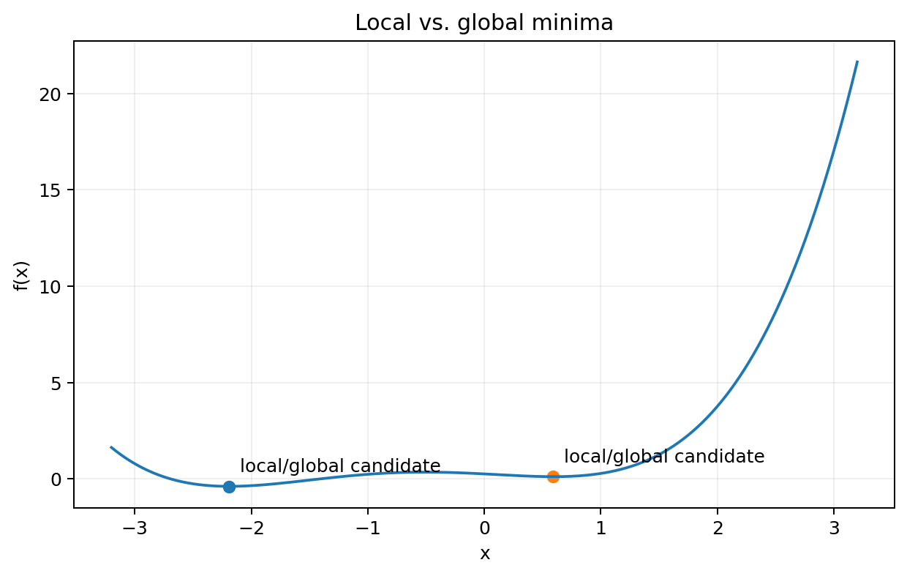
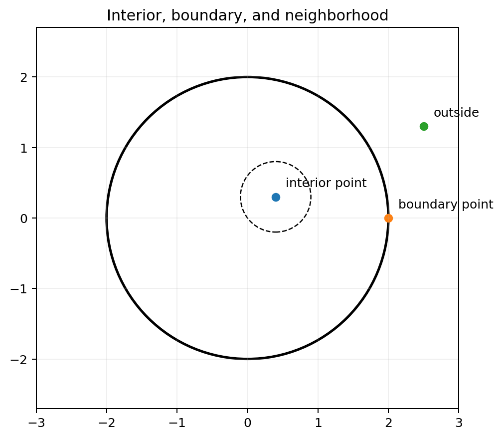

# Chapter 1 — An Introduction to Mathematical Programming：中文学习笔记


## 1. 本章学习目标

学完本章后，你应该能够：

1. 用数学语言写出一个最基本的**数学规划问题（mathematical programming problem）**；
2. 区分目标函数、约束、可行域、决策变量；
3. 区分线性规划（LP）、非线性规划（NLP）、连续变量、离散变量和整数规划；
4. 理解最大化与最小化之间的等价转换；
5. 使用松弛变量（slack variable）和剩余变量（surplus variable）把不等式改写成等式；
6. 处理没有符号限制的变量（unrestricted variable）；
7. 理解局部最优、全局最优以及它们在优化问题中的区别；
8. 掌握邻域、内部点、边界点、开集、闭集、聚点等后续优化几何所需的基本拓扑概念；
9. 理解灵敏度分析、参数规划、模型稳定性和数值稳定性的基本思想；
10. 能把生产、配料、运输、指派、网络流、组合选择、投资组合等现实问题翻译成数学模型。

***

## 1A. 推荐学习方式：第一次读本章时做什么

如果你是第一次接触优化，建议不要试图一次记住所有术语。按下面顺序学习：

1. 先掌握“**决策变量—目标函数—约束—变量范围**”四件套；
2. 用 Example 1–3 练习把文字翻成线性模型；
3. 学会 slack、surplus 和 unrestricted variable 的标准化技巧；
4. 再学习局部/全局最优与基本集合概念；
5. 最后理解 sensitivity / parametric / stability，它们暂时只需掌握思想，不要求会完整算法；
6. 做 Exercise 1.4、1.6、1.7、1.8、1.9 检查是否真正掌握。

本章不是要求你“会求所有模型的最优解”。Chapter 1 的首要任务是**会准确建模并读懂优化语言**；系统求解方法从后续章节展开。

***

## 2. 先修知识与最小充分复习

本章是入门章，不要求你先学过优化，但后文会频繁使用向量、函数、求和符号和距离。为了让本笔记可以脱离教材独立学习，这里先把最必要的知识补齐。

### 2.1 实数、向量与决策向量

实数集合记为 $\mathbb{R}$。一个含 $n$ 个实数的列向量可以写成

$$
x=
\begin{bmatrix}
x_1\\
\vdots\\
x_n
\end{bmatrix}
\in\mathbb{R}^n.
$$

优化里，$x_1,\ldots,x_n$ 往往不是“待求的普通未知数”，而是**我们可以选择的决策量**，所以合起来称为决策向量（decision vector）。

例如一个工厂决定每天生产桌子和椅子的数量，可以令

$$
x=
\begin{bmatrix}
x_1\\x_2
\end{bmatrix},
$$

其中 $x_1$ 是桌子数量，$x_2$ 是椅子数量。

### 2.2 函数：把一个方案映射成一个评价值

函数

$$
f:\mathbb{R}^n\to\mathbb{R}
$$

可以理解为：输入一个方案 $x$，输出这个方案的“得分”。这个得分可能是利润、成本、运输费用、风险、误差或总流量。

例如

$$
f(x_1,x_2)=50x_1+25x_2
$$

可以表示生产 $x_1$ 件产品 1、$x_2$ 件产品 2 时的总利润。

### 2.3 求和符号 $\sum$

当变量很多时，

$$
c_1x_1+c_2x_2+\cdots+c_nx_n
$$

常写成

$$
\sum_{j=1}^{n}c_jx_j.
$$

其中 $j$ 只是索引。把 $j=1,2,\ldots,n$ 逐个代入并相加，就得到原来的长式子。

双重求和

$$
\sum_{i=1}^{m}\sum_{j=1}^{n}c_{ij}x_{ij}
$$

表示把全部 $m\times n$ 个 $c_{ij}x_{ij}$ 相加。运输问题会经常出现这种写法。

### 2.4 线性表达式与非线性表达式

线性表达式的典型形式是

$$
a_1x_1+\cdots+a_nx_n,
$$

变量只以一次幂出现，变量之间不相乘，也不出现在分母、指数、三角函数等位置。

下面这些是非线性的：

$$
x_1x_2,\qquad x_1^2,\qquad \frac1{x_1},\qquad e^{x_1},\qquad \sin x_1.
$$

这一区分直接决定模型是 LP 还是 NLP。

### 2.5 不等式的方向如何翻译现实语言

初学建模时最常见的错误不是计算，而是不等号方向写反。可以记住：

- “最多、不超过、容量上限” $\Rightarrow \le$；
- “至少、不少于、最低需求” $\Rightarrow \ge$；
- “恰好、必须等于” $\Rightarrow =$。

例如“最多有 100 小时人工”对应

$$
\text{人工总用量}\le100.
$$

“至少摄入 10 mg 营养素”对应

$$
\text{营养素总摄入量}\ge10.
$$

### 2.6 欧氏距离与邻域

对 $x,y\in\mathbb{R}^n$，欧氏距离为

$$
\lVert x-y\rVert_2
=
\sqrt{\sum_{i=1}^{n}(x_i-y_i)^2}.
$$

因此点 $x$ 周围半径为 $\varepsilon$ 的开球/邻域写成

$$
N_\varepsilon(x)=\{y:\lVert y-x\rVert_2<\varepsilon\}.
$$

这会用于定义“局部最优”“内部点”和“边界点”。

### 2.7 读优化模型时的固定顺序

看到一个模型，不要从第一行公式开始硬读。建议固定按以下顺序：

1. **变量是什么、单位是什么？**
2. **目标是 max 还是 min？目标的单位是什么？**
3. **每条约束在现实中对应哪句话？**
4. **变量能否为负、是否必须为整数或 0–1？**
5. **目标与约束是否线性？**

本章真正要培养的能力，就是把任何应用题稳定地拆成这五个问题。

***

## 3. 核心术语（中英对照）

| 中文 | English | 含义 / 备注 |
|---|---|---|
| 数学规划 | mathematical programming | 在可行集合上最大化或最小化目标函数 |
| 优化 | optimization | 寻找最好方案的过程 |
| 决策变量 | decision variable | 我们可以选择的未知量 |
| 目标函数 / 成本函数 | objective function / cost function | 要最大化或最小化的函数 |
| 约束 | constraint | 决策变量必须满足的条件 |
| 可行解 | feasible solution | 满足全部约束的变量取值 |
| 可行域 / 可行集 | feasible set | 全部可行解组成的集合 |
| 无约束问题 | unconstrained problem | 可行域就是整个变量空间 |
| 约束问题 | constrained problem | 可行域是真子集 |
| 线性规划 | linear programming, LP | 目标和约束均为线性 |
| 非线性规划 | nonlinear programming, NLP | 至少有一个目标或约束是非线性的 |
| 连续变量 | continuous variable | 允许取某区间中的实数值 |
| 离散变量 | discrete variable | 只能取离散集合中的值 |
| 整数规划 | integer programming | 变量被限制为整数的优化问题 |
| 松弛变量 | slack variable | 把“$\le$”约束改成等式时加入的非负变量 |
| 剩余变量 | surplus variable | 把“$\ge$”约束改成等式时减去的非负变量 |
| 无符号限制变量 | unrestricted variable | 可正、可负、可为零 |
| 全局最优解 | global optimal solution | 在整个可行域中最好 |
| 局部最优解 | local optimal solution | 在某个邻域中最好 |
| 邻域 | neighborhood | 某点周围一定半径的集合 |
| 内部点 | interior point | 存在完全落在集合中的邻域 |
| 边界点 | boundary point | 任意邻域同时碰到集合内外 |
| 开集 | open set | 每一点都是内部点 |
| 闭集 | closed set | 包含自己的全部边界点 |
| 聚点 | accumulation point | 任意邻域中都有另一个集合内点 |
| 灵敏度分析 | sensitivity analysis | 研究数据变化对最优解的影响 |
| 后最优分析 | post-optimal analysis | 已知原最优解后分析修改后的问题 |
| 参数规划 | parametric programming | 把变化量直接作为参数放入模型 |
| 模型稳定性 | model stability | 小数据变化只导致小的解变化 |
| 数值稳定性 | numerical stability | 算法中的舍入误差不会失控 |

***

## 4. 本章知识主线

本章可以看成整本书的“地图”。首先，教材给出数学规划最一般的形式：在一个集合 $\Omega$ 上优化函数 $f$。随后通过生产、饲料、运输、指派、网络流、生产线选择和投资组合等例子，让我们看到不同现实问题如何落到同一种数学语言中。教材接着解释连续/离散变量、松弛/剩余变量以及无符号限制变量的处理方法，为后面的单纯形法做准备。

缺失的 pp. 14–15 原本承担了从“建模”向“最优解的几何概念”过渡的作用：全局解、局部解以及邻域、开集、闭集等概念。第 16 页随后继续定义边界点、闭集和聚点，因此这些概念必须补齐，才能顺利完成 Exercises 1.8–1.10。之后教材引入后最优分析、参数规划和稳定性，最后给出优化方法的发展简史。

***

## 5. 分节精讲
### 5.1 Section 1 — The Mathematical Programming Problem

#### 5.1.1 最一般的数学规划形式
设

$$
f:\mathbb{R}^n\to\mathbb{R}
$$

是一个实值函数，决策向量写作

$$
x=(x_1,\ldots,x_n).
$$

最基本的数学规划问题是

$$
\min_{x\in\Omega} f(x)
$$

或

$$
\max_{x\in\Omega} f(x),
$$

其中 $\Omega$ 是允许的决策向量集合。

**教材主线。**

- $f$：cost function / objective function；
- $\Omega$：set of feasible solutions；
- 定义 $\Omega$ 的方程、不等式：constraints；
- $x\in\Omega$：可行解。

#### 5.1.2 约束与无约束
如果

$$
\Omega=\mathbb{R}^n,
$$

就是**无约束优化（unconstrained optimization）**。

如果

$$
\Omega\subsetneq\mathbb{R}^n,
$$

则为**约束优化（constrained optimization）**。

约束经常写成

$$
g_i(x)\le b_i,
$$

$$
h_j(x)=d_j.
$$

#### 5.1.3 什么叫“线性”
教材中线性目标函数写成

$$
f(x_1,\ldots,x_n)=c_1x_1+\cdots+c_nx_n
=\sum_{j=1}^n c_jx_j.
$$

线性等式约束：

$$
a_1x_1+\cdots+a_nx_n=b.
$$

线性不等式约束可写为 $\le,<,\ge,>$ 等形式。

如果目标函数与定义可行域的所有约束都是线性的，则称为**线性规划问题（linear programming problem）**。

若不是，则属于**非线性规划问题（nonlinear programming problem）**。

#### 5.1.4 最大化与最小化可以互换
教材给出重要等价关系：

$$
\max_{x\in\Omega} f(x)
=
-\min_{x\in\Omega}[-f(x)].
$$

因此一个只会“最小化”的算法也可以用来解决最大化问题：把目标函数乘以 $-1$ 即可。

**易错点。**

变量的最优取值不变，但目标函数最优值要变号。

***

### 5.2 Section 2 — Examples of Mathematical Programming Problems

这一节最重要的不是记住例题，而是掌握建模模板：

1. **先问：我要决定什么？** → 决策变量；
2. **什么叫“最好”？** → 目标函数；
3. **现实世界限制是什么？** → 约束；
4. **变量能取什么值？** → 非负、整数、0–1、上下界等。

#### 5.2.1 连续变量、离散变量、整数规划
如果变量可以在某区间取任意实数值，称为**连续变量（continuous variable）**。

如果变量只能从一个离散集合取值，称为**离散变量（discrete variable）**。

特别地，若变量要求为非负整数，例如

$$
x_j\in\{0,1,2,\ldots\},
$$

就属于整数规划。

#### 5.2.2 松弛变量（slack variable）
对于

$$
a_1x_1+\cdots+a_nx_n\le b,
$$

定义

$$
s=b-(a_1x_1+\cdots+a_nx_n)\ge0,
$$

则约束变成

$$
a_1x_1+\cdots+a_nx_n+s=b.
$$

$s$ 表示“还没有用完的资源”。

#### 5.2.3 剩余变量（surplus variable）
对于

$$
a_1x_1+\cdots+a_nx_n\ge b,
$$

定义

$$
s=(a_1x_1+\cdots+a_nx_n)-b\ge0,
$$

因此

$$
a_1x_1+\cdots+a_nx_n-s=b.
$$

$s$ 表示“超过最低要求的量”。

#### 5.2.4 无符号限制变量（unrestricted variable）
如果 $x_i$ 既可以为正也可以为负，可以写成两个非负变量之差：

$$
x_i=y_i-z_i,
\qquad y_i\ge0,\ z_i\ge0.
$$

这是后面把问题统一成标准形式的重要技巧。

***

### 5.3 Section 3 — Global and Local Solutions
> **缺失内容说明：** 本节对应的原书页面缺失。为保证知识链完整，以下内容依据前后文、目录与相关习题重建；用于学习，不视为原文逐字复现。

#### 5.3.1 Example 7 投资组合部分的合理续接
教材 p.13 已说明 $x_i$ 表示投资于证券 $S_i$ 的资产比例，$c_i$ 表示预期收益率，二次项代表风险。因此至少应满足比例约束

$$
\sum_{i=1}^n x_i=1,
\qquad x_i\ge0.
$$

这与 Example 7 给出的二次规划框架一致。

#### 5.3.2 全局最优解
考虑最小化问题

$$
\min_{x\in\Omega}f(x).
$$

若 $x^*\in\Omega$ 满足

$$
f(x^*)\le f(x),\qquad \forall x\in\Omega,
$$

则称 $x^*$ 为**全局最小解（global minimum solution）**。

最大化问题类似：若

$$
f(x^*)\ge f(x),\qquad \forall x\in\Omega,
$$

则 $x^*$ 为全局最大解。

#### 5.3.3 邻域与局部最优解
在 $\mathbb{R}^n$ 中，点 $x$ 的 $\varepsilon$-邻域可定义为

$$
N_\varepsilon(x)
=
\{y\in\mathbb{R}^n:\lVert y-x\rVert<\varepsilon\},
\qquad \varepsilon>0.
$$

若存在某个 $\varepsilon>0$，使得对所有

$$
y\in\Omega\cap N_\varepsilon(x^*)
$$

都有

$$
f(x^*)\le f(y),
$$

则 $x^*$ 是**局部最小解（local minimum solution / relative minimum）**。

局部最大解同理。



**关键区别：**

- 全局最优：要和整个可行域比较；
- 局部最优：只和附近的可行点比较；
- 全局最优一定是局部最优；
- 一般非线性问题中的局部最优不一定是全局最优；
- 线性规划是一个特殊例外：Exercise 1.8 要求证明任何局部最优都是全局最优。

#### 5.3.4 内部点与开集
若 $x\in\Omega$，并且存在 $\varepsilon>0$ 使得

$$
N_\varepsilon(x)\subseteq\Omega,
$$

则 $x$ 是 $\Omega$ 的**内部点（interior point）**。

全部内部点组成

$$
\operatorname{Int}(\Omega).
$$

如果

$$
\operatorname{Int}(\Omega)=\Omega,
$$

则 $\Omega$ 是**开集（open set）**。

#### 5.3.5 补集、边界点、闭集与聚点
教材 p.16 明确给出这些概念。

在 $E_n=\mathbb{R}^n$ 中，$\Omega$ 的补集写作

$$
E_n\setminus\Omega.
$$

若对任意 $\varepsilon>0$，邻域 $N_\varepsilon(x)$ 中既有 $\Omega$ 内的点，也有 $\Omega$ 外的点，则 $x$ 是**边界点（boundary point）**。

所有边界点组成

$$
\operatorname{Bd}(\Omega).
$$

如果

$$
\operatorname{Bd}(\Omega)\subseteq\Omega,
$$

则 $\Omega$ 是**闭集（closed set）**。

若任意邻域 $N_\varepsilon(x)$ 都包含至少一个不同于 $x$ 的 $\Omega$ 中的点，则 $x$ 是 $\Omega$ 的**聚点（accumulation point）**。



***

### 5.4 Section 4 — Post-Optimal Analysis, Parametric Programming, and Stability

#### 5.4.1 为什么优化问题需要“解完之后再分析”
现实数据往往不是永远不变：

- 原材料供应 $b_i$ 会变化；
- 单位运输成本 $c_{ij}$ 会变化；
- 营养成分 $a_{ij}$ 可能变化；
- 可能加入新变量或新约束。

如果每次变化都从头求解，成本很高。

#### 5.4.2 后最优分析 / 灵敏度分析
教材定义的核心思想是：

> 已经知道原问题的最优解后，利用原解及其结构，高效获得修改后问题的最优解。

这就是**post-optimal analysis / sensitivity analysis**。

#### 5.4.3 参数规划
如果可以预先描述变化规律，就把变化量写入模型作为参数。

以运输问题为例，若第 $j$ 个零售点的需求随时间 $t$ 增长为

$$
d_j+t\Delta d_j,
$$

则需求约束改成

$$
\sum_{i=1}^m x_{ij}=d_j+t\Delta d_j.
$$

若运输成本随时间变化为

$$
c_{ij}+t\Delta c_{ij},
$$

目标函数变成

$$
\min\sum_{i=1}^m\sum_{j=1}^n
(c_{ij}+t\Delta c_{ij})x_{ij}.
$$

#### 5.4.4 模型稳定性（model stability）
如果数据 $a_{ij},b_i,c_j$ 发生小变化时，最优解 $x^*$ 和最优值 $f(x^*)$ 也只发生小变化，则模型是稳定的。

不稳定模型可能出现：

- 数据只改变一点点；
- 最优解却发生巨大跳变；
- 甚至原本可行的问题变成不可行。

教材指出，冗余约束（redundant constraints）有时会造成这种问题。

#### 5.4.5 数值稳定性（numerical stability）
这和模型稳定性不同。

- **模型稳定性：** 问题本身对数据扰动敏不敏感；
- **数值稳定性：** 算法计算时，舍入误差会不会被不断放大。

教材用线性方程求解作类比：某些消元策略在有限精度计算中更可靠。

***

### 5.5 Section 5 — Some Historical Comments

本节不是考试计算重点，但有助于建立方法之间的时间线。

- **1939–1940s：** Kantorovich、Hitchcock、Koopmans 等推动运输问题与资源配置模型；
- **1947：** George Dantzig 发展单纯形法（simplex procedure）；
- **1950s：** 对偶理论、对偶单纯形法、原始-对偶算法等逐步形成；
- **1950s–1960s：** revised simplex、网络流、最大流等算法体系发展；
- **Kuhn–Tucker 条件：** 成为约束非线性优化的重要最优性条件；
- **罚函数、障碍函数、乘子法：** 为求解非线性约束问题提供主要工具。

这些内容将在 Chapters 3–10 逐一展开。

***

## 6. 定义、结论与必须掌握的公式
### 6.1 数学规划标准抽象
$$
\boxed{
\min_{x\in\Omega}f(x)
}
$$

或

$$
\boxed{
\max_{x\in\Omega}f(x)
}
$$

### 6.2 线性规划的典型形式
$$
\begin{aligned}
\min\quad & c^\top x\\
\text{s.t.}\quad & Ax\le b,\\
& x\ge0.
\end{aligned}
$$

### 6.3 最大化-最小化互换
$$
\boxed{
\max_{x\in\Omega}f(x)
=-\min_{x\in\Omega}[-f(x)]
}
$$

### 6.4 松弛变量
$$
a^\top x\le b
\iff
a^\top x+s=b,\quad s\ge0.
$$

### 6.5 剩余变量
$$
a^\top x\ge b
\iff
a^\top x-s=b,\quad s\ge0.
$$

### 6.6 无符号限制变量
$$
\boxed{x_i=y_i-z_i,\qquad y_i,z_i\ge0}
$$

### 6.7 全局最小解
$$
x^*\in\Omega,
\qquad
f(x^*)\le f(x),\ \forall x\in\Omega.
$$

### 6.8 局部最小解
存在 $\varepsilon>0$，使得

$$
f(x^*)\le f(x),
\qquad
\forall x\in\Omega\cap N_\varepsilon(x^*).
$$

***

## 7. 关键证明与推导
### 7.1 为什么最大化可以转成最小化
若 $x^*$ 最大化 $f$，则对所有 $x\in\Omega$，

$$
f(x)\le f(x^*).
$$

两边乘以 $-1$：

$$
-f(x)\ge -f(x^*).
$$

因此 $x^*$ 最小化 $-f$。

反向完全相同。

### 7.2 为什么任意实数变量都能写成两个非负变量之差
对任意 $x\in\mathbb{R}$，令

$$
y=\max(x,0),
\qquad
z=\max(-x,0).
$$

则

$$
y\ge0,\quad z\ge0,
$$

且

$$
x=y-z.
$$

所以用 $y-z$ 替换无符号限制变量不会损失一般性。

### 7.3 为什么 LP 的局部最优一定是全局最优
这是 Exercise 1.8 的核心，完整证明见习题文件。

直观原因有两个：

1. LP 的可行域是凸集；
2. 线性目标函数沿两点连线是线性变化。

若附近已经是最优，却在远处存在更好点，那么从局部最优点向更好点移动“极小的一步”，仍然可行且目标已经改善，与“局部最优”矛盾。

***

## 8. 本章建模流程
以后遇到任何应用题，都建议按以下顺序写。

#### Step 1：定义决策变量
写清楚变量的现实含义和单位。

例如：

$$
x_j=\text{第 }j\text{ 种产品每天生产的数量}.
$$

#### Step 2：写目标函数
问自己：究竟在最大化利润、收入、流量，还是最小化成本、风险、误差？

#### Step 3：逐条翻译约束
每一条约束都要能回答：

> 这条式子在现实世界中对应什么限制？

#### Step 4：写变量范围
不要忘记：

- $x_i\ge0$；
- $x_i\in\mathbb{Z}$；
- $x_i\in\{0,1\}$；
- $l_i\le x_i\le u_i$；
- 或 $x_i$ unrestricted。

#### Step 5：检查单位
同一个约束两边单位必须一致。

#### Step 6：判断模型类型
- 全部线性 → LP；
- 有乘积、平方、指数等 → NLP；
- 有整数要求 → integer/discrete programming。

***

## 9. 教材例题与完整解答
### Example 1 — 生产与原材料配置

#### 题意
制造商用 $m$ 种原材料生产 $n$ 种产品。每件产品消耗一定数量的每种原料，原料每天供应有限，每单位产品带来收入 $c_j$。求最大日收入。

#### 决策变量
$$
x_j=\text{产品 }P_j\text{ 的生产数量},\qquad j=1,\ldots,n.
$$

#### 目标函数
$$
\max\sum_{j=1}^n c_jx_j.
$$

#### 原材料约束
若 $a_{ij}$ 是生产一单位 $P_j$ 需要的原料 $M_i$ 数量，$b_i$ 是原料 $M_i$ 的供应量，则

$$
\sum_{j=1}^n a_{ij}x_j\le b_i,
\qquad i=1,\ldots,m.
$$

#### 完整模型
$$
\begin{aligned}
\max\quad & \sum_{j=1}^n c_jx_j\\
\text{s.t.}\quad
& \sum_{j=1}^n a_{ij}x_j\le b_i,
&& i=1,\ldots,m,\\
& x_j\ge0,
&& j=1,\ldots,n.
\end{aligned}
$$

加入松弛变量 $s_i\ge0$ 后：

$$
\sum_{j=1}^n a_{ij}x_j+s_i=b_i.
$$

**小白理解：** 每个原材料约束就是“实际用量不能超过库存”。

***

### Example 2 — 饲料配比（Diet / Feed-mix Problem）

#### 题意
用 $n$ 种饲料满足 $m$ 种营养素的最低需求，同时让饲料成本最小。

#### 决策变量
$$
x_j=\text{饲料 }F_j\text{ 使用的磅数}.
$$

#### 目标函数
$$
\min\sum_{j=1}^n c_jx_j.
$$

#### 营养约束
若每磅 $F_j$ 含有 $a_{ij}$ 单位营养素 $N_i$，最低需求为 $b_i$，则

$$
\sum_{j=1}^n a_{ij}x_j\ge b_i.
$$

#### 完整模型
$$
\begin{aligned}
\min\quad & \sum_{j=1}^n c_jx_j\\
\text{s.t.}\quad
& \sum_{j=1}^n a_{ij}x_j\ge b_i,
&& i=1,\ldots,m,\\
& x_j\ge0,
&& j=1,\ldots,n.
\end{aligned}
$$

用剩余变量 $s_i\ge0$：

$$
\sum_{j=1}^n a_{ij}x_j-s_i=b_i.
$$

**易错点：** “最低需求”意味着 $\ge$，不是 $\le$。

***

### Example 3 — 运输问题（Transportation Problem）

#### 决策变量
$$
x_{ij}=\text{从仓库 }F_i\text{ 运往零售点 }O_j\text{ 的数量}.
$$

#### 目标函数
$$
\min\sum_{i=1}^m\sum_{j=1}^n c_{ij}x_{ij}.
$$

#### 仓库供应约束
$$
\sum_{j=1}^n x_{ij}\le s_i,
\qquad i=1,\ldots,m.
$$

#### 零售点需求约束
若每个零售点必须恰好获得 $d_j$：

$$
\sum_{i=1}^m x_{ij}=d_j,
\qquad j=1,\ldots,n.
$$

#### 完整模型
$$
\begin{aligned}
\min\quad & \sum_{i=1}^m\sum_{j=1}^n c_{ij}x_{ij}\\
\text{s.t.}\quad
& \sum_{j=1}^n x_{ij}\le s_i,
&&i=1,\ldots,m,\\
& \sum_{i=1}^m x_{ij}=d_j,
&&j=1,\ldots,n,\\
& x_{ij}\ge0.
\end{aligned}
$$

***

### Example 4 — 指派问题（Assignment Problem）

有 4 名销售员与 4 个销售区，每个销售员恰好去一个区，每个区恰好安排一名销售员。

#### 0–1 变量
$$
x_{ij}=
\begin{cases}
1,&\text{销售员 }S_i\text{ 被分配到区域 }D_j,\\
0,&\text{否则}.
\end{cases}
$$

收益矩阵为

$$
R=
\begin{bmatrix}
5&10&8&2\\
3&4&2&6\\
9&5&4&5\\
5&5&6&4
\end{bmatrix}.
$$

模型：

$$
\begin{aligned}
\max\quad & \sum_{i=1}^4\sum_{j=1}^4 r_{ij}x_{ij}\\
\text{s.t.}\quad
& \sum_{j=1}^4x_{ij}=1,
&&i=1,\ldots,4,\\
& \sum_{i=1}^4x_{ij}=1,
&&j=1,\ldots,4,\\
& x_{ij}\in\{0,1\}.
\end{aligned}
$$

**学习补充：数值最优指派。**

枚举 4! 种指派可得到最优方案：

- $S_1\to D_2$；
- $S_2\to D_4$；
- $S_3\to D_1$；
- $S_4\to D_3$；

总评分

$$
10+6+9+6=31.
$$

***

### Example 5 — 最大流网络（Maximal Flow）

设 $x_{ij}$ 表示从节点 $S_i$ 流向节点 $S_j$ 的油量，管道容量为 $u_{ij}$，总流量为 $f$。

中间节点必须满足流量守恒：

$$
\sum_{i=1}^n(x_{ij}-x_{ji})=0,
\qquad j\notin\{1,n\}.
$$

源点流出净量等于 $f$，汇点流入净量也等于 $f$，且

$$
0\le x_{ij}\le u_{ij}.
$$

目标：

$$
\max f.
$$

这是 Chapter 6 的核心问题之一。

***

### Example 6 — 生产线与品牌选择

每条生产线必须在品牌 A 和 B 中二选一。

定义

$$
x_i=
\begin{cases}
1,&L_i\text{ 生产 A},\\
0,&\text{否则},
\end{cases}
$$

$$
w_i=
\begin{cases}
1,&L_i\text{ 生产 B},\\
0,&\text{否则}.
\end{cases}
$$

教材用互补约束

$$
x_iw_i=0
$$

以及

$$
x_i+w_i=1
$$

保证“只能选一个且必须选一个”。

目标函数：

$$
\max\;15000x_1+10000x_2+12000x_3
+12000w_1+13500w_2+14500w_3.
$$

由于包含乘积 $x_iw_i$，按这种写法属于非线性规划。

**学习补充。** 实际上本题直接比较每条线两种选择即可：

- $L_1$: A 的 15000 大于 B 的 12000；
- $L_2$: B 的 13500 大于 A 的 10000；
- $L_3$: B 的 14500 大于 A 的 12000。

因此最优总产量为

$$
15000+13500+14500=43000.
$$

***

### Example 7 — 二次规划与投资组合

教材给出一类二次规划：目标中含有变量乘积 $x_ix_j$，因此目标函数是二次函数。

可概括为

$$
\begin{aligned}
\max\quad
& c^\top x + x^\top Bx\\
\text{s.t.}\quad
& Ax=b,\\
& x\ge0.
\end{aligned}
$$

其中二次项可以用于刻画投资组合风险。

在投资组合语境中：

- $x_i$：资产投在证券 $S_i$ 的比例；
- $c_i$：该证券的预期收益率；
- 二次项：风险；
- $x_i\ge0$：不允许负比例；
- 通常还需

$$
\sum_{i=1}^n x_i=1.
$$

**核心思想：** 收益与风险常常冲突，因此优化模型是在不同目标之间做权衡。

***

## 10. 图表与几何直觉
### 10.1 局部最优与全局最优


**看图方法：** 横轴是决策变量（示意为一维），纵轴是目标函数值。一个“谷底”可能只比附近点低，因此是局部最小；所有谷底中最低的那个才是全局最小。对于一般非线性函数，局部谷底可以有很多个；这也是后面无约束优化算法为什么会依赖初始点的重要原因。

### 10.2 内部点、边界点与邻域


**看图方法：** 对集合内部的点，可以画出一个足够小的圆，整个圆仍留在集合内；边界点无论把圆画得多小，都会同时碰到集合内和集合外。这个“任何邻域都碰到两边”的量词是边界点定义的核心。

### 10.3 Exercise 1.7(e) 的灌溉几何模型


**看图方法：** 这类几何建模题要先把现实限制转成“圆不能越过公路边界”，再把可灌溉面积写成半径的函数。重点不是记住图，而是学会把“位置 + 距离 + 面积”转成变量、几何约束和目标函数。

***

## 11. 易错点与小白问答
#### Q1：目标函数一定叫“成本函数”吗？
不一定。教材会使用 cost function，但即使最大化利润、收益或流量，也可以统一称为 objective function。

#### Q2：为什么 $x\ge0$ 有时叫 restriction 而不是 constraint？
这是教材的术语习惯。数学上它当然仍然是对变量的限制。后续常把结构约束 $Ax=b$ 和变量符号约束 $x\ge0$ 分开写。

#### Q3：$\le$ 为什么加 slack，而 $\ge$ 为什么减 surplus？
因为 slack 是“还没用掉的量”，surplus 是“超过最低要求的量”。

#### Q4：无符号限制变量为什么不能简单去掉限制？
后续单纯形法常要求所有变量非负。写成 $y-z$ 后，仍能表示任意实数，同时满足算法标准形式。

#### Q5：局部最优是不是一定很差？
不是。它只是“未必全球最好”。对凸优化/线性规划等特殊结构，局部最优常常就是全局最优。

#### Q6：模型稳定和数值稳定是一回事吗？
不是。前者针对问题数据扰动，后者针对计算算法误差。

***

## 12. 本章知识地图
```text
现实问题
   │
   ├── 决策变量 x
   │
   ├── 目标函数 f(x)
   │      ├── maximize
   │      └── minimize
   │
   └── 可行域 Ω
          ├── 等式约束
          ├── 不等式约束
          └── 变量范围
                │
                ├── continuous
                ├── discrete / integer
                └── unrestricted

数学规划
   ├── Linear Programming
   └── Nonlinear Programming

标准化技巧
   ├── max f  ↔  min(-f)
   ├── <= + slack
   ├── >= - surplus
   └── unrestricted x = y-z

最优解
   ├── global optimum
   └── local optimum
          │
          └── neighborhood / open / closed / boundary

问题发生变化后
   ├── sensitivity / post-optimal analysis
   ├── parametric programming
   ├── model stability
   └── numerical stability
```

***

## 13. 一页速记
1. 优化问题 = **变量 + 目标 + 约束 + 变量范围**。
2. 基本形式：$\min_{x\in\Omega}f(x)$ 或 $\max_{x\in\Omega}f(x)$。
3. LP：目标和全部约束都线性。
4. NLP：至少有非线性目标或约束。
5. 最大化转最小化：$\max f=-\min(-f)$。
6. $a^\top x\le b$：加 slack；$a^\top x\ge b$：减 surplus。
7. unrestricted：$x=y-z$，$y,z\ge0$。
8. global optimum：和整个可行域比；local optimum：只和邻域比。
9. LP 中任何局部最优都是全局最优。
10. sensitivity analysis：研究数据变化后最优解如何变化。
11. model stability ≠ numerical stability。
12. 建模时最容易漏的是：**变量单位、非负约束、整数/0–1 条件和不等号方向**。

***

## 13A. 概念辨析
#### 可行解 vs. 最优解
可行解只要求“守规则”；最优解除了守规则，还必须在所有可行解中达到最好目标值。一个问题通常有很多可行解，但最优解可能唯一、多个，甚至不存在。

#### 可行（feasible）vs. 有界（bounded）
“可行”是说至少存在一个满足约束的点；“有界”通常讨论可行域或目标值是否会无限延伸。可行并不保证有最优解。例如

$$
\min -x\quad\text{s.t.}\quad x\ge0
$$

有无穷多个可行点，但目标值可以趋向 $-\infty$，因此没有有限最小值。

#### 线性规划 vs. 整数规划
若所有目标和约束线性，但某些变量要求整数，那么从“表达式”看仍然线性，却属于整数规划而不是普通连续 LP。离散限制会改变问题的求解方法。

#### slack vs. surplus
- $\le$：加 slack；
- $\ge$：减 surplus。

二者都非负，且都代表原不等式“离边界还差多少”。

#### local optimum vs. global optimum
全局最优一定是局部最优；反过来一般不成立。LP 因可行域凸且目标线性而具有特殊结构：局部最优就是全局最优。

***

## 13B. 独立学习自测
先不看答案，尝试口头或书面完成。

#### 自测 1
把“某工厂生产两种产品，每件利润分别为 3 和 5，资源约束为 $2x_1+x_2\le10$，且产品数量非负”写成 LP。

**答案：**

$$
\begin{aligned}
\max\quad & 3x_1+5x_2\\
\text{s.t.}\quad &2x_1+x_2\le10,\\
&x_1,x_2\ge0.
\end{aligned}
$$

#### 自测 2
把

$$
2x_1+3x_2\ge7
$$

改写为等式约束。

**答案：** 令 $s\ge0$，则

$$
2x_1+3x_2-s=7.
$$

#### 自测 3
若 $x$ 无符号限制，如何让后续算法只处理非负变量？

**答案：** 令

$$
x=x^+-x^-,\qquad x^+,x^-\ge0.
$$

#### 自测 4
“局部最优一定是全局最优”对一般 NLP 是否成立？对 LP 呢？

**答案：** 一般 NLP 不成立；LP 成立。

#### 自测 5
下列哪个是非线性模型的信号：$3x_1+2x_2$、$x_1x_2$、$4x_1-x_2\le6$？

**答案：** $x_1x_2$，因为变量之间发生乘积。

#### 自测 6
模型稳定性和数值稳定性分别针对什么？

**答案：** 模型稳定性针对输入数据的小扰动；数值稳定性针对算法计算过程中的舍入/浮点误差。

***

## 14. 学习补充（非教材原文）
### 14.1 现代优化常用的统一写法
现代教材经常把约束问题写为

$$
\begin{aligned}
\min_x\quad & f(x)\\
\text{s.t.}\quad
& g_i(x)\le0,\quad i=1,\ldots,m,\\
& h_j(x)=0,\quad j=1,\ldots,p.
\end{aligned}
$$

这与本书的思想完全一致，只是符号更统一。

### 14.2 建模检查四问
完成模型后一定问：

1. 每个变量有现实意义吗？
2. 目标函数单位正确吗？
3. 每条现实限制都进入模型了吗？
4. 是否忘了变量的取值域？

