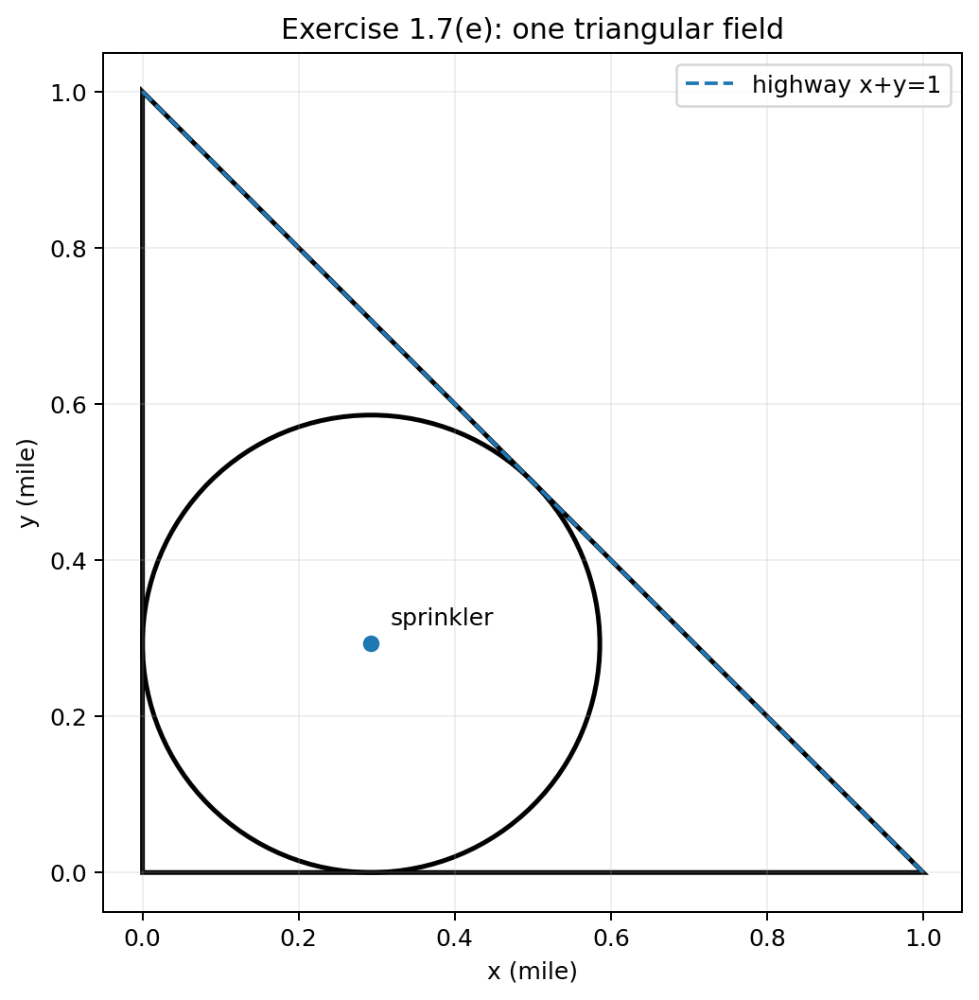

# Chapter 1 — An Introduction to Mathematical Programming：习题与答案（中英双语）

> 状态：✅ **Exercise 1.1–1.10 独立学习版 V2 完成**  
> 排版规范：遵循 [`../FORMATTING_GUIDE.md`](../FORMATTING_GUIDE.md)  
> 术语与符号：遵循 [`../SYMBOLS_AND_TERMS.md`](../SYMBOLS_AND_TERMS.md)  
> **版权与学习说明：** English restatement 为题意转述，不是教材原文逐字复制；数学数据与条件已按教材页面核对。Exercises 1.8–1.10 所需的 Section 3 位于当前 PDF 的缺失页 pp. 14–15，相关定义已在本章笔记中知识性重建。

## 0. 使用说明

- 题号与教材保持一致。
- 每题给出中文详细解答，并提供简洁英文解法/结论。
- 建模题先完成“教材要求的模型”，数值最优解若额外给出，会标记为 **学习补充**。
- 证明题尽量从定义出发，不省略关键逻辑。
- 每题已重述足够条件，不要求读者打开教材才能作答。
- English restatement 用于训练英文读题，不是原文逐句复制。

***

## Exercise 1.1
> 来源：教材印刷页 p. 18；PDF p. 37。  
> 难度：★

### English restatement
Show that maximizing $f$ over the feasible set $\Omega$ is equivalent to minimizing $-f$ over the same feasible set, with the optimizer unchanged and the optimal value changing sign.

### 中文题目
证明：

$$
f(x^*)=\max_{x\in\Omega}f(x)
$$

当且仅当

$$
-f(x^*)=\min_{x\in\Omega}[-f(x)].
$$

### 考查知识点
- 最大化与最小化等价转换；
- 不等式乘以负数时方向反转。

### 解题思路
直接使用最大值和最小值的定义。

### 中文详细解答
先证明“$\Rightarrow$”。

若

$$
f(x^*)=\max_{x\in\Omega}f(x),
$$

则对任意 $x\in\Omega$，

$$
f(x)\le f(x^*).
$$

两边乘以 $-1$，不等号反向：

$$
-f(x)\ge -f(x^*).
$$

也就是

$$
-f(x^*)\le -f(x),\qquad \forall x\in\Omega.
$$

因此

$$
-f(x^*)=\min_{x\in\Omega}[-f(x)].
$$

再证明“$\Leftarrow$”。

若

$$
-f(x^*)=\min_{x\in\Omega}[-f(x)],
$$

则

$$
-f(x^*)\le -f(x),\qquad \forall x\in\Omega.
$$

两边乘以 $-1$：

$$
f(x^*)\ge f(x),\qquad \forall x\in\Omega,
$$

所以

$$
f(x^*)=\max_{x\in\Omega}f(x).
$$

证毕。

### English solution / final answer
If $f(x)\le f(x^*)$ for every feasible $x$, multiplying by $-1$ gives $-f(x)\ge -f(x^*)$ for every feasible $x$. Thus $x^*$ minimizes $-f$. The converse follows by reversing the same argument. Hence

$$
\max_{x\in\Omega}f(x)=-\min_{x\in\Omega}[-f(x)].
$$

### 易错点
不要只写“目标函数乘 $-1$”；必须说明**最优点不变，最优值变号**。

***

## Exercise 1.2
> 来源：教材印刷页 p. 19；PDF p. 38。  
> 难度：★★

### English restatement
Use equality constraints to eliminate unrestricted variables whenever possible, so that the reduced problem uses only nonnegative decision variables. Explain how a solution of the reduced problem recovers a solution of the original problem.

### 中文题目
利用等式约束消去无符号限制变量，并把问题化成只含非负变量的优化问题。

### 1.2(a)
原问题：

$$
\begin{aligned}
\min\quad & x_1+6x_2-x_3\\
\text{s.t.}\quad
&7x_1+x_2-x_3=6,\\
&3x_1+x_2+2x_3\le6,\\
&x_1\ge0,\ x_2\ge0,
\end{aligned}
$$

其中 $x_3$ 无符号限制。

#### 中文详细解答
由等式约束：

$$
x_3=7x_1+x_2-6.
$$

代入目标函数：

$$
\begin{aligned}
x_1+6x_2-x_3
&=x_1+6x_2-(7x_1+x_2-6)\\
&=-6x_1+5x_2+6.
\end{aligned}
$$

代入剩余不等式：

$$
3x_1+x_2+2(7x_1+x_2-6)\le6,
$$

整理：

$$
17x_1+3x_2\le18.
$$

因此等价的非负变量问题为

$$
\boxed{
\begin{aligned}
\min\quad & -6x_1+5x_2+6\\
\text{s.t.}\quad &17x_1+3x_2\le18,\\
&x_1,x_2\ge0.
\end{aligned}}
$$

因为常数 6 不影响最优点，也可以最小化 $-6x_1+5x_2$。

得到最优 $x_1^*,x_2^*$ 后，用

$$
x_3^*=7x_1^*+x_2^*-6
$$

恢复原问题变量。

#### English solution / final answer
Eliminate $x_3$ using

$$
x_3=7x_1+x_2-6.
$$

The reduced problem is

$$
\min\;-6x_1+5x_2+6
$$

subject to

$$
17x_1+3x_2\le18,
\qquad x_1,x_2\ge0.
$$

Recover $x_3$ from the equality above.

***

### 1.2(b)
原问题：

$$
\begin{aligned}
\min\quad & x_1x_2+x_3x_4\\
\text{s.t.}\quad
&x_1+2x_2-x_3+x_4=8,\\
&3x_1-x_2+6x_3=7,\\
&x_1+x_2+x_3+x_4\le20,\\
&x_3,x_4\ge0,
\end{aligned}
$$

其中 $x_1,x_2$ 无符号限制。

#### 中文详细解答
前两个等式组成关于 $x_1,x_2$ 的线性方程组。

解得

$$
\boxed{
x_1=\frac{22-11x_3-x_4}{7}
}
$$

和

$$
\boxed{
x_2=\frac{17+9x_3-3x_4}{7}.
}
$$

代入第三个约束：

$$
\frac{22-11x_3-x_4}{7}
+
\frac{17+9x_3-3x_4}{7}
+x_3+x_4\le20.
$$

整理得到

$$
5x_3+3x_4\le101.
$$

目标函数变为

$$
\frac{(22-11x_3-x_4)(17+9x_3-3x_4)}{49}+x_3x_4.
$$

因此只含非负变量 $x_3,x_4$ 的问题为

$$
\boxed{
\begin{aligned}
\min\quad &
\frac{(22-11x_3-x_4)(17+9x_3-3x_4)}{49}+x_3x_4\\
\text{s.t.}\quad
&5x_3+3x_4\le101,\\
&x_3,x_4\ge0.
\end{aligned}}
$$

求得 $x_3^*,x_4^*$ 后，再由上面的两个公式恢复 $x_1^*,x_2^*$。

#### English solution / final answer
Solving the two equality constraints for the unrestricted variables gives

$$
x_1=\frac{22-11x_3-x_4}{7},
\qquad
x_2=\frac{17+9x_3-3x_4}{7}.
$$

The remaining constraint becomes

$$
5x_3+3x_4\le101,
\qquad x_3,x_4\ge0,
$$

and the objective is

$$
\frac{(22-11x_3-x_4)(17+9x_3-3x_4)}{49}+x_3x_4.
$$

#### 易错点
“只含非负变量”不意味着原来的无符号变量突然要求非负，而是通过等式**消掉**了它们。

***

## Exercise 1.3
> 来源：教材印刷页 p. 19；PDF p. 38。  
> 难度：★

### English restatement
Replace every equality constraint by two inequalities, one in each direction.

### 中文题目
将

$$
\begin{aligned}
\min\quad &x_1x_2+x_3^2\\
\text{s.t.}\quad
&x_1+x_2-7x_3=4,\\
&5x_1-x_2=6,\\
&x_1,x_2,x_3\ge0
\end{aligned}
$$

改写为只使用 $\le$ 与 $\ge$ 约束的形式。

### 中文详细解答
利用

$$
a=b
\iff
\begin{cases}
a\le b,\\a\ge b.
\end{cases}
$$

所以等价模型为

$$
\boxed{
\begin{aligned}
\min\quad &x_1x_2+x_3^2\\
\text{s.t.}\quad
&x_1+x_2-7x_3\le4,\\
&x_1+x_2-7x_3\ge4,\\
&5x_1-x_2\le6,\\
&5x_1-x_2\ge6,\\
&x_1,x_2,x_3\ge0.
\end{aligned}}
$$

### English solution / final answer
Replace each equality $g(x)=b$ by $g(x)\le b$ and $g(x)\ge b$. The objective and nonnegativity restrictions are unchanged.

***

## Exercise 1.4
> 来源：教材印刷页 p. 19；PDF p. 38。  
> 难度：★★★

### English restatement
Rewrite each problem as a **minimization** problem with **equality constraints** and **nonnegative variables**.

### 1.4(a)
原问题：

$$
\begin{aligned}
\max\quad &x_1+x_2-x_3\\
\text{s.t.}\quad
&2x_1+6x_2\ge4,\\
&3x_2+x_3\le8,\\
&x_1,x_2\ge0,
\end{aligned}
$$

其中 $x_3$ 无符号限制。

令

$$
x_3=y_3-z_3,
\qquad y_3,z_3\ge0.
$$

第一条为 $\ge$，减去剩余变量 $s_1\ge0$；第二条为 $\le$，加入松弛变量 $s_2\ge0$。

同时把最大化改成最小化负目标。

因此

$$
\boxed{
\begin{aligned}
\min\quad &-x_1-x_2+y_3-z_3\\
\text{s.t.}\quad
&2x_1+6x_2-s_1=4,\\
&3x_2+y_3-z_3+s_2=8,\\
&x_1,x_2,y_3,z_3,s_1,s_2\ge0.
\end{aligned}}
$$

#### English final answer
Use $x_3=y_3-z_3$, a surplus variable for the first constraint, a slack variable for the second, and negate the objective.

***

### 1.4(b)
原问题：

$$
\begin{aligned}
\max\quad &6x_1x_2+x_3^2\\
\text{s.t.}\quad
&x_1+2x_2\le4,\\
&x_1+x_2+x_3\le6.
\end{aligned}
$$

题目没有给三个变量任何非负限制，因此把它们视为 unrestricted。

令

$$
x_i=x_i^+-x_i^- ,
\qquad x_i^+,x_i^-\ge0,
\quad i=1,2,3.
$$

加入 $s_1,s_2\ge0$：

$$
\boxed{
\begin{aligned}
\min\quad
&-6(x_1^+-x_1^-)(x_2^+-x_2^-)
-(x_3^+-x_3^-)^2\\
\text{s.t.}\quad
&(x_1^+-x_1^-)+2(x_2^+-x_2^-)+s_1=4,\\
&(x_1^+-x_1^-)+(x_2^+-x_2^-)+(x_3^+-x_3^-)+s_2=6,\\
&x_i^+,x_i^-\ge0\ (i=1,2,3),\quad s_1,s_2\ge0.
\end{aligned}}
$$

**注意：** 转换后仍然是非线性问题，因为目标含变量乘积和平方项。

***

### 1.4(c)
原问题：

$$
\begin{aligned}
\min\quad &2x_1+3x_2+x_4\\
\text{s.t.}\quad
&x_1+x_2+x_3=1,\\
&3x_1+x_2+3x_4\le8,\\
&x_2\ge0,\quad x_3\ge-8,\quad x_4\ge0.
\end{aligned}
$$

$x_1$ unrestricted，令

$$
x_1=u-v,
\qquad u,v\ge0.
$$

对下界 $x_3\ge-8$，作变量平移：

$$
y=x_3+8\ge0,
\qquad x_3=y-8.
$$

给第二个约束加入 slack $s\ge0$。

得到

$$
\boxed{
\begin{aligned}
\min\quad &2u-2v+3x_2+x_4\\
\text{s.t.}\quad
&u-v+x_2+y=9,\\
&3u-3v+x_2+3x_4+s=8,\\
&u,v,x_2,y,x_4,s\ge0.
\end{aligned}}
$$

#### 易错点
$x_3\ge-8$ 最方便的做法是**平移变量**，不是把 $x_3$ 写成两个非负变量之差。

***

## Exercise 1.5
> 来源：教材印刷页 p. 19；PDF p. 38。  
> 难度：★★

### English restatement
Introduce slack and/or surplus variables so that all inequality constraints become equalities.

### 1.5(a)
$$
\begin{aligned}
\min\quad &7x_1+x_2+2x_3\\
\text{s.t.}\quad
&3x_1+x_2\le8,\\
&x_1+x_2+2x_3\ge4,\\
&x_1,x_2,x_3\ge0.
\end{aligned}
$$

加入 $s_1,s_2\ge0$：

$$
\boxed{
\begin{aligned}
3x_1+x_2+s_1&=8,\\
x_1+x_2+2x_3-s_2&=4.
\end{aligned}}
$$

目标函数不变。

***

### 1.5(b)
$$
\begin{aligned}
\max\quad &x_1^2+x_2^2+x_3^2+x_4^2\\
\text{s.t.}\quad
&x_1+x_2\ge4,\\
&x_2+x_3\ge8,\\
&x_3+x_4\ge1,\\
&x_i\ge0.
\end{aligned}
$$

三条都是 $\ge$，所以分别减去 surplus：

$$
\boxed{
\begin{aligned}
x_1+x_2-s_1&=4,\\
x_2+x_3-s_2&=8,\\
x_3+x_4-s_3&=1,\\
s_1,s_2,s_3&\ge0.
\end{aligned}}
$$

***

### 1.5(c)
$$
\begin{aligned}
\min\quad &x_1+x_2+x_3+x_4\\
\text{s.t.}\quad
&x_1x_3+x_2x_4=0,\\
&x_1^2+x_2x_3\ge5,\\
&x_i\ge0.
\end{aligned}
$$

第一条已经是等式，不动。第二条减 surplus $s\ge0$：

$$
\boxed{
x_1^2+x_2x_3-s=5.}
$$

因此所有约束都是等式。

#### English solution / final answer
Add a nonnegative slack variable to each $\le$ constraint and subtract a nonnegative surplus variable from each $\ge$ constraint. Existing equality constraints remain unchanged.

***

## Exercise 1.6
> 来源：教材印刷页 p. 20；PDF p. 39。  
> 难度：★★★

### English restatement
Convert the given maximization problem into an equivalent minimization problem with equality constraints and nonnegative variables only.

原问题：

$$
\begin{aligned}
\max\quad &x_1+2x_2+x_3+2x_4\\
\text{s.t.}\quad
&2x_1+3x_2\ge8,\\
&x_2+2x_3\le9,\\
&x_1+x_3+2x_4=10,\\
&x_1\ge0,\quad x_4\ge0.
\end{aligned}
$$

$x_2,x_3$ 没有符号限制。

令

$$
x_2=y_2-z_2,
\qquad
x_3=y_3-z_3,
$$

其中

$$
y_2,z_2,y_3,z_3\ge0.
$$

第一条 $\ge$ 减 surplus $s_1$，第二条 $\le$ 加 slack $s_2$。

最终：

$$
\boxed{
\begin{aligned}
\min\quad
&-x_1-2y_2+2z_2-y_3+z_3-2x_4\\
\text{s.t.}\quad
&2x_1+3y_2-3z_2-s_1=8,\\
&y_2-z_2+2y_3-2z_3+s_2=9,\\
&x_1+y_3-z_3+2x_4=10,\\
&x_1,x_4,y_2,z_2,y_3,z_3,s_1,s_2\ge0.
\end{aligned}}
$$

### English solution / final answer
Replace $x_2$ and $x_3$ by differences of nonnegative variables, negate the objective, subtract a surplus variable from the first constraint, and add a slack variable to the second.

***

## Exercise 1.7
> 来源：教材印刷页 pp. 20–23；PDF pp. 39–42。  
> 难度：★★～★★★

### English restatement
For each real-world scenario, define decision variables and formulate an appropriate mathematical programming model. The textbook asks primarily for the **formulation**, not for an algorithmic solution.

***

### 1.7(a) 家具生产
#### 中文题意
三种产品 $P_1,P_2,P_3$ 的单位利润分别为 50、25、40 美元。每天可用劳动 800 小时、木材 4200 board feet、塑料 150 张、胶水 150 pint。每件产品资源消耗如下：

| 产品 | Labor | Lumber | Plastic | Glue |
|---|---:|---:|---:|---:|
| $P_1$ | 10 | 61 | 0 | 2 |
| $P_2$ | 5 | 15 | 1 | 1 |
| $P_3$ | 4 | 10 | 2 | 2 |

令 $x_i$ 为产品 $P_i$ 的日产量。

#### 模型
$$
\boxed{
\begin{aligned}
\max\quad &50x_1+25x_2+40x_3\\
\text{s.t.}\quad
&10x_1+5x_2+4x_3\le800,\\
&61x_1+15x_2+10x_3\le4200,\\
&x_2+2x_3\le150,\\
&2x_1+x_2+2x_3\le150,\\
&x_1,x_2,x_3\ge0.
\end{aligned}}
$$

若产品必须整件生产，可额外要求 $x_i\in\mathbb{Z}_{\ge0}$；教材本章主要按连续变量理解。

**学习补充：一个最优解。**

由胶水约束乘 25：

$$
50x_1+25x_2+50x_3\le3750.
$$

所以

$$
50x_1+25x_2+40x_3\le3750.
$$

取

$$
(x_1,x_2,x_3)=(0,150,0)
$$

可行且利润为 3750，因此它是最优解之一。

#### English final answer
Maximize $50x_1+25x_2+40x_3$ subject to the four resource-capacity inequalities above and $x\ge0$.

***

### 1.7(b) 两种麦片混合
令

$$
x_A=\text{brand A 的盎司数},
\qquad
x_B=\text{brand B 的盎司数}.
$$

以“美分”为成本单位：A 每盎司 5 cents，B 每盎司 7 cents。

最低营养要求：10 mg 的 vitamin $B_1$、300 mg 的 vitamin C。

模型：

$$
\boxed{
\begin{aligned}
\min\quad &5x_A+7x_B\\
\text{s.t.}\quad
&0.20x_A+1.5x_B\ge10,\\
&30x_A+35x_B\ge300,\\
&x_A,x_B\ge0.
\end{aligned}}
$$

**学习补充：数值最优解。**

两条营养约束在最优点同时取等：

$$
\begin{cases}
0.2x_A+1.5x_B=10,\\
30x_A+35x_B=300.
\end{cases}
$$

解得

$$
x_A=\frac{50}{19}\approx2.632,
\qquad
x_B=\frac{120}{19}\approx6.316.
$$

最小成本

$$
\frac{1090}{19}\approx57.37\text{ cents}.
$$

***

### 1.7(c) 维生素片定价
教材给定：药片含 10 mg 的 $B_1$ 和 150 mg 的 C。令

$$
x_1=\text{每 mg }B_1\text{ 的售价（cents）},
$$

$$
x_2=\text{每 mg C 的售价（cents）}.
$$

药片售价：

$$
10x_1+150x_2.
$$

为了让按这些“营养成分价格”计算出的麦片营养价值不超过麦片市场价格：

$$
0.20x_1+30x_2\le5,
$$

$$
1.5x_1+35x_2\le7.
$$

因此

$$
\boxed{
\begin{aligned}
\max\quad &10x_1+150x_2\\
\text{s.t.}\quad
&0.20x_1+30x_2\le5,\\
&1.5x_1+35x_2\le7,\\
&x_1,x_2\ge0.
\end{aligned}}
$$

**学习补充：数值最优。**

该 LP 的一个最优解为

$$
x_1=\frac{14}{3},\qquad x_2=0,
$$

药片售价为

$$
\frac{140}{3}\approx46.67\text{ cents}.
$$

> 注意：教材在 (b) 中给 C 的最低需求为 300 mg，而 (c) 明确写药片含 150 mg C。这里忠实保留教材数据，不自行“纠正”。

***

### 1.7(d) 汽车运输
令

$$
x_{ij}=\text{从仓库 }i\in\{A,B,C\}\text{ 运往经销商 }j\in\{1,2,3,4\}\text{ 的汽车数}.
$$

成本矩阵

$$
C=
\begin{bmatrix}
225&150&375&140\\
105&110&400&200\\
200&450&310&105
\end{bmatrix}.
$$

需求：

$$
(d_1,d_2,d_3,d_4)=(100,50,65,75).
$$

仓库供应上限：

$$
(s_A,s_B,s_C)=(295,400,300).
$$

模型：

$$
\boxed{
\begin{aligned}
\min\quad &\sum_{i}\sum_j c_{ij}x_{ij}\\
\text{s.t.}\quad
&\sum_{j=1}^4x_{Aj}\le295,\\
&\sum_{j=1}^4x_{Bj}\le400,\\
&\sum_{j=1}^4x_{Cj}\le300,\\
&x_{A1}+x_{B1}+x_{C1}=100,\\
&x_{A2}+x_{B2}+x_{C2}=50,\\
&x_{A3}+x_{B3}+x_{C3}=65,\\
&x_{A4}+x_{B4}+x_{C4}=75,\\
&x_{ij}\ge0.
\end{aligned}}
$$

**学习补充：数值最优。**

容量充足，因此可以把每个 dealer 的需求全部交给其最低成本仓库：

- $D_1$: B，100 辆；
- $D_2$: B，50 辆；
- $D_3$: C，65 辆；
- $D_4$: C，75 辆。

总费用

$$
100(105)+50(110)+65(310)+75(105)=44025.
$$

***

### 1.7(e) 三角形农田灌溉
#### 建模假设
一英里见方的正方形被对角线公路分成两个相同的等腰直角三角形。按提示只建模其中一个。

取该三角形为

$$
T=\{(x,y):x\ge0,\ y\ge0,\ x+y\le1\}.
$$

公路为

$$
x+y=1.
$$

经验告诉我们喷头到两条非公路边距离相等，因此中心取

$$
(a,a).
$$

令喷水半径为 $r$。

若要求整个圆形喷水区域留在三角形农田内，则必须满足：

$$
r\le a,
$$

以及到公路的距离约束

$$
r\le\frac{1-2a}{\sqrt2}.
$$

目标为最大化圆面积：

$$
\boxed{
\begin{aligned}
\max\quad &\pi r^2\\
\text{s.t.}\quad
&r\le a,\\
&r\le\frac{1-2a}{\sqrt2},\\
&a\ge0,\ r\ge0.
\end{aligned}}
$$

**学习补充（在上述“圆完全留在农田内”的建模假设下）。**

最优时两个限制同时取等：

$$
r=a=\frac{1-2a}{\sqrt2}.
$$

因此

$$
\boxed{
r=a=\frac{1}{2+\sqrt2}
=1-\frac{\sqrt2}{2}\approx0.2929\text{ mile}.}
$$

> 若允许水喷出两条非公路边，只禁止喷到公路，则目标应改成“圆与三角形的交面积”，模型会不同。教材本题主要考察建模，因此这里把假设显式写出。

***

### 1.7(f) 直线拟合的三种误差准则
数据：

$$
x_i=-3,-2,-1,0,1,2,3,4,5,6,7,8,
$$

$$
y_i=(-1.98,1.01,4.02,6.98,10.03,14,15.8,18.67,22.4,25,27.71,30.67).
$$

拟合模型：

$$
\hat y(x)=mx+b.
$$

残差：

$$
r_i=y_i-(mx_i+b).
$$

#### (i) 最小二乘 / squared error
$$
\boxed{
\min_{m,b}\sum_{i=1}^{12}[y_i-(mx_i+b)]^2.}
$$

这是非线性目标（关于 $m,b$ 为二次函数），但无约束。

**扩展计算：**

$$
m\approx2.975979,
\qquad
b\approx7.085886.
$$

#### (ii) 最小绝对偏差 / absolute error
直接形式：

$$
\boxed{
\min_{m,b}\sum_{i=1}^{12}|y_i-(mx_i+b)|.}
$$

若用辅助变量 $u_i\ge0$ 线性化：

$$
\begin{aligned}
\min\quad &\sum_{i=1}^{12}u_i\\
\text{s.t.}\quad
&y_i-(mx_i+b)\le u_i,\\
&-(y_i-(mx_i+b))\le u_i,
&&i=1,\ldots,12.
\end{aligned}
$$

**扩展计算：** 一个最优解约为

$$
m\approx2.961429,
\qquad
b=6.98.
$$

#### (iii) 最小最大误差 / minimax error
直接形式：

$$
\boxed{
\min_{m,b}\max_{1\le i\le12}|y_i-(mx_i+b)|.}
$$

引入 $t\ge0$：

$$
\begin{aligned}
\min\quad &t\\
\text{s.t.}\quad
&|y_i-(mx_i+b)|\le t,
&&i=1,\ldots,12.
\end{aligned}
$$

进一步写成线性不等式即可得到 LP。

**扩展计算：**

$$
m=2.95,
\qquad
b=7.485,
\qquad
t=0.615.
$$

#### English final answer
The three formulations minimize, respectively, the sum of squared residuals, the sum of absolute residuals, and the maximum absolute residual for the line $y=mx+b$.

***

### 1.7(g) 距离给定点最近的线性方程组解
设

$$
x=(x_1,x_2,x_3,x_4)^\top,
\qquad
c=(c_1,c_2,c_3,c_4)^\top.
$$

给定线性系统

$$
Ax=b
$$

（三个方程、四个未知量）。要在所有满足 $Ax=b$ 的解中，找距离 $c$ 最近者。

欧氏距离为

$$
\lVert x-c\rVert_2.
$$

因此模型可以写为

$$
\boxed{
\begin{aligned}
\min\quad &\lVert x-c\rVert_2\\
\text{s.t.}\quad &Ax=b.
\end{aligned}}
$$

由于平方根是单调递增函数，等价地可以写成更方便的二次规划：

$$
\boxed{
\begin{aligned}
\min\quad &\sum_{i=1}^4(x_i-c_i)^2\\
\text{s.t.}\quad &Ax=b.
\end{aligned}}
$$

***

### 1.7(h) 六名获奖者的交通方式分配
4 人必须坐飞机，2 人必须坐船。

令

$$
x_i=
\begin{cases}
1,&W_i\text{ 坐飞机},\\
0,&W_i\text{ 坐船}.
\end{cases}
$$

飞机费用

$$
a=(585,450,625,735,300,810),
$$

轮船费用

$$
s=(1005,700,1450,1500,685,2025).
$$

模型：

$$
\boxed{
\begin{aligned}
\min\quad &\sum_{i=1}^6[a_ix_i+s_i(1-x_i)]\\
\text{s.t.}\quad
&\sum_{i=1}^6x_i=4,\\
&x_i\in\{0,1\}.
\end{aligned}}
$$

**学习补充：最优分配。**

若某人从飞机改成轮船，增加的成本为

$$
s_i-a_i=(420,250,825,765,385,1215).
$$

必须选 2 人坐船，应选择增加成本最小的两人：$W_2,W_5$。

因此：

- Air：$W_1,W_3,W_4,W_6$；
- Ship：$W_2,W_5$。

总成本

$$
585+700+625+735+685+810=\boxed{4140}.
$$

***

## Exercise 1.8
> 来源：教材印刷页 p. 23；PDF p. 42。  
> 难度：★★★

### English restatement
Prove that every local optimum of a linear programming problem is also a global optimum.

### 中文题目
证明：线性规划问题的任何局部最优解都是全局最优解。

### 考查知识点
- 局部最优与全局最优；
- LP 可行域的凸性；
- 线性目标函数。

### 中文详细证明（最小化情形）
考虑线性规划

$$
\min\;c^\top x
\qquad\text{s.t. }x\in\Omega,
$$

其中 $\Omega$ 由线性等式和线性不等式定义，因此是凸集。

假设 $x^*\in\Omega$ 是局部最小解，但不是全局最小解。

“不是全局最小”意味着存在 $y\in\Omega$，使得

$$
c^\top y<c^\top x^*.
$$

由于 $\Omega$ 是凸集，对任意 $\alpha\in[0,1]$，

$$
x(\alpha)=(1-\alpha)x^*+\alpha y\in\Omega.
$$

当 $\alpha>0$ 足够小时，$x(\alpha)$ 可以任意接近 $x^*$，因此位于定义局部最优的邻域内。

但线性目标函数满足

$$
\begin{aligned}
c^\top x(\alpha)
&=c^\top[(1-\alpha)x^*+\alpha y]\\
&=(1-\alpha)c^\top x^*+\alpha c^\top y.
\end{aligned}
$$

因为

$$
c^\top y<c^\top x^*,
$$

所以对任何 $\alpha\in(0,1]$，

$$
c^\top x(\alpha)<c^\top x^*.
$$

这说明在 $x^*$ 任意近的地方都有更好的可行点，和“$x^*$ 是局部最小解”矛盾。

所以 $x^*$ 必须是全局最小解。

最大化情形完全类似。

证毕。

### 小白解释
如果远处真的有一个更好的点 $y$，那么从 $x^*$ 朝 $y$ 只走非常小的一步：

- 因为可行域是凸的，这一步仍在可行域；
- 因为目标是线性的，这一步立刻就会改善目标值。

因此“附近没人更好，但远处有人更好”在 LP 里不可能发生。

### English solution / final answer
Assume $x^*$ is a local minimizer but not a global minimizer. Then some feasible $y$ satisfies $c^Ty<c^Tx^*$. Since the LP feasible region is convex,

$$
x_\alpha=(1-\alpha)x^*+\alpha y
$$

is feasible for $0\le\alpha\le1$. For arbitrarily small $\alpha>0$, $x_\alpha$ lies arbitrarily close to $x^*$, while

$$
c^Tx_\alpha=(1-\alpha)c^Tx^*+\alpha c^Ty<c^Tx^*.
$$

This contradicts local optimality. Hence every local LP optimum is global.

***

## Exercise 1.9
> 来源：教材印刷页 p. 23；PDF p. 42。  
> 难度：★★★

设环境空间为 $E_n=\mathbb{R}^n$。

### 1.9(a) 证明 $\operatorname{Int}(\Omega)$ 是开集
取任意

$$
x\in\operatorname{Int}(\Omega).
$$

根据内部点定义，存在 $\varepsilon>0$ 使得

$$
N_\varepsilon(x)\subseteq\Omega.
$$

对任意 $y\in N_\varepsilon(x)$，有

$$
\lVert y-x\rVert<\varepsilon.
$$

令

$$
\delta=\varepsilon-\lVert y-x\rVert>0.
$$

若 $z\in N_\delta(y)$，由三角不等式：

$$
\lVert z-x\rVert
\le
\lVert z-y\rVert+\lVert y-x\rVert
<\delta+\lVert y-x\rVert
=\varepsilon.
$$

所以

$$
N_\delta(y)\subseteq N_\varepsilon(x)\subseteq\Omega.
$$

因此 $y$ 也是内部点。

于是

$$
N_\varepsilon(x)\subseteq\operatorname{Int}(\Omega),
$$

说明 $\operatorname{Int}(\Omega)$ 是开集。

***

### 1.9(b) $\Omega$ 开当且仅当 $\Omega\cap\operatorname{Bd}(\Omega)=\varnothing$
#### “$\Rightarrow$”
若 $\Omega$ 开，则每个 $x\in\Omega$ 都是内部点，存在邻域完全包含在 $\Omega$ 中。因此这个邻域不可能同时含 $\Omega$ 外的点，所以 $x$ 不是边界点。

故

$$
\Omega\cap\operatorname{Bd}(\Omega)=\varnothing.
$$

#### “$\Leftarrow$”
若

$$
\Omega\cap\operatorname{Bd}(\Omega)=\varnothing,
$$

取任意 $x\in\Omega$。

假设 $x$ 不是内部点，那么每个邻域中都有 $\Omega$ 外的点；而 $x$ 本身属于 $\Omega$，所以每个邻域也都有 $\Omega$ 内的点。于是 $x$ 是边界点，和假设矛盾。

所以每个 $x\in\Omega$ 都是内部点，$\Omega$ 开。

***

### 1.9(c) $\Omega$ 闭当且仅当 $E_n\setminus\Omega$ 开
#### “$\Rightarrow$”
若 $\Omega$ 闭，则所有边界点都属于 $\Omega$。

取

$$
x\in E_n\setminus\Omega.
$$

因为 $x\notin\Omega$，所以它不可能是 $\Omega$ 的边界点。故存在某个邻域 $N_\varepsilon(x)$ 不与 $\Omega$ 相交，即

$$
N_\varepsilon(x)\subseteq E_n\setminus\Omega.
$$

因此补集开。

#### “$\Leftarrow$”
若补集开，取 $x\in\operatorname{Bd}(\Omega)$。

若 $x\notin\Omega$，则 $x$ 在补集中。因为补集开，存在邻域完全包含在补集中，这与边界点“每个邻域都含 $\Omega$ 中的点”矛盾。

因此所有边界点都属于 $\Omega$，所以 $\Omega$ 闭。

***

### 1.9(d) $\Omega$ 闭当且仅当包含全部聚点
#### “$\Rightarrow$”
若 $\Omega$ 闭，由 (c) 知补集开。

若 $x$ 是 $\Omega$ 的聚点但 $x\notin\Omega$，则 $x$ 位于开补集中，所以存在一个邻域完全不含 $\Omega$ 中的点，与聚点定义矛盾。

所以所有聚点都在 $\Omega$ 中。

#### “$\Leftarrow$”
假设 $\Omega$ 包含全部聚点。

取任意边界点 $x\in\operatorname{Bd}(\Omega)$。

若 $x\notin\Omega$，则边界点定义保证每个邻域都有 $\Omega$ 中的点；由于 $x\notin\Omega$，这些点必定不同于 $x$。因此 $x$ 是聚点。

按假设 $x$ 应属于 $\Omega$，矛盾。

因此全部边界点都属于 $\Omega$，故 $\Omega$ 闭。

***

### 1.9(e) 任意开集的并仍为开集
设

$$
U=\bigcup_{\alpha\in A}U_\alpha,
$$

其中每个 $U_\alpha$ 都开。

取 $x\in U$，则至少存在一个 $\alpha_0$ 使

$$
x\in U_{\alpha_0}.
$$

因为 $U_{\alpha_0}$ 开，存在 $\varepsilon>0$：

$$
N_\varepsilon(x)\subseteq U_{\alpha_0}\subseteq U.
$$

所以 $U$ 开。

***

### 1.9(f) 有限个开集的交仍为开集
设

$$
U=U_1\cap\cdots\cap U_k,
$$

且每个 $U_i$ 开。

取 $x\in U$。对每个 $i$，存在 $\varepsilon_i>0$ 使

$$
N_{\varepsilon_i}(x)\subseteq U_i.
$$

令

$$
\varepsilon=\min\{\varepsilon_1,\ldots,\varepsilon_k\}>0.
$$

则

$$
N_\varepsilon(x)\subseteq U_i,
\qquad i=1,\ldots,k,
$$

所以

$$
N_\varepsilon(x)\subseteq U.
$$

因此有限交开。

#### English solution / final answer
(a) Use an $\varepsilon$-ball inside $\Omega$ and the triangle inequality to show every point of that ball is itself interior.  
(b) A point of an open set cannot be a boundary point; conversely, any non-interior point of $\Omega$ that lies in $\Omega$ is a boundary point.  
(c) A set is closed iff its complement is open.  
(d) A set is closed iff it contains every accumulation point.  
(e) Any union of open sets is open because each point belongs to at least one open member.  
(f) For a finite intersection, take the minimum of the finitely many neighborhood radii.

***

## Exercise 1.10
> 来源：教材印刷页 p. 23；PDF p. 42。  
> 难度：★★

### English restatement
Give examples illustrating four basic topological possibilities.

### 1.10(a) 既不开也不闭的集合
在 $\mathbb{R}$ 中取

$$
\boxed{\Omega=[0,1).}
$$

- 不开：$0\in\Omega$，但任何以 0 为中心的小邻域都含负数；
- 不闭：$1$ 是边界点/聚点但 $1\notin\Omega$。

***

### 1.10(b) 既开又闭的集合
在 $\mathbb{R}$ 中：

$$
\boxed{\Omega=\mathbb{R}}
$$

既开又闭。

空集 $\varnothing$ 也是既开又闭的集合。

***

### 1.10(c) 无限多个开集的交不是开集
令

$$
U_n=\left(-\frac1n,\frac1n\right),
\qquad n=1,2,\ldots
$$

每个 $U_n$ 都是开集，但

$$
\bigcap_{n=1}^{\infty}U_n=\{0\}.
$$

单点集 $\{0\}$ 在 $\mathbb{R}$ 中不是开集。

因此

$$
\boxed{
\bigcap_{n=1}^{\infty}
\left(-\frac1n,\frac1n\right)=\{0\}
}
$$

就是所求例子。

***

### 1.10(d) 边界点但不是聚点
取

$$
\boxed{\Omega=\{0\}\subset\mathbb{R}.}
$$

点 0 是边界点，因为任何邻域中：

- 有集合内点 0；
- 也有集合外点。

但 0 不是聚点，因为不存在**不同于 0** 的 $\Omega$ 中点。

#### English solution / final answer
Suitable examples are:

- neither open nor closed: $[0,1)$;
- both open and closed: $\mathbb{R}$ (or $\varnothing$);
- infinite intersection of open sets not open: $\bigcap_{n\ge1}(-1/n,1/n)=\{0\}$;
- boundary point not an accumulation point: $0$ for the set $\{0\}$.

***

## 本章习题总结
### 高频考点
1. 最大化与最小化互换；
2. slack / surplus；
3. unrestricted variable 的消去或差分表示；
4. “文字 → 数学模型”；
5. 局部最优与全局最优；
6. open / closed / boundary / accumulation point。

### 代表题
- **1.4 / 1.6：** 标准化技巧综合；
- **1.7：** 建模能力核心题；
- **1.8：** LP 几何结构的重要证明；
- **1.9：** 后续凸分析需要的集合基础。

### 最容易出错的地方
- 把 $\ge$ 约束错误地“加” slack；
- 忘记最大化变最小化时目标函数整体乘 $-1$；
- 没写变量非负/整数/0–1 条件；
- 认为题目没写 $x_i\ge0$ 就默认非负；实际上通常应视为 unrestricted；
- Exercise 1.7(c) 的 C 含量和 1.7(b) 不相同，不能擅自修改教材数据；
- 把 boundary point 和 accumulation point 混为一谈。

### 建议二刷
$$
\boxed{1.4,\ 1.6,\ 1.7,\ 1.8,\ 1.9}
$$

### 完成检查
- [x] Exercise 1.1–1.10 编号无遗漏。
- [x] 数学条件已按教材页面视觉内容核对。
- [x] 中英文数学符号一致。
- [x] 关键数值扩展结果已计算检查。
- [x] 证明题逻辑完整。
- [x] 建模题解释了变量、目标和约束来源。
- [x] 缺失页相关定义已显式说明来源状态。
- [x] 图片使用相对路径。
- [x] 每题题意与必要数据可独立阅读。
- [x] 只使用本文件与本章笔记即可完成复习，不需要回查教材。
