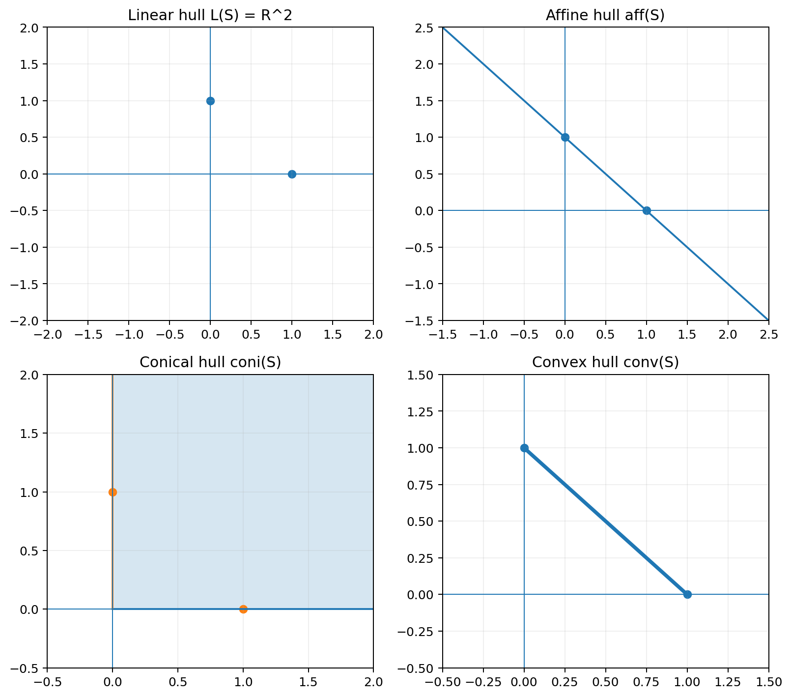
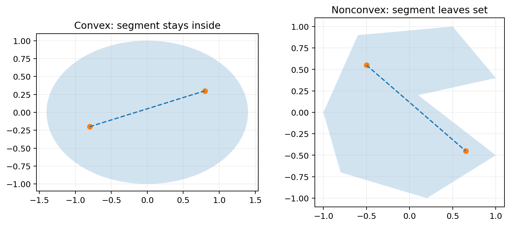
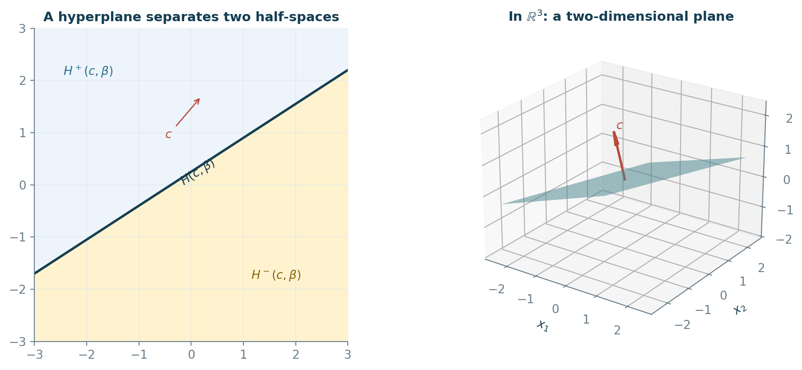
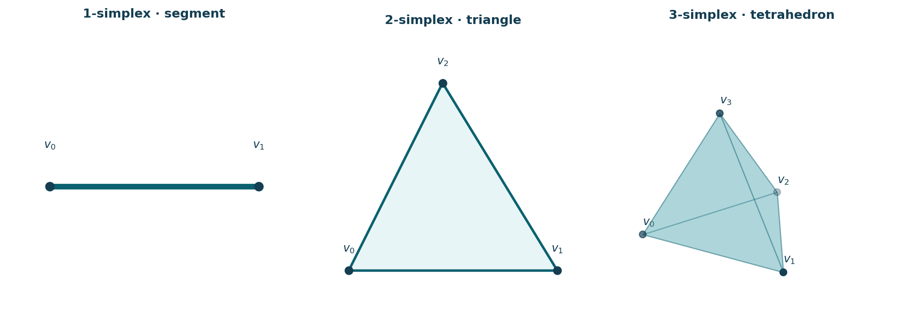
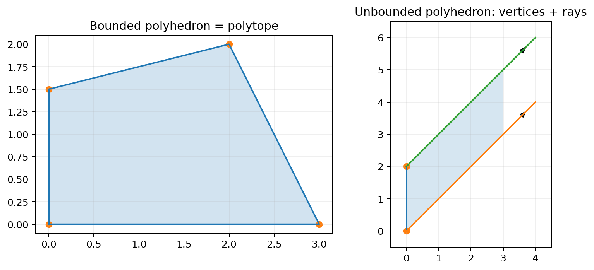
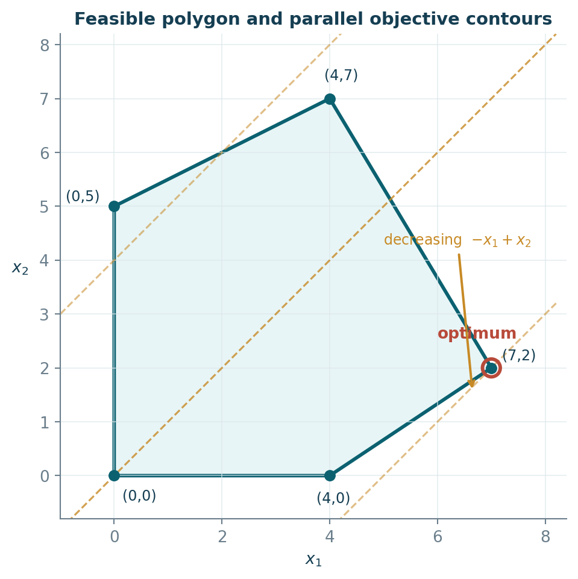
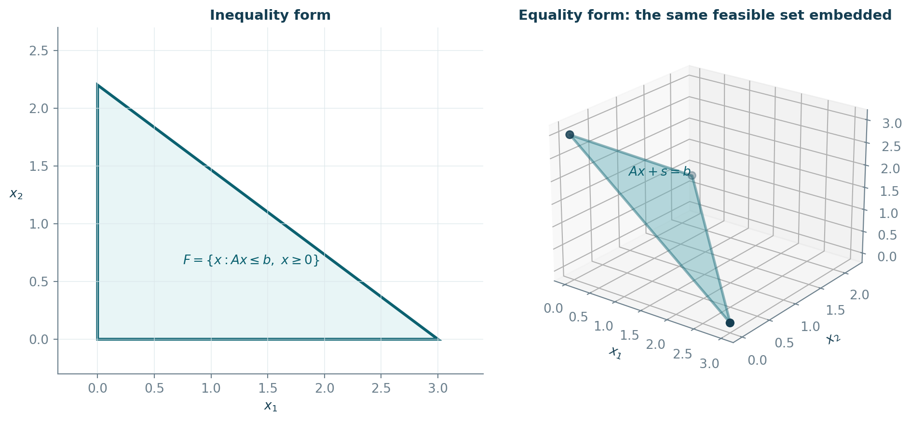
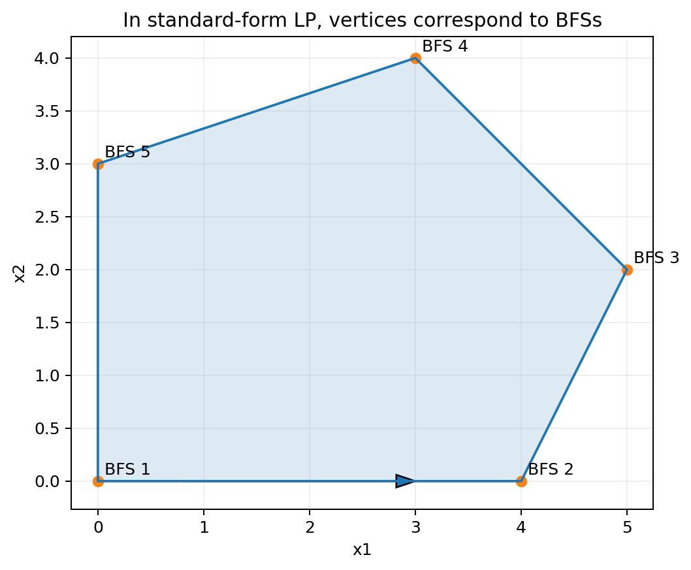

# Chapter 2 — Subspaces, Matrices, Affine Sets, Cones, Convex Sets, and the Linear Programming Problem：中文学习笔记


## 1. 本章到底在解决什么问题
Chapter 1 已经告诉我们：线性规划可以写成

$$
\min c^\top x\quad\text{s.t.}\quad Ax\le b,\;x\ge0.
$$

但只会写模型还不够。要理解“为什么单纯形法只在某些点之间移动”，需要回答三个问题：

1. $Ax=b$ 的解到底是什么结构？
2. 线性不等式围成的可行域在几何上是什么形状？
3. 为什么线性目标函数只需要关注可行域的“角点”？

本章恰好按这三个问题组织：

```text
线性代数
  │
  ├── 子空间 / 基 / 秩
  ├── 矩阵消元 / LU
  └── Ax=b 的 basic solution
          │
          ▼
仿射与凸几何
  │
  ├── affine / convex / cone
  ├── hyperplane / half-space
  └── extreme point
          │
          ▼
线性规划几何
  │
  ├── feasible set 是 convex polyhedron
  ├── 有界最优值可在 extreme point 取得
  └── extreme point ⇔ basic feasible solution
          │
          ▼
Chapter 3：Primal Simplex
```

**这一章最重要的一句话：**

> 单纯形法的代数对象是“基本可行解（basic feasible solution, BFS）”，它的几何对象就是“可行多面体的极点（extreme point）”。

***

## 2. 学习目标
学完本章，你应该能够：

1. 正确使用向量、内积、范数、矩阵、转置、矩阵乘法；
2. 判断一个集合是否为子空间，理解 span、linear independence、basis、dimension、rank；
3. 用初等行变换求逆、解方程，并理解 Gaussian elimination、partial pivoting、LU decomposition；
4. 对 $Ax=b$ 构造 basic solution，并区分 basic / nonbasic variables 与 degeneracy；
5. 区分 linear / affine / conical / convex combination；
6. 区分 subspace、affine set、convex set、convex cone；
7. 理解 affine hull、convex hull、conical hull；
8. 理解 hyperplane、half-space、polytope、polyhedron、simplex、extreme point；
9. 证明 LP 可行域是凸集；
10. 理解 finite basis theorem；
11. 理解“线性目标在多面体上若有有界最优值，则可在极点取得”；
12. 理解 slack variables 为什么不会破坏极点结构；
13. 理解 extreme point 与 BFS 的对应关系，为 Chapter 3 单纯形法做好准备。

***

## 3. 先修知识：最小充分复习
### 3.1 向量与矩阵尺寸
矩阵

$$
A=[a_{ij}]\in\mathbb{R}^{m\times n}
$$

有 $m$ 行、$n$ 列。向量通常视为列矩阵：

$$
x\in\mathbb{R}^{n\times1}\equiv\mathbb{R}^n.
$$

矩阵乘法 $AB$ 有意义的条件是：$A$ 的列数等于 $B$ 的行数。

若

$$
A\in\mathbb{R}^{m\times k},\qquad B\in\mathbb{R}^{k\times n},
$$

则

$$
AB\in\mathbb{R}^{m\times n}.
$$

### 3.2 转置
$A^\top$ 把行列互换：

$$
(A^\top)_{ij}=a_{ji}.
$$

常用性质：

$$
(AB)^\top=B^\top A^\top,
$$

注意顺序会反过来。

### 3.3 内积和范数
对 $x,y\in\mathbb{R}^n$，内积

$$
\langle x,y\rangle=x^\top y=\sum_{i=1}^{n}x_i y_i.
$$

欧氏范数

$$
\lVert x\rVert_2=\sqrt{x^\top x}.
$$

教材 Proposition 1 强调三个基本性质：对任意标量 $\alpha,\beta$，

$$
\langle x,y\rangle=\langle y,x\rangle,
$$

$$
\langle \alpha x+\beta y,z\rangle
=\alpha\langle x,z\rangle+\beta\langle y,z\rangle,
$$

以及

$$
\langle x,x\rangle\ge0,
$$

且仅当 $x=0$ 时等号成立。

### 3.4 为什么本章需要线性代数
Chapter 3 的单纯形法本质上不断做这件事：

> 从约束矩阵 $A$ 的列中选出一组线性无关列作为“基”，解出对应基本变量，再尝试把另一列换进来。

所以 basis、rank、matrix inverse、pivot、basic solution 并不是背景知识，而是算法本身的语言。

***

## 4. 核心术语表
| 中文 | English | 核心含义 |
|---|---|---|
| 子空间 | subspace | 对任意线性组合封闭的非空集合 |
| 线性组合 | linear combination | $\sum\alpha_i x_i$，系数任意实数 |
| 张成 / 线性包 | span / linear hull | 所有线性组合组成的集合 |
| 线性相关 | linearly dependent | 存在非全零系数使组合为 0 |
| 线性无关 | linearly independent | 只有全零系数才能组合为 0 |
| 基 | basis | 既线性无关又张成空间的一组向量 |
| 维数 | dimension | 任一基中的向量个数 |
| 秩 | rank | 行空间/列空间的维数 |
| 非奇异矩阵 | nonsingular matrix | 存在逆矩阵 |
| 奇异矩阵 | singular matrix | 不可逆 |
| 初等行变换 | elementary row operation | 行倍乘、倍加、行交换 |
| 高斯消元 | Gaussian elimination | 前向消元 + 回代 |
| 部分主元 | partial pivoting | 每步选较大绝对值主元降低舍入误差 |
| LU 分解 | LU decomposition | $A=LU$ |
| 基本变量 | basic variable | 与基矩阵列对应的变量 |
| 非基本变量 | nonbasic variable | 基本解中设为 0 的变量 |
| 基本解 | basic solution | 选 $m$ 个独立列，非基变量设 0 后求解 |
| 退化基本解 | degenerate basic solution | 至少一个基本变量等于 0 |
| 仿射组合 | affine combination | $\sum\alpha_i x_i$ 且 $\sum\alpha_i=1$ |
| 锥组合 | conical combination | $\sum\alpha_i x_i$ 且 $\alpha_i\ge0$ |
| 凸组合 | convex combination | $\alpha_i\ge0$ 且 $\sum\alpha_i=1$ |
| 仿射包 | affine hull | 所有仿射组合 |
| 锥包 | conical hull | 所有锥组合 |
| 凸包 | convex hull | 所有凸组合 |
| 仿射集 | affine set | 任意两点连成的整条直线都在集合内 |
| 凸集 | convex set | 任意两点之间的线段都在集合内 |
| 凸锥 | convex cone | 对非负线性组合封闭 |
| 超平面 | hyperplane | $H(c,\beta)=\{x:c^\top x=\beta\}$ |
| 半空间 | half-space | $c^\top x\le\beta$ 或 $\ge\beta$ |
| 凸多胞体 | convex polytope | 有限个点的凸包；必有界 |
| 凸多面体 | convex polyhedron | 有限个半空间的交；可无界 |
| 单纯形 | simplex | $k+1$ 个仿射无关点的凸包 |
| 极点 | extreme point | 不能作为集合内两个不同点的非平凡凸组合 |
| 方向向量 | direction vector | 描述无界多面体向无穷延伸的方向 |
| 基本可行解 | basic feasible solution, BFS | 同时是 basic solution 和 feasible solution |

***

## 5. Section 1 — A Review of Elementary Linear Algebra

### 5.1 子空间：什么样的集合保留线性结构
#### 5.1.1 正式定义
非空集合 $S\subseteq\mathbb{R}^n$ 是子空间，当且仅当对任意

$$
x,y\in S,\qquad \alpha,\beta\in\mathbb{R},
$$

都有

$$
\alpha x+\beta y\in S.
$$

这一个条件同时包含了：

- $0\in S$；
- 对加法封闭；
- 对任意实数倍封闭。

#### 5.1.2 最简单的正例与反例
正例：

$$
S=\{(x_1,x_2,0)^\top:x_1,x_2\in\mathbb{R}\}
$$

是经过原点的 $x_1x_2$ 平面。

反例：

$$
T=\{(x_1,x_2)^\top:x_1+x_2=1\}
$$

不是子空间，因为 $0\notin T$。它后面会被称为**仿射集**。

***

### 5.2 span：一组向量究竟能生成多大的空间
对集合 $B\subseteq\mathbb{R}^n$，线性包/张成空间定义为

$$
L(B)=\left\{
\sum_{i=1}^{k}\alpha_i x_i:
\alpha_i\in\mathbb{R},\;x_i\in B
\right\}.
$$

$L(B)$ 一定是子空间，而且是**包含 $B$ 的最小子空间**。

#### Example 1 — 标准基张成 $\mathbb{R}^3$
教材取

$$
B_1=\left\{
\begin{bmatrix}1\\0\\0\end{bmatrix},
\begin{bmatrix}0\\1\\0\end{bmatrix},
\begin{bmatrix}0\\0\\1\end{bmatrix}
\right\}.
$$

任意 $x=(x_1,x_2,x_3)^\top$ 都可写成

$$
x=x_1e_1+x_2e_2+x_3e_3,
$$

所以

$$
L(B_1)=\mathbb{R}^3.
$$

#### Example 2 — 两个向量张成一个平面
$$
B_2=\left\{
\begin{bmatrix}1\\0\\0\end{bmatrix},
\begin{bmatrix}1\\0\\1\end{bmatrix}
\right\}.
$$

线性组合为

$$
\alpha
\begin{bmatrix}1\\0\\0\end{bmatrix}
+\beta
\begin{bmatrix}1\\0\\1\end{bmatrix}
=
\begin{bmatrix}\alpha+\beta\\0\\\beta\end{bmatrix}.
$$

所以第二坐标恒为 0：

$$
L(B_2)=\{(x_1,0,x_3)^\top:x_1,x_3\in\mathbb{R}\},
$$

即 $x_1x_3$ 平面。

#### Example 3 — 加一个“多余向量”并不会扩张 span
教材再加入

$$
\begin{bmatrix}4\\0\\1\end{bmatrix}
=3
\begin{bmatrix}1\\0\\0\end{bmatrix}
+
\begin{bmatrix}1\\0\\1\end{bmatrix}.
$$

它已经在 $L(B_2)$ 内，因此新的集合仍张成同一平面。这是“线性相关”的最直观意义：某个向量能被其他向量解释掉。

#### Example 4 — 从方程看 span
集合

$$
S=\{(x_1,x_2,x_3)^\top:x_1+x_2=0\}
$$

可写成 $x_2=-x_1$，于是

$$
\begin{bmatrix}x_1\\x_2\\x_3\end{bmatrix}
=x_1
\begin{bmatrix}1\\-1\\0\end{bmatrix}
+x_3
\begin{bmatrix}0\\0\\1\end{bmatrix}.
$$

因此

$$
S=L\left(
\left\{
(1,-1,0)^\top,(0,0,1)^\top
\right\}
\right).
$$

这也立即证明 $S$ 是子空间。

***

### 5.3 线性无关、基和维数
#### 5.3.1 线性相关/无关
$\{x_1,\ldots,x_k\}$ 线性相关，若存在不全为 0 的 $\alpha_i$ 使

$$
\sum_{i=1}^{k}\alpha_i x_i=0.
$$

若只有

$$
\alpha_1=\cdots=\alpha_k=0
$$

才可能得到零向量，则线性无关。

#### 5.3.2 基
$B$ 是子空间 $S$ 的一组基，当且仅当：

1. $B$ 线性无关；
2. $L(B)=S$。

**基的意义不是“生成”这么简单，而是“无冗余地生成”。**

#### Theorem 1 — 基与维数
每个有限维子空间都有基；同一子空间的任意两组基含有相同数量的向量。

因此可以定义

$$
\dim S=\text{任一基中向量的数量}.
$$

#### Theorem 2
任何张成 $S$ 的向量集合都包含一组 $S$ 的基。

#### Theorem 3
任何 $S$ 中的线性无关集合都可以扩充成 $S$ 的一组基。

#### Theorem 4
若 $\dim S=k$，那么 $S$ 中任意多于 $k$ 个向量必线性相关。

#### 为什么基表示唯一
若 $B=\{b_1,\ldots,b_k\}$ 是基且

$$
x=\sum_i\alpha_i b_i=\sum_i\beta_i b_i,
$$

相减得

$$
\sum_i(\alpha_i-\beta_i)b_i=0.
$$

由线性无关性，只能

$$
\alpha_i=\beta_i.
$$

所以一旦选定基，坐标表示唯一。

***

### 5.4 矩阵、行空间、列空间与秩
矩阵 $A\in\mathbb{R}^{m\times n}$ 的第 $j$ 列记为 $A^{(j)}$，第 $i$ 行可记为 $A_{(i)}$。

- 列空间：所有列向量的 span；
- 行空间：所有行向量的 span；
- 列秩 = 列空间维数；
- 行秩 = 行空间维数。

基本结论：

$$
\operatorname{rank}(A)
=\text{column rank}(A)
=\text{row rank}(A).
$$

#### Example 5 — 矩阵乘法
教材计算

$$
A=
\begin{bmatrix}
2&0&3\\
1&4&5
\end{bmatrix},
\qquad
B=
\begin{bmatrix}
1&0&1&0\\
2&1&6&0\\
4&0&1&0
\end{bmatrix}.
$$

逐行乘逐列：

$$
AB=
\begin{bmatrix}
14&0&5&0\\
29&4&30&0
\end{bmatrix}.
$$

例如左上角

$$
2\cdot1+0\cdot2+3\cdot4=14.
$$

#### Example 6 — 单位矩阵
$n$ 阶单位矩阵

$$
I_n=\begin{bmatrix}
1&&0\\
&\ddots&\\
0&&1
\end{bmatrix}
$$

满足

$$
AI_n=A,\qquad I_mA=A.
$$

它在矩阵乘法中扮演数字 1 的角色。

#### 分块矩阵
若尺寸匹配，矩阵可按 block 计算。例如

$$
A=[C\;D],
$$

则

$$
AB=[CB\;DB]
$$

要按实际分块方向与尺寸理解。Chapter 3 的 simplex tableau 会大量使用分块记号。

***

### 5.5 可逆矩阵
平方矩阵 $A\in\mathbb{R}^{n\times n}$ 若存在 $B$ 满足

$$
AB=BA=I_n,
$$

则 $A$ 非奇异（nonsingular），$B=A^{-1}$。

#### Example 7 — 一对互逆矩阵
教材矩阵

$$
A=
\begin{bmatrix}
1&1&-1\\
-2&1&1\\
1&1&1
\end{bmatrix}
$$

的逆为

$$
A^{-1}=
\begin{bmatrix}
0&-1/3&1/3\\
1/2&1/3&1/6\\
-1/2&0&1/2
\end{bmatrix}.
$$

直接相乘可验证

$$
AA^{-1}=A^{-1}A=I_3.
$$

#### Theorem 5 — 可逆性与秩
对 $A\in\mathbb{R}^{n\times n}$，以下等价：

$$
A\text{ 可逆}
\iff \operatorname{rank}(A)=n
\iff A\text{ 的列线性无关}
\iff A\text{ 的行线性无关}.
$$

#### Example 8 — 奇异 vs. 非奇异
若矩阵含零行或列线性相关，则 rank 不满，因而不可逆；而满秩三角形矩阵可逆。判断时不要只看“矩阵是不是方阵”，方阵也可能奇异。

***

### 5.6 初等行变换与 Gauss–Jordan
三类初等行变换：

1. $R_i\leftarrow\alpha R_i$，$\alpha\ne0$；
2. $R_i\leftarrow R_i+\alpha R_j$；
3. 交换 $R_i,R_j$。

这些操作不改变方程组解集；作为矩阵左乘时，对应初等矩阵。

#### Example 9 — 三类行变换
教材分别演示了行倍乘、倍加和行交换。真正需要记住的不是数值，而是：**任何复杂消元都只是这三类操作的组合。**

#### Example 10 — 用 $[A\mid I]$ 求逆
对 Example 7 的矩阵，构造

$$
[A\mid I_3]
$$

并做行变换直到左半边成为 $I_3$：

$$
[A\mid I_3]\longrightarrow[I_3\mid A^{-1}].
$$

最终得到

$$
A^{-1}=
\begin{bmatrix}
0&-1/3&1/3\\
1/2&1/3&1/6\\
-1/2&0&1/2
\end{bmatrix}.
$$

若无法把左半边化成 $I_n$，说明 $A$ 奇异。

#### Example 11 — 分块逆矩阵
教材考虑

$$
M=
\begin{bmatrix}
B&0\\
-c_B^\top&1
\end{bmatrix},
$$

若 $B$ 可逆，则

$$
M^{-1}=
\begin{bmatrix}
B^{-1}&0\\
c_B^\top B^{-1}&1
\end{bmatrix}.
$$

教材取

$$
-c_B^\top=[1,0,-1],
$$

以及 Example 7 的 $B$，得到

$$
c_B^\top B^{-1}
=\left[-\frac12,\frac13,\frac16\right].
$$

这个 block inverse 形式以后会直接出现在 simplex tableau 的代数推导里。

#### Example 12 — 同时求逆并解 $Ax=b$
教材取同一个

$$
A=
\begin{bmatrix}
1&1&-1\\
-2&1&1\\
1&1&1
\end{bmatrix},
\qquad
b=\begin{bmatrix}1\\2\\0\end{bmatrix}.
$$

由

$$
x=A^{-1}b
$$

得到

$$
\boxed{x=
\begin{bmatrix}
-2/3\\
7/6\\
-1/2
\end{bmatrix}}.
$$

若把右端改为

$$
\tilde b=\begin{bmatrix}1\\0\\3\end{bmatrix},
$$

同一个 $A^{-1}$ 可立即复用：

$$
A^{-1}\tilde b=
\begin{bmatrix}1\\1\\1\end{bmatrix}.
$$

这说明：当同一个 $A$ 要配多个不同 $b$ 解方程时，预处理/分解 $A$ 很有价值。

***

### 5.7 Gaussian elimination、pivot 与数值稳定性
Gauss–Jordan 会把矩阵继续化到单位阵；Gaussian elimination 只做前向消元得到上三角矩阵 $U$，再回代。

#### 前向消元
$$
[A\mid b]\longrightarrow[U\mid\tilde b].
$$

#### 回代
从最后一个方程开始求 $x_n$，再逐个往上求。

#### 为什么要选主元
若用非常小的数做 pivot，就会产生很大的消元倍数，浮点舍入误差可能被放大。因此实际数值计算常做 **partial pivoting**：在当前列选择绝对值较大的元素作为主元并交换行。

#### Example 13 — Gaussian elimination
方程组为

$$
\begin{aligned}
2x_2-x_3&=8,\\
x_1+2x_2&=6,\\
3x_2+4x_3&=12.
\end{aligned}
$$

先把含 $x_1$ 的第二行换到第一行，再消元，可得到上三角系统。回代：

$$
x_3=0,
$$

$$
3x_2=12\Rightarrow x_2=4,
$$

$$
x_1+2(4)=6\Rightarrow x_1=-2.
$$

所以

$$
\boxed{x=(-2,4,0)^\top}.
$$

教材在此引入 pivot matrix 和 permutation matrix，为 LU 分解做准备。

***

### 5.8 LU decomposition
如果消元过程可写成

$$
A=LU,
$$

其中 $L$ 是下三角、$U$ 是上三角，那么解

$$
Ax=b
$$

可拆成两步：

$$
Ly=b,
$$

再解

$$
Ux=y.
$$

当同一个 $A$ 配很多个 $b$ 时，这比每次重新消元高效得多。

**与 Chapter 5 的连接：** revised simplex 会反复求与 basis matrix $B$ 相关的线性系统，LU 分解正是高效实现的基础。

***

### 5.9 $Ax=b$ 的 basic solution：本章最重要的代数概念
设

$$
A\in\mathbb{R}^{m\times n},\qquad m<n,\qquad \operatorname{rank}(A)=m.
$$

从 $A$ 的 $n$ 列中选出 $m$ 个线性无关列组成

$$
B\in\mathbb{R}^{m\times m}.
$$

剩余列组成 $D$。把变量同步分为

$$
x=
\begin{bmatrix}
x_B\\x_D
\end{bmatrix}.
$$

则

$$
Bx_B+Dx_D=b.
$$

左乘 $B^{-1}$：

$$
x_B+B^{-1}Dx_D=B^{-1}b.
$$

#### 定义：basic solution
把所有非基本变量设为 0：

$$
x_D=0,
$$

则

$$
\boxed{x_B=B^{-1}b}.
$$

这就是与 basis matrix $B$ 对应的**基本解**。

#### basic variable 与 nonbasic variable
- $x_B$：basic variables；
- $x_D$：nonbasic variables，在该基本解中设为 0。

#### degeneracy
若 $B^{-1}b$ 的某个分量为 0，则该 basic solution 是退化的（degenerate）。

#### 最多有多少组 basic solution
选择 $m$ 个列的方式最多为

$$
\binom{n}{m}.
$$

并不是每组都能作为基，因为某些列组合可能线性相关。

#### Example 14 — 两个 basic solutions
系统：

$$
\begin{aligned}
x_1+x_2+6x_4&=4,\\
x_2-3x_3+2x_4&=8.
\end{aligned}
$$

第一组选列 $A^{(1)},A^{(2)}$ 为基，把 $x_3=x_4=0$：

$$
x_2=8,
$$

$$
x_1+8=4\Rightarrow x_1=-4.
$$

得到

$$
\boxed{x=(-4,8,0,0)^\top}.
$$

换一组基（教材将第 4 列换入），可以得到另一基本解

$$
\boxed{x=(-20,0,0,4)^\top}.
$$

**这里要特别注意：basic solution 不要求非负。** 只有再满足 $x\ge0$ 时，才是 basic feasible solution。

***

## 6. Section 2 — Affine and Convex Sets

### 6.1 四种“组合”必须彻底分清
对点/向量 $x_1,\ldots,x_k$：

#### 线性组合 linear combination
$$
\sum_{i=1}^{k}\alpha_i x_i,
\qquad \alpha_i\in\mathbb{R}.
$$

没有额外限制。

#### 仿射组合 affine combination
$$
\sum_{i=1}^{k}\alpha_i x_i,
\qquad
\sum_{i=1}^{k}\alpha_i=1.
$$

系数可以为负。

#### 锥组合 conical combination
$$
\sum_{i=1}^{k}\alpha_i x_i,
\qquad \alpha_i\ge0.
$$

不要求系数和为 1。

#### 凸组合 convex combination
$$
\sum_{i=1}^{k}\alpha_i x_i,
\qquad
\alpha_i\ge0,
\qquad
\sum_{i=1}^{k}\alpha_i=1.
$$

**记忆法：** convex = affine 条件 + nonnegative 条件。

***

### 6.2 四种 hull
对非空集合 $S$：

$$
L(S)=\text{所有线性组合},
$$

$$
\operatorname{aff}(S)=\text{所有仿射组合},
$$

$$
\operatorname{coni}(S)=\text{所有锥组合},
$$

$$
\operatorname{conv}(S)=\text{所有凸组合}.
$$

关系：

$$
S\subseteq\operatorname{conv}(S)\subseteq\operatorname{aff}(S)\subseteq L(S),
$$

以及

$$
S\subseteq\operatorname{conv}(S)\subseteq\operatorname{coni}(S)\subseteq L(S).
$$

#### 教材无编号 Example — 两点的四种 hull
取

$$
S=\{e_1,e_2\}
=\left\{
(1,0,0)^\top,(0,1,0)^\top
\right\}.
$$

则：

- $L(S)$：整个 $x_1x_2$ 平面；
- $\operatorname{aff}(S)$：穿过 $e_1,e_2$ 的整条直线；
- $\operatorname{coni}(S)$：第一象限方向的二维锥；
- $\operatorname{conv}(S)$：$e_1$ 与 $e_2$ 之间的闭线段。



这一个例子足以建立四个概念的几何直觉。

***

### 6.3 subspace / affine / convex / cone 的定义
#### Subspace
$$
x,y\in S,\;\alpha,\beta\in\mathbb{R}
\Rightarrow \alpha x+\beta y\in S.
$$

#### Affine set
$$
x,y\in S,\;\alpha+\beta=1
\Rightarrow \alpha x+\beta y\in S.
$$

几何含义：两点决定的**整条直线**都在集合中。

#### Convex set
$$
x,y\in S,\;0\le\alpha\le1
\Rightarrow \alpha x+(1-\alpha)y\in S.
$$

几何含义：两点之间的**线段**都在集合中。

#### Convex cone
$$
x,y\in S,\;\alpha,\beta\ge0
\Rightarrow \alpha x+\beta y\in S.
$$

几何含义：集合对从原点向外拉伸的射线封闭。



#### Proposition 1
$$
S\text{ 是子空间}\iff S=L(S).
$$

**证明思路：**

- $L(S)$ 本身总是子空间；
- 若 $S$ 已是子空间，它对任意有限线性组合封闭，因此 $L(S)\subseteq S$；
- 又总有 $S\subseteq L(S)$；
- 所以相等。

#### Proposition 2
$$
S\text{ affine}\iff S=\operatorname{aff}(S),
$$

$$
S\text{ convex cone}\iff S=\operatorname{coni}(S),
$$

$$
S\text{ convex}\iff S=\operatorname{conv}(S).
$$

其逻辑和 Proposition 1 完全平行：一个集合若已经对相应组合封闭，就等于自己的相应 hull。

***

### 6.4 交集性质
任意多个 convex sets 的交仍是 convex；任意多个 affine sets 的交仍是 affine；任意多个以原点为顶点的 convex cones 的交仍是 convex cone。

**为什么？** 如果 $x,y$ 同时属于所有集合，那么它们的允许组合也分别属于每一个集合，因此仍属于交集。

这个结论非常重要，因为 LP 的可行域就是多个 half-spaces 的交。

***

### 6.5 affine set 是 subspace 的平移
#### Proposition 3
若 $x_0\in S$，则

$$
S\text{ affine}
\iff
S-x_0=\{x-x_0:x\in S\}\text{ 是 subspace}.
$$

#### 直观理解
- subspace 必须经过原点；
- affine set 可以不经过原点；
- 把 affine set 中某个点 $x_0$ 移回原点，就恢复线性子空间。

因此仿射几何就是“允许平移后的线性几何”。

#### dimension of affine set
定义

$$
\dim S=\dim(S-x_0),
$$

与选哪个 $x_0\in S$ 无关。

对任意集合 $T$，教材把

$$
\dim T=\dim\operatorname{aff}(T).
$$

#### Example 15 — 线段的 affine hull 与维数
$$
S=\{(x_1,x_2)^\top:x_1+x_2=1,\;x_1,x_2\ge0\}.
$$

它是从 $(1,0)$ 到 $(0,1)$ 的线段。

其 affine hull 是整条直线

$$
\operatorname{aff}(S)=\{x:x_1+x_2=1\}.
$$

取 $x_0=(1,0)^\top$，平移后：

$$
\operatorname{aff}(S)-x_0
=\{y:y_1+y_2=0\},
$$

这是 1 维子空间，因此

$$
\boxed{\dim S=1}.
$$

***

### 6.6 Hyperplane 与 half-space
对非零 $c\in\mathbb{R}^n$ 和 $\beta\in\mathbb{R}$：

$$
H(c,\beta)=\{x:c^\top x=\beta\}
$$

称为超平面。

两个闭半空间：

$$
H^+(c,\beta)=\{x:c^\top x\ge\beta\},
$$

$$
H^-(c,\beta)=\{x:c^\top x\le\beta\}.
$$

- 在 $\mathbb{R}^2$ 中，hyperplane 是直线；
- 在 $\mathbb{R}^3$ 中，hyperplane 是平面；
- 在 $\mathbb{R}^n$ 中，维数为 $n-1$。

每个 half-space 都是 convex。LP 的每条线性不等式本质上都切出一个 half-space。



> 公开版原创重绘：先看等式 $c^Tx=\beta$ 形成的 hyperplane，再看同一边界两侧的 half-spaces；三维子图同时展示法向量 $c$。

***

### 6.7 Polytope、simplex 与 extreme point
#### Convex polytope
有限个点的 convex hull：

$$
P=\operatorname{conv}\{x_1,\ldots,x_k\}.
$$

必有界。

#### Affinely independent
$\{x_0,x_1,\ldots,x_k\}$ 仿射无关，当且仅当

$$
\{x_1-x_0,\ldots,x_k-x_0\}
$$

线性无关。

#### Simplex
$k$ 维 simplex 是 $k+1$ 个仿射无关点的凸包。

- 0-simplex：一个点；
- 1-simplex：线段；
- 2-simplex：三角形；
- 3-simplex：四面体。



> 原创对照图把 1-simplex、2-simplex、3-simplex 放在一起，帮助建立“维数 = 仿射无关生成点数减 1”的几何直觉。

#### Extreme point
若 $z\in S$ 且不存在不同的 $x,y\in S$ 与 $0<\alpha<1$ 使

$$
z=\alpha x+(1-\alpha)y,
$$

则 $z$ 是极点。

**一句话：** 极点不能藏在集合内部某条线段的中间。

在多边形中，它就是通常说的“顶点”；但在一般凸集里，极点不一定只有有限个，例如严格凸圆盘的每个边界点都是极点。

***

## 7. Section 3 — The Linear Programming Problem

### 7.1 LP 的矩阵形式
教材集中研究：

$$
\begin{aligned}
\min\quad & c^\top x\\
\text{s.t.}\quad & Ax\le b,\\
&x\ge0.
\end{aligned}
$$

可行域

$$
F=\{x:Ax\le b,\;x\ge0\}.
$$

若 $F\ne\varnothing$，问题 feasible；若 $F=\varnothing$，问题 infeasible。

***

### 7.2 Proposition 4 — LP 可行域一定是 convex
取任意 $x,z\in F$，以及 $\alpha\in[0,1]$。

因为

$$
Ax\le b,\qquad Az\le b,
$$

所以

$$
A(\alpha x+(1-\alpha)z)
=\alpha Ax+(1-\alpha)Az
\le\alpha b+(1-\alpha)b=b.
$$

同时 $x,z\ge0$ 推出

$$
\alpha x+(1-\alpha)z\ge0.
$$

因此

$$
\alpha x+(1-\alpha)z\in F.
$$

所以 $F$ convex。

**这一步非常重要：** 线性不等式不会在可行域中“挖洞”。

***

### 7.3 Convex polyhedron vs. convex polytope
有限个 half-spaces 的交称为 convex polyhedron：

$$
P=\{x:Mx\le d\}.
$$

- polyhedron 可以无界；
- polytope 一定有界；
- 有界 polyhedron 就是 polytope。



***

### 7.4 Finite Basis Theorem（有限基定理）
#### Theorem 6
若 $F$ 是凸多面体，其极点集合为

$$
X=\{x_1,\ldots,x_d\},
$$

则存在有限个 direction vectors

$$
Y=\{y_1,\ldots,y_\ell\}
$$

使

$$
\boxed{
F=\operatorname{conv}(X)+\operatorname{coni}(Y)
}.
$$

也就是说任意 $x\in F$ 可写成

$$
x=
\sum_{i=1}^{d}\alpha_i x_i
+
\sum_{j=1}^{\ell}\beta_j y_j,
$$

其中

$$
\alpha_i\ge0,\qquad \sum_i\alpha_i=1,
\qquad \beta_j\ge0.
$$

#### 直观意义
一个多面体由两部分信息完全描述：

1. **从哪里开始**：极点；
2. **能向哪些方向无限走**：方向向量。

有界 polytope 没有非零无限方向，因此只剩极点的凸包。

#### 边界情形提醒：含直线的 polyhedron
Exercise 2.45 会出现一个非常重要的边界情形：某些 convex polyhedron（例如整条直线）可以**没有任何 extreme point**。因此上面的“极点 convex hull + direction cone”表述最自然地适用于存在极点、尤其是 pointed polyhedron 的情形。

对完全一般的非空 polyhedron，更稳妥的现代 Minkowski--Weyl 写法是

$$
P=\operatorname{conv}(V)+\operatorname{coni}(R)+\operatorname{span}(L),
$$

其中 $L$ 描述 lineality space（可以沿正反两个方向无限移动的线性子空间）。若没有 extreme points，也可以选一个基准点 $v_0$，再加成对方向 $v_i,-v_i$。

这不是替换教材主线，而是把 Exercise 2.45--2.46(c) 暗示的特殊情况显式补全。

***

### 7.5 Theorem 7 — LP 的最优值可在极点取得
若线性函数

$$
f(x)=c^\top x
$$

在 polyhedron $F$ 上有下界，则它在 $F$ 上取得最小值，而且至少有一个极点是最优解。

#### 证明
由 finite basis theorem，任意 $x\in F$ 写成

$$
x=\sum_i\alpha_i x_i+\sum_j\beta_j y_j.
$$

线性性给出

$$
f(x)=\sum_i\alpha_i f(x_i)+\sum_j\beta_j f(y_j).
$$

若某个方向满足

$$
f(y_j)<0,
$$

那么沿该方向把 $\beta_j\to\infty$，会使 $f(x)\to-\infty$，与“有下界”矛盾。所以所有可行无界方向必须满足

$$
f(y_j)\ge0.
$$

令 $x_k$ 是所有极点中目标值最小者，则

$$
\sum_i\alpha_i f(x_i)
\ge
\sum_i\alpha_i f(x_k)
=f(x_k)\sum_i\alpha_i
=f(x_k).
$$

再加上方向项非负，得

$$
f(x)\ge f(x_k).
$$

因此极点 $x_k$ 最优。

#### 为什么这一定理改变了问题
原本 $F$ 可能有无限多个点；现在我们知道：若有有界最优值，至少可以把搜索集中到 extreme points。

Chapter 3 的单纯形法不会枚举所有极点，而是从一个极点沿邻接结构移动到更好的极点。

***

### 7.6 Example 16 — 图解 LP
问题：

$$
\begin{aligned}
\min\quad & -x_1+x_2\\
\text{s.t.}\quad
&-x_1+2x_2\le10,\\
&5x_1+3x_2\le41,\\
&2x_1-3x_2\le8,\\
&x_1,x_2\ge0.
\end{aligned}
$$

可行域的极点为

$$
(0,0),\;(4,0),\;(7,2),\;(4,7),\;(0,5).
$$

计算目标：

| 极点 | $-x_1+x_2$ |
|---|---:|
| $(0,0)$ | $0$ |
| $(4,0)$ | $-4$ |
| $(7,2)$ | $-5$ |
| $(4,7)$ | $3$ |
| $(0,5)$ | $5$ |

所以

$$
\boxed{x^*=(7,2)^\top,\qquad f^*=-5.}
$$

几何上，等值线

$$
-x_1+x_2=\mu
$$

斜率恒定，只需平行移动，第一次/最后一次接触可行域的位置会落在极点或一整条最优边上。



> 图中同时标出可行多边形的五个极点，以及目标函数等值线 $-x_1+x_2=\mu$ 的平移方向；最优点出现在 $(7,2)$。

***

### 7.7 加 slack variable：从不等式 polyhedron 到等式标准形式
对

$$
Ax\le b,
$$

定义 slack vector

$$
s=b-Ax\ge0.
$$

则

$$
Ax+s=b.
$$

把

$$
\bar x=
\begin{bmatrix}
x\\s
\end{bmatrix},
\qquad
\bar A=[A\;I],
$$

得到

$$
\bar A\bar x=b,\qquad \bar x\ge0.
$$

目标中 slack 的成本系数为 0。

***

### 7.8 Proposition 5 — slack 映射保持凸组合
定义

$$
\sigma(x)=
\begin{bmatrix}
x\\b-Ax
\end{bmatrix}.
$$

若 $x,z$ 是原不等式问题的可行点，则 $\sigma$ 一一对应到等式标准形式中的可行点。

并且

$$
\begin{aligned}
\sigma(\alpha x+(1-\alpha)z)
&=
\begin{bmatrix}
\alpha x+(1-\alpha)z\\
b-A(\alpha x+(1-\alpha)z)
\end{bmatrix}\\
&=
\alpha
\begin{bmatrix}x\\b-Ax\end{bmatrix}
+(1-\alpha)
\begin{bmatrix}z\\b-Az\end{bmatrix}\\
&=\alpha\sigma(x)+(1-\alpha)\sigma(z).
\end{aligned}
$$

所以它保持 convex combinations。

#### Proposition 6 — 极点也被保持
$$
x\text{ 是原可行域极点}
\iff
\sigma(x)\text{ 是扩展可行域极点}.
$$

这意味着引入 slack variables 不会把我们真正关心的几何“角点”弄丢。

#### Example 17 — 三角形加一个 slack 变成标准 simplex
原集合

$$
F=\{(x_1,x_2)^\top:x_1+x_2\le1,\;x_1,x_2\ge0\}.
$$

令

$$
x_3=1-x_1-x_2\ge0,
$$

得到

$$
\bar F=\{(x_1,x_2,x_3)^\top:x_1+x_2+x_3=1,\;x\ge0\}.
$$



> 原创重绘展示二维三角形可行域如何通过 slack variable 一一对应到三维等式平面；这正是 Proposition 5/6 的几何版本。

极点对应：

$$
(0,0)\leftrightarrow(0,0,1),
$$

$$
(1,0)\leftrightarrow(1,0,0),
$$

$$
(0,1)\leftrightarrow(0,1,0).
$$

***

### 7.9 Theorem 8 — 极点与独立列
考虑标准形式可行域

$$
\bar F=\{x:Ax=b,\;x\ge0\},
$$

其中 $A\in\mathbb{R}^{m\times n}$ 且 $\operatorname{rank}(A)=m$。

#### 第一部分
若 $x$ 是极点，并令

$$
\Lambda=\{j:x_j>0\},
$$

则对应列

$$
\{A^{(j)}:j\in\Lambda\}
$$

必须线性无关。

##### 证明导航
假设这些正变量对应列线性相关，则存在非零 $y$ 使

$$
\sum_{j\in\Lambda}y_jA^{(j)}=0.
$$

因为 $x_j>0$，可以取足够小的 $t>0$，让

$$
u=x+ty,
\qquad
v=x-ty
$$

仍然非负。又因为 $Ay=0$，

$$
Au=Ax+tAy=b,
$$

$$
Av=Ax-tAy=b.
$$

所以 $u,v$ 都可行且不同，并且

$$
x=\frac12u+\frac12v.
$$

这与 $x$ 是极点矛盾。

#### 第二部分
反过来，若选择一组线性无关列作为 basis matrix $B$，令非基本变量为 0，且解

$$
Bx_B=b
$$

满足 $x_B\ge0$，则得到的点是极点。

**结论：** 对标准形式 LP，极点由线性无关的基列生成。

***

### 7.10 Example 18 — 从极点到 BFS
把 Example 16 加入三个 slack variables：

$$
\begin{aligned}
-x_1+2x_2+x_3&=10,\\
5x_1+3x_2+x_4&=41,\\
2x_1-3x_2+x_5&=8,\\
x_i&\ge0.
\end{aligned}
$$

从 5 列中选 3 个线性无关列作为基。

若选第 1、2、3 列，解得

$$
(x_1,x_2,x_3)=(7,2,13),
$$

并令 $x_4=x_5=0$，得到

$$
(7,2,13,0,0)^\top\ge0.
$$

所以这是 BFS，对应原问题极点 $(7,2)$。

若换某组列得到基本变量含负数，则虽是 basic solution，却不是 BFS，也不对应可行域极点。

教材枚举后得到原二维可行域所有极点：

$$
(7,2),\;(4,7),\;(4,0),\;(0,5),\;(0,0).
$$

其中目标最小仍在

$$
\boxed{(7,2)}.
$$

**为什么还需要 Chapter 3？** 因为枚举 $\binom{n}{m}$ 个基在大问题中太贵。单纯形法将学会“只换一列”地从一个 BFS 走向相邻 BFS。

***

## 8. 本章最重要的等价关系
在标准形式

$$
Ax=b,
\qquad x\ge0,
\qquad \operatorname{rank}(A)=m
$$

下，可以建立这条链：

```text
选择 m 个线性无关列
        ⇓
basis matrix B
        ⇓
令 nonbasic variables = 0
        ⇓
x_B = B^{-1}b
        ⇓
basic solution
        ⇓  若 x_B >= 0
basic feasible solution (BFS)
        ⇕
extreme point of feasible polyhedron
```

而 Theorem 7 又告诉我们：

```text
LP 有有限最优值
        ⇓
至少存在一个最优 extreme point
        ⇕
至少存在一个最优 BFS
```

这就是 Chapter 3 单纯形法成立的理论骨架。

***

## 9. 算法与计算流程
### 9.1 判断一组向量是否线性无关
1. 把向量作为列组成矩阵 $B$；
2. 做行消元；
3. 若每列都有 pivot（对方阵即 rank 满），则线性无关；
4. 若出现自由列，则线性相关。

### 9.2 构造 basic solution
输入：$Ax=b$，$A\in\mathbb{R}^{m\times n}$，rank $A=m$。

1. 从 $A$ 选 $m$ 个线性无关列组成 $B$；
2. 对应变量记为 $x_B$；
3. 其余变量 $x_D=0$；
4. 解 $Bx_B=b$；
5. 拼回完整 $x$；
6. 若 $x\ge0$，则是 BFS；否则只是 basic solution。

### 9.3 Gaussian elimination
1. 在当前列选择 pivot；
2. 必要时交换行（partial pivoting）；
3. 消去 pivot 下方元素；
4. 递归到右下子矩阵；
5. 得到上三角 $U$ 后回代。

### 9.4 用极点解二维 LP
1. 画每条约束边界；
2. 确定所有半空间交集；
3. 求所有边界交点并筛选可行极点；
4. 在极点代入目标函数；
5. 比较目标值；
6. 若沿无界方向目标可持续改善，则判定 unbounded。

***

## 10. 图表与几何直觉
### 10.1 四种 hull


**看图要点：** 同样两点，允许的系数规则不同，得到的几何对象就从线段、直线、锥区域一直扩张到整个线性平面。

### 10.2 Convex 与 nonconvex


**看图要点：** 检验 convex 只需要尝试任取两点，若存在一条连接线段跑出集合，就不是 convex。

### 10.3 Polyhedron、extreme points、direction


**看图要点：** 有界多面体只需极点描述；无界多面体还需要 direction vectors 描述“向无穷延伸”的部分。

### 10.4 BFS 的几何意义


**看图要点：** 二维 LP 的极点是若干约束同时 active 的交点；在线性代数里，这对应选出一组独立列并令其他变量为 0。几何“角点”和代数“基”是同一件事的两种语言。

***

## 11. 教材 Example 1–18 索引与学习任务
| Example | 主题 | 你应掌握的结论 |
|---|---|---|
| 1 | 标准基的 span | $e_1,e_2,e_3$ 张成 $\mathbb{R}^3$ |
| 2 | 两向量 span | 两独立向量张成平面 |
| 3 | 冗余向量 | 相关向量不会扩大 span |
| 4 | 方程定义子空间 | 把约束参数化成 basis |
| 5 | 矩阵乘法 | 行乘列 |
| 6 | 单位矩阵 | $AI=A$ |
| 7 | 逆矩阵 | $AA^{-1}=I$ |
| 8 | rank 与 singularity | 满秩方阵可逆 |
| 9 | 三类行变换 | 消元基本操作 |
| 10 | Gauss–Jordan 求逆 | $[A\mid I]\to[I\mid A^{-1}]$ |
| 11 | block inverse | simplex 分块代数铺垫 |
| 12 | $A^{-1}b$ | 同一逆可复用多个 RHS |
| 13 | Gaussian elimination | forward elimination + back substitution |
| 14 | basic solutions | basis columns → basic variables |
| 无编号 | 四种 hull | linear/affine/conical/convex |
| 15 | affine hull dimension | affine set = translated subspace |
| 16 | LP 几何求解 | optimum at extreme point |
| 17 | slack map | 极点结构被保持 |
| 18 | BFS / extreme point | 单纯形法理论入口 |

***

## 12. 概念辨析与易错点
### 12.1 span vs. basis
span 是一个**集合/空间**；basis 是一组**无冗余生成向量**。

### 12.2 linear independence vs. orthogonality
正交一定线性无关（非零向量），但线性无关不要求互相垂直。

### 12.3 affine set vs. convex set
- affine：两点决定的整条线；
- convex：只要求两点间线段。

所以

$$
\text{affine}\Rightarrow\text{convex},
$$

但反之不成立。

### 12.4 polytope vs. polyhedron
- polytope：有限点的凸包，必有界；
- polyhedron：有限半空间的交，可有界也可无界。

### 12.5 basic solution vs. BFS
basic solution 可以含负数；BFS 必须满足所有可行性条件，特别是 $x\ge0$。

### 12.6 extreme point vs. “边界上的点”
边界点不一定是极点。一条边的内部点在边界上，但它能写成两个端点的凸组合，因此不是极点。

### 12.7 rank $m$ 为什么重要
若 $A\in\mathbb{R}^{m\times n}$ 但 rank $A<m$，并非每条等式约束都独立；直接选 $m$ 列做 basis 可能失败。教材暂时假设 full row rank，后续再处理欠秩情况。

### 12.8 “目标在极点取得”不等于“最优解唯一”
若目标等值线与一条可行边平行并恰好贴住整条边，那么边上所有点都最优，其中两个端点是最优极点。

***

## 13. 高频小白问答
#### Q1：为什么 affine combination 要求系数和为 1？
因为这使组合对平移不敏感：若所有点同时加一个 $v$，组合结果也只加一个 $v$。这正是“仿射几何”的核心。

#### Q2：convex combination 为什么还要系数非负？
非负 + 和为 1 使结果成为“加权平均”，因此不会跑出点之间的线段/多边形内部。

#### Q3：为什么 basic solution 要把非基变量设成 0？
$m$ 个独立方程要唯一解出 $m$ 个基本变量，需要把剩余 $n-m$ 个自由度固定。设为 0 是最自然且与非负约束相容的选择。

#### Q4：为什么极点处通常有多个约束同时取等号？
直观上，一个二维角点通常由两条边界线相交；在 $m$ 维等式标准形式中，这对应足够多的变量/约束变为 active，从而消除局部自由度。

#### Q5：Theorem 7 是否说所有最优点都是极点？
不是。它说至少存在一个极点最优。若整条边都最优，边内部点也最优，但不是极点。

#### Q6：为什么 Chapter 2 看起来比 Chapter 1 抽象很多？
因为 Chapter 2 在建立后续算法的共同语言。Chapter 3 以后出现的 basis、pivot、BFS、adjacent solution、revised simplex 都直接依赖这里。

***

## 14. 本章知识地图
```text
R^n
│
├── linear combination
│   └── span L(S)
│       └── subspace
│           ├── linear independence
│           ├── basis
│           └── dimension
│
├── matrix A
│   ├── row/column space
│   ├── rank
│   ├── inverse
│   ├── Gaussian elimination
│   ├── pivot / partial pivoting
│   └── LU
│
├── Ax=b, m<n
│   ├── choose basis B
│   ├── x_D=0
│   └── x_B=B^{-1}b
│       └── basic solution
│
├── affine / conical / convex combination
│   ├── aff(S)
│   ├── coni(S)
│   └── conv(S)
│
├── affine set / convex set / convex cone
│   ├── hyperplane
│   ├── half-space
│   ├── polytope
│   ├── polyhedron
│   └── extreme point
│
└── LP feasible region
    ├── convex polyhedron
    ├── finite basis theorem
    ├── optimum at extreme point
    ├── slack variables preserve extreme points
    └── extreme point <=> BFS
            │
            ▼
       Chapter 3 simplex
```

***

## 15. 一页速记
1. 子空间：对任意实系数线性组合封闭。
2. basis = span + linearly independent。
3. rank = 行空间维数 = 列空间维数。
4. 方阵可逆 $\iff$ rank 满。
5. Gaussian elimination = 前向消元 + 回代。
6. partial pivoting 用来降低舍入误差。
7. $A=LU$ 后可先解 $Ly=b$ 再解 $Ux=y$。
8. basic solution：选 $m$ 个独立列，令其余变量为 0，解 $Bx_B=b$。
9. affine combination：系数和 1；convex combination：再加非负。
10. convex set：任意两点间线段都在集合内。
11. hyperplane：$c^\top x=\beta$；half-space：$c^\top x\le\beta$ 或 $\ge\beta$。
12. polyhedron 可无界，polytope 有界。
13. extreme point 不能写成两个不同可行点的非平凡凸组合。
14. LP feasible set 是 convex polyhedron。
15. 若线性目标在 polyhedron 上有下界，至少有一个极点最优。
16. slack variable 映射保持凸组合和极点。
17. 标准形式中，BFS 与 extreme point 对应。
18. 单纯形法 = 在 BFS/极点之间有策略地移动。

***

## 16. 独立学习自测
### 自测 1
判断

$$
S=\{(x_1,x_2)^\top:x_1+x_2=0\}
$$

是否为 subspace。

**答案：** 是。零点满足；任意两个解的线性组合仍满足分量和为 0。

### 自测 2
判断

$$
T=\{x:x_1+x_2=1\}
$$

是否为 subspace、affine、convex。

**答案：** 不是 subspace（不含 0），是 affine，因此也是 convex。

### 自测 3
若 $A\in\mathbb{R}^{3\times5}$ 且 rank $A=3$，一个 basic solution 需要选几列？

**答案：** 选 3 个线性无关列作为 basis。

### 自测 4
若基本解为

$$
x=(2,-1,0,0,3)^\top,
$$

它能否成为标准形式 $x\ge0$ 的 BFS？

**答案：** 不能，因为存在负分量。

### 自测 5
为什么 line segment 的中间点通常不是 extreme point？

**答案：** 因为它可以写成两个端点的非平凡 convex combination。

### 自测 6
有限最优值 LP 的最优解一定唯一吗？

**答案：** 不一定；但至少有一个 extreme point/BFS 是最优的。

### 自测 7
写出

$$
x_1+2x_2\le5
$$

的 slack 形式。

**答案：**

$$
x_1+2x_2+s=5,\qquad s\ge0.
$$

### 自测 8
为什么 $\operatorname{conv}(S)$ 是包含 $S$ 的最小 convex set？

**答案：** 它本身 convex 且包含 $S$；任何包含 $S$ 的 convex set 必须包含 $S$ 的所有有限 convex combinations，因此也必须包含 $\operatorname{conv}(S)$。

***

## 17. 与 Chapter 3 的连接
从现在开始，你应把下面三种说法视作同一结构的不同视角：

- 几何：当前点是 feasible polyhedron 的 extreme point；
- 代数：当前点是 $Ax=b,x\ge0$ 的 BFS；
- 算法：当前有一个 admissible basis $B$。

Chapter 3 的核心工作就是：

1. 从一个 BFS 开始；
2. 判断是否最优；
3. 选一个非基变量进入 basis；
4. 选一个基本变量离开 basis；
5. pivot 到新的 BFS；
6. 重复直到最优或识别 unbounded。

如果这里的 basic solution 与 extreme point 没有真正理解，后面的 tableau 很容易变成机械算表。
