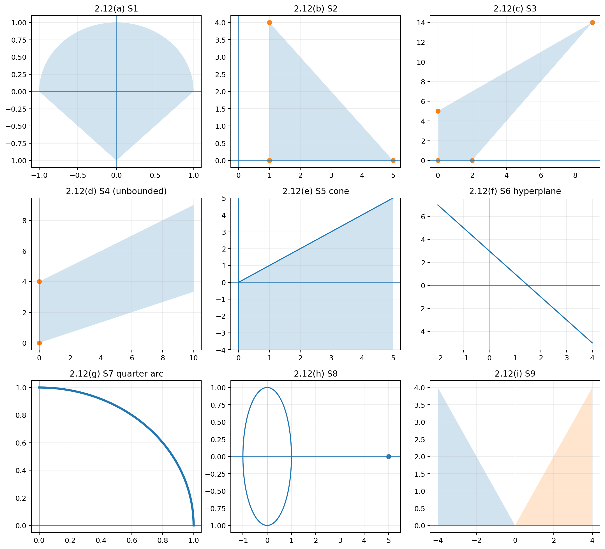
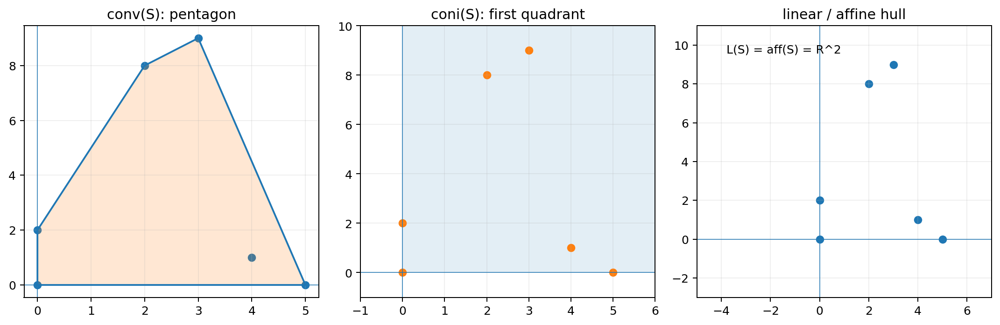
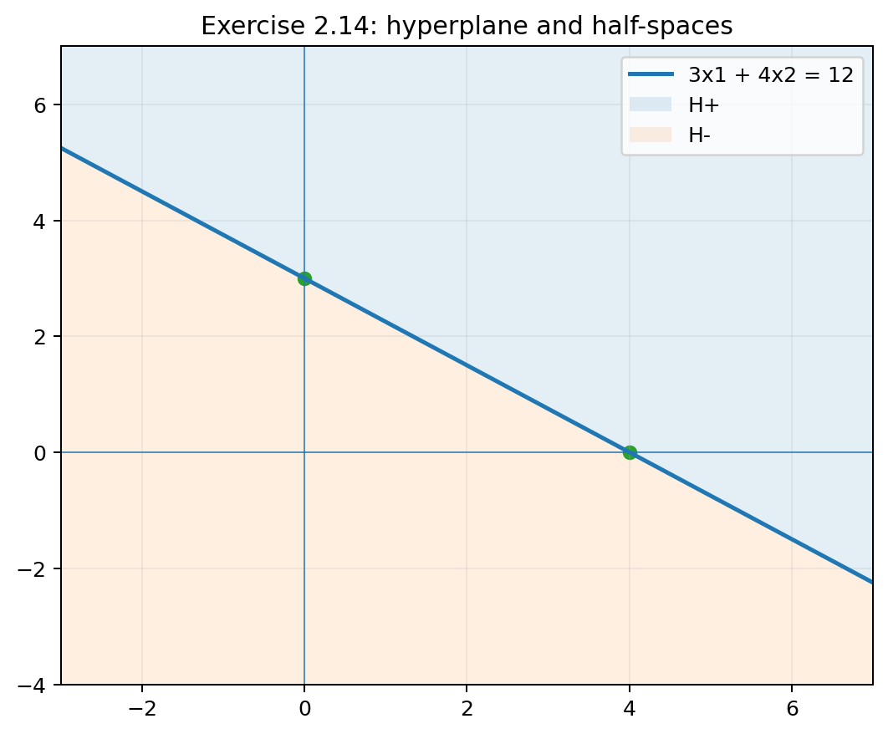
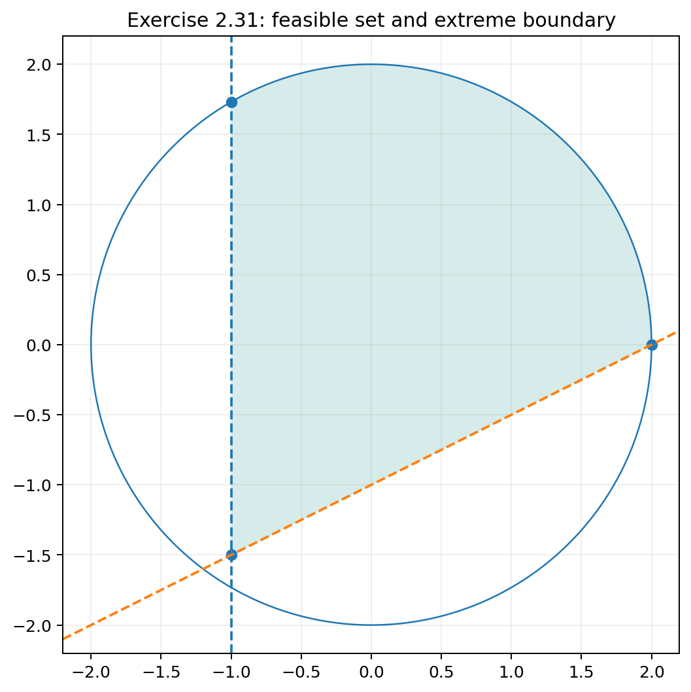
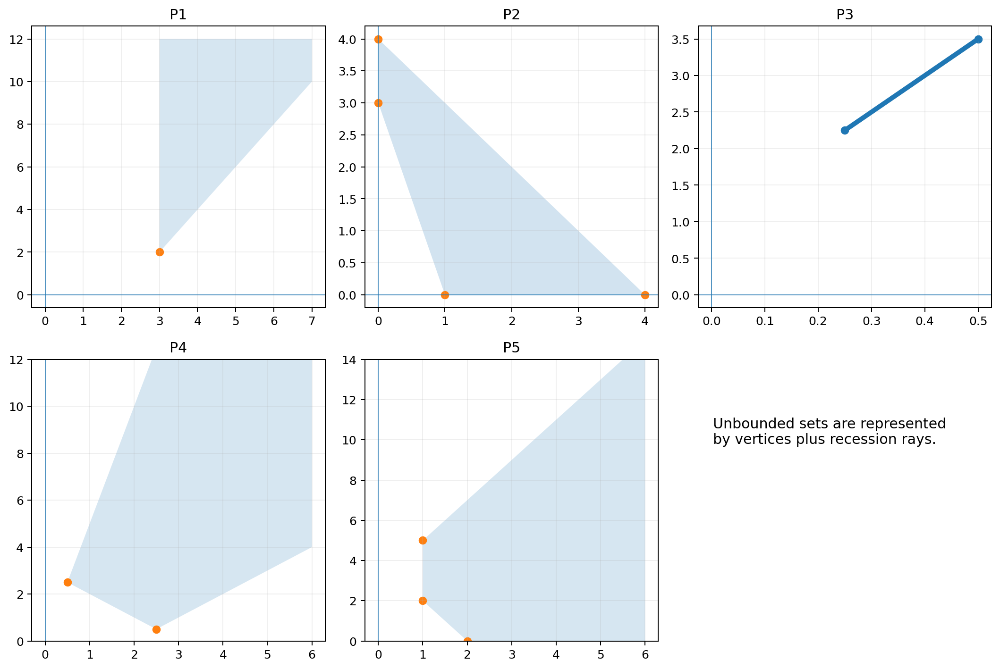
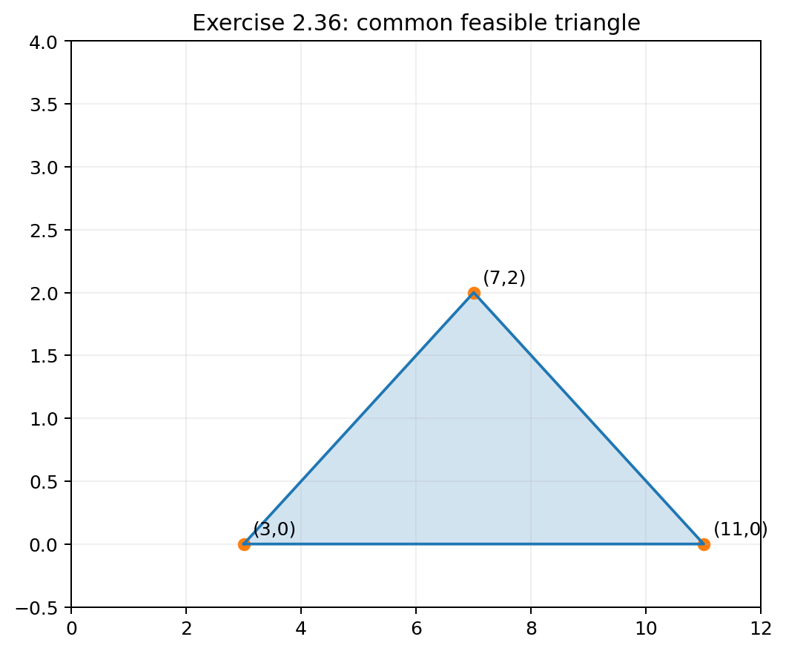
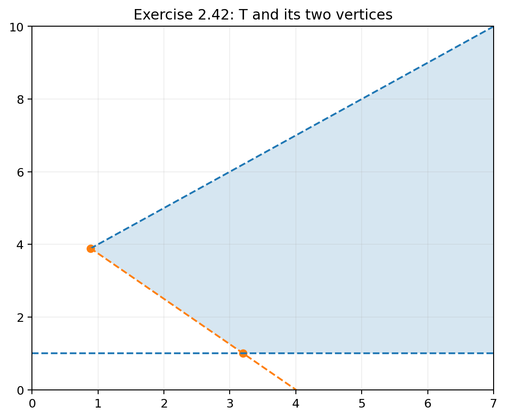

# Chapter 2 — Subspaces, Matrices, Affine Sets, Cones, Convex Sets, and the Linear Programming Problem：习题与答案（中英双语）

> **独立学习要求：** 本文件中的题目重述、符号、必要背景与解答均尽量自洽；读者不需要同时打开教材才能理解本阶段已经完成的题目。
>
> **当前状态：🟩 当前 PDF 中可可靠识别的 Chapter 2 习题均已完成并核对：2.1–2.31、Section 3 开头的无编号 polyhedron 题块、2.34–2.46。当前 PDF 无法可靠判定该无编号题块与 2.32/2.33 的准确对应关系，因此保留编号异常，不伪造缺失题面。**
>
> 排版规范：[`../FORMATTING_GUIDE.md`](../FORMATTING_GUIDE.md)　　术语与符号：[`../SYMBOLS_AND_TERMS.md`](../SYMBOLS_AND_TERMS.md)

***

## 0. 使用说明

Chapter 2 的习题分成三组：

1. **2.1–2.11：线性代数与基本解**——为单纯形法准备计算工具；
2. **2.12–2.31：仿射集、凸集、锥、超平面、极点**——建立线性规划几何语言；
3. **2.32–2.46：线性规划几何与基本可行解**——直接连接 Chapter 3 的单纯形法。

本文件已按三组逐步补全。每题尽量包含：英文重述、中文题意、知识点、详细解答、英文简答、验算和易错点。Exercise 2.32 因源文件题面缺失，只记录审计结论，不虚构内容。

### 关于 Exercise 2.1 的编号异常

当前 PDF 的教材印刷页 p.50 将 Chapter 2 的第一道习题印成了 `1.2`，而下一题直接是 `2.2`。结合章节位置和连续编号，本仓库把它规范化记录为 **Exercise 2.1**，同时保留此异常说明。

***

## 第一组：线性代数与基本解（Exercises 2.1–2.11）
### Exercise 2.1 — 三角矩阵乘积
> 来源：教材印刷页 p.50；PDF 第 69 页。　难度：★★

#### English restatement
Prove that the product of two upper triangular matrices is upper triangular, and that the product of two lower triangular matrices is lower triangular.

#### 中文题目
证明：

1. 两个上三角矩阵（upper triangular matrices）的乘积仍为上三角矩阵；
2. 两个下三角矩阵（lower triangular matrices）的乘积仍为下三角矩阵。

#### 考查知识点
- 矩阵乘法的元素公式；
- 上/下三角矩阵的定义；
- 利用指标范围判断求和项为何为零。

#### 中文详细解答
设

$$
A=(a_{ij}),\qquad B=(b_{ij})
$$

都是 $n\times n$ 上三角矩阵。所谓上三角，是指

$$
a_{ij}=0,\quad b_{ij}=0\qquad (i>j).
$$

令

$$
C=AB=(c_{ij}).
$$

矩阵乘法告诉我们

$$
c_{ij}=\sum_{k=1}^n a_{ik}b_{kj}.
$$

为了证明 $C$ 是上三角，只需证明当 $i>j$ 时 $c_{ij}=0$。

固定一个 $i>j$。对任意 $k$，只有两种可能：

- 若 $k<i$，则 $i>k$，由于 $A$ 为上三角，所以 $a_{ik}=0$；
- 若 $k\ge i$，因为 $i>j$，所以 $k>j$，由于 $B$ 为上三角，所以 $b_{kj}=0$。

因此，对每个 $k$，乘积 $a_{ik}b_{kj}$ 至少有一个因子为零，于是

$$
c_{ij}=\sum_{k=1}^n a_{ik}b_{kj}=0.
$$

这就证明了 $AB$ 仍为上三角矩阵。

下三角情况完全类似。若 $A,B$ 都为下三角，则

$$
a_{ij}=b_{ij}=0\qquad (i<j).
$$

当 $i<j$ 时：

- 若 $k>i$，则 $a_{ik}=0$；
- 若 $k\le i$，由于 $i<j$，有 $k<j$，所以 $b_{kj}=0$。

仍然得到每个 $a_{ik}b_{kj}=0$，因此 $c_{ij}=0$。故 $AB$ 为下三角矩阵。

#### English solution / final answer
For $C=AB$,

$$
c_{ij}=\sum_{k=1}^n a_{ik}b_{kj}.
$$

If $A$ and $B$ are upper triangular and $i>j$, then for every $k$ either $k<i$, which gives $a_{ik}=0$, or $k\ge i>j$, which gives $b_{kj}=0$. Hence $c_{ij}=0$. Therefore $AB$ is upper triangular. The lower-triangular case follows analogously.

#### 易错点
不要只说“显然保持三角形结构”。证明的核心是对 $c_{ij}$ 的求和项逐个说明为何为零。

***

### Exercise 2.2 — 小主元与部分选主元
> 来源：教材印刷页 p.50；PDF 第 69 页。　难度：★★★

#### English restatement
Solve, rounding every computation to the nearest ten-thousandth,

$$
\begin{aligned}
0.0001x+y&=1.0000,\\
x+y&=2.0000.
\end{aligned}
$$

First use Gaussian elimination with $0.0001$ as the pivot. Then solve using partial pivoting. Compare the results and identify the more accurate one.

#### 中文题目
所有计算均四舍五入到小数点后四位。先直接把 $0.0001$ 当作第一主元做高斯消元，再采用**部分选主元（partial pivoting）**求解。比较结果并解释差异。

#### 核心思想
这是一个经典的数值稳定性例子：数学上非零的主元不等于数值计算上“好的”主元。主元过小会产生很大的消元乘子，从而放大舍入误差。

#### 方法一：直接使用 $0.0001$ 为主元
增广矩阵为

$$
\left[
\begin{array}{cc|c}
0.0001&1.0000&1.0000\\
1.0000&1.0000&2.0000
\end{array}
\right].
$$

为了消去第二行中的 $x$，乘子为

$$
m_{21}=\frac{1.0000}{0.0001}=10000.
$$

执行

$$
R_2\leftarrow R_2-10000R_1,
$$

得到

$$
\left[
\begin{array}{cc|c}
0.0001&1.0000&1.0000\\
0&-9999.0000&-9998.0000
\end{array}
\right].
$$

于是

$$
y=\frac{-9998}{-9999}\approx0.9999.
$$

回代第一式，并继续按四位小数运算：

$$
0.0001x+0.9999=1.0000,
$$

因此

$$
0.0001x=0.0001,
$$

得到

$$
\boxed{x=1.0000,\quad y=0.9999}.
$$

#### 方法二：部分选主元
第一列中绝对值最大的元素是第二行的 $1.0000$，因此先交换两行：

$$
\left[
\begin{array}{cc|c}
1.0000&1.0000&2.0000\\
0.0001&1.0000&1.0000
\end{array}
\right].
$$

此时乘子只有

$$
m_{21}=0.0001.
$$

执行

$$
R_2\leftarrow R_2-0.0001R_1,
$$

得到

$$
\left[
\begin{array}{cc|c}
1.0000&1.0000&2.0000\\
0&0.9999&0.9998
\end{array}
\right].
$$

故

$$
y=\frac{0.9998}{0.9999}\approx0.9999,
$$

再由第一行

$$
x=2.0000-0.9999=1.0001.
$$

因此

$$
\boxed{x=1.0001,\quad y=0.9999}.
$$

#### 与精确解比较
两式相减可得

$$
0.9999x=1,
$$

因此

$$
x=\frac1{0.9999}\approx1.00010001,
$$

$$
y=2-x\approx0.99989999.
$$

四舍五入到四位小数正是

$$
\boxed{(x,y)=(1.0001,0.9999)}.
$$

所以部分选主元得到的答案正确到指定精度。

#### 为什么差别这么大？
直接用 $0.0001$ 作主元时，消元乘子达到 $10000$。这意味着第一行中的小舍入误差会被放大约一万倍。部分选主元将较大的元素选为主元，把乘子控制在很小的范围，从而提高数值稳定性。

#### English solution / final answer
Using $0.0001$ as the first pivot gives approximately

$$
(x,y)=(1.0000,0.9999).
$$

After partial pivoting, swapping the two equations first gives

$$
(x,y)=(1.0001,0.9999),
$$

which agrees with the exact solution $x=1/0.9999\approx1.00010001$, $y\approx0.99989999$. Partial pivoting is therefore numerically superior.

***

### Exercise 2.3 — 不经换行不能做标准 $LU$ 分解的矩阵
> 来源：教材印刷页 p.50；PDF 第 69 页。　难度：★★

#### English restatement
Give an example of a square matrix that has no $LU$ decomposition of the standard form with a lower triangular $L$ and an upper triangular $U$ unless row permutation is allowed.

#### 中文题目
给出一个方阵，使得在**不进行行交换**的标准消元意义下，它不能写成

$$
A=LU,
$$

其中 $L$ 为下三角矩阵、$U$ 为上三角矩阵。

#### 解答
最简单的例子是

$$
A=
\begin{bmatrix}
0&1\\
1&0
\end{bmatrix}.
$$

假设存在

$$
L=
\begin{bmatrix}
l_{11}&0\\
l_{21}&l_{22}
\end{bmatrix},\qquad
U=
\begin{bmatrix}
u_{11}&u_{12}\\
0&u_{22}
\end{bmatrix}
$$

使 $A=LU$。则

$$
LU=
\begin{bmatrix}
l_{11}u_{11}&l_{11}u_{12}\\
l_{21}u_{11}&l_{21}u_{12}+l_{22}u_{22}
\end{bmatrix}.
$$

比较 $(1,1)$ 元素：

$$
l_{11}u_{11}=0.
$$

但比较 $(1,2)$ 元素必须有

$$
l_{11}u_{12}=1,
$$

所以 $l_{11}\ne0$，从而只能有 $u_{11}=0$。

再看 $(2,1)$ 元素，要求

$$
l_{21}u_{11}=1,
$$

但 $u_{11}=0$，左边必为零，矛盾。

因此该矩阵不存在这种无换行的 $LU$ 分解。

不过若允许交换行，令

$$
P=
\begin{bmatrix}0&1\\1&0\end{bmatrix},
$$

则

$$
PA=I,
$$

立即可以做 $LU$ 分解。这正体现了置换矩阵在数值线性代数中的作用。

#### English solution / final answer
A valid example is

$$
A=\begin{bmatrix}0&1\\1&0\end{bmatrix}.
$$

Assuming $A=LU$ with $L$ lower triangular and $U$ upper triangular forces $u_{11}=0$ from the $(1,1)$ and $(1,2)$ entries, but then the $(2,1)$ entry of $LU$ is zero rather than one. Thus no such factorization exists without row permutation.

***

### Exercise 2.4 — $LU$ 分解的唯一性条件
> 来源：教材印刷页 p.50；PDF 第 69 页。　难度：★★★

#### English restatement
Let $A$ be nonsingular. Suppose

$$
A=L_1U_1=L_2U_2
$$

are two $LU$ decompositions and the diagonal entries of $L_1$ and $L_2$ agree. Prove that $L_1=L_2$ and $U_1=U_2$.

#### 中文详细解答
因为 $A$ 非奇异，所以分解中的三角因子也必须非奇异，因此 $L_1,L_2,U_1,U_2$ 都可逆。

由

$$
L_1U_1=L_2U_2
$$

左乘 $L_2^{-1}$、右乘 $U_1^{-1}$，得到

$$
L_2^{-1}L_1=U_2U_1^{-1}. \tag{1}
$$

观察等式两边：

- $L_2^{-1}$ 与 $L_1$ 都是下三角矩阵，所以左边是下三角矩阵；
- $U_2$ 与 $U_1^{-1}$ 都是上三角矩阵，所以右边是上三角矩阵。

因此同一个矩阵既是下三角又是上三角，只可能是**对角矩阵**。记

$$
D=L_2^{-1}L_1=U_2U_1^{-1}.
$$

又因为 $L_1$ 与 $L_2$ 对角元完全相同，所以

$$
diag(D)=diag(L_2^{-1}L_1)=(1,\ldots,1),
$$

故

$$
D=I.
$$

于是

$$
L_2^{-1}L_1=I\quad\Rightarrow\quad L_1=L_2,
$$

并由原分解立即得到

$$
U_1=U_2.
$$

因此分解唯一。

#### English solution / final answer
From $L_1U_1=L_2U_2$,

$$
L_2^{-1}L_1=U_2U_1^{-1}.
$$

The left side is lower triangular and the right side is upper triangular, so the common matrix is diagonal. Since $L_1$ and $L_2$ have identical diagonal entries, this diagonal matrix is $I$. Hence $L_1=L_2$, and consequently $U_1=U_2$.

***

### Exercise 2.5 — 行置换与 $PLU$ 思想
> 来源：教材印刷页 p.50；PDF 第 69 页。　难度：★★★

#### 中文题目与上下文说明
教材在这一节允许高斯消元过程中使用行交换。题目要求说明：可以用一个置换矩阵 $P$ 把所有必要的行交换集中表示，使得经过置换后的矩阵 $PA$ 具有标准的三角分解，其中 $L$ 为下三角因子。

这正是现代常写成

$$
PA=LU
$$

的 **PLU decomposition** 思想。

#### 中文详细解答
高斯消元的每一步有两类与本题相关的操作：

1. 为选择合适主元而交换两行；
2. 用主元行消去其下方元素。

每次行交换都可以由一个置换矩阵 $P_k$ 表示；每次消元都可由一个单位下三角型的消元矩阵 $E_k$ 表示。

经过有限步后，存在

$$
E_rP_r\cdots E_2P_2E_1P_1A=U,
$$

其中 $U$ 为上三角矩阵。

把所有行交换的总体效果记为置换矩阵 $P$。在标准的消元重新整理中，可以把消元乘子收集到一个单位下三角矩阵 $L$ 中，从而得到

$$
PA=LU.
$$

这里：

- $P$ 记录行交换；
- $L$ 记录消元乘子；
- $U$ 是消元完成后的上三角矩阵。

所以只要把必要的行交换预先通过 $P$ 表示，$PA$ 就具有标准的下三角–上三角分解。

#### 学习补充
不同教材在 $P$ 的方向上可能写成 $PA=LU$ 或 $A=PLU$，两者本质上只是把 $P^{-1}=P^\top$ 移到等号另一边。做题时要以本书所采用的约定为准。

#### English solution / final answer
Represent every row interchange used during elimination by a permutation matrix. Collecting all row permutations into one permutation matrix $P$ and all elimination multipliers into a lower triangular matrix $L$ yields

$$
PA=LU,
$$

where $U$ is upper triangular. Thus the row permutations can be separated from the triangular factors.

***

### Exercise 2.6 — 无零主元时的 Doolittle 型 $LU$ 分解
> 来源：教材印刷页 p.50；PDF 第 69 页。　难度：★★★

#### English restatement
Prove that if Gaussian elimination can proceed without encountering a zero pivot, then

$$
A=LU,
$$

where $L$ is lower triangular with all diagonal entries equal to $1$, and $U$ is upper triangular.

#### 中文详细解答
假设高斯消元过程中不需要换行，并且每一步主元都非零。

第一步用第一个主元消去其下方元素。设消元乘子为

$$
m_{21},m_{31},\ldots,m_{n1}.
$$

第二步使用第二个主元，乘子为

$$
m_{32},\ldots,m_{n2},
$$

依此类推。

消元完成后得到一个上三角矩阵 $U$。把所有消元乘子放入矩阵

$$
L=
\begin{bmatrix}
1&0&0&\cdots&0\\
m_{21}&1&0&\cdots&0\\
m_{31}&m_{32}&1&\cdots&0\\
\vdots&\vdots&\vdots&\ddots&\vdots\\
m_{n1}&m_{n2}&m_{n3}&\cdots&1
\end{bmatrix}.
$$

$L$ 显然是单位下三角矩阵。

高斯消元本身可以写成

$$
E_{n-1}\cdots E_2E_1A=U,
$$

其中每个 $E_i$ 都是单位下三角的消元矩阵。故

$$
A=E_1^{-1}E_2^{-1}\cdots E_{n-1}^{-1}U.
$$

令

$$
L=E_1^{-1}E_2^{-1}\cdots E_{n-1}^{-1}.
$$

因为单位下三角矩阵的逆和乘积仍是单位下三角矩阵，所以 $L$ 正具有上述形式。因此

$$
\boxed{A=LU}.
$$

#### 为什么“主元不为零”很重要？
如果某一步主元为零，就无法定义相应消元乘子。这时通常必须先交换行，也就是引入 Exercise 2.5 中的置换矩阵 $P$。

#### English solution / final answer
If all pivots are nonzero, Gaussian elimination can be performed without row exchanges. If $E_k$ are the elimination matrices, then

$$
E_r\cdots E_1A=U.
$$

Hence

$$
A=(E_1^{-1}\cdots E_r^{-1})U=LU.
$$

Each $E_k^{-1}$ is unit lower triangular, so their product $L$ is also unit lower triangular.

***

### Exercise 2.7 — 求 $LU$ 分解并解线性方程组
> 来源：教材印刷页 p.50；PDF 第 69 页。　难度：★★★

#### English restatement
For

$$
A=
\begin{bmatrix}
1&5&-1&5\\
1&2&-1&4\\
1&5&0&10\\
1&5&0&9
\end{bmatrix},
$$

(a) find an $LU$ decomposition; (b) use it to solve

$$
Ax=\begin{bmatrix}1\\-4\\0\\1\end{bmatrix}.
$$

#### (a) 求 $LU$ 分解
从 $A$ 开始做高斯消元。

先用第一行消去第一列下方元素：

$$
R_2\leftarrow R_2-R_1,
\quad
R_3\leftarrow R_3-R_1,
\quad
R_4\leftarrow R_4-R_1.
$$

得到

$$
\begin{bmatrix}
1&5&-1&5\\
0&-3&0&-1\\
0&0&1&5\\
0&0&1&4
\end{bmatrix}.
$$

再执行

$$
R_4\leftarrow R_4-R_3,
$$

得到

$$
U=
\begin{bmatrix}
1&5&-1&5\\
0&-3&0&-1\\
0&0&1&5\\
0&0&0&-1
\end{bmatrix}.
$$

消元乘子为

$$
m_{21}=m_{31}=m_{41}=1,\qquad m_{43}=1,
$$

其余相应乘子为零。因此

$$
L=
\begin{bmatrix}
1&0&0&0\\
1&1&0&0\\
1&0&1&0\\
1&0&1&1
\end{bmatrix}.
$$

所以

$$
\boxed{A=LU}.
$$

#### (b) 利用 $LU$ 解 $Ax=b$
先解

$$
Ly=b,
$$

即

$$
\begin{bmatrix}
1&0&0&0\\
1&1&0&0\\
1&0&1&0\\
1&0&1&1
\end{bmatrix}
\begin{bmatrix}y_1\\y_2\\y_3\\y_4\end{bmatrix}
=
\begin{bmatrix}1\\-4\\0\\1\end{bmatrix}.
$$

逐行前代：

$$
y_1=1,
$$

$$
y_1+y_2=-4\Rightarrow y_2=-5,
$$

$$
y_1+y_3=0\Rightarrow y_3=-1,
$$

$$
y_1+y_3+y_4=1\Rightarrow y_4=1.
$$

所以

$$
y=\begin{bmatrix}1\\-5\\-1\\1\end{bmatrix}.
$$

再解

$$
Ux=y.
$$

从最后一行开始回代：

$$
-x_4=1\Rightarrow x_4=-1,
$$

$$
x_3+5x_4=-1\Rightarrow x_3=4,
$$

$$
-3x_2-x_4=-5\Rightarrow -3x_2+1=-5\Rightarrow x_2=2,
$$

$$
x_1+5x_2-x_3+5x_4=1
$$

给出

$$
x_1+10-4-5=1\Rightarrow x_1=0.
$$

因此

$$
\boxed{x=\begin{bmatrix}0\\2\\4\\-1\end{bmatrix}}.
$$

#### 验算
直接计算 $Ax$：

$$
\begin{aligned}
5(2)-4+5(-1)&=1,\\
2(2)-4+4(-1)&=-4,\\
5(2)+10(-1)&=0,\\
5(2)+9(-1)&=1,
\end{aligned}
$$

与 $b$ 完全一致。

#### English solution / final answer
One valid factorization is

$$
L=\begin{bmatrix}
1&0&0&0\\1&1&0&0\\1&0&1&0\\1&0&1&1
\end{bmatrix},\qquad
U=\begin{bmatrix}
1&5&-1&5\\0&-3&0&-1\\0&0&1&5\\0&0&0&-1
\end{bmatrix}.
$$

Solving $Ly=b$ and then $Ux=y$ gives

$$
\boxed{x=(0,2,4,-1)^\top}.
$$

***

### Exercise 2.8 — 枢轴矩阵为何非奇异
> 来源：教材印刷页 p.50；PDF 第 69 页。　难度：★★

#### English restatement
Let $A=[a_{ij}]\in\mathbb R^{3\times3}$ and suppose $a_{11}\ne0$ is a pivot. Determine the corresponding pivot matrix $F$ that zeros the entries below $a_{11}$, and prove that $F$ is nonsingular.

#### 中文详细解答
为了利用第一行消去第一列中 $a_{21},a_{31}$，需要执行

$$
R_2\leftarrow R_2-\frac{a_{21}}{a_{11}}R_1,
$$

$$
R_3\leftarrow R_3-\frac{a_{31}}{a_{11}}R_1.
$$

把这两个行操作施加到单位矩阵 $I_3$ 上，得到枢轴矩阵

$$
\boxed{
F=
\begin{bmatrix}
1&0&0\\
-\dfrac{a_{21}}{a_{11}}&1&0\\
-\dfrac{a_{31}}{a_{11}}&0&1
\end{bmatrix}}.
$$

这是一个单位下三角矩阵，因此

$$
\det(F)=1\ne0.
$$

所以 $F$ 非奇异。

还可以直接写出逆矩阵：

$$
F^{-1}=
\begin{bmatrix}
1&0&0\\
\dfrac{a_{21}}{a_{11}}&1&0\\
\dfrac{a_{31}}{a_{11}}&0&1
\end{bmatrix}.
$$

验证 $FF^{-1}=I$ 即可。

#### English solution / final answer
$$
F=
\begin{bmatrix}
1&0&0\\
-a_{21}/a_{11}&1&0\\
-a_{31}/a_{11}&0&1
\end{bmatrix}.
$$

It is unit lower triangular, so $\det F=1$ and $F$ is nonsingular.

***

### Exercise 2.9 — 转置与 $LU$ 分解
> 来源：教材印刷页 p.50；PDF 第 69 页。　难度：★★

#### English restatement
If $A=LU$, where $L$ is lower triangular and $U$ is upper triangular, prove that

$$
A^\top=U^\top L^\top
$$

is an $LU$-type decomposition of $A^\top$.

#### 中文详细解答
使用矩阵乘积转置公式

$$
(AB)^\top=B^\top A^\top.
$$

因为

$$
A=LU,
$$

所以

$$
A^\top=(LU)^\top=U^\top L^\top.
$$

若 $U$ 为上三角矩阵，则 $U^\top$ 为下三角矩阵；若 $L$ 为下三角矩阵，则 $L^\top$ 为上三角矩阵。

因此

$$
\boxed{A^\top=U^\top L^\top}
$$

确实是“下三角因子 × 上三角因子”的分解。

#### English solution / final answer
Since $(LU)^\top=U^\top L^\top$, and $U^\top$ is lower triangular while $L^\top$ is upper triangular, the stated factorization follows immediately.

***

### Exercise 2.10 — 基矩阵坐标表示
> 来源：教材印刷页 p.50；PDF 第 69 页。　难度：★★

#### 题目背景
本节正文把一个满行秩矩阵 $A$ 的 $m$ 个线性无关列组成基矩阵 $B$，并定义

$$
X_B=B^{-1}A.
$$

题目要求证明

$$
A=BX_B,
$$

并特别说明每一列满足

$$
A^{(j)}=BX_B^{(j)}.
$$

#### 中文详细解答
从定义

$$
X_B=B^{-1}A
$$

开始，两边左乘 $B$：

$$
BX_B=BB^{-1}A=IA=A.
$$

所以

$$
\boxed{A=BX_B}.
$$

矩阵等式意味着对应列相等。因此若 $A^{(j)}$ 表示 $A$ 的第 $j$ 列，$X_B^{(j)}$ 表示 $X_B$ 的第 $j$ 列，则

$$
\boxed{A^{(j)}=BX_B^{(j)}}.
$$

#### 这条式子的几何意义
$B$ 的列向量构成一个基。$X_B^{(j)}$ 正是第 $j$ 个列向量 $A^{(j)}$ 在这个基下的坐标。换句话说，

$$
A^{(j)}=BX_B^{(j)}
$$

是在说：“用基 $B$ 的列向量，按照坐标 $X_B^{(j)}$ 做线性组合，可以恢复原来的列 $A^{(j)}$。”

这个观点会在单纯形表中反复出现。

#### English solution / final answer
By definition $X_B=B^{-1}A$. Hence

$$
BX_B=BB^{-1}A=A.
$$

Columnwise this gives

$$
A^{(j)}=BX_B^{(j)}.
$$

***

### Exercise 2.11 — 求三个基本解
> 来源：教材印刷页 p.51；PDF 第 70 页。　难度：★★★

#### English restatement
Find three basic solutions of the system

$$
\begin{aligned}
5x_1+7x_3+2x_4+6x_6+x_7&=9,\\
6x_1+5x_2-x_3+x_7+x_8&=7,\\
x_1+4x_2+3x_4+x_5-x_6+x_7&=10.
\end{aligned}
$$

#### 中文题目
该系统有 $m=3$ 条独立方程、$n=8$ 个变量。请通过选择不同的三个线性无关列作为基，求出三个基本解（basic solutions）。

#### 解题前必须理解：什么叫基本解？
对满行秩系统

$$
Ax=b,\qquad A\in\mathbb R^{m\times n},\quad m<n,
$$

选出 $m$ 个线性无关列组成可逆基矩阵 $B$。把其余 $n-m$ 个非基变量设为零，然后解

$$
Bx_B=b.
$$

所得完整 $n$ 维向量就是一个基本解。

**基本解不要求非负。** 若以后还要求 $x\ge0$，才叫基本可行解（BFS）。

本题矩阵为

$$
A=
\begin{bmatrix}
5&0&7&2&0&6&1&0\\
6&5&-1&0&0&0&1&1\\
1&4&0&3&1&-1&1&0
\end{bmatrix},
\qquad
b=
\begin{bmatrix}9\\7\\10\end{bmatrix}.
$$

#### 基本解 1：选列 $1,4,7$
令

$$
x_2=x_3=x_5=x_6=x_8=0.
$$

剩余系统为

$$
\begin{aligned}
5x_1+2x_4+x_7&=9,\\
6x_1+x_7&=7,\\
x_1+3x_4+x_7&=10.
\end{aligned}
$$

由第二式

$$
x_7=7-6x_1.
$$

代入第一式：

$$
5x_1+2x_4+7-6x_1=9
$$

得到

$$
2x_4-x_1=2. \tag{1}
$$

代入第三式：

$$
x_1+3x_4+7-6x_1=10
$$

即

$$
3x_4-5x_1=3. \tag{2}
$$

由 (1) 得 $x_1=2x_4-2$，代入 (2)：

$$
3x_4-5(2x_4-2)=3,
$$

$$
-7x_4=-7,
$$

所以

$$
x_4=1,\quad x_1=0,\quad x_7=7.
$$

第一个基本解是

$$
\boxed{x^{(1)}=(0,0,0,1,0,0,7,0)^\top}.
$$

注意：一个基本变量 $x_1=0$，所以这是一个**退化基本解（degenerate basic solution）**。

#### 基本解 2：选列 $2,3,6$
令

$$
x_1=x_4=x_5=x_7=x_8=0.
$$

剩余系统为

$$
\begin{aligned}
7x_3+6x_6&=9,\\
5x_2-x_3&=7,\\
4x_2-x_6&=10.
\end{aligned}
$$

由第二式

$$
x_3=5x_2-7,
$$

由第三式

$$
x_6=4x_2-10.
$$

代入第一式：

$$
7(5x_2-7)+6(4x_2-10)=9,
$$

$$
35x_2-49+24x_2-60=9,
$$

$$
59x_2=118,
$$

所以

$$
x_2=2,
$$

从而

$$
x_3=3,\qquad x_6=-2.
$$

因此

$$
\boxed{x^{(2)}=(0,2,3,0,0,-2,0,0)^\top}.
$$

它是基本解，但因为 $x_6<0$，若系统另外要求 $x\ge0$，它就不是基本可行解。

#### 基本解 3：选列 $3,4,8$
令

$$
x_1=x_2=x_5=x_6=x_7=0.
$$

系统简化为

$$
\begin{aligned}
7x_3+2x_4&=9,\\
-x_3+x_8&=7,\\
3x_4&=10.
\end{aligned}
$$

第三式直接给出

$$
x_4=\frac{10}{3}.
$$

代入第一式：

$$
7x_3+\frac{20}{3}=9=\frac{27}{3},
$$

所以

$$
7x_3=\frac73,
\qquad
x_3=\frac13.
$$

第二式给出

$$
x_8=7+x_3=\frac{22}{3}.
$$

因此

$$
\boxed{x^{(3)}=\left(0,0,\frac13,\frac{10}{3},0,0,0,\frac{22}{3}\right)^\top}.
$$

三个基变量均为非零，而且都为正，因此这个基本解非退化；若附加 $x\ge0$，它同时也是基本可行解。

#### 验算
将三个向量分别代回三条原方程，都能得到右端 $(9,7,10)^\top$，因此三者均为合法基本解。

#### English solution / final answer
Three valid basic solutions are, for example,

$$
\boxed{x^{(1)}=(0,0,0,1,0,0,7,0)^\top},
$$

obtained from basis columns $1,4,7$;

$$
\boxed{x^{(2)}=(0,2,3,0,0,-2,0,0)^\top},
$$

obtained from columns $2,3,6$; and

$$
\boxed{x^{(3)}=\left(0,0,\frac13,\frac{10}{3},0,0,0,\frac{22}{3}\right)^\top},
$$

obtained from columns $3,4,8$.

The second is not nonnegative; this illustrates that a **basic solution** need not be a **basic feasible solution**.

***

## 阶段总结：2.1–2.11 应该掌握什么？
完成这组题后，应能够独立回答以下问题：

1. 为什么三角矩阵对乘法具有封闭性？
2. 为什么小主元会导致数值误差，部分选主元如何缓解？
3. 为什么有些矩阵必须先换行才能进行稳定的 $LU$ 分解？
4. $PA=LU$ 中 $P,L,U$ 分别保存了什么信息？
5. 如何利用 $LU$ 分解高效地求解多个具有相同系数矩阵的方程组？
6. 什么是 pivot matrix / permutation matrix？
7. 为什么 $A=BX_B$ 可以理解为“在基 $B$ 下表示 $A$ 的各列”？
8. 如何通过“选基列 + 非基变量置零”构造基本解？
9. 基本解、退化基本解、基本可行解有什么区别？

这些问题正是 Chapter 3 单纯形法的计算基础。

### 本批次代表题
- **2.2**：理解数值稳定性；
- **2.7**：完整掌握 $LU$ 分解与三角方程求解；
- **2.11**：从线性代数过渡到线性规划的“基本解”概念。

### 当前完成检查
- [x] Exercise 2.1–2.11 编号与教材原页核对。
- [x] 2.1 的原书编号异常已显式记录。
- [x] 数值题已验算。
- [x] 证明题给出完整逻辑，而非只给结论。
- [x] 基本解与 BFS 的区别已额外解释。
- [ ] Exercise 2.12–2.46 待后续批次完成。
- [ ] Chapter 2 全部习题完成后再做最终全章交叉检查。

***

## 第二组：仿射集、凸集、锥、超平面与极点（Exercises 2.12–2.31）
> 这一组的目标不是“会画图就行”，而是要把几何对象与代数条件对应起来。后面单纯形法之所以能在有限个候选点之间移动，根本原因就在这里。

### Exercise 2.12 — 九个集合的几何分类
> 来源：教材印刷页 p.63；PDF 第 82 页。　难度：★★★

#### English restatement
For each of nine sets, sketch the geometry; decide whether it is affine, convex, a convex cone with vertex at the origin, a convex polytope, a simplex, or a hyperplane. For convex sets, identify extreme points. For nonconvex sets, describe the convex hull. Also determine the affine dimension.

#### 中文题目
对下面九个集合逐一完成：

- 画出几何形状；
- 判断是否为 affine set、convex set、以原点为顶点的 convex cone、convex polytope、simplex、hyperplane；
- 若 convex，找 extreme points；
- 若非 convex，描述 convex hull；
- 求集合的 dimension（这里按教材定义，指其 affine hull 的维数）。

#### (a)
$$
S_1=\left\{(x_1,x_2)^\top:
 x_1^2+x_2^2\le1,
 x_1-x_2\le1,
 x_2\ge -x_1-1
\right\}.
$$

先把两个线性不等式改写为

$$
x_2\ge x_1-1,
\qquad
x_2\ge -x_1-1.
$$

因此 $S_1$ 是单位圆盘与两个闭半空间的交。圆盘和半空间都 convex，交集仍 convex。

两个直线边界分别连接

$$
(0,-1)\leftrightarrow(1,0),
\qquad
(-1,0)\leftrightarrow(0,-1).
$$

所以 $S_1$ 可以理解为“单位圆盘去掉左右两个下部圆弓区域后剩下的部分”。

结论：

- affine：否；
- convex：是；
- convex cone：否；
- convex polytope：否，因为边界含圆弧，不是有限半空间交出来的纯折线多边形；
- simplex：否；
- hyperplane：否；
- dimension：$2$。

极点为：

1. 单位圆的上半圆弧
   $$
   \{(x_1,x_2):x_1^2+x_2^2=1,\ x_2\ge0\};
   $$
2. 额外的尖点
   $$
   (0,-1).
   $$

两条斜线段的内部点不是极点，因为它们可以写成线段两端点的非平凡凸组合。

#### (b)
$$
S_2=\{(x_1,x_2)^\top:x_1+x_2\le5,
\ x_2\ge0,
\ x_1\ge1\}.
$$

三个边界相交得到三角形顶点：

$$
(1,0),\qquad(5,0),\qquad(1,4).
$$

因此

$$
\boxed{
S_2=\operatorname{conv}\{(1,0),(5,0),(1,4)\}
}.
$$

结论：convex、convex polytope、2-simplex，维数 $2$；不是 affine、cone 或 hyperplane。极点就是上述三个顶点。

#### (c)
$$
S_3=
\{(x_1,x_2)^\top:
2x_1-x_2\le4,
\ x_1-x_2\ge-5,
\ x_1\ge0,
\ x_2\ge0\}.
$$

改写为

$$
x_2\ge2x_1-4,
\qquad
x_2\le x_1+5.
$$

再结合第一象限，可以找到四个顶点：

$$
(0,0),\quad(2,0),\quad(9,14),\quad(0,5).
$$

所以 $S_3$ 是一个有界四边形：

- convex：是；
- convex polytope：是；
- simplex：否，因为二维 simplex 必须只有 3 个仿射无关顶点；
- dimension：$2$；
- extreme points：上述四点。

#### (d)
$$
S_4=
\{(x_1,x_2)^\top:
 x_2\le \tfrac12x_1+4,
\ x_2\ge\tfrac13x_1,
\ x_1\ge0,
\ x_2\ge0\}.
$$

这是夹在两条斜线之间并向右无限延伸的区域。它的两个有限极点为

$$
(0,0),\qquad(0,4).
$$

结论：convex、无界 convex polyhedron；不是 polytope，不是 cone（例如 $(0,4)\in S_4$，但 $2(0,4)=(0,8)\notin S_4$），维数 $2$。

#### (e)
$$
S_5=\{(x_1,x_2)^\top:x_2\le |x_1|,\ x_1\ge0\}.
$$

因为 $x_1\ge0$，所以 $|x_1|=x_1$，于是

$$
S_5=\{x_1\ge0,\ x_2\le x_1\}.
$$

这是一个由两个射线张成的凸锥：

$$
S_5=\operatorname{coni}\{(0,-1),(1,1)\}.
$$

结论：convex，且为以原点为顶点的 convex cone；维数 $2$。唯一 extreme point 是原点：任何非零点 $x$ 都可写成

$$
x=\frac12(0)+\frac12(2x),
$$

且 $0,2x\in S_5$。

#### (f)
$$
S_6=\{(x_1,x_2)^\top:2x_1+x_2=3,\ x_1^2+x_2^2\ge0\}.
$$

第二个条件对所有实向量都成立，所以它完全是冗余条件。故

$$
S_6=\{x:2x_1+x_2=3\},
$$

是一条直线，即二维空间中的 hyperplane。

结论：affine、convex、hyperplane，维数 $1$；无极点；不是 cone、polytope 或 simplex。

#### (g)
$$
S_7=\{(x_1,x_2,x_3)^\top:
 x_1^2+x_2^2=1,
\ x_3=3,
\ x_1\ge0,
\ x_2\ge0\}.
$$

它是平面 $x_3=3$ 中的四分之一单位圆弧。取两端点

$$
(1,0,3),\qquad(0,1,3),
$$

它们的中点为

$$
\left(\frac12,\frac12,3\right),
$$

但

$$
\left(\frac12\right)^2+
\left(\frac12\right)^2=\frac12\ne1,
$$

所以中点不在 $S_7$，故 $S_7$ 非凸。

其 convex hull 是平面 $x_3=3$ 中由圆弧与弦 $x_1+x_2=1$ 围成的区域：

$$
\boxed{
\operatorname{conv}(S_7)=
\left\{
(x_1,x_2,3):
 x_1,x_2\ge0,
\ x_1^2+x_2^2\le1,
\ x_1+x_2\ge1
\right\}.
}
$$

注意：虽然原集合看起来只是“一条曲线”，但教材所定义的 dimension 是 affine-hull dimension。该圆弧包含三个不共线点，所以

$$
\dim S_7=2.
$$

#### (h)
$$
S_8=
\{(x_1,x_2)^\top:x_1^2+x_2^2=1\}
\cup\{(5,0)\}.
$$

单位圆周本身就不是 convex；再并入 $(5,0)$ 后仍非凸。

其 convex hull 可写成

$$
\boxed{
\operatorname{conv}(S_8)
=\operatorname{conv}
\left(
\{x:\|x\|_2\le1\}\cup\{(5,0)\}
\right).
}
$$

几何上，它是单位圆盘再加上从 $(5,0)$ 向圆盘作两条切线所包围的“尖帽”区域。切点满足

$$
x_1=\frac15,
\qquad
x_2=\pm\frac{2\sqrt6}{5}.
$$

原集合的 affine hull 是整个 $\mathbb R^2$，所以 dimension 为 $2$。

#### (i)
$$
S_9=\{(x_1,x_2,x_3)^\top:
 x_2\le|x_1|,
\ x_2\ge0,
\ -4\le x_1\le4,
\ x_3=3\}.
$$

这是平面 $x_3=3$ 内的两个三角形的并。它不是 convex。例如

$$
(-2,2,3),(2,2,3)\in S_9,
$$

但它们的中点

$$
(0,2,3)\notin S_9.
$$

它的 convex hull 是矩形

$$
\boxed{
\operatorname{conv}(S_9)=
\{(x_1,x_2,3):-4\le x_1\le4,\ 0\le x_2\le4\}.
}
$$

维数为 $2$。

#### 2.12 总结表
| 集合 | affine | convex | cone | polytope | simplex | hyperplane | dim |
|---|---|---|---|---|---|---|---:|
| $S_1$ | 否 | 是 | 否 | 否 | 否 | 否 | 2 |
| $S_2$ | 否 | 是 | 否 | 是 | 是（2-simplex） | 否 | 2 |
| $S_3$ | 否 | 是 | 否 | 是 | 否 | 否 | 2 |
| $S_4$ | 否 | 是 | 否 | 否（无界） | 否 | 否 | 2 |
| $S_5$ | 否 | 是 | 是 | 否 | 否 | 否 | 2 |
| $S_6$ | 是 | 是 | 否 | 否 | 否 | 是 | 1 |
| $S_7$ | 否 | 否 | 否 | 否 | 否 | 否 | 2 |
| $S_8$ | 否 | 否 | 否 | 否 | 否 | 否 | 2 |
| $S_9$ | 否 | 否 | 否 | 否 | 否 | 否 | 2 |

#### English final answer
The key classifications are: $S_2$ is a 2-simplex; $S_3$ is a four-vertex polytope; $S_4$ is an unbounded convex polyhedron; $S_5$ is a convex cone; $S_6$ is an affine hyperplane; and $S_7,S_8,S_9$ are nonconvex. The detailed extreme-point and convex-hull descriptions are given above.

***

### Exercise 2.13 — $L(S)$、$\operatorname{aff}(S)$、$\operatorname{conv}(S)$、$\operatorname{coni}(S)$
> 来源：教材印刷页 p.63；PDF 第 82 页。　难度：★★

#### 题目重述
在 $\mathbb R^2$ 中给定

$$
S=\{(0,0),(4,1),(5,0),(3,9),(0,2),(2,8)\}.
$$

描述并作图：线性包、仿射包、凸包与锥包。

#### 解答
因为 $(5,0)$ 与 $(0,2)$ 线性无关，所以

$$
\boxed{L(S)=\mathbb R^2}.
$$

同理，$S$ 中存在三个不共线点，例如

$$
(0,0),(5,0),(0,2),
$$

因此

$$
\boxed{\operatorname{aff}(S)=\mathbb R^2}.
$$

因为 $(5,0)$ 与 $(0,2)$ 都属于 $S$，其非负组合可以生成整个第一象限，所以

$$
\boxed{
\operatorname{coni}(S)=
\{(x_1,x_2):x_1\ge0,x_2\ge0\}.
}
$$

计算六个点的凸包可知，$(4,1)$ 落在其他点形成的凸多边形内部；真正的凸包顶点依次为

$$
(0,0),
(5,0),
(3,9),
(2,8),
(0,2).
$$

故

$$
\boxed{
\operatorname{conv}(S)=
\operatorname{conv}\{(0,0),(5,0),(3,9),(2,8),(0,2)\}.
}
$$

#### 易错点
不要把“给定点集里的所有点”都自动当成 convex hull 的 extreme points。$(4,1)$ 虽然属于 $S$，但不是凸包顶点。

***

### Exercise 2.14 — 超平面与两个半空间
> 来源：教材印刷页 p.63；PDF 第 82 页。　难度：★

给定

$$
c=(3,4)^\top,
\qquad
\beta=12.
$$

超平面为

$$
\boxed{H(c,\beta)=\{x:3x_1+4x_2=12\}}.
$$

截距是

$$
(4,0),\qquad(0,3).
$$

按照本章记号，两个闭半空间为

$$
\boxed{H^+(c,\beta)=\{x:3x_1+4x_2\ge12\}},
$$

$$
\boxed{H^-(c,\beta)=\{x:3x_1+4x_2\le12\}}.
$$

***

### Exercise 2.15 — 仿射无关判断
> 来源：教材印刷页 p.64；PDF 第 83 页。　难度：★★

给定五个 $\mathbb R^5$ 中的点

$$
\begin{aligned}
x_0&=(1,0,0,0,0)^\top,\\
x_1&=(1,1,0,0,0)^\top,\\
x_2&=(1,0,1,0,0)^\top,\\
x_3&=(1,0,0,1,0)^\top,\\
x_4&=(1,0,0,0,1)^\top.
\end{aligned}
$$

判断它们是否 affinely independent。

取 $x_0$ 为基准点：

$$
x_1-x_0=e_2,
\quad
x_2-x_0=e_3,
\quad
x_3-x_0=e_4,
\quad
x_4-x_0=e_5.
$$

标准基向量 $e_2,e_3,e_4,e_5$ 线性无关，因此

$$
\boxed{\{x_0,x_1,x_2,x_3,x_4\}\text{ affinely independent}.}
$$

***

### Exercise 2.16 — 证明 $\operatorname{conv}(S)$ 是凸集
> 来源：教材印刷页 p.64；PDF 第 83 页。　难度：★★

任取

$$
x=\sum_{i=1}^k\alpha_i s_i,
\qquad
y=\sum_{j=1}^{\ell}\beta_j t_j
$$

属于 $\operatorname{conv}(S)$，其中

$$
\alpha_i,\beta_j\ge0,
\qquad
\sum_i\alpha_i=\sum_j\beta_j=1.
$$

任取 $\lambda\in[0,1]$，则

$$
\lambda x+(1-\lambda)y
=
\sum_i(\lambda\alpha_i)s_i
+
\sum_j((1-\lambda)\beta_j)t_j.
$$

所有系数非负，而且系数和为

$$
\lambda\sum_i\alpha_i
+(1-\lambda)\sum_j\beta_j
=\lambda+(1-\lambda)=1.
$$

所以这仍然是 $S$ 中元素的凸组合。因此

$$
\boxed{\operatorname{conv}(S)\text{ is convex}.}
$$

***

### Exercise 2.17 — 不是 simplex 的 convex polytope
> 来源：教材印刷页 p.64；PDF 第 83 页。　难度：★

最简单例子：单位正方形

$$
P=[0,1]^2.
$$

它是四个点

$$
(0,0),(1,0),(1,1),(0,1)
$$

的 convex hull，所以是 convex polytope。

但二维 simplex 必须是三个 affinely independent 点的 convex hull，即三角形。正方形有四个极点，因此

$$
\boxed{[0,1]^2\text{ is a convex polytope but not a simplex}.}
$$

***

### Exercise 2.18 — 凸锥的等价刻画
> 来源：教材印刷页 p.64；PDF 第 83 页。　难度：★★

证明：$S$ 是以原点为顶点的 convex cone，当且仅当

1. $x,y\in S\Rightarrow x+y\in S$；
2. $x\in S,\alpha\ge0\Rightarrow \alpha x\in S$。

#### 必要性
若 $S$ 是 convex cone，则定义已经要求对任意 $\alpha,\beta\ge0$，

$$
\alpha x+\beta y\in S.
$$

取 $\alpha=\beta=1$，得到 $x+y\in S$；取 $\beta=0$，得到 $\alpha x\in S$。

#### 充分性
反过来，若满足 (1)(2)，对任意 $x,y\in S$ 和 $\alpha,\beta\ge0$，由 (2)

$$
\alpha x\in S,
\qquad
\beta y\in S,
$$

再由 (1)

$$
\alpha x+\beta y\in S.
$$

故 $S$ 对任意 conical combination 封闭，正是 convex cone。

***

### Exercise 2.19 — $\operatorname{coni}(S)$ 是凸锥
> 来源：教材印刷页 p.64；PDF 第 83 页。　难度：★★

任取

$$
x=\sum_i\alpha_i s_i,
\qquad
y=\sum_j\beta_j t_j
$$

属于 $\operatorname{coni}(S)$，其中所有系数非负。

则

$$
x+y
=
\sum_i\alpha_i s_i+
\sum_j\beta_jt_j
$$

仍然是 $S$ 中元素的 conical combination，所以 $x+y\in\operatorname{coni}(S)$。

对任意 $\lambda\ge0$，

$$
\lambda x
=\sum_i(\lambda\alpha_i)s_i
$$

也仍是 conical combination。

由 Exercise 2.18 的等价刻画，

$$
\boxed{\operatorname{coni}(S)\text{ is a convex cone with vertex }0.}
$$

***

### Exercise 2.20 — Proposition 2 的 (i)(ii)
> 来源：教材印刷页 p.64；PDF 第 83 页。　难度：★★★

要证明：

$$
S\text{ affine}\iff S=\operatorname{aff}(S),
$$

以及

$$
S\text{ convex cone}\iff S=\operatorname{coni}(S).
$$

#### (i) affine
若 $S=\operatorname{aff}(S)$，而 $\operatorname{aff}(S)$ 本身是 affine set，所以 $S$ affine。

反过来，若 $S$ affine，显然

$$
S\subseteq\operatorname{aff}(S).
$$

而任意有限 affine combination

$$
\sum_{i=1}^k\alpha_i x_i,
\qquad
\sum_i\alpha_i=1,
$$

都可用二元 affine-combination 封闭性通过数学归纳法证明仍属于 $S$。故

$$
\operatorname{aff}(S)\subseteq S.
$$

因此相等。

#### (ii) convex cone
证明完全平行。若 $S=\operatorname{coni}(S)$，右边本身是 convex cone。

若 $S$ 是 convex cone，则它对有限个非负系数的 conical combination 封闭，所以

$$
\operatorname{coni}(S)\subseteq S.
$$

结合 $S\subseteq\operatorname{coni}(S)$，得到相等。

***

### Exercise 2.21 — 交集保持结构
> 来源：教材印刷页 p.64；PDF 第 83 页。　难度：★★

设 $\{S_\gamma\}_{\gamma\in\Gamma}$ 是一族集合。

#### (a) convex sets
若每个 $S_\gamma$ convex，取

$$
x,y\in\bigcap_\gamma S_\gamma,
\qquad
\lambda\in[0,1].
$$

则对每个 $\gamma$ 都有 $x,y\in S_\gamma$，所以

$$
\lambda x+(1-\lambda)y\in S_\gamma.
$$

因此它属于所有 $S_\gamma$ 的交。

#### (b) affine sets
把 $\lambda\in[0,1]$ 改成任意 $\lambda\in\mathbb R$，并写成

$$
\lambda x+(1-\lambda)y,
$$

同理可得交集 affine。

#### (c) convex cones
若 $x,y$ 属于所有锥，且 $\alpha,\beta\ge0$，则

$$
\alpha x+\beta y
$$

也属于每一个锥，从而属于交集。

***

### Exercise 2.22 — hull 是包含 $S$ 的最小结构集
> 来源：教材印刷页 p.64；PDF 第 83 页。　难度：★★★

#### (a) convex hull
记 $\mathcal C$ 为所有包含 $S$ 的 convex set 的集合族。由 Exercise 2.21，

$$
C_*:=\bigcap_{C\in\mathcal C}C
$$

仍是 convex，且显然包含 $S$。

因为 $\operatorname{conv}(S)$ 是包含 $S$ 的 convex set，所以

$$
C_*\subseteq\operatorname{conv}(S).
$$

另一方面，任意 $C\in\mathcal C$ 都包含 $S$，又因为 $C$ convex，所以必须包含 $S$ 的所有有限 convex combinations，即

$$
\operatorname{conv}(S)\subseteq C.
$$

对所有 $C$ 同时成立，故

$$
\operatorname{conv}(S)\subseteq C_*.
$$

因此

$$
\boxed{\operatorname{conv}(S)=\bigcap\{C:C\supseteq S,\ C\text{ convex}\}.}
$$

#### (b)(c)
把“convex / convex combination”分别替换成“affine / affine combination”和“convex cone / conical combination”，同一证明立即成立。

***

### Exercise 2.23 — affine set 是唯一子空间的平移
> 来源：教材印刷页 p.64；PDF 第 83 页。　难度：★★★

设 $S$ 非空且 affine，任取 $x_0\in S$。教材 Proposition 3 已说明

$$
M:=S-x_0
$$

是 subspace，而且

$$
S=x_0+M.
$$

现在证明 $M$ 唯一。

注意

$$
S-S:=\{x-y:x,y\in S\}.
$$

若 $S=x_0+M$，则任意 $x,y\in S$ 可写成

$$
x=x_0+m_1,
\qquad
y=x_0+m_2,
$$

因此

$$
x-y=m_1-m_2\in M.
$$

所以 $S-S\subseteq M$。

反过来，对任意 $m\in M$，

$$
x_0+m\in S,
$$

于是

$$
m=(x_0+m)-x_0\in S-S.
$$

故

$$
\boxed{M=S-S}.
$$

右边只由 $S$ 决定，所以平移方向子空间唯一。

***

### Exercise 2.24 — hyperplane 与 half-space 的性质
> 来源：教材印刷页 p.64；PDF 第 83 页。　难度：★★

设 $c\ne0$。

#### (a) $H(c,\beta)$ affine
若

$$
c^\top x=c^\top y=\beta
$$

且 $\alpha+(1-\alpha)=1$，则

$$
c^\top[\alpha x+(1-\alpha)y]
=\alpha\beta+(1-\alpha)\beta
=\beta.
$$

所以 hyperplane 对 affine combination 封闭。

#### (b) 两个闭 half-space convex
若 $c^\top x,c^\top y\le\beta$，则对 $\lambda\in[0,1]$，

$$
c^\top[\lambda x+(1-\lambda)y]
\le\lambda\beta+(1-\lambda)\beta
=\beta.
$$

$H^-$ convex；$H^+$ 同理。

#### (c) 去掉边界后的开 half-space 仍 convex
若两个点都严格满足 $c^\top x<\beta$，凸组合仍严格小于 $\beta$；另一侧同理。

#### (d) 两个开 half-space 不相交
不可能同时有

$$
c^\top x>\beta
\quad\text{和}\quad
c^\top x<\beta.
$$

所以交为空集。

#### (e) 三分空间
任意实数 $c^\top x$ 与 $\beta$ 的关系只有三种：$<$、$=$、$>$。因此

$$
\boxed{
\mathbb R^n
=H(c,\beta)
\cup(H^+\setminus H)
\cup(H^-\setminus H)
}
$$

且后三者两两不交。

***

### Exercise 2.25 — affine independence 的“齐次系数”判据
> 来源：教材印刷页 p.64；PDF 第 83 页。　难度：★★★

证明：$\{x_0,\ldots,x_k\}$ affinely independent，当且仅当

$$
\sum_{i=0}^k\alpha_i x_i=0,
\qquad
\sum_{i=0}^k\alpha_i=0
$$

只可能有零解 $\alpha_i=0$。

由第二式，

$$
\alpha_0=-\sum_{i=1}^k\alpha_i.
$$

代入第一式：

$$
0
=\sum_{i=1}^k\alpha_i x_i
-\left(\sum_{i=1}^k\alpha_i\right)x_0
=\sum_{i=1}^k\alpha_i(x_i-x_0).
$$

因此原条件恰好等价于

$$
\sum_{i=1}^k\alpha_i(x_i-x_0)=0.
$$

而 $\{x_0,\ldots,x_k\}$ affinely independent 的定义正是

$$
\{x_1-x_0,\ldots,x_k-x_0\}
$$

线性无关。

所以结论成立。

***

### Exercise 2.26 — 仿射坐标的唯一性
> 来源：教材印刷页 p.65；PDF 第 84 页。　难度：★★★

若 $\{x_0,\ldots,x_k\}$ affinely independent 且

$$
x\in\operatorname{aff}\{x_0,
\ldots,x_k\},
$$

则按 affine hull 定义至少存在一组系数

$$
x=\sum_{i=0}^k\alpha_i x_i,
\qquad
\sum_i\alpha_i=1.
$$

只需证明唯一性。

若同时有另一组 $\beta_i$，则

$$
\sum_i\alpha_i x_i
=
\sum_i\beta_i x_i,
\qquad
\sum_i\alpha_i=
\sum_i\beta_i=1.
$$

相减：

$$
\sum_i(\alpha_i-\beta_i)x_i=0,
$$

且

$$
\sum_i(\alpha_i-\beta_i)=0.
$$

由 Exercise 2.25，

$$
\alpha_i-\beta_i=0
$$

对所有 $i$ 成立。因此

$$
\boxed{\alpha_i=\beta_i\quad\forall i.}
$$

***

### Exercise 2.27 — hyperplane 的维数
> 来源：教材印刷页 p.65；PDF 第 84 页。　难度：★★

设

$$
H(c,\beta)=\{x:c^\top x=\beta\},
\qquad c\ne0.
$$

取任意 $x_0\in H(c,\beta)$。则

$$
H(c,\beta)-x_0
=\{z:c^\top z=0\}
=\ker(c^\top).
$$

线性映射 $c^\top:\mathbb R^n\to\mathbb R$ 的 rank 为 $1$。由 rank-nullity theorem，

$$
\dim\ker(c^\top)=n-1.
$$

因此

$$
\boxed{\dim H(c,\beta)=n-1.}
$$

***

### Exercise 2.28 — $m$-simplex 的维数
> 来源：教材印刷页 p.65；PDF 第 84 页。　难度：★

$m$-simplex 按定义是 $m+1$ 个 affinely independent 点

$$
\{x_0,\ldots,x_m\}
$$

的 convex hull。

这些点的 affine hull 由

$$
x_1-x_0,\ldots,x_m-x_0
$$

这 $m$ 个线性无关向量张成。因此其方向子空间维数为 $m$，故

$$
\boxed{\dim(\text{$m$-simplex})=m.}
$$

***

### Exercise 2.29 — 用“中点”判断极点已经足够
> 来源：教材印刷页 p.65；PDF 第 84 页。　难度：★★★

要证明：对 convex set $S$，$x$ 是 extreme point，当且仅当不存在不同的 $y,z\in S$ 使

$$
x=\frac12y+\frac12z.
$$

#### “只有 if”
若 $x$ extreme，却存在不同 $y,z$ 满足上式，则它已经是一个非平凡 convex combination，直接与 extreme-point 定义矛盾。

#### “if”
反过来，假设 $x$ 不是 extreme point，则存在不同 $y,z\in S$ 和

$$
\alpha\in(0,1)
$$

使

$$
x=\alpha y+(1-\alpha)z.
$$

令线段参数化为

$$
p(t)=ty+(1-t)z,
\qquad t\in[0,1].
$$

于是 $x=p(\alpha)$。选择

$$
0<\delta\le\min\{\alpha,1-\alpha\}.
$$

则

$$
y'=p(\alpha+\delta),
\qquad
z'=p(\alpha-\delta)
$$

都在 $S$ 中，而且不同。由于 $p(t)$ 对 $t$ 是 affine 的，

$$
\frac12y'+\frac12z'
=p(\alpha)=x.
$$

因此只检查“是否是两个不同可行点的中点”就足以判定极点。

***

### Exercise 2.30 — 两个非闭凸包例子
> 来源：教材印刷页 p.65；PDF 第 84 页。　难度：★★★★

#### (a)
$$
S=\{(x_1,x_2)^\top:x_2=|1/x_1|\}.
$$

由于 $x_1\ne0$，所有点都有

$$
x_2>0.
$$

任何有限 convex combination 的第二坐标也严格大于 0，所以

$$
\operatorname{conv}(S)\subseteq
\{(x_1,x_2):x_2>0\}.
$$

反过来，任意给定 $(u,v)$ 且 $v>0$，可先取很小的高度 $a>0$，使该高度对应的两点

$$
\left(\pm\frac1a,a\right)
$$

之间的水平线段足够宽；再与较高位置的对称点凸组合，可把第二坐标调到 $v$ 且把第一坐标保持为 $u$。因此任意 $v>0$ 的点都可由有限 convex combination 得到。

故

$$
\boxed{
\operatorname{conv}(S)
=\{(x_1,x_2):x_2>0\}.
}
$$

这个例子很重要：convex hull 不一定是 closed set。

#### (b)
$$
S=
\{(0,x_2)^\top:x_2\in\mathbb R\}
\cup\{(-1,0)^\top\}.
$$

任意使用点 $(-1,0)$ 的 convex combination 可写成

$$
\lambda(-1,0)+(1-\lambda)(0,t)
=(-\lambda,(1-\lambda)t),
\qquad 0\le\lambda\le1.
$$

若 $\lambda<1$，则

$$
-1<x_1\le0,
$$

而 $t$ 任意，所以 $x_2$ 任意。若 $\lambda=1$，只能得到 $(-1,0)$。

因此

$$
\boxed{
\operatorname{conv}(S)
=
\{(x_1,x_2):-1<x_1\le0,\ x_2\in\mathbb R\}
\cup\{(-1,0)\}.
}
$$

这同样不是 closed set。

***

### Exercise 2.31 — 圆盘与两个半空间交集的极点
> 来源：教材印刷页 p.65；PDF 第 84 页。　难度：★★★

给定

$$
Q=\{(x_1,x_2)^\top:
 x_1^2+x_2^2\le4,
\ x_1\ge-1,
\ x_1-2x_2\le2\}.
$$

#### 第一步：找直线交点
两条线性边界

$$
x_1=-1
$$

与

$$
x_1-2x_2=2
$$

相交于

$$
\boxed{(-1,-3/2)}.
$$

它严格位于半径 2 的圆盘内部，因为

$$
(-1)^2+(-3/2)^2=\frac{13}{4}<4.
$$

所以这个折角是一个极点。

#### 第二步：圆周上保留下来的弧
竖线 $x_1=-1$ 与圆周交于

$$
(-1,\pm\sqrt3).
$$

其中只有上面的

$$
(-1,\sqrt3)
$$

满足 $x_1-2x_2\le2$。

直线 $x_1-2x_2=2$ 与圆周联立：

$$
x_2=\frac{x_1-2}{2},
$$

代入

$$
x_1^2+x_2^2=4
$$

得到

$$
5x_1^2-4x_1-12=0,
$$

所以

$$
x_1=2
\quad\text{或}\quad
x_1=-\frac65.
$$

第二个值违反 $x_1\ge-1$，故保留交点为

$$
(2,0).
$$

单位圆盘是严格凸的，因此保留下来的圆弧上的每个点都是极点。

最终：

$$
\boxed{
\operatorname{ext}(Q)
=
\left\{(x_1,x_2):
 x_1^2+x_2^2=4,
\ x_1\ge-1,
\ x_1-2x_2\le2
\right\}
\cup\left\{(-1,-3/2)\right\}.
}
$$

几何上，圆弧从 $(-1,\sqrt3)$ 连到 $(2,0)$，另外还有一个直线边界交出的尖点 $(-1,-3/2)$。

***

## 第三组：线性规划几何、BFS 与有限基（Exercises 2.32–2.46）
### Exercises 2.32–2.33 — 当前 PDF 的编号/题面异常
> **教材审计状态：⚠️ 当前 PDF 无法可靠恢复题面。**
>
> Chapter 2 的 p.65 上一题为 2.31；Section 3 正文结束后的 p.76 “Exercises” 处出现一个**无编号**题块，下一页直接进入其 (a)–(e)，随后明确印有 2.34。结合 2.34/2.35 对 “Problem 1 / Problem 2” 的内部引用，可较高概率判断该无编号题块是 2.33；但当前 PDF 中没有可辨识的独立 2.32 题面。
>
> 因此本仓库不会强行把“缺失的 2.32/2.33”编造成一个不存在的题目。下面会完整解答当前 PDF 实际可见的无编号 polyhedron 题块，但其正式题号仅作**暂定标签**。若后续获得另一版本扫描件或出版社可访问页，将再校正题号。

***

### 无编号 Section 3 题块（暂定标签：Exercise 2.33）— 五个 convex polyhedra 的极点与方向
> 来源：教材印刷页 pp.76–77；PDF 第 95–96 页。当前 PDF 中该题开头未显示题号；后续直接出现 2.34，因此这里暂以 **2.33** 作为工作标签，但不把这一映射视为已核实事实。　难度：★★★★

题目要求把每个集合写成

$$
P=\{x:Mx\le d\},
$$

并确定 extreme points $X$ 与 direction vectors $Y$，使

$$
P=\operatorname{conv}(X)+\operatorname{coni}(Y).
$$

#### (a) $P_1$
$$
P_1=\{x:2x_1-x_2\le4,\ x_1\ge3,\ x_1+x_2\ge1\}.
$$

矩阵形式可写为

$$
\begin{bmatrix}
2&-1\\
-1&0\\
-1&-1
\end{bmatrix}x
\le
\begin{bmatrix}
4\\-3\\-1
\end{bmatrix}.
$$

当 $x_1\ge3$ 时，约束 $x_2\ge2x_1-4$ 已经比 $x_2\ge1-x_1$ 更强，所以第三个约束实际上冗余。

唯一有限极点是

$$
X_1=\{(3,2)\}.
$$

recession cone 满足

$$
d_1\ge0,
\qquad
d_2\ge2d_1,
$$

因此可取极端方向

$$
y_1=(0,1),
\qquad
y_2=(1,2).
$$

所以

$$
\boxed{
P_1=(3,2)+\operatorname{coni}\{(0,1),(1,2)\}.
}
$$

#### (b) $P_2$
$$
P_2=\{x:6x_1+2x_2\ge6,\ x_1+x_2\le4,\ x_1,x_2\ge0\}.
$$

矩阵形式可写成

$$
\begin{bmatrix}
-6&-2\\
1&1\\
-1&0\\
0&-1
\end{bmatrix}x
\le
\begin{bmatrix}
-6\\4\\0\\0
\end{bmatrix}.
$$

其极点为

$$
\boxed{(1,0),(4,0),(0,4),(0,3)}.
$$

它有界，因此没有非零 recession direction。故

$$
\boxed{
P_2=\operatorname{conv}\{(1,0),(4,0),(0,4),(0,3)\}.
}
$$

#### (c) $P_3$
$$
P_3=\{x:6x_1+2x_2\ge6,
\ x_1+x_2\le4,
\ x_2=5x_1+1,
\ x_1,x_2\ge0\}.
$$

若必须写成纯 $Mx\le d$，把等式拆成两个不等式：

$$
\begin{bmatrix}
-6&-2\\
1&1\\
-5&1\\
5&-1\\
-1&0\\
0&-1
\end{bmatrix}x
\le
\begin{bmatrix}
-6\\4\\1\\-1\\0\\0
\end{bmatrix}.
$$

代入 $x_2=5x_1+1$：

$$
3x_1+x_2\ge3
\Rightarrow
8x_1+1\ge3
\Rightarrow
x_1\ge\frac14,
$$

以及

$$
x_1+x_2\le4
\Rightarrow
6x_1+1\le4
\Rightarrow
x_1\le\frac12.
$$

所以这是一个线段：

$$
\boxed{
P_3=
\operatorname{conv}
\left\{
\left(\frac14,\frac94\right),
\left(\frac12,\frac72\right)
\right\}.
}
$$

无非零方向。

#### (d) $P_4$
$$
P_4=\{x:x_1+x_2\ge3,
\ x_2-5x_1\le0,
\ x_1-x_2\le2,
\ x_1,x_2\ge0\}.
$$

矩阵形式为

$$
\begin{bmatrix}
-1&-1\\
-5&1\\
1&-1\\
-1&0\\
0&-1
\end{bmatrix}x
\le
\begin{bmatrix}
-3\\0\\2\\0\\0
\end{bmatrix}.
$$

有限极点来自 $x_1+x_2=3$ 与两条斜边的交：

$$
\boxed{
\left(\frac12,\frac52\right),
\left(\frac52,\frac12\right).
}
$$

recession cone 满足

$$
d_1,d_2\ge0,
\qquad
d_1\le d_2\le5d_1,
$$

所以可取

$$
y_1=(1,1),
\qquad
 y_2=(1,5).
$$

因此

$$
\boxed{
P_4=
\operatorname{conv}
\left\{
\left(\frac12,\frac52\right),
\left(\frac52,\frac12\right)
\right\}
+
\operatorname{coni}\{(1,1),(1,5)\}.
}
$$

#### (e) $P_5$
$$
P_5=\{x:x_2\le2x_1+3,
\ 2x_1+x_2\ge4,
\ x_1\ge1,
\ x_2\ge0\}.
$$

矩阵形式为

$$
\begin{bmatrix}
-2&1\\
-2&-1\\
-1&0\\
0&-1
\end{bmatrix}x
\le
\begin{bmatrix}
3\\-4\\-1\\0
\end{bmatrix}.
$$

有限极点为

$$
\boxed{(1,2),(1,5),(2,0)}.
$$

recession cone：

$$
d_1\ge0,
\qquad
0\le d_2\le2d_1,
$$

故可取

$$
y_1=(1,0),
\qquad
y_2=(1,2).
$$

于是

$$
\boxed{
P_5=
\operatorname{conv}\{(1,2),(1,5),(2,0)\}
+
\operatorname{coni}\{(1,0),(1,2)\}.
}
$$

***

### Exercise 2.34 — $f=x_1-5x_2$ 的下界与最小值
> 来源：教材印刷页 p.77；PDF 第 96 页。　难度：★★★

对 Exercise 2.33 的五个多面体，研究

$$
f(x_1,x_2)=x_1-5x_2.
$$

若某个方向 $y$ 满足

$$
f(y)<0,
$$

那么沿 $x+ty$，$t\to\infty$ 时目标函数趋向 $-\infty$，因此不下有界。

| 多面体 | 方向检查/顶点检查 | 结论 |
|---|---|---|
| $P_1$ | $f(0,1)=-5<0$ | 不下有界 |
| $P_2$ | 顶点最小为 $f(0,4)=-20$ | $\min=-20$ at $(0,4)$ |
| $P_3$ | 两端点值 $-11,-17$ | $\min=-17$ at $(1/2,7/2)$ |
| $P_4$ | $f(1,1)=-4<0$ | 不下有界 |
| $P_5$ | $f(1,2)=-9<0$ | 不下有界 |

所以只有 $P_2,P_3$ 上存在有限最小值。

***

### Exercise 2.35 — $f=x_1-5x_2$ 的上界与最大值
> 来源：教材印刷页 p.77；PDF 第 96 页。　难度：★★★

若 recession direction $y$ 满足 $f(y)>0$，则目标可沿该方向趋于 $+\infty$。

| 多面体 | 结论 |
|---|---|
| $P_1$ | 两个极端方向的目标增量都 $<0$；最大值 $-7$ at $(3,2)$ |
| $P_2$ | 最大值 $4$ at $(4,0)$ |
| $P_3$ | 最大值 $-11$ at $(1/4,9/4)$ |
| $P_4$ | 两个极端方向增量均 $<0$；最大值 $0$ at $(5/2,1/2)$ |
| $P_5$ | $f(1,0)=1>0$，故上无界 |

***

### Exercise 2.36 — 三个图解线性规划
> 来源：教材印刷页 p.77；PDF 第 96 页。　难度：★★

三题具有同一可行域：

$$
\begin{aligned}
2x_1-x_2&\ge-2,\\
x_1-2x_2&\ge3,\\
x_1+2x_2&\le11,\\
x_1,x_2&\ge0.
\end{aligned}
$$

第一条在这个区域中不是决定顶点的关键约束。最终可行三角形顶点为

$$
\boxed{(3,0),(11,0),(7,2)}.
$$

#### (a) minimize $x_1-x_2$
三个顶点的值：

$$
3,
\qquad11,
\qquad5.
$$

故

$$
\boxed{x^*=(3,0),\quad f^*=3.}
$$

#### (b) minimize $5x_1-x_2$
顶点值：

$$
15,
\qquad55,
\qquad33.
$$

故

$$
\boxed{x^*=(3,0),\quad f^*=15.}
$$

#### (c) maximize $5x_1-x_2$
同样三个值中最大的是 $55$，所以

$$
\boxed{x^*=(11,0),\quad f^*=55.}
$$

***

### Exercise 2.37 — 标准形式可行集的 extreme points
> 来源：教材印刷页 p.77；PDF 第 96 页。　难度：★★★

给定

$$
F=\{x:Ax=b,x\ge0\},
$$

其中

$$
A=
\begin{bmatrix}
2&0&-1&1\\
1&1&2&0
\end{bmatrix},
\qquad
b=\begin{bmatrix}2\\1\end{bmatrix}.
$$

$A$ 有两行，所以每个 BFS 至多选择两个基列。枚举所有可逆的两列组合：

- 基 $(1,2)$ 给 $x=(1,0,0,0)$；
- 基 $(1,3)$、$(1,4)$ 由于退化也给出同一个点 $(1,0,0,0)$；
- 基 $(2,3)$ 给出负分量，不可行；
- 基 $(2,4)$ 给
  $$
  x=(0,1,0,2);
  $$
- 基 $(3,4)$ 给
  $$
  x=\left(0,0,\frac12,\frac52\right).
  $$

因此不同的 extreme points 为

$$
\boxed{
(1,0,0,0),
\quad
(0,1,0,2),
\quad
\left(0,0,\frac12,\frac52\right).
}
$$

其中第一个点是 degenerate BFS，因为可以由多个 basis 表示，并且某些基变量为 0。

***

### Exercise 2.38 — 三变量可行集的 extreme points
> 来源：教材印刷页 p.77；PDF 第 96 页。　难度：★★★

约束为

$$
\begin{aligned}
2x_1+x_2&\ge1,\\
x_1-2x_3&\le-2,\\
x_1+x_2+x_3&=3,\\
x_1,x_2,x_3&\ge0.
\end{aligned}
$$

由等式消去

$$
x_2=3-x_1-x_3.
$$

于是剩下二维约束：

$$
\begin{aligned}
x_3&\le x_1+2,\\
x_3&\ge\frac{x_1+2}{2},\\
x_1+x_3&\le3,\\
x_1&\ge0.
\end{aligned}
$$

其二维顶点对应回三维得到

$$
\boxed{
(0,2,1),
\ (0,1,2),
\ \left(\frac12,0,\frac52\right),
\ \left(\frac43,0,\frac53\right).
}
$$

这四点即 $F$ 的 extreme points。

***

### Exercise 2.39 — 改成 equality constraints 并枚举 extreme points 求解
> 来源：教材印刷页 p.78；PDF 第 97 页。　难度：★★★★

#### (a)
原问题：

$$
\min 3x_1-x_2
$$

s.t.

$$
\begin{aligned}
2x_1-x_2&\ge-2,\\
x_1-2x_2&\le3,\\
x_1+2x_2&\le11,\\
x_1,x_2&\ge0.
\end{aligned}
$$

引入非负 surplus/slack variables：

$$
\begin{aligned}
2x_1-x_2-s_1&=-2,\\
x_1-2x_2+s_2&=3,\\
x_1+2x_2+s_3&=11,
\end{aligned}
\qquad
x,s\ge0.
$$

原二维可行域极点：

$$
(0,0),\ (3,0),\ (7,2),\
\left(\frac75,\frac{24}{5}\right),\ (0,2).
$$

目标值分别为

$$
0,\ 9,\ 19,\ -\frac35,\ -2.
$$

故

$$
\boxed{x^*=(0,2),\quad f^*=-2.}
$$

#### (b)
$$
\min x_1+x_2
$$

s.t.

$$
\begin{aligned}
x_1+x_2&\ge3,\\
2x_1+x_2&\ge4,\\
x_1+5x_2&\ge10,\\
x_1,x_2&\ge0.
\end{aligned}
$$

等式形式：

$$
\begin{aligned}
x_1+x_2-s_1&=3,\\
2x_1+x_2-s_2&=4,\\
x_1+5x_2-s_3&=10,
\end{aligned}
\qquad x,s\ge0.
$$

extreme points：

$$
(1,2),
\quad
\left(\frac54,\frac74\right),
\quad
(0,4),
\quad
(10,0).
$$

目标值：

$$
3,\ 3,\ 4,\ 10.
$$

故最小值为

$$
\boxed{f^*=3}.
$$

由于前两个相邻极点都最优，Exercise 2.40 告诉我们它们之间整条线段也都最优：

$$
\boxed{
\left\{
\alpha(1,2)+(1-\alpha)\left(\frac54,\frac74\right):
0\le\alpha\le1
\right\}.
}
$$

#### (c)
$$
\max 2x_1+4x_2
$$

s.t.

$$
\begin{aligned}
x_1-x_2&\le2,\\
x_1+2x_2&\ge4,\\
5x_1+8x_2&\le40,\\
x_1,x_2&\ge0.
\end{aligned}
$$

等式形式：

$$
\begin{aligned}
x_1-x_2+s_1&=2,\\
x_1+2x_2-s_2&=4,\\
5x_1+8x_2+s_3&=40,
\end{aligned}
\qquad x,s\ge0.
$$

extreme points：

$$
\left(\frac83,\frac23\right),
\quad
\left(\frac{56}{13},\frac{30}{13}\right),
\quad
(0,2),
\quad
(0,5).
$$

对应目标值：

$$
8,
\quad
\frac{232}{13},
\quad
8,
\quad
20.
$$

故

$$
\boxed{x^*=(0,5),\quad f^*=20.}
$$

#### (d)
$$
\min x_1-x_2+2x_3
$$

s.t.

$$
\begin{aligned}
2x_1+x_2&\ge1,\\
x_1-2x_3&\le-2,\\
x_1+x_2+x_3&=3,\\
x_1,x_2,x_3&\ge0.
\end{aligned}
$$

等式形式：

$$
\begin{aligned}
2x_1+x_2-s_1&=1,\\
x_1-2x_3+s_2&=-2,\\
x_1+x_2+x_3&=3,
\end{aligned}
\qquad x,s\ge0.
$$

由 Exercise 2.38 已知四个 extreme points：

$$
(0,2,1),
(0,1,2),
\left(\frac12,0,\frac52\right),
\left(\frac43,0,\frac53\right).
$$

目标值分别为

$$
0,
\quad3,
\quad\frac{11}{2},
\quad\frac{14}{3}.
$$

因此

$$
\boxed{x^*=(0,2,1),\quad f^*=0.}
$$

***

### Exercise 2.40 — 两个最优极点之间整条线段都最优
> 来源：教材印刷页 p.78；PDF 第 97 页。　难度：★★

设 $x,z$ 都是 $F$ 中的最优点，并且

$$
c^\top x=c^\top z=m.
$$

由于 $F$ convex，对任意 $\alpha\in[0,1]$，

$$
y=\alpha x+(1-\alpha)z\in F.
$$

又因为目标函数线性：

$$
\begin{aligned}
c^\top y
&=c^\top[\alpha x+(1-\alpha)z]\\
&=\alpha c^\top x+(1-\alpha)c^\top z\\
&=\alpha m+(1-\alpha)m\\
&=m.
\end{aligned}
$$

所以

$$
\boxed{
\text{两个最优解之间的整个线段都由最优解组成。}
}
$$

这就是 LP 出现 infinitely many optimal solutions 的几何原因。

***

### Exercise 2.41 — slack-variable 映射保持 extreme points
> 来源：教材印刷页 p.78；PDF 第 97 页。　难度：★★★

定义

$$
\sigma(x)=
\begin{bmatrix}
x\\b-Ax
\end{bmatrix}
$$

把不等式可行集 $F$ 映到加入 slack variables 后的 equality-form feasible set $\widehat F$。

教材 Proposition 5 已证明：

1. $\sigma$ 是 one-to-one；
2. $\sigma$ 保持 convex combinations：
   $$
   \sigma(\alpha x+(1-\alpha)y)
   =\alpha\sigma(x)+(1-\alpha)\sigma(y).
   $$

#### 若 $x$ extreme，则 $\sigma(x)$ extreme
假设相反，存在不同 $u,v\in\widehat F$ 和 $\alpha\in(0,1)$ 使

$$
\sigma(x)=\alpha u+(1-\alpha)v.
$$

由于 $\widehat F$ 中每个点都对应某个 $F$ 中点，可写

$$
u=\sigma(y),\qquad v=\sigma(z).
$$

于是

$$
\sigma(x)
=\alpha\sigma(y)+(1-\alpha)\sigma(z)
=\sigma(\alpha y+(1-\alpha)z).
$$

由 injectivity，

$$
x=\alpha y+(1-\alpha)z.
$$

$x$ extreme，所以 $y=z=x$，进而 $u=v$，矛盾。

#### 反方向
若 $\sigma(x)$ extreme，而 $x$ 不是 extreme，则存在不同 $y,z\in F$ 使

$$
x=\alpha y+(1-\alpha)z.
$$

应用 $\sigma$：

$$
\sigma(x)=
\alpha\sigma(y)+(1-\alpha)\sigma(z).
$$

injectivity 保证 $\sigma(y)\ne\sigma(z)$，与 $\sigma(x)$ extreme 矛盾。

因此

$$
\boxed{x\text{ extreme in }F\iff \sigma(x)\text{ extreme in }\widehat F.}
$$

***

### Exercise 2.42 — 无界多面体 $T$ 的分解与优化
> 来源：教材印刷页 pp.78–79；PDF 第 97–98 页。　难度：★★★★

$$
T=\{(x_1,x_2)^\top:
-x_1+x_2\le3,
\ 5x_1+4x_2\ge20,
\ x_2\ge1\}.
$$

#### (a)(b) 极点与方向
边界 1 与 2 相交：

$$
x_2=x_1+3,
$$

代入 $5x_1+4x_2=20$：

$$
9x_1+12=20,
$$

所以

$$
u_1=\left(\frac89,\frac{35}{9}\right).
$$

边界 2 与 $x_2=1$ 相交：

$$
5x_1+4=20
\Rightarrow
u_2=\left(\frac{16}{5},1\right).
$$

recession direction $d$ 必须满足齐次约束

$$
-d_1+d_2\le0,
\qquad
5d_1+4d_2\ge0,
\qquad
d_2\ge0.
$$

前后合并可写为

$$
d_1\ge d_2\ge0,
$$

所以极端方向可取

$$
v_1=(1,0),
\qquad
v_2=(1,1).
$$

于是

$$
\boxed{
T=\operatorname{conv}\left\{
\left(\frac89,\frac{35}{9}\right),
\left(\frac{16}{5},1\right)
\right\}
+
\operatorname{coni}\{(1,0),(1,1)\}.
}
$$

#### (c) minimize $x_1+x_2$
两个方向上的目标增量分别为 $1$ 和 $2$，都为正，所以最小值必在有限极点处。

$$
f(u_1)=\frac{43}{9},
\qquad
f(u_2)=\frac{21}{5}.
$$

因为

$$
\frac{21}{5}<\frac{43}{9},
$$

故

$$
\boxed{\min_T(x_1+x_2)=\frac{21}{5},\quad x^*=\left(\frac{16}{5},1\right).}
$$

#### (d) maximize $x_1+x_2$
沿 $v_1=(1,0)$ 目标每走一步增加 1，所以

$$
\boxed{\text{unbounded above}.}
$$

#### (e) minimize $x_1-x_2$
方向目标增量：

$$
f(v_1)=1,
\qquad
f(v_2)=0.
$$

所以不会向 $-\infty$。极点目标：

$$
f(u_1)=-3,
\qquad
f(u_2)=\frac{11}{5}.
$$

故最小值为 $-3$。而沿 $v_2=(1,1)$，目标值不变，所以最优解不是唯一：

$$
\boxed{
\operatorname{argmin}_T(x_1-x_2)
=
\left\{
\left(\frac89,\frac{35}{9}\right)+t(1,1):t\ge0
\right\}.
}
$$

#### (f) maximize $x_1-x_2$
沿 $v_1=(1,0)$ 目标每步增加 1，因此

$$
\boxed{\text{unbounded above}.}
$$

***

### Exercise 2.43 — 增加约束后的 post-optimal analysis
> 来源：教材印刷页 p.79；PDF 第 98 页。　难度：★★

设原可行集为

$$
F=\{x:Ax=b,x\ge0\},
$$

新增约束后的可行集为

$$
\bar F=\{x:\bar A x=\bar b,x\ge0\},
$$

并且

$$
\bar F\subseteq F.
$$

假设 $x^*\in\bar F$ 已经是原问题

$$
\min\{c^\top x:x\in F\}
$$

的最优解。

因为 $\bar F\subseteq F$，对任意 $x\in\bar F$ 也有 $x\in F$，所以

$$
c^\top x^*\le c^\top x.
$$

而 $x^*$ 又属于 $\bar F$，所以它也是缩小后的问题的最优解：

$$
\boxed{x^*\text{ remains optimal over }\bar F.}
$$

特别地，如果只是给 $Ax=b$ 增加一条新等式

$$
a_{m+1,1}x_1+\cdots+a_{m+1,n}x_n=b_{m+1},
$$

且原最优解 $x^*$ 恰好已经满足这条等式，那么它不需要重新优化就仍然最优。

#### 本题核心
新增约束只会**缩小可行集**。如果旧最优点没有被删掉，那么它不可能突然变得“比某个新点更差”，因为新可行点本来就是旧可行点的子集。

***

### Exercise 2.44 — 有 feasible solution 就存在 BFS
> 来源：教材印刷页 p.79；PDF 第 98 页。　难度：★★★★

考虑

$$
Ax=b,
\qquad x\ge0.
$$

本节沿用教材的 standing assumption：先去除冗余等式，使 $\operatorname{rank}(A)=m$。

从所有 feasible solutions 中选一个**正分量个数最少**的解 $x^*$。设它的正分量索引集合为

$$
I=\{i:x_i^*>0\}.
$$

我们证明列集合

$$
\{A^{(i)}:i\in I\}
$$

线性无关。

若不然，存在不全为零的 $y_i$ 使

$$
\sum_{i\in I}y_iA^{(i)}=0.
$$

把 $y$ 扩展成 $\mathbb R^n$ 向量，在 $I$ 外令分量为 0，则

$$
Ay=0.
$$

因此对任意 $t$，

$$
A(x^*+ty)=b.
$$

由于 $x_i^*>0$ 对 $i\in I$，可以选择一个非零的 $t$，使所有分量仍非负，并且至少一个原来正的分量刚好变成 0。这样得到另一个 feasible solution，却拥有更少的正分量，与 $x^*$ 的选择矛盾。

所以正支撑对应的列线性无关。

因为 $\operatorname{rank}(A)=m$，若这些列少于 $m$，可把它们扩充成 $m$ 个线性无关列。扩充进来的基本变量取值为 0。于是 $x^*$ 是一个 basic solution，同时非负，所以是 BFS。

故

$$
\boxed{F\ne\varnothing\Rightarrow F\text{ contains a BFS}.}
$$

***

### Exercise 2.45 — 没有 extreme point 的 polyhedron 与直线
> 来源：教材印刷页 p.79；PDF 第 98 页。　难度：★★★★

#### (a) 例子
取

$$
F=\{(x_1,x_2):x_2=0\}.
$$

它可写成两个 closed half-spaces 的交：

$$
x_2\le0,
\qquad
-x_2\le0.
$$

所以是 convex polyhedron。

任一点 $(a,0)$ 都满足

$$
(a,0)=\frac12(a-1,0)+\frac12(a+1,0),
$$

且两端点不同，所以没有 extreme point。

#### (b) 若 $F$ 包含整条直线，则没有 extreme points
设存在不同 $x,y\in F$，并且

$$
\{\alpha x+(1-\alpha)y:\alpha\in\mathbb R\}\subseteq F.
$$

令

$$
d=x-y\ne0.
$$

若

$$
F=\{z:a_i^\top z\le b_i,
\ i=1,\ldots,m\},
$$

因为 $y+td\in F$ 对所有 $t\in\mathbb R$ 成立，所以每个约束必须满足

$$
a_i^\top d=0;
$$

否则让 $t\to+\infty$ 或 $t\to-\infty$ 总会违反某个约束。

因此对任意 $z\in F$，

$$
a_i^\top(z\pm d)
=a_i^\top z\le b_i,
$$

即

$$
z+d,z-d\in F.
$$

于是

$$
z=\frac12(z+d)+\frac12(z-d),
$$

且两点不同。故任意 $z$ 都不是 extreme point。

#### 反过来：若 polyhedron 没有 extreme point，则必须含一条直线
给出一个适合初学者理解的有限约束论证。

从任意 $z_0\in F$ 出发。若它不是 extreme point，则它位于某条非退化可行线段内部。沿该线段方向向两侧尽量延伸：

- 如果两侧都能无限延伸，就已经得到整条直线；
- 否则至少有一侧最终碰到新的约束边界。

移动到该边界点后，再在该更低维的 face 中重复上述过程。每次没有得到整条直线时，都会增加一个独立的 active constraint；由于约束数有限、空间维数有限，这个过程不可能无限增加独立 active constraints。

如果最终得到 0 维 face，它就是 extreme point，与假设矛盾。因此在此之前必有一步可以向某个非零方向正反两侧无限延伸，即 $F$ 含一条直线。

所以

$$
\boxed{
F\text{ has no extreme points}
\iff
F\text{ contains a full affine line}.
}
$$

***

### Exercise 2.46 — extreme directions 与有限基定理
> 来源：教材印刷页 p.79；PDF 第 98 页。　难度：★★★★★

设

$$
F=\{x:Ax=b,x\ge0\}.
$$

direction $d$ 满足

$$
Ad=0,
\qquad d\ge0.
$$

#### (a) extreme points 与 extreme directions 都只有有限个
##### extreme points
Theorem 8 告诉我们：每个 extreme point 都是 BFS。一个 BFS 来自有限多个列中选择一个线性无关 basis。可选列组合数有限（在满行秩 $m$ 情况下最多 $\binom nm$ 个 basis），因此不同 extreme points 也只有有限个。

##### extreme directions
任意非零 direction $d\ge0$ 可以正比例缩放。为消除缩放自由度，令

$$
\mathbf1^\top d=1.
$$

考虑集合

$$
D=\{d:Ad=0,d\ge0,\mathbf1^\top d=1\}.
$$

由于 $d\ge0$ 且分量和为 1，$D$ 有界；它又由有限个线性等式/不等式定义，所以是 polytope。

每一条非零方向射线与超平面 $\mathbf1^\top d=1$ 恰好交于一个点。若该射线是 extreme direction，对应归一化点就是 $D$ 的 extreme point；反之亦然。

polytope 的 extreme points 有限，所以 extreme directions 的射线也只有有限条。

因此

$$
\boxed{F\text{ has finitely many extreme points and extreme directions}.}
$$

#### (b) 用 support-reduction 建立有限基表示
目标是说明任意 $x\in F$ 最终都能由有限个 extreme points 和 extreme directions 组成。

若 $x$ 已是 extreme point，无需分解。

若不是，则其正支撑对应列线性相关，或它位于非平凡可行线段内。于是可找到非零 $d$ 满足

$$
Ad=0
$$

且在 $x$ 的正支撑外令 $d_i=0$。

考虑

$$
x+td.
$$

因为 $Ad=0$，这些点始终满足等式。非负约束决定 $t$ 的允许区间。

- 若 $t$ 在正、负两个方向都有有限端点，则可取两个端点 $x^+,x^-$，使至少各有一个正分量变成 0，并把
  $$
  x=\lambda x^++(1-\lambda)x^-
  $$
  写成凸组合。两个新点的支撑更小。
- 若某一方向可以无限延伸，则相应方向给出一个 recession direction，并可把 $x$ 分离成“一个更小支撑的可行点 + 非负倍数方向”。

每做一次有限端点分解，至少消去一个正分量。因此这个递归过程不可能无限进行。最终只会剩：

1. 无法再分解的 extreme points；
2. 无法再拆成两个不同方向 conical combination 的 extreme directions。

因为 (a) 已证明它们总数有限，得到

$$
\boxed{
F=\operatorname{conv}(X)+\operatorname{coni}(Y)
}
$$

（在 $F$ 确实拥有 extreme points、即不含 lineality 的标准情形）。

一般不等式 polyhedron

$$
P=\{x:Mx\le d\}
$$

可以加 slack variables 变成 equality-form polyhedron；Exercise 2.41 的一一 affine 对应保持 convex combinations/extreme points，投影回原变量即可得到一般形式的有限生成表示。

#### (c) affine set 的正负方向表示
设 $M$ 是 $d$ 维 affine set。取 $v_0\in M$，令其方向子空间的一组 basis 为

$$
v_1,\ldots,v_d.
$$

于是任意 $x\in M$ 唯一写成

$$
x=v_0+\sum_{i=1}^d\gamma_i v_i,
\qquad \gamma_i\in\mathbb R.
$$

把每个实数拆成正负部：

$$
\alpha_i=\max\{\gamma_i,0\},
\qquad
\beta_i=\max\{-\gamma_i,0\}.
$$

则

$$
\gamma_i=\alpha_i-\beta_i,
$$

并且

$$
\alpha_i,\beta_i\ge0,
\qquad
\alpha_i\beta_i=0.
$$

所以

$$
\boxed{
M=v_0+
\left\{
\sum_{i=1}^d\alpha_i v_i
+
\sum_{i=1}^d\beta_i(-v_i):
\alpha_i,\beta_i\ge0,
\ \alpha_i\beta_i=0
\right\}.
}
$$

这说明 affine lineality 可以用成对方向 $v_i,-v_i$ 描述。

#### 一个重要的数学细节
Exercise 2.45 告诉我们，有些 polyhedron（例如整条直线）**没有任何 extreme point**。因此把一般 Minkowski-Weyl 结构写成“extreme points 的 convex hull + directions 的 cone”时，需要注意 lineality / vertexless 情况。

更稳妥的一般形式是

$$
\boxed{
P=\operatorname{conv}(V)
+\operatorname{coni}(R)
+\operatorname{span}(L),
}
$$

或者在没有顶点时加入一个基准点 $v_0$，再用正负方向表示 affine lineality。

这不是要否定教材 Theorem 6 的学习价值，而是把 Exercise 2.45–2.46(c) 所揭示的边界情形显式说清楚。

***

## Chapter 2 全部习题阶段总结
### 你现在应当掌握的四层结构
#### 第一层：线性代数计算层
- Gaussian elimination / partial pivoting；
- $LU$ decomposition；
- inverse / rank / elementary matrix；
- basis 与 basic solution。

#### 第二层：几何语言层
- affine / convex / conical combination；
- hull；
- hyperplane / half-space；
- polyhedron / polytope / simplex；
- extreme point。

#### 第三层：LP 结构层
- feasible region 是 convex polyhedron；
- 线性目标若有限最优，可在 extreme point 处取得；
- inequality form 加 slack variables 后与 equality form 一一对应；
- standard form 中 extreme point 对应 BFS。

#### 第四层：Chapter 3 算法入口
Chapter 3 不再尝试“枚举全部极点”。它要解决的问题是：

> 已知一个 BFS 后，怎样只通过一次 pivot 移动到相邻 BFS，并让目标值持续改善？

这正是 simplex method 的核心。

### 最终完成检查
- [x] Exercise 2.1–2.11：线性代数与 basic solution。
- [x] Exercise 2.12–2.31：affine / convex / cone / extreme point。
- [x] Section 3 开头无编号 polyhedron 题块已完整解答；2.32/2.33 的正式对应关系仍标记为待外部版本核验。
- [x] Exercise 2.34–2.46：LP geometry / BFS / post-optimal / finite basis。
- [x] 关键图解题已增加原创图。
- [x] 计算题已通过独立枚举或代数回代复核。
- [x] 证明题给出完整论证主线。
- [ ] 2.32/2.33 编号映射：当前 PDF 无法可靠恢复，等待其他版本来源，不伪造。
***

## English concise solutions — Exercises 2.13–2.46
> The Chinese sections above contain the complete derivations, figures, and computations. This section gives concise English conclusions for the part of Chapter 2 that previously lacked an English counterpart. Exercises 2.32–2.33 remain a **source-numbering anomaly**: the current scan contains an unnumbered polyhedron block before 2.34, so the mathematics is solved above but the exact mapping of those two printed numbers is not invented.

### Exercise 2.13Compute the four hulls directly from their definitions. For the displayed point set, the linear hull is $L(S)=\mathbb R^2$; the affine, convex, and conical hulls are the affine combinations, convex polygon, and cone generated by the same points, respectively. A point belonging to $S$ need not be an extreme point of $\operatorname{conv}(S)$.

### Exercise 2.14A hyperplane $H(c,\beta)=\{x:c^Tx=\beta\}$ separates $\mathbb R^n$ into the two half-spaces $c^Tx\le\beta$ and $c^Tx\ge\beta$. Both half-spaces are convex and closed; their common boundary is the hyperplane. The figure above shows the two-dimensional instance.

### Exercise 2.15Using the difference-vector criterion, the five displayed points are affinely independent: the four vectors obtained by subtracting one reference point are linearly independent.

### Exercise 2.16$\operatorname{conv}(S)$ is convex. A convex combination of two finite convex combinations of points of $S$ is again a finite convex combination of points of $S$.

### Exercise 2.17The square $[0,1]^2$ is a convex polytope but is not a simplex: a two-dimensional simplex has exactly three affinely independent vertices, whereas the square has four extreme points.

### Exercise 2.18A set is a convex cone iff it is closed under all nonnegative conical combinations. Closure under nonnegative scaling and addition gives the forward direction; taking one or two terms gives the converse.

### Exercise 2.19$\operatorname{coni}(S)$ is a convex cone with vertex at the origin. Sums and nonnegative scalar multiples of conical combinations remain conical combinations.

### Exercise 2.20The cone generated by a set is the smallest convex cone containing that set. The two inclusions follow from $S\subseteq\operatorname{coni}(S)$ and closure of any convex cone under conical combinations.

### Exercise 2.21Arbitrary intersections of affine sets are affine, arbitrary intersections of convex sets are convex, and arbitrary intersections of convex cones are convex cones (provided the intersection is interpreted in the usual nonempty setting where required). The proof applies the defining combination to every set in the family.

### Exercise 2.22Each hull is the smallest set of the corresponding type that contains $S$: $\operatorname{aff}(S)$ for affine sets, $\operatorname{conv}(S)$ for convex sets, and $\operatorname{coni}(S)$ for convex cones. Any such containing set must contain all corresponding combinations of points of $S$.

### Exercise 2.23Every nonempty affine set is a translate of a unique linear subspace. If $x_0\in S$, then $S=x_0+M$ with $M=S-S$; the difference set is independent of the chosen base point, which proves uniqueness.

### Exercise 2.24A hyperplane is an affine set and is closed and convex. Its two associated half-spaces are closed and convex; the corresponding open half-spaces are open. The hyperplane and the two strict half-spaces form the expected disjoint partition.

### Exercise 2.25Points $x_0,\ldots,x_m$ are affinely independent iff the only coefficients satisfying $\sum_i\alpha_i x_i=0$ and $\sum_i\alpha_i=0$ are $\alpha_i=0$ for all $i$. This is equivalent to linear independence of $x_i-x_0$, $i=1,\ldots,m$.

### Exercise 2.26Affine coordinates with respect to an affinely independent set are unique. Subtracting two affine representations gives a zero affine dependence, so every coefficient difference must vanish: $\alpha_i=\beta_i$.

### Exercise 2.27For $c\ne0$, the hyperplane $H(c,\beta)$ has dimension $n-1$. Its direction space is $\ker(c^T)$, which has nullity $n-1$ by rank-nullity.

### Exercise 2.28An $m$-simplex has affine dimension $m$, because its $m+1$ vertices are affinely independent and their difference vectors span an $m$-dimensional direction space.

### Exercise 2.29To test whether $x$ is an extreme point of a convex set it is enough to test midpoints. If $x=\alpha y+(1-\alpha)z$ with $0<\alpha<1$ and $y\ne z$, two suitable points on the segment $[y,z]$ can be chosen with midpoint $x$; hence failure of extremality is detected by a midpoint representation.

### Exercise 2.30The two sets constructed above are convex hulls that are not closed. In each case a sequence of convex combinations converges to a boundary point that is not itself contained in the hull.

### Exercise 2.31The extreme points and extreme directions are exactly those listed and justified in the Chinese solution above. The method is to intersect the disk/half-spaces geometrically, test candidate boundary intersections for extremality, and identify recession directions from the homogeneous inequalities.

### Exercise 2.32 — source-numbering noteThe current PDF does not safely reveal which part of the unnumbered polyhedron block immediately preceding Exercise 2.34 should be assigned the number 2.32. The visible mathematics is solved in the preceding block, but this repository does not fabricate the exact mapping without another edition for verification.

### Exercise 2.33 — source-numbering noteThe same scan-level numbering ambiguity applies to 2.33. The mathematical content of the visible unnumbered block is solved above; the exact 2.32/2.33 number-to-question correspondence remains explicitly unresolved rather than guessed.

### Exercise 2.34For each displayed polyhedron, inspect every recession direction $d$. A finite lower bound for $f(x)=x_1-5x_2$ exists only when $c^Td\ge0$ for all recession directions. Applying this test gives the finite-minimum cases identified above; the remaining cases are unbounded below.

### Exercise 2.35Use the same recession-cone test with the sign reversed. A finite maximum requires $c^Td\le0$ for every recession direction. The individual bounded/unbounded conclusions are those computed in the Chinese solution.

### Exercise 2.36The three graphical LP optima are, respectively,
$$
(x^*,f^*)=(3,0;3),\qquad(3,0;15),\qquad(11,0;55),
$$
with the objective value evaluated at the indicated optimal vertex in each case.

### Exercise 2.37Enumerating admissible bases gives all extreme points of the standard-form feasible set. The first displayed extreme point is a degenerate BFS because at least one basic variable is zero and more than one basis can represent the same point.

### Exercise 2.38The feasible set has the four extreme points listed in the detailed solution above. They are obtained by activating enough independent constraints to determine a point and then checking feasibility.

### Exercise 2.39After introducing slack/surplus variables, enumerate the basic feasible solutions and evaluate the objective. The three problems have the optimal solutions displayed above, including $(0,5)$ with value $20$ in the second problem and $(0,2,1)$ with value $0$ in the third.

### Exercise 2.40If two distinct feasible extreme points are both optimal for a linear objective, every point on the line segment joining them is feasible and has the same objective value by linearity. Hence the LP has infinitely many optimal solutions on that segment.

### Exercise 2.41The slack-variable map $\sigma(x)=(x,b-Ax)$ is affine and one-to-one between the original inequality feasible set and its equality-form image. Therefore
$$
x\text{ is extreme in }F\iff \sigma(x)\text{ is extreme in }\widehat F.
$$

### Exercise 2.42Decompose the unbounded polyhedron into a convex hull of its extreme points plus the conical hull of its extreme directions. The objective is unbounded above because one recession direction has strictly positive objective rate.

### Exercise 2.43Adding a constraint can only shrink the feasible set. If the old optimal solution satisfies the new constraint, it remains optimal; otherwise the new optimum must be sought on the reduced feasible set, which is the post-optimal-analysis situation worked out above.

### Exercise 2.44Every nonempty standard-form LP feasible set $\{x:Ax=b,x\ge0\}$ with $\operatorname{rank}A=m$ contains a basic feasible solution. Starting from any feasible point with too many positive components, move along a null-space direction until at least one positive component reaches zero; repeating finitely many times yields at most $m$ positive components and hence a BFS.

### Exercise 2.45A polyhedron containing a full affine line has no extreme point along that line: every point is the midpoint of two distinct feasible points. Conversely, the example in the exercise is described by such a lineality direction.

### Exercise 2.46The recession cone of a polyhedron is a polyhedral cone and therefore has a finite generating set of extreme directions. Together with the finite set of extreme points, this yields the standard finite representation used for optimization over an unbounded polyhedron. The proof and the exact generators for the exercise are given above.

