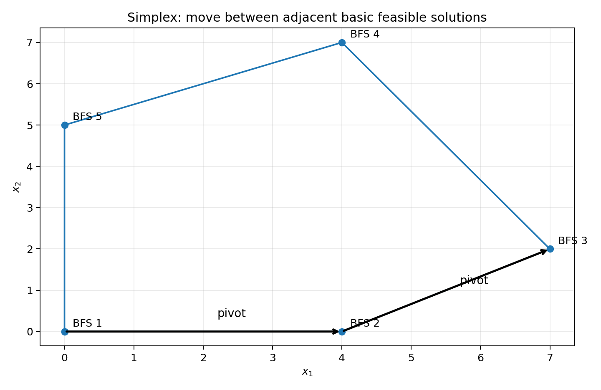
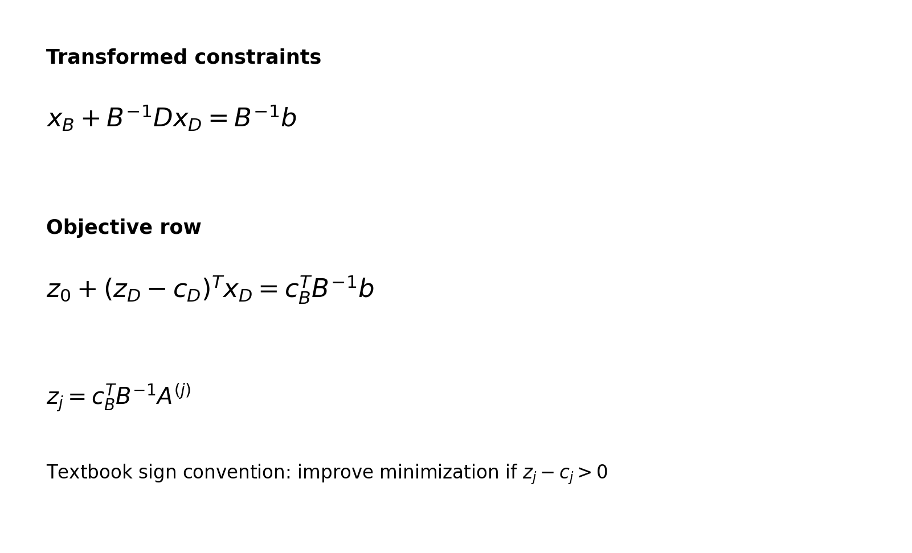
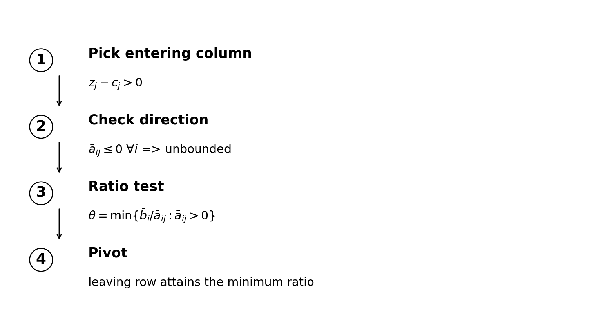
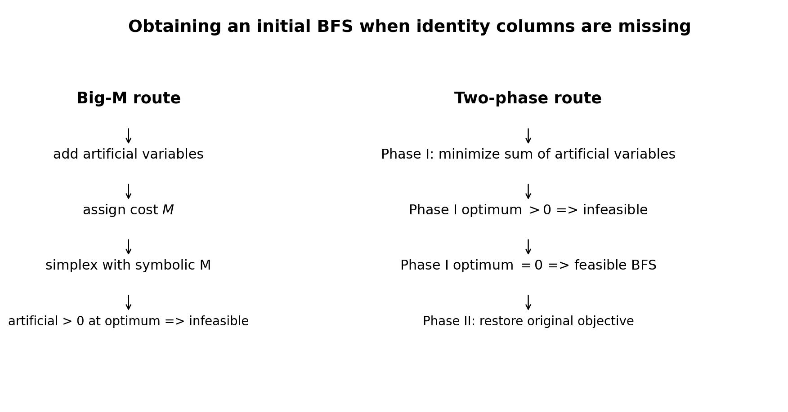

# 第 3 章：原始单纯形法（The Primal Simplex Procedure）


***

## 0. 本章到底要解决什么问题？

Chapter 2 已经告诉我们一个极其重要的事实：对于线性规划，只要最优值有限，就可以在可行域的一个**极点（extreme point）**找到最优解；把不等式加入松弛变量以后，极点又与**基本可行解（basic feasible solution, BFS）**相对应。

问题因此从

> “在无穷多个可行点中搜索”

变成了

> “怎样高效地从一个 BFS 移到另一个更好的 BFS？”

这就是 **simplex procedure / 单纯形法** 的核心。



图中每个顶点都可以理解为一个 BFS。一次 **pivot（枢轴变换）** 对应“换一个基”，几何上通常表现为沿可行域边移动到相邻顶点。

本章还解决第二个现实问题：

> 如果一开始根本找不到一个显然的 BFS，怎么办？

教材给出两类方法：

- **artificial variables + artificial cost coefficients**：人工变量 + Big-M 思想；
- **two-phase method**：两阶段法。

***

## 1. 本章学习目标

学完本章，你应能够：

1. 把线性规划整理成

   $$
   \min c^\top x
   \quad\text{s.t.}\quad
   Ax=b,\qquad x\ge 0.
   $$

2. 从一个 basis matrix $B$ 写出 simplex tableau 的代数形式；
3. 理解教材中的 $z_j-c_j$ 是什么；
4. 判断当前 BFS 是否已经最优；
5. 判断问题是否向下无界；
6. 正确选择 entering variable 与 leaving variable；
7. 使用 minimum ratio test；
8. 理解退化（degeneracy）、多重最优（multiple optima）与 cycling；
9. 当初始 BFS 不明显时，使用 Big-M 或 two-phase method；
10. 从 Phase I 判断原问题是否 infeasible；
11. 处理 Phase I 结束后仍留在基中、但取值为 0 的人工变量。

***

## Part I. 单纯形法的代数基础
### 2. 标准问题
📘 本章首先研究

$$
\begin{aligned}
\min \quad & c^\top x\\
\text{s.t.}\quad & Ax=b,\\
&x\ge 0,
\end{aligned}
$$

其中

$$
A\in\mathbb R^{m\times n},\qquad
x\in\mathbb R^n,
$$

并暂时假设

$$
\operatorname{rank}(A)=m\le n.
$$

这意味着 $A$ 至少包含 $m$ 个线性无关列，因此存在某个 $m\times m$ 非奇异子矩阵，可以拿来做 basis matrix。

#### 2.1 为什么可以只研究这种形式？
因为前两章已经建立了常见标准化规则：

- 最大化可乘 $-1$ 改成最小化；
- $\le$ 约束可加 slack variable；
- $\ge$ 约束可减 surplus variable；
- unrestricted variable 可写成两个非负变量之差；
- 线性等式本身已经是 $Ax=b$ 形式。

因此本章不是“只会处理一小类 LP”，而是在一个统一形式中讲算法。

***

### 3. 从基矩阵开始
从 $A$ 中选 $m$ 个线性无关列组成

$$
B\in\mathbb R^{m\times m}.
$$

其余列组成 $D$。重新排列变量以后可以写成

$$
A=[B\mid D].
$$

相应地，把变量和成本向量分块：

$$
x=
\begin{bmatrix}
x_B\\x_D
\end{bmatrix},
\qquad
c=
\begin{bmatrix}
c_B\\c_D
\end{bmatrix}.
$$

约束

$$
Ax=b
$$

变成

$$
Bx_B+Dx_D=b.
$$

左乘 $B^{-1}$：

$$
\boxed{
 x_B+B^{-1}D x_D=B^{-1}b
}
$$

因此

$$
\boxed{
 x_B=B^{-1}b-B^{-1}Dx_D
}
$$

如果令所有非基变量

$$
x_D=0,
$$

就得到基本解

$$
\boxed{x_B=B^{-1}b.}
$$

如果进一步

$$
B^{-1}b\ge0,
$$

它就是一个 **basic feasible solution (BFS)**。

***

### 4. 目标函数如何随非基变量变化？
目标函数

$$
z_0=c^\top x=c_B^\top x_B+c_D^\top x_D.
$$

代入

$$
x_B=B^{-1}b-B^{-1}Dx_D,
$$

得到

$$
\begin{aligned}
z_0
&=c_B^\top B^{-1}b
-c_B^\top B^{-1}D x_D+c_D^\top x_D\\
&=c_B^\top B^{-1}b
-\left(c_B^\top B^{-1}D-c_D^\top\right)x_D.
\end{aligned}
$$

因此教材 tableau 的核心其实就是下面两行：

$$
\boxed{x_B+B^{-1}D x_D=B^{-1}b}
$$

以及

$$
\boxed{
 z_0+
 \left(c_B^\top B^{-1}D-c_D^\top\right)x_D
 =c_B^\top B^{-1}b
}.
$$



***

### 5. $z_j-c_j$ 到底是什么？
设 $A^{(j)}$ 是 $A$ 的第 $j$ 列。教材定义

$$
z_j=c_B^\top B^{-1}A^{(j)}.
$$

于是

$$
\boxed{z_j-c_j=c_B^\top B^{-1}A^{(j)}-c_j.}
$$

💡 **现代教材常用的 reduced cost 可能写成**

$$
\bar c_j=c_j-z_j.
$$

这与本书的 $z_j-c_j$ 正好差一个负号。

因此阅读其他书时必须先确认符号约定：

| 本书写法 | 另一常见写法 |
|---|---|
| $z_j-c_j$ | $\bar c_j=c_j-z_j$ |
| 最小化时 $z_j-c_j>0$ 表示有改进机会 | 最小化时 $\bar c_j<0$ 表示有改进机会 |
| 最优条件 $z_j-c_j\le0$ | 最优条件 $\bar c_j\ge0$ |

这一点非常容易把初学者绕晕。

***

## Part II. 最优性、无界性与 pivot
### 6. Theorem 1：当前 BFS 何时已经最优？
📘 如果

$$
B^{-1}b\ge0
$$

并且所有变量满足

$$
\boxed{z_j-c_j\le0,}
$$

则当前 BFS

$$
x_B=B^{-1}b,\qquad x_D=0
$$

就是最优解。

#### 6.1 为什么？
从目标函数变换式：

$$
z_0
=c_B^\top B^{-1}b-
\sum_{j\in N}(z_j-c_j)x_j.
$$

因为非基变量满足 $x_j\ge0$。

若

$$
z_j-c_j\le0,
$$

那么

$$
-(z_j-c_j)x_j\ge0.
$$

故任何增加非基变量的可行操作都不能让 $z_0$ 低于当前值

$$
c_B^\top B^{-1}b.
$$

所以当前 BFS 最优。

#### 6.2 一句话记忆
本书的最小化问题：

> **最后一行没有正的 $z_j-c_j$，就停止。**

***

### 7. 如果某个 $z_j-c_j>0$ 会怎样？
这说明增加 $x_j$ 可能使目标值下降。

我们把 $x_j$ 从 0 增加为 $\theta$。此时基本变量变为

$$
x_B(\theta)=B^{-1}b-	heta B^{-1}A^{(j)}.
$$

目标值变为

$$
z_0(\theta)=z_0(0)-\theta(z_j-c_j).
$$

因为

$$
z_j-c_j>0,
$$

所以只要 $\theta>0$，目标函数就下降。

问题只剩下：

> $\theta$ 最多能增加多少而不破坏 $x_B\ge0$？

***

### 8. Theorem 2：无界性判别
设当前选择进入基的变量为 $x_j$，且

$$
z_j-c_j>0.
$$

记

$$
B^{-1}A^{(j)}=
\begin{bmatrix}
\bar a_{1j}\\
\vdots\\
\bar a_{mj}
\end{bmatrix}.
$$

若

$$
\boxed{\bar a_{ij}\le0\quad\forall i,}
$$

则

$$
x_B(\theta)=B^{-1}b-	heta B^{-1}A^{(j)}
$$

不会因为增大 $\theta$ 而变成负数。

因此 $\theta$ 可无限增大，而

$$
z_0(\theta)=z_0(0)-\theta(z_j-c_j)\to-\infty.
$$

所以问题向下无界。

#### 8.1 初学者直觉
- 进入变量能改善目标；
- 但没有任何基本变量会被“压到 0”；
- 因而没有东西阻止它无限增大；
- 目标值就一路下降到 $-\infty$。

***

### 9. minimum ratio test：谁离开基？
若进入列中至少有一个正元素，要求

$$
B^{-1}b-	heta B^{-1}A^{(j)}\ge0.
$$

对于每个

$$
\bar a_{ij}>0
$$

必须有

$$
\theta\le\frac{\bar b_i}{\bar a_{ij}},
$$

其中

$$
\bar b=B^{-1}b.
$$

因此最大允许步长为

$$
\boxed{
\theta^*=
\min_{\bar a_{ij}>0}
\frac{\bar b_i}{\bar a_{ij}}
}.
$$

取得最小比值的那一行对应的基本变量首先降为 0，所以它离开基。



#### 9.1 为什么只对正元素做比值？
因为若

$$
\bar a_{ij}\le0,
$$

则

$$
\bar b_i-\theta\bar a_{ij}
$$

随着 $\theta$ 增大不会下降，不会造成非负性破坏。

***

### 10. pivot 的本质
一次 pivot 同时完成两件事：

1. 一个非基变量进入 basis；
2. 一个基本变量离开 basis。

代数上，是把进入列通过行变换变成新的单位列；几何上，是从一个 BFS 移到相邻 BFS。

如果原 basis 为

$$
B=[A^{(i_1)},\ldots,A^{(i_k)},\ldots,A^{(i_m)}],
$$

进入列为 $A^{(j)}$，离开列为 $A^{(i_k)}$，则新 basis 是

$$
\widetilde B=
[A^{(i_1)},\ldots,A^{(j)},\ldots,A^{(i_m)}].
$$

***

### 11. Theorem 3：pivot 后目标值为什么不变差？
若

$$
z_j-c_j>0
$$

且 ratio test 得到

$$
\theta^*>0,
$$

则

$$
z_0^{\text{new}}
=z_0^{\text{old}}-	heta^*(z_j-c_j)
<z_0^{\text{old}}.
$$

若

$$
\theta^*=0,
$$

则目标值不变。

后者就是**退化 pivot**的重要来源。

***

### 12. Theorem 4：有限最优值一定能在 BFS 上取得
📘 教材再次从代数角度证明：若 $c^\top x$ 在可行集

$$
F=\{x:Ax=b,x\ge0\}
$$

上有有限最小值，则至少存在一个 BFS 达到该最小值。

#### 12.1 证明思想
若一个最优解有超过 $m$ 个正分量，那么这些正分量对应的列超过矩阵秩 $m$，必线性相关。

因此存在非零方向 $y$，使

$$
Ay=0.
$$

可以沿 $+y$ 或 $-y$ 在可行面中移动，直到至少一个正分量变成 0；同时因为原点已是最优点，两个方向都不能改善目标，于是可证明

$$
c^\top y=0.
$$

因此移动后仍保持同一最优值。

不断减少正分量数，最终得到最多 $m$ 个正分量的最优解，即 BFS。

#### 12.2 与 Chapter 2 的联系
Chapter 2 用“极点”语言表达这个事实；本章用“基与正分量数”再次证明。

这两种语言是同一件事的几何版与代数版。

***

## Part III. 完整 primal simplex algorithm
### 13. 算法模板
给定当前 BFS 与 tableau：

#### Step 1：检查最优性
若所有

$$
z_j-c_j\le0,
$$

停止：当前 BFS 最优。

#### Step 2：选择 entering variable
选择某个

$$
z_j-c_j>0.
$$

教材提到一种常用规则：优先选最大的 $z_j-c_j$；并列时可选编号最小者。

#### Step 3：检查无界性
若进入列

$$
B^{-1}A^{(j)}\le0
$$

逐分量成立，则问题向下无界。

#### Step 4：minimum ratio test
计算

$$
\frac{\bar b_i}{\bar a_{ij}}
\quad\text{for }\bar a_{ij}>0.
$$

最小者决定 leaving variable。

#### Step 5：pivot
把 pivot element 化为 1，并把该列其他元素化为 0。

#### Step 6：重复
直到：

- 满足最优性条件；或
- 发现无界。

***

### 14. 三个 tableau 自检规则
教材特别提醒：

1. 最小化问题中，$z_0$ 不应在正常改进 pivot 后增加；
2. 右端列 $B^{-1}b$ 不应出现负分量，否则当前点不是 primal feasible BFS；
3. 当前 basis 中的每个变量都应满足

   $$
   z_j-c_j=0.
   $$

如果手算 tableau 违反这些条件，优先检查 pivot 算术。

***

## Part IV. 退化、多解与 cycling
### 15. Degenerate BFS
一个 BFS 若某个基本变量恰好为 0，则称为**退化基本可行解（degenerate BFS）**。

等价地，

$$
B^{-1}b
$$

至少有一个分量为 0。

#### 15.1 为什么退化会导致 $\theta=0$？
如果 ratio test 的某个候选行右端已经是 0，而且 pivot column 对应元素为正，则

$$
\theta=\frac0{\bar a_{ij}}=0.
$$

于是换了 basis，但几何点可能完全没动。

#### 15.2 cycling
如果不断发生退化 pivot，理论上可能重新回到以前的 basis，形成循环。

教材在本章只提醒这种现象，后面的章节再专门处理。

💡 现代常见防循环规则包括 Bland's rule 等，本章不要求掌握。

***

### 16. Multiple optimal solutions
若已经达到最优 tableau，但某个**非基变量**仍满足

$$
z_j-c_j=0,
$$

那么让这个变量进入基不会改变目标值。

因此通常可以得到另一个最优 BFS。

若 $x^{(1)}$、$x^{(2)}$ 都最优，那么任意

$$
\alpha x^{(1)}+(1-\alpha)x^{(2)},
\qquad 0\le\alpha\le1
$$

也最优。

所以“两组最优 BFS”往往意味着整条线段都是最优解。

***

## Part V. 教材 Examples 1–7
### 17. Example 1：指定 basis 后构造 tableau
📘 问题为

$$
\begin{aligned}
\min\quad &-2x_1-x_2+2x_3\\
\text{s.t.}\quad
&x_1+x_3=4,\\
&-2x_1+x_2=8,\\
&x_1,x_2,x_3\ge0.
\end{aligned}
$$

教材指定

$$
B=[A^{(3)},A^{(2)}].
$$

于是

$$
x_B=[x_3,x_2]^\top,
\qquad
x_D=[x_1],
$$

并有

$$
c_B=[2,-1]^\top,
\qquad
c_D=[-2].
$$

#### 17.1 初始增广结构
把约束与目标行写在一起：

$$
\begin{bmatrix}
1&0&1&0&4\\
-2&1&0&0&8\\
2&1&-2&1&0
\end{bmatrix}.
$$

对目标行做

$$
R_3\leftarrow R_3+2R_1-R_2,
$$

得到

$$
\begin{bmatrix}
1&0&1&0&4\\
-2&1&0&0&8\\
6&0&0&1&0
\end{bmatrix}.
$$

这里最后一行已经把基变量系数消成 0。

**学习重点**：simplex tableau 不是一张神秘表格；它本质上就是“把当前基变量消元以后”的约束与目标函数。

***

### 18. Example 2：basis 列不在自然顺序时怎么办？
问题：

$$
\begin{aligned}
\min\quad &x_1+x_2+2x_4\\
\text{s.t.}\quad
&2x_1+x_2+x_3+x_4=8,\\
&2x_1-x_3+3x_4=7,\\
&x_i\ge0.
\end{aligned}
$$

教材指定

$$
B=[A^{(4)},A^{(1)}].
$$

因此

$$
x_B=[x_4,x_1]^\top,
\qquad
x_D=[x_2,x_3]^\top.
$$

对应

$$
c_B=[2,1]^\top,
\qquad
c_D=[1,0]^\top.
$$

教材通过行变换把第 4 列、第 1 列变成单位列，得到等价 tableau。

**学习重点**：basis 不需要位于矩阵前 $m$ 列。实际算法每次 pivot 后，basis 的列位置都会变化。

***

### 19. Example 3：当基列已经是单位列
问题：

$$
\begin{aligned}
\min\quad &x_3+x_4\\
\text{s.t.}\quad
&x_2+21x_3=53,\\
&x_1-19x_4=71,\\
&x_i\ge0.
\end{aligned}
$$

选

$$
B=[A^{(2)},A^{(1)}].
$$

此时两列已经构成身份矩阵的两列，因此 tableau 几乎无需额外变换。

**学习重点**：如果模型通过 slack variables 已经自然包含 $I_m$，初始 BFS 通常非常容易找到。

***

### 20. Example 4：识别 unbounded minimum
教材例题经过一次 pivot 后得到一个 tableau，其中某非基变量满足

$$
z_j-c_j>0,
$$

但其对应变换列所有元素均非正。

依据 Theorem 2，目标函数可以无限下降，所以问题**无有限最小值**。

#### 20.1 这类题不要继续做 ratio test
如果进入列没有正数，ratio test 根本没有候选行。

正确结论是：

> unbounded，而不是“算不出来”。

***

### 21. Example 5：退化 BFS 但算法仍可继续
原最大化问题：

$$
\begin{aligned}
\max\quad &2x_1+x_2+3x_3\\
\text{s.t.}\quad
&x_1+3x_2+2x_3\le6,\\
&-x_1+x_2-3x_3\ge-9,\\
&x\ge0.
\end{aligned}
$$

先把第二个不等式乘 $-1$，并加入 slack variables：

$$
\begin{aligned}
x_1+3x_2+2x_3+x_4&=6,\\
x_1-x_2+3x_3+x_5&=9.
\end{aligned}
$$

再把最大化改为最小化 $-2x_1-x_2-3x_3$。

#### 21.1 初始 BFS
$$
(x_1,x_2,x_3,x_4,x_5)=(0,0,0,6,9).
$$

算法中会经过退化 BFS

$$
(0,0,3,0,0),
$$

最终得到

$$
(x_1,x_2,x_3,x_4,x_5)=(6,0,0,0,3).
$$

所以原最大化问题的最优值为

$$
\boxed{12}
$$

且原变量最优解为

$$
\boxed{(x_1,x_2,x_3)=(6,0,0).}
$$

**学习重点**：退化不等于失败；它只意味着某一步可能换 basis 而目标值不改善。

***

### 22. Example 6：多个退化 pivot
问题：

$$
\begin{aligned}
\min\quad &x_1+x_2+x_3+x_4+x_5+x_6\\
\text{s.t.}\quad
16x_1+2x_2+x_5+10x_6&=4,\\
-x_1+x_4+x_6&=0,\\
5x_1+4x_2+x_3&=8,\\
x_i&\ge0.
\end{aligned}
$$

一个明显初始 BFS 是

$$
(0,0,8,0,4,0).
$$

教材通过若干 pivot，包含退化 pivot，最后到达

$$
\boxed{x=(0,2,0,0,0,0)^\top}
$$

以及

$$
\boxed{z_0=2.}
$$

最终可取 basis

$$
\{A^{(2)},A^{(4)},A^{(3)}\}.
$$

对应

$$
B=
\begin{bmatrix}
2&0&0\\
0&1&0\\
4&0&1
\end{bmatrix},
\qquad
B^{-1}=
\begin{bmatrix}
\tfrac12&0&0\\
0&1&0\\
-2&0&1
\end{bmatrix}.
$$

这个 $B^{-1}$ 会在 Exercises 3.9–3.10 的 post-optimal analysis 中继续使用。

***

### 23. Example 7：multiple solutions
教材构造一个问题，使最优 tableau 中存在非基变量满足

$$
z_j-c_j=0.
$$

由此得到两个不同的最优 BFS，例如教材给出的两个端点可写成

$$
x^{(1)}=(0,5,0,4)^\top,
$$

和

$$
x^{(2)}=(4,1,0,0)^\top.
$$

两者目标值相同。

因此任意

$$
\boxed{
 x(\alpha)
 =\alpha x^{(1)}+(1-\alpha)x^{(2)},
 \qquad 0\le\alpha\le1
}
$$

都是最优解。

这说明线性规划的最优解不一定唯一，也不一定只有 BFS 才是最优点；整条最优面都可能由非 BFS 点组成。

***

## Part VI. 为什么需要 artificial variables？
### 24. 初始 BFS 不总是“白送”的
如果加入 slack variables 后，$A$ 中包含 $I_m$ 的列，那么这些 slack variables 往往自然构成初始 basis。

但如果约束包含：

- 等式；
- $\ge$ 约束（加入 surplus 后产生 $-1$）；
- 或其他无法直接找到单位列的结构；

我们可能找不到显然的 BFS。

人工变量的作用不是改变原模型，而是：

> **暂时人为制造一组单位列，使算法可以启动。**

然后必须把这些人工变量全部赶回 0 并删除。

***

## Part VII. Big-M / artificial cost coefficients
### 25. Big-M 思想
假设需要加入人工变量 $a_i\ge0$。

对于最小化问题，给人工变量一个非常大的正成本

$$
M>0.
$$

扩展目标函数形如

$$
\min\quad c^\top x+M\sum_i a_i.
$$

如果原问题可行，我们希望最优过程中把所有人工变量压到 0。

#### 25.1 为什么 $M$ 要“大”？
因为人工变量只是算法工具，不属于原模型。只要它保持正值，就应当受到强烈惩罚。

#### 25.2 为什么教材不建议随便取 $M=10^6$？
两个原因：

1. 事先不知道“多大才够大”；
2. 太大的数会造成严重 round-off error。

所以教材更强调把 tableau 中的量写成

$$
aM+d,
$$

保持 $M$ 为符号，而不是直接赋一个巨大的浮点数。

***

### 26. Big-M 如何判断 infeasible？
如果扩展问题达到最优时仍有人工变量为正，那么原问题没有可行解。

直觉上：

- 若原问题有可行点，就应能让所有人工变量归零；
- 如果即使最优也无法让它们归零，就说明原约束本身互相冲突。

***

### 27. 人工变量一旦离开 basis，为什么通常直接删除？
人工变量不属于原模型。

一旦某人工变量已经从 basis 离开并变为 0，算法没有理由再允许它返回并取正值。

因此教材采取：

> 人工变量离基后，直接删除对应列。

***

## Part VIII. 教材 Examples 8–11：Big-M
### 28. Example 8：Big-M 识别不可行问题
问题：

$$
\begin{aligned}
\min\quad &2x_1+x_2+2x_3\\
\text{s.t.}\quad
&x_1-2x_3=2,\\
&x_1+x_3=1,\\
&x_2+x_3=1,\\
&x\ge0.
\end{aligned}
$$

前两条约束事实上已经冲突于非负性：

由

$$
x_1+x_3=1
$$

有 $x_1\le1$，但

$$
x_1-2x_3=2
$$

要求 $x_1\ge2$。

教材加入人工变量并运行 Big-M，最终人工目标部分无法归零，因此判定

$$
\boxed{\text{original problem infeasible}.}
$$

这个例子告诉我们：Big-M 不只是“找初始 basis”，同时也在做可行性检测。

***

### 29. Example 9：人工变量为 0 但仍在 basis
问题：

$$
\begin{aligned}
\min\quad &2x_1+x_2+x_3+3x_4\\
\text{s.t.}\quad
&-\frac13x_1+x_3+x_4=1,\\
&x_2+x_3=1,\\
&-x_1+x_2+x_3=1,\\
&x\ge0.
\end{aligned}
$$

教材添加两个人工变量，最后得到原问题的退化 BFS

$$
\boxed{(x_1,x_2,x_3,x_4)=(0,0,1,0)}
$$

且

$$
\boxed{z_0=1.}
$$

教材还指出第二条约束是 redundant constraint。

#### 29.1 关键理解
“人工变量仍在 basis”不等于“人工变量为正”。

若它作为基本变量的值是 0，则它并没有改变原问题的可行点，只反映了当前 basis 的退化结构。

***

### 30. Example 10：人工变量完全被消去
问题：

$$
\begin{aligned}
\min\quad &4x_1+x_2+x_3+x_4\\
\text{s.t.}\quad
&x_1+x_4=4,\\
&x_1+x_3=5,\\
&x_1+x_2+x_4=9,\\
&x\ge0.
\end{aligned}
$$

加入一个人工变量后运行 Big-M，人工变量最终离基并变为 0。

原问题得到 BFS

$$
\boxed{(0,5,5,4)}
$$

以及最小值

$$
\boxed{14}.
$$

***

### 31. Example 11：等式、$\ge$、$\le$ 混合
原问题：

$$
\begin{aligned}
\max\quad &x_1+x_2+x_3\\
\text{s.t.}\quad
&x_1+x_2=2,\\
&x_2+x_3\ge1,\\
&x_1+x_3\le5,\\
&x\ge0.
\end{aligned}
$$

处理过程：

1. $\ge$ 约束减 surplus variable；
2. $\le$ 约束加 slack variable；
3. 不能自然形成 basis 的等式加入 artificial variables；
4. 最大化改写为最小化；
5. 用 Big-M 启动 simplex。

教材最终得到原变量最优解

$$
\boxed{(x_1,x_2,x_3)=(0,2,5)}
$$

并得到

$$
\boxed{\max=7.}
$$

***

## Part IX. Two-Phase Method
### 32. 为什么还要两阶段法？
Big-M 的思想非常直观，但人工参数 $M$ 会让 tableau 更复杂。

Two-phase method 把任务分开：

#### Phase I
只做一件事：**找原问题的可行 BFS**。

令原变量成本暂时全部为 0，人工变量成本为 1：

$$
\boxed{
\min w=\sum_i a_i.
}
$$

因为所有人工变量非负，所以

$$
w\ge0.
$$

#### Phase I 结束判定
- 若

  $$
  w^*>0,
  $$

  原问题 infeasible；

- 若

  $$
  w^*=0,
  $$

  原问题至少存在可行点，可以进入 Phase II。

#### Phase II
恢复原目标函数，继续普通 simplex。



***

### 33. Example 12：Phase I 最优值大于 0
教材构造一个不可行问题，并加入 slack / artificial variables。

Phase I 最终得到

$$
w^*=3>0.
$$

于是立即结论：

$$
\boxed{\text{original problem infeasible}.}
$$

注意：此时不进入 Phase II。

***

### 34. Example 13：Phase I 成功后进入 Phase II
问题：

$$
\begin{aligned}
\min\quad &4x_1+x_2-2x_3\\
\text{s.t.}\quad
&2x_1-x_3=4,\\
&2x_2+x_3=7,\\
&x\ge0.
\end{aligned}
$$

加入两个人工变量后：

#### Phase I
最小化人工变量之和。

教材得到

$$
w^*=0
$$

并消去了人工变量，得到原问题的 BFS。

#### Phase II
恢复原成本系数，再继续 pivot。

最终：

$$
\boxed{x_1=\frac{11}{2},\quad x_2=0,\quad x_3=7}
$$

以及

$$
\boxed{z_0=8.}
$$

直接验算：

$$
2\cdot\frac{11}{2}-7=4,
$$

$$
2\cdot0+7=7,
$$

目标值为

$$
4\cdot\frac{11}{2}+0-2\cdot7=22-14=8.
$$


***

### 35. Phase I 结束时人工变量仍在 basis，但值为 0
这是两阶段法最容易出错的情况。

假设 Phase I 已有

$$
w^*=0,
$$

但某些人工变量仍是基本变量，而且其值为 0。

此时它们是**退化基本变量**。

进入 Phase II 后，必须保证这些人工变量不要重新变成正数。

教材策略是：

- 恢复原目标成本；
- 剩余人工变量成本设为 0；
- 若普通 ratio test 会让某个人工变量变正，就优先以相应行作 pivot，把该人工变量赶出 basis；
- 离基后删除人工变量列。

***

### 36. Example 14：Phase II 中剩余人工变量的三种情况
教材用三个 tableau 小例子说明：

#### 情形 A：人工变量对应行的进入列系数为正
可按合适 pivot 把人工变量换出，并删除它。

#### 情形 B：对应系数为 0
pivot 后人工变量仍保持 0，可以继续。

#### 情形 C：普通 ratio test 可能使人工变量变正
不能机械使用普通 leaving rule，应选择人工变量所在行 pivot，使其离基并删除。

**核心原则只有一句：**

> Phase II 绝不能允许 artificial variable 重新取得正值。

***

## Part X. Big-M 与 Two-Phase 的比较
### 37. 对比表
| 项目 | Big-M | Two-Phase |
|---|---|---|
| 主要目的 | 人为建立初始 basis 并在一个扩展目标中求解 | Phase I 先找可行 BFS，Phase II 再优化 |
| 人工变量成本 | 大正数 $M$ | Phase I 为 1，其他为 0 |
| 是否需要“大数” | 是（最好符号化） | 否 |
| 可行性判定 | 最优时人工变量仍正 $\Rightarrow$ infeasible | Phase I 最优值 $>0\Rightarrow$ infeasible |
| 手算 | 容易出现 $aM+d$ | 一般更清晰 |
| 数值稳定性 | 直接用巨大浮点 $M$ 不理想 | 通常更合适 |

#### 37.1 本书语境下怎么选？
本章两种方法都要求掌握。

如果是手算考试：

- 题目明确要求 Big-M，就保留 $M$ 为符号；
- 题目明确要求 two-phase，就严格区分 Phase I / II；
- 没有限定时，两阶段法通常更容易组织。

***

## Part XI. Post-optimal analysis 在本章的初步应用
### 38. 为什么 Exercises 3.8–3.10 不要求从头重算？
如果旧问题已经有最优 basis，那么改变：

- 一个 constraint；
- 一个 cost coefficient；
- 一个 column；
- 新增一个 variable；

通常可以利用已有

$$
B^{-1},\qquad B^{-1}b,\qquad c_B^\top B^{-1}
$$

直接更新 tableau。

这就是 post-optimal / sensitivity 思想。

#### 38.1 改一个成本系数
只需更新目标行，即重新计算

$$
z_j-c_j.
$$

#### 38.2 改一个列 $A^{(j)}$
只需计算

$$
B^{-1}\widetilde A^{(j)}
$$

以及

$$
c_B^\top B^{-1}\widetilde A^{(j)}-\widetilde c_j.
$$

#### 38.3 新增变量
同样把新列当成一个新的非基列：

$$
B^{-1}A^{(\text{new})}
$$

和

$$
z_{\text{new}}-c_{\text{new}}
$$

就能判断它有没有进入 basis 的必要。

***

## Part XII. 初学者最容易错的地方
### 39. 错误 1：把本书 $z_j-c_j$ 与现代 reduced cost 符号搞反
一定记住本书最小化的停止条件：

$$
\boxed{z_j-c_j\le0.}
$$

***

### 40. 错误 2：ratio test 对所有行都算
只对

$$
\bar a_{ij}>0
$$

的行计算比值。

***

### 41. 错误 3：进入列没有正数却说“没有 leaving variable”
正确结论不是算法卡住，而是：

$$
\boxed{\text{unbounded}.}
$$

***

### 42. 错误 4：看到基本变量为 0 就认为不是 BFS
BFS 允许基本变量为 0。

那叫**degenerate BFS**。

***

### 43. 错误 5：最优 tableau 中看到非基变量 $z_j-c_j=0$ 却忽略
这往往意味着 multiple optima。

***

### 44. 错误 6：Big-M 中人工变量离基后又让它返回
人工变量只是算法辅助；离基后通常应删除。

***

### 45. 错误 7：Phase I 最优值为 0 就立刻删除所有人工变量
如果某人工变量仍在 basis，虽然值为 0，也要先检查怎样安全把它换出或识别 redundant constraint。

***

## Part XIII. 本章知识地图
```text
Chapter 2
  extreme point ↔ BFS
          │
          ▼
choose basis B
          │
          ▼
B^{-1}A, B^{-1}b, c_B^T B^{-1}
          │
          ▼
compute z_j - c_j
   ┌──────┼────────────┐
   │      │            │
all ≤ 0  some > 0     no obvious BFS
   │      │            │
 optimal ratio test   artificial variables
          │             ├─ Big-M
          │             └─ Two-Phase
          ▼
        pivot
          │
          ▼
new BFS → repeat
```

***

## Part XIV. 一页速记
### 46. 必背公式
#### 基本解
$$
x_B=B^{-1}b,
\qquad x_D=0.
$$

#### BFS 条件
$$
B^{-1}b\ge0.
$$

#### tableau 约束
$$
x_B+B^{-1}D x_D=B^{-1}b.
$$

#### 本书 reduced-cost 记号
$$
z_j-c_j=c_B^\top B^{-1}A^{(j)}-c_j.
$$

#### 最小化最优条件
$$
z_j-c_j\le0\quad\forall j.
$$

#### 进入变量
找

$$
z_j-c_j>0.
$$

#### 无界判据
若该进入列

$$
B^{-1}A^{(j)}\le0,
$$

则向下无界。

#### minimum ratio test
$$
\theta^*=
\min_{\bar a_{ij}>0}
\frac{\bar b_i}{\bar a_{ij}}.
$$

#### Two-Phase Phase I
$$
\min\sum_i a_i.
$$

- optimum $>0$：原问题 infeasible；
- optimum $=0$：进入 Phase II。

***

## Part XV. 自测题
### 47. 自测 1
为什么 simplex 只搜索 BFS 而不搜索所有可行点？

**答案：**因为若 LP 有有限最优值，则至少有一个 BFS 达到最优值；BFS 数量有限，而可行点通常无限多。

### 48. 自测 2
最小化问题中，如果某非基列有

$$
z_j-c_j=4>0
$$

且

$$
B^{-1}A^{(j)}=(-1,0,-3)^\top,
$$

结论是什么？

**答案：**该进入列所有分量非正，变量可以无限增加且目标持续下降，因此问题向下无界。

### 49. 自测 3
为什么 ratio test 只看正系数？

**答案：**只有正系数会在进入变量增加时使相应基本变量下降，可能触碰 0；非正系数不会破坏非负性。

### 50. 自测 4
Phase I 最优值为 0，但仍有一个人工变量在 basis 中，其值也是 0。能否直接宣布算法结束？

**答案：**不能。只能说明原问题可行；还需妥善处理该零值人工基本变量，然后进入 Phase II 优化原目标。

***

## 51. 学完本章后应达到的能力
如果你能做到下面这些，本章才算真正掌握：

- 看到 $A=[B\mid D]$ 能自己推导 tableau，而不是死背表格；
- 能解释 $z_j-c_j$ 的经济/代数含义；
- 能证明为什么“全非正”意味着最优；
- 能解释为什么“进入列全非正”意味着无界；
- 能独立完成 entering / leaving / pivot；
- 能识别 degeneracy 和 multiple optima；
- 能把没有自然初始 BFS 的问题交给 Big-M 或 two-phase；
- 能用 Phase I 判断 infeasible；
- 能解释为什么人工变量不能在 Phase II 重新变正。

下一章的 duality、dual simplex、complementary slackness 都会继续使用本章的 basis、tableau、$B^{-1}$ 和 reduced-cost 语言。
