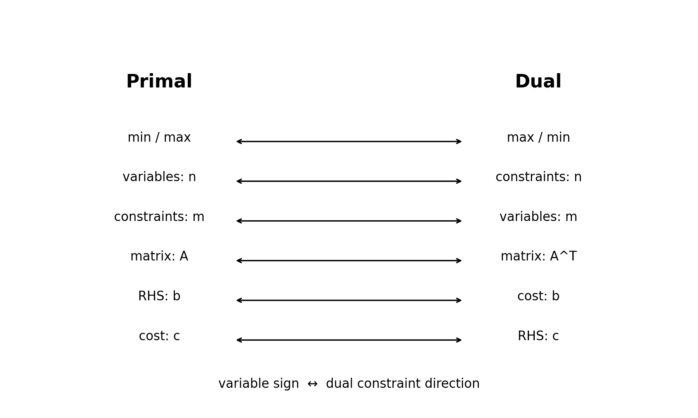
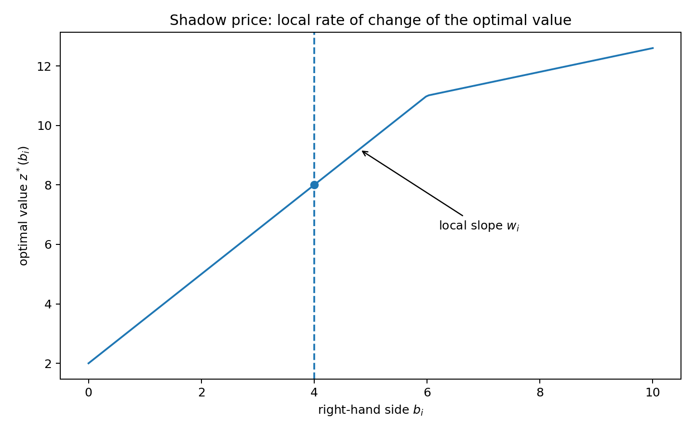
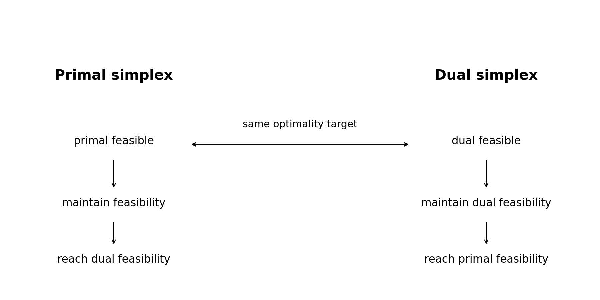
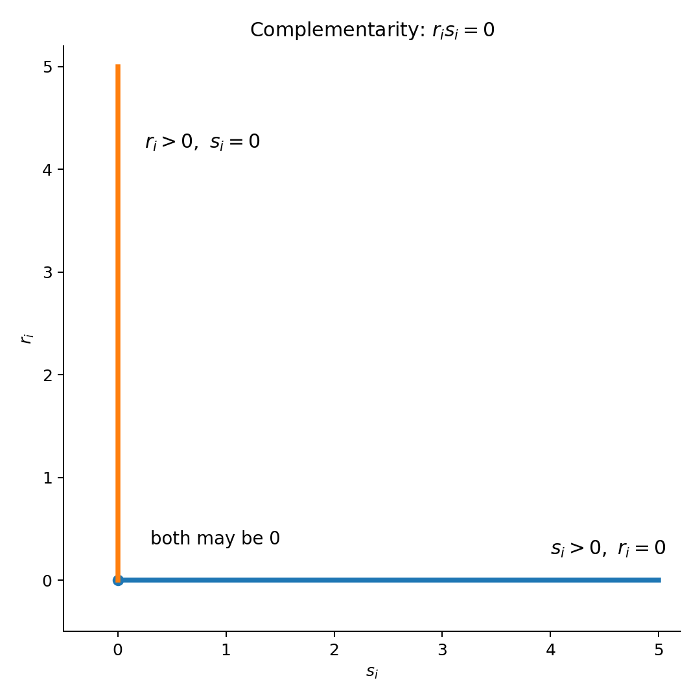
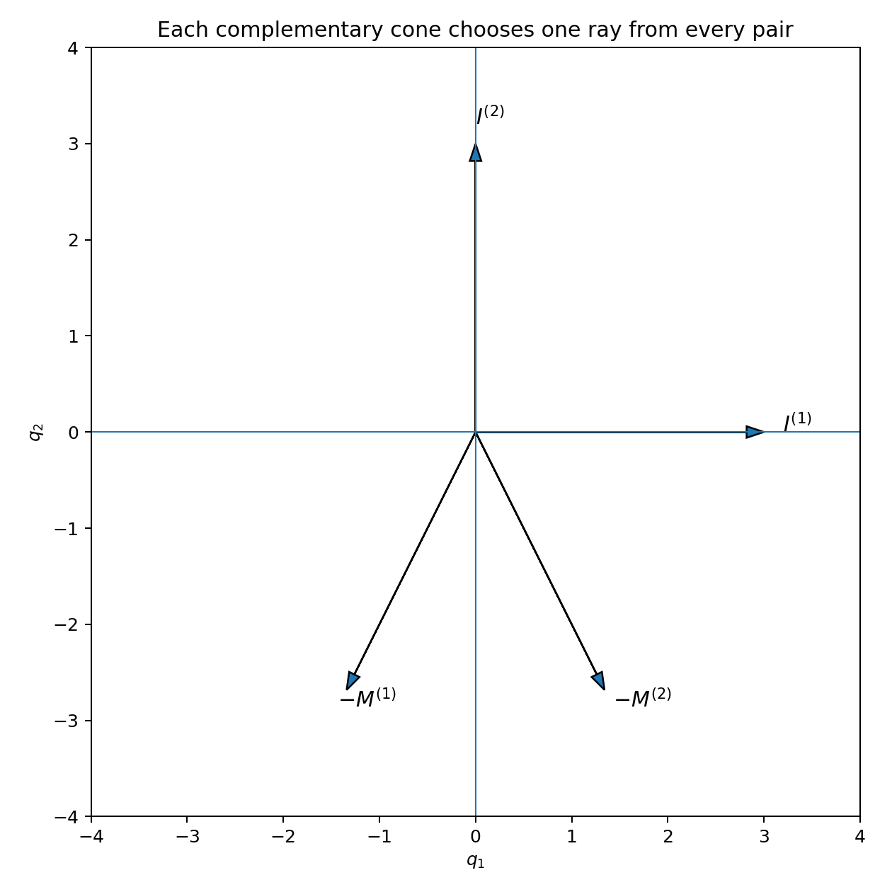

# 第 4 章：对偶与线性互补问题（Duality and the Linear Complementarity Problem）


> **本章核心问题**：同一个线性规划为什么会有一个“镜像问题”？为什么原问题的资源约束会在对偶中变成价格变量？为什么 primal simplex 与 dual simplex 是同一套几何结构的两种走法？为什么最优性最终可以写成一组“二者不能同时为正”的互补条件？

***

## 0. 学习路线

Chapter 3 已经教会我们从一个 basic feasible solution（BFS）通过 pivot 找到最优解。本章把这个算法背后的结构揭开：

1. **Duality / 对偶性**：每个 LP 对应另一个 LP；
2. **Weak duality / 弱对偶**：任何 primal 可行值都不会“越过” dual 可行值；
3. **Strong/Fundamental duality / 强对偶**：只要存在有限最优解，两边最优值相等；
4. **Shadow price / 影子价格**：dual variable 是最优值对资源右端项的局部边际价值；
5. **Dual simplex / 对偶单纯形法**：保持 dual feasible，逐步修复 primal infeasible；
6. **Complementary slackness / 互补松弛**：最优时，“原变量”和“对偶松弛”逐项互补；
7. **LCP / 线性互补问题**：把 LP 最优性写成统一的互补系统；
8. **Lemke complementary pivoting**：通过互补 pivot 求 LCP。



***

## Part I. 对偶问题
### 1. Unsymmetric primal 与 dual
📘 教材先从 Chapter 3 使用的标准形式开始：

$$
\boxed{
\begin{aligned}
\min\quad & c^\top x\\
\text{s.t.}\quad & Ax=b,\\
&x\ge0,
\end{aligned}}
$$

其中

$$
A\in\mathbb R^{m\times n},\qquad
b\in\mathbb R^m,\qquad
c\in\mathbb R^n.
$$

教材把它称为 **unsymmetric primal problem（非对称原问题）**。

与之对应的 dual 是

$$
\boxed{
\begin{aligned}
\max\quad & b^\top w\\
\text{s.t.}\quad & A^\top w\le c.
\end{aligned}}
$$

这里 $w\in\mathbb R^m$ **没有符号限制**，因为 primal 中 $Ax=b$ 是等式约束。

#### 1.1 维数为什么交换？
若 $A$ 是 $m\times n$：

- primal 有 $n$ 个变量、$m$ 条等式；
- dual 有 $m$ 个变量、$n$ 条不等式。

因此“变量数”和“约束数”互换，而系数矩阵变成转置 $A^\top$。

***

### 2. Proposition 1：Weak Duality / 弱对偶
#### 定理
若 $x$ 是 primal 的可行解，$w$ 是 dual 的可行解，则

$$
\boxed{b^\top w\le c^\top x.}
$$

#### 证明
primal 可行意味着

$$
Ax=b,\qquad x\ge0.
$$

dual 可行意味着

$$
A^\top w\le c.
$$

转置后

$$
w^\top A\le c^\top.
$$

因为 $x\ge0$，不等式右乘 $x$ 不改变方向：

$$
w^\top Ax\le c^\top x.
$$

又因为 $Ax=b$，所以

$$
\boxed{b^\top w=w^\top b=w^\top Ax\le c^\top x.}
$$

证毕。

#### 2.1 最重要的直觉
primal 是最小化，dual 是最大化。

- 任意 dual 可行值都是 primal 最优值的**下界**；
- 任意 primal 可行值都是 dual 最优值的**上界**。

因此只要找到一对可行解满足

$$
c^\top x=b^\top w,
$$

就已经没有任何“缝隙”可供改进。

***

### 3. Proposition 2：等值即可证明最优
若 $x,w$ 分别 primal/dual 可行，且

$$
\boxed{c^\top x=b^\top w,}
$$

那么 $x,w$ 分别是两边的最优解。

这是一种极其有用的 **optimality certificate（最优性证书）**。

以后做题时，与其穷举全部可行点，更好的证明方式常常是：

1. 给出一个 primal 可行解 $x$；
2. 给出一个 dual 可行解 $w$；
3. 验证目标值相等。

三步完成，全局最优立刻成立。

***

### 4. Theorem 1：Fundamental Duality / 基本对偶定理
#### 教材结论
如果 primal 或 dual 任意一方存在**有限最优解**，另一方也存在有限最优解，并且

$$
\boxed{
\min\{c^\top x:Ax=b,x\ge0\}
=
\max\{b^\top w:A^\top w\le c\}.
}
$$

这就是 LP 的强对偶结论。

#### 4.1 从最终 simplex tableau 构造 dual 最优解
设最优 basis 为 $B$，其余列为 $D$：

$$
A=[B\mid D].
$$

对应成本分块为 $c_B,c_D$。

Chapter 3 的最优 tableau 满足

$$
B^{-1}b\ge0,
$$

以及最小化问题的 reduced-cost 条件

$$
c_B^\top B^{-1}D-c_D^\top\le0.
$$

定义

$$
\boxed{w=(c_B^\top B^{-1})^\top=B^{-\top}c_B.}
$$

那么

$$
A^\top w
=
\begin{bmatrix}
B^\top\\D^\top
\end{bmatrix}B^{-\top}c_B
=
\begin{bmatrix}
c_B\\D^\top B^{-\top}c_B
\end{bmatrix}
\le
\begin{bmatrix}c_B\\c_D\end{bmatrix}=c.
$$

因此 $w$ dual feasible。

同时

$$
b^\top w
=b^\top B^{-\top}c_B
=c_B^\top B^{-1}b
=c^\top x^*.
$$

根据 Proposition 2，两者都最优。

#### 4.2 为什么这个证明很重要？
它告诉我们：

> dual 变量并不是额外凭空创造出来的量，而是已经藏在最终 simplex tableau 的基逆矩阵与 reduced costs 中。

***

### 5. Example 1：如何从最终 tableau 读取 dual variable
📘 **教材 Example 1** 回到 Chapter 3 Example 6，但这里把模型重新完整写出，使本章不依赖前章原文：

$$
\begin{aligned}
\min\quad &x_1+x_2+x_3+x_4+x_5+x_6\\
\text{s.t.}\quad
16x_1+2x_2+x_5+10x_6&=4,\\
-x_1+x_4+x_6&=0,\\
5x_1+4x_2+x_3&=8,\\
x_i&\ge0.
\end{aligned}
$$

Chapter 3 的 simplex 计算得到一个最优 primal 解

$$
\boxed{x^*=(0,2,0,0,0,0)^\top,}
$$

以及

$$
\boxed{c^\top x^*=2.}
$$

#### 5.1 从 basis 直接构造 dual 解
最终可取基变量 $x_2,x_4,x_3$，因此

$$
B=
\begin{bmatrix}
2&0&0\\
0&1&0\\
4&0&1
\end{bmatrix},
\qquad
c_B=
\begin{bmatrix}1\\1\\1\end{bmatrix}.
$$

其逆矩阵为

$$
B^{-1}=
\begin{bmatrix}
\tfrac12&0&0\\
0&1&0\\
-2&0&1
\end{bmatrix}.
$$

unsymmetric primal

$$
\min c^\top x\quad\text{s.t. }Ax=b,\ x\ge0
$$

的 dual 是

$$
\max b^\top w\quad\text{s.t. }A^\top w\le c,
$$

而最优 basis 给

$$
w^\top=c_B^\top B^{-1}.
$$

所以

$$
\begin{aligned}
w^\top
&=[1,1,1]
\begin{bmatrix}
\tfrac12&0&0\\
0&1&0\\
-2&0&1
\end{bmatrix}\\
&=\left[-\frac32,1,1\right].
\end{aligned}
$$

即

$$
\boxed{w=(-3/2,1,1)^\top.}
$$

代入 dual 约束可验证 $A^\top w\le c$；同时

$$
b^\top w=2=c^\top x^*.
$$

由 weak duality / Proposition 2，$x^*$ 与 $w$ 分别是 primal 与 dual 的最优解。

#### 5.2 为什么这道例题很重要？
它把一个非常抽象的结论变成可操作规则：

> **dual variables 已经编码在最优 simplex basis 中。**

在 tableau 语言中，当初始表含单位列时，也可以通过最终表中对应列和 reduced-cost 行读取相同信息；本质仍是

$$
w^\top=c_B^\top B^{-1}.
$$

这正是强对偶在 simplex tableau 中的具体体现。
***

### 6. 一般 mixed-sign LP 的对偶规则
现实问题不总是“等式 + 非负变量”。可能同时存在：

- $=$、$\le$、$\ge$ 三类约束；
- $x_j\ge0$；
- $x_j\le0$；
- unrestricted/free variable。

最稳妥的记忆方式不是死背，而是理解“变量符号 ↔ 对偶约束方向”的配对。

#### 6.1 最小化 primal 的规则
若 primal 是 minimization：

| primal 第 $i$ 条约束 | dual 变量 $w_i$ |
|---|---|
| $=$ | unrestricted |
| $\ge$ | $w_i\ge0$ |
| $\le$ | $w_i\le0$ |

若 primal 第 $j$ 个变量：

| primal 变量 $x_j$ | dual 第 $j$ 条约束 |
|---|---|
| $x_j\ge0$ | $A_{:j}^\top w\le c_j$ |
| $x_j\le0$ | $A_{:j}^\top w\ge c_j$ |
| unrestricted | $A_{:j}^\top w=c_j$ |

#### 6.2 最大化 primal 的规则
方向全部镜像：

| primal 第 $i$ 条约束 | dual 变量 |
|---|---|
| $=$ | unrestricted |
| $\le$ | $w_i\ge0$ |
| $\ge$ | $w_i\le0$ |

以及

| primal 变量 | dual 约束 |
|---|---|
| $x_j\ge0$ | $A_{:j}^\top w\ge c_j$ |
| $x_j\le0$ | $A_{:j}^\top w\le c_j$ |
| unrestricted | equality |

#### 6.3 强烈推荐的检查法
写完 dual 后检查四件事：

1. primal 的约束数 = dual 的变量数；
2. primal 的变量数 = dual 的约束数；
3. $A$ 是否变成 $A^\top$；
4. primal 的 RHS $b$ 是否成为 dual objective coefficients，primal 的 $c$ 是否成为 dual RHS。

***

### 7. Symmetric primal/dual
📘 教材特别强调：

$$
\boxed{
\begin{aligned}
\min\quad &c^\top x\\
\text{s.t.}\quad &Ax\ge b,\\
&x\ge0
\end{aligned}}
$$

的 dual 是

$$
\boxed{
\begin{aligned}
\max\quad &b^\top w\\
\text{s.t.}\quad &A^\top w\le c,\\
&w\ge0.
\end{aligned}}
$$

这两个形式分别称为 **symmetric primal** 与 **symmetric dual**。

这一对形式在 complementary slackness 和 LCP 部分最方便。

***

### 8. Example 2：先写 dual，再反过来求 primal
教材例题：

$$
\begin{aligned}
\max\quad&4w_1+w_2\\
\text{s.t.}\quad
&2w_1-w_2\le2,\\
&2w_1+w_2\le3,\\
&w_1\le1.
\end{aligned}
$$

对应 dual 可写成

$$
\begin{aligned}
\min\quad&2x_1+3x_2+x_3\\
\text{s.t.}\quad
&2x_1+2x_2+x_3=4,\\
&-x_1+x_2=1,\\
&x\ge0.
\end{aligned}
$$

教材用 artificial variable + simplex 解 dual，再利用 strong duality 得到原问题最优解。

最终可取

$$
\boxed{w=(1,1)^\top,}
$$

目标值

$$
\boxed{5.}
$$

💡 学习重点：如果 dual 的约束数显著少于 primal，或 dual 有明显初始 basis，**解 dual 再恢复 primal** 往往更省计算。

***

### 9. Example 3：mixed signs 的完整对偶
原问题：

$$
\begin{aligned}
\min\quad &x_1+2x_2+5x_3+4x_4\\
\text{s.t.}\quad
&2x_1+x_2+x_3=7,\\
&x_1+4x_2\le8,\\
&6x_1+3x_3+x_4\ge9,\\
&2\le x_4\le4,\\
&x_1\ge0,
\quad x_2\le0,
\quad x_3\text{ unrestricted},
\quad x_4\ge0.
\end{aligned}
$$

教材先把 $2\le x_4\le4$ 拆成两个约束，并把 $x_4$ 当作 unrestricted variable 来处理 bound 信息。所得 dual 是

$$
\begin{aligned}
\max\quad
&7w_1+8w_2+9w_3+4w_4+2w_5\\
\text{s.t.}\quad
&2w_1+w_2+6w_3\le1,\\
&w_1+4w_2\ge2,\\
&w_1+3w_3=5,\\
&w_3+w_4+w_5=4,\\
&w_2\le0,
\quad w_3\ge0,
\quad w_4\le0,
\quad w_5\ge0,
\end{aligned}
$$

其中 $w_1$ unrestricted。

这个例题几乎把所有 dual-rule 一次性考完。

***

## Part II. Dual interpretation 与 sensitivity
### 10. Shadow price / 影子价格
对 symmetric primal/dual，若 $x^*,w^*$ 最优，则

$$
c^\top x^*=b^\top w^*.
$$

把最优值记作

$$
z^*(b)=b^\top w^*.
$$

在当前 optimal basis 保持不变的局部范围内，改变某个 RHS $b_i$ 时：

$$
\boxed{
\frac{\partial z^*}{\partial b_i}=w_i^*.
}
$$

因此 $w_i$ 可以解释为：

> 资源 $i$ 的 RHS 增加 1 个单位，对最优目标值造成的局部边际变化。



#### 10.1 注意“局部”二字
影子价格不是永远不变。

当 $b_i$ 变化足够大，optimal basis 可能改变，于是新的 dual optimum 也会改变。最优值函数通常是 piecewise linear（分段线性）的。

***

### 11. Example 4：制造问题中的资源价值
Chapter 1 的制造问题中：

- $x_j$ = 产品 $P_j$ 的产量；
- $b_i$ = 原材料 $M_i$ 的可用量；
- primal objective = 最大化收益。

对应 dual variable $w_i$ 可以解释为原材料 $M_i$ 的**内部边际价值**。

如果在当前 basis 有效的范围内增加一单位 $M_i$，最优收益大约改变 $w_i$。

因此企业不是简单问“哪种材料便宜”，而是问：

> 哪一种稀缺资源再增加一个单位，对最优利润的提升最大？

这就是 shadow price 的经济意义。

***

### 12. Model stability / 模型稳定性
教材讨论：若 $A,b,c$ 中的小变化只引起最优解与最优值的小变化，则模型称为 **model stable**。

对于 symmetric primal

$$
\min c^\top x,
\quad Ax\ge b,
\quad x\ge0,
$$

教材给出 regularity condition：

$$
Ay\ge0,
\quad y\ge0,
\quad y\ne0
\quad\Longrightarrow\quad
c^\top y>0.
$$

对于 symmetric dual：

$$
A^\top u\le0,
\quad u\ge0,
\quad u\ne0
\quad\Longrightarrow\quad
b^\top u<0.
$$

unsymmetric 形式也有对应的 regularity conditions。

#### 12.1 为什么要关心 regularity？
因为数据通常来自：

- 测量；
- 估计；
- 价格预测；
- 市场需求预测。

若一个模型非常不稳定，小到几乎可以忽略的数据误差，都可能让最优解完全跳到另一个区域。

教材给出 Robinson 的例子说明这种现象：一个系数只改变 $\varepsilon>0$，primal optimum 就可能从一个点跳到另一个点，而 dual solution 甚至出现 $1/\varepsilon$ 级别的放大。

***

## Part III. Dual Simplex Procedure
### 13. primal simplex 与 dual simplex 的对称性
对

$$
\min c^\top x,
\quad Ax=b,
\quad x\ge0,
$$

设

$$
A=[B\mid D].
$$

canonical tableau 的核心是

$$
x_B+B^{-1}Dx_D=B^{-1}b,
$$

以及

$$
z_j-c_j=(c_B^\top B^{-1}A^{(j)}-c_j).
$$

对 minimization：

- **primal feasible**：$B^{-1}b\ge0$；
- **dual feasible**：所有 $z_j-c_j\le0$。

primal simplex：

> 从 primal feasible 出发，保持 primal feasibility，直到 dual feasible。

dual simplex：

> 从 dual feasible 出发，保持 dual feasibility，直到 primal feasible。



***

### 14. dual simplex 的 pivot 规则
假设 reduced costs 已满足

$$
z_j-c_j\le0,
$$

但某个 basic value 为负：

$$
(B^{-1}b)_i<0.
$$

#### Step 1：选择 leaving row
通常选一个 RHS 为负的行 $i$。

#### Step 2：检查该行能否修复
canonical equation 为

$$
(x_B)_i+
\sum_j \bar a_{ij}x_j
=\bar b_i<0.
$$

若所有非基列系数

$$
\bar a_{ij}\ge0,
$$

则 $x_j\ge0$ 时左边基本变量只会更负，不可能使其非负。

所以 primal infeasible。

#### Step 3：选择 entering column
只考虑

$$
\bar a_{ij}<0.
$$

为了保持 dual feasibility，教材使用比值

$$
\boxed{
\frac{z_j-c_j}{\bar a_{ij}}.
}
$$

在候选负元素中选择使该比值最小的列作为 pivot column。

随后做普通 pivot。

***

### 15. Example 5：dual simplex 避免人工变量
教材问题：

$$
\begin{aligned}
\min\quad&x_1+x_2+x_4+x_5\\
\text{s.t.}\quad
&2x_1+x_2-x_3+x_4+2x_5=8,\\
&x_1+2x_2+6x_4+x_5\le10,\\
&x\ge0.
\end{aligned}
$$

把第一条等式乘 $-1$，第二条加 slack variable 后，可以得到：

- reduced costs 已经 dual feasible；
- 但初始 RHS 有负值。

因此直接使用 dual simplex。

最终：

$$
\boxed{x_1=4,\quad x_2=x_3=x_4=x_5=0,}
$$

最小值

$$
\boxed{4.}
$$

#### 15.1 这个例题的意义
如果坚持 primal simplex，由于初始 BFS 不可行，通常要引入 artificial variable。

Dual simplex 则从“对偶可行”这一侧直接开始，省掉 Phase I/Big-M。

***

### 16. Example 6：新增约束后的 post-optimal analysis
在 Example 5 基础上加入

$$
x_1+x_2+x_3-x_5\ge6.
$$

原最优点

$$
(4,0,0,0,0)
$$

不满足新约束，因此旧 optimum 失效。

关键做法：

1. 把新增约束加入旧的**最优 tableau**；
2. 做行变换恢复 canonical form；
3. 旧 tableau 原本 dual feasible；
4. 新 RHS 导致 primal infeasible；
5. 正好用 dual simplex 继续。

教材最终得到原变量：

$$
\boxed{
(x_1,x_2,x_3,x_4,x_5)
=
\left(\frac{14}{3},0,\frac43,0,0\right),
}
$$

目标值

$$
\boxed{\frac{14}{3}.}
$$

这就是 dual simplex 在 sensitivity/post-optimal analysis 中非常自然的用途。

***

## Part IV. Complementary Slackness
### 17. symmetric primal/dual 加入 slack
symmetric primal：

$$
\min c^\top x,
\qquad Ax\ge b,
\qquad x\ge0.
$$

定义 primal surplus/slack

$$
u=Ax-b\ge0,
$$

所以

$$
Ax-u=b.
$$

symmetric dual：

$$
\max b^\top w,
\qquad A^\top w\le c,
\qquad w\ge0.
$$

定义 dual slack

$$
v=c-A^\top w\ge0,
$$

所以

$$
A^\top w+v=c.
$$

***

### 18. Theorem 2：Complementary Slackness
若 $x,u,w,v$ 分别满足 primal/dual feasibility，则两边最优当且仅当

$$
\boxed{v^\top x+u^\top w=0.}
$$

#### 18.1 证明
由

$$
c=A^\top w+v,
\qquad
b=Ax-u,
$$

有

$$
\begin{aligned}
c^\top x-b^\top w
&=(A^\top w+v)^\top x-(Ax-u)^\top w\\
&=w^\top Ax+v^\top x-x^\top A^\top w+u^\top w\\
&=v^\top x+u^\top w.
\end{aligned}
$$

由于所有变量均非负：

$$
v^\top x\ge0,
\qquad
u^\top w\ge0.
$$

强对偶最优时目标差为 0，因此

$$
v^\top x+u^\top w=0.
$$

反过来，如果互补和为 0，则 primal/dual objective 相等，弱对偶立即证明两边最优。

***

### 19. “互补”到底是什么意思？
因为

$$
v_jx_j\ge0,
$$

且所有项之和为 0，所以逐项必须满足

$$
\boxed{x_jv_j=0.}
$$

同理

$$
\boxed{u_iw_i=0.}
$$

因此：

- 若 $x_j>0$，对应 dual constraint 必须 tight：$v_j=0$；
- 若 dual constraint 有严格 slack $v_j>0$，则 $x_j=0$；
- 若 primal constraint 有严格 surplus $u_i>0$，则 $w_i=0$；
- 若 $w_i>0$，对应 primal constraint 必须 active。



这是一条以后做 LP、KKT、quadratic programming 都会反复出现的最优性结构。

***

## Part V. Linear Complementarity Problem
### 20. 从 LP 最优性到 LCP
把

$$
v+A^\top w=c,
$$

$$
u=Ax-b
$$

组合起来。定义

$$
r=
\begin{bmatrix}
v\\u
\end{bmatrix},
\qquad
s=
\begin{bmatrix}
x\\w
\end{bmatrix},
$$

$$
q=
\begin{bmatrix}
c\\-b
\end{bmatrix},
$$

以及

$$
\boxed{
M=
\begin{bmatrix}
0&-A^\top\\
A&0
\end{bmatrix}.
}
$$

于是 primal feasibility、dual feasibility 和 complementary slackness 合并为

$$
\boxed{
r-Ms=q,\qquad r\ge0,\quad s\ge0,\quad r^\top s=0.
}
$$

这就是 **LCP$(q,M)$**。

***

### 21. LCP 的正式定义
给定

$$
M\in\mathbb R^{n\times n},
\qquad
q\in\mathbb R^n,
$$

寻找 $r,s\in\mathbb R^n$，使

$$
\boxed{
\begin{aligned}
r-Ms&=q,\\
r&\ge0,\\
s&\ge0,\\
r^\top s&=0.
\end{aligned}}
$$

由于每项 $r_is_i\ge0$，所以

$$
r^\top s=0
\iff
r_is_i=0,
\quad i=1,\dots,n.
$$

每对 $(r_i,s_i)$ 称为 **complementary variables（互补变量）**。

***

### 22. Complementary cones / 互补锥
对每个 $i$，从下面两个列中二选一：

$$
I^{(i)}
\quad\text{或}\quad
-M^{(i)}.
$$

选择 $n$ 个列生成的 conical hull 称为一个 **complementary cone**。

一共有至多

$$
2^n
$$

个这种选择。

教材指出：

$$
\boxed{
LCP(q,M)\text{ 有解}
\iff
q\text{ 属于至少一个 complementary cone。}
}
$$



这把一个代数问题转成了几何问题：

> $q$ 是否落在某个由“单位列或负的 $M$ 列”组成的锥中？

***

## Part VI. Lemke’s Complementary Pivoting Algorithm
### 23. 为什么需要人工变量 $s_0$？
如果

$$
q\ge0,
$$

LCP 有显然解

$$
r=q,
\qquad s=0.
$$

真正困难的是 $q$ 含负分量。

Lemke 引入

$$
e=(1,\dots,1)^\top
$$

和人工变量 $s_0\ge0$，考虑

$$
\boxed{
r-Ms-es_0=q.}
$$

选

$$
s_0=-\min_i q_i
$$

就可以把最负的 RHS 拉到 0，从而构造一个初始 BFS。

***

### 24. complementary BFS 与 almost complementary BFS
#### Complementary BFS
每个互补对 $(r_i,s_i)$ 中恰有一个变量处于 basis，并且 $s_0$ 不在 basis；此时互补条件自动满足。

#### Almost complementary BFS
$s_0$ 在 basis，同时只有 $n-1$ 对互补变量完成“一对选一个”的结构。

Lemke 算法沿着 almost-complementary BFS 相邻结构 pivot，目标是最终把 $s_0$ 赶出 basis。

***

### 25. Lemke 算法步骤
#### Step 1：初始化
找最小的 $q_i<0$，在人工变量列 $s_0$ 对应该行 pivot，使 $s_0$ 进入 basis。

#### Step 2：确定缺失的互补变量
初始 pivot 会让某个 $r_i$ 离开 basis；接下来要求它的 complement $s_i$ 进入。

#### Step 3：普通 ratio test + complementary pivot
在 $s_i$ 列做普通非负 ratio test，某个变量离开 basis。

如果离开的变量是 $r_j$，下一次必须让 $s_j$ 尝试进入；如果离开的是 $s_j$，下一次让 $r_j$ 进入。

#### Step 4：停止条件
若 $s_0$ 离开 basis，当前解已经是真正的 complementary BFS：

$$
r^\top s=0.
$$

算法成功结束。

#### 失败情况
如果某个应进入的 pivot column **所有分量都非正**，ratio test 无候选，则出现 **ray termination（射线终止）**。

此时算法失败；该 LCP 可能无解，也可能有另一个算法路径可解。

退化情况下还可能 cycling。

***

### 26. Example 7：把 LP 写成 LCP
教材 LP：

$$
\begin{aligned}
\min\quad&2x_1+3x_2\\
\text{s.t.}\quad
&x_1+2x_2\ge4,\\
&3x_1+x_2\ge6,\\
&x\ge0.
\end{aligned}
$$

这里

$$
A=
\begin{bmatrix}
1&2\\3&1
\end{bmatrix},
\quad
b=
\begin{bmatrix}4\\6\end{bmatrix},
\quad
c=
\begin{bmatrix}2\\3\end{bmatrix}.
$$

因此

$$
q=
\begin{bmatrix}
2\\3\\-4\\-6
\end{bmatrix},
$$

$$
M=
\begin{bmatrix}
0&0&-1&-3\\
0&0&-2&-1\\
1&2&0&0\\
3&1&0&0
\end{bmatrix}.
$$

Lemke pivot 最终得到 primal variables

$$
\boxed{x_1=\frac85,\qquad x_2=\frac65.}
$$

检查 primal constraints：

$$
\frac85+2\cdot\frac65=4,
$$

$$
3\cdot\frac85+\frac65=6.
$$

两条都 active。

目标值

$$
2\cdot\frac85+3\cdot\frac65
=\frac{34}{5}.
$$

***

### 27. Example 8：ray termination 与无解
教材给

$$
q=(1,2,-5)^\top,
$$

$$
M=
\begin{bmatrix}
1&-3&-3\\
-2&2&-4\\
1&-1&-5
\end{bmatrix}.
$$

Lemke 迭代过程中出现一个应 pivot 的列完全 nonpositive，于是算法 ray termination。

教材进一步指出该例 LCP **确实无解**。

这个例子提醒我们：

> “pivot column 无正元素”在 LCP 中不像普通 LP 那样总能直接翻译成一个简单的 unbounded optimum；它首先说明 Lemke 当前路径形成了一条无限 ray。

***

### 28. copositive-plus 与算法终止
📘 教材定义：若

$$
x\ge0\Longrightarrow x^\top Mx\ge0,
$$

并且

$$
x\ge0,\quad x^\top Mx=0
\Longrightarrow
(M+M^\top)x=0,
$$

则称 $M$ 为 **copositive-plus**。

positive semidefinite matrix 是 copositive-plus 的一个重要子类。

教材指出：在 nondegenerate 条件下，如果 $M$ copositive-plus，则 Lemke 算法能够有限终止并求解 LCP。

***

### 29. Q-matrix
若对每一个

$$
q\in\mathbb R^n
$$

LCP$(q,M)$ 都至少有一个解，则称 $M$ 是 **Q-matrix**。

结合 complementary-cone 几何，等价地：

$$
\boxed{
M\text{ 是 Q-matrix}
\iff
\text{所有 complementary cones 的并覆盖 }\mathbb R^n.
}
$$

这个结论正是 Exercise 4.32。

***

## Part VII. 本章最容易混淆的概念
### 30. primal feasible 与 dual feasible
不要把它们混为一谈。

对 Chapter 3/4 的 minimization tableau：

- primal feasible：
  $$B^{-1}b\ge0;$$
- dual feasible：
  $$z_j-c_j\le0.$$

primal simplex 从前者出发；dual simplex 从后者出发。

***

### 31. dual variable 与 slack variable 不一样
- dual variable $w_i$ 对应 primal 的一条约束；
- primal slack/surplus $u_i$ 测量该约束离 tight 还差多少；
- complementary slackness 把二者联系起来：

$$
\boxed{u_iw_i=0.}
$$

所以：资源若“剩很多”，其 shadow price 通常为 0；资源若有正 shadow price，对应约束必须 tight。

***

### 32. duality gap
定义

$$
\text{gap}=c^\top x-b^\top w.
$$

对 primal/dual feasible 解，弱对偶保证

$$
\text{gap}\ge0.
$$

在 symmetric form：

$$
\boxed{
\text{gap}=v^\top x+u^\top w.
}
$$

最优时 gap=0，这就是 complementary slackness。

***

### 33. 本章知识地图
```text
LP standard form
   │
   ├── weak duality ──> primal bound / dual bound
   │
   ├── fundamental duality ──> equal optimal values
   │                          └── shadow prices / sensitivity
   │
   ├── final simplex tableau ──> dual solution
   │
   ├── primal simplex: primal feasible → dual feasible
   │
   └── dual simplex:   dual feasible   → primal feasible
                                  │
                                  v
                    complementary slackness
                                  │
                                  v
                   r - Ms = q, r,s >= 0,
                        r^T s = 0
                                  │
                                  v
                                LCP
                                  │
                                  v
                    Lemke complementary pivoting
```

***

### 34. 一页速记
#### Unsymmetric pair
$$
\min c^\top x
\quad\text{s.t. }Ax=b,x\ge0
$$

$$
\Longleftrightarrow
$$

$$
\max b^\top w
\quad\text{s.t. }A^\top w\le c,
\quad w\text{ free}.
$$

#### Symmetric pair
$$
\min c^\top x,
\quad Ax\ge b,
\quad x\ge0
$$

$$
\Longleftrightarrow
$$

$$
\max b^\top w,
\quad A^\top w\le c,
\quad w\ge0.
$$

#### Weak duality
$$
\boxed{b^\top w\le c^\top x.}
$$

#### Strong duality
$$
\boxed{b^\top w^*=c^\top x^*.}
$$

#### Shadow price
$$
\boxed{w_i\approx\frac{\partial z^*}{\partial b_i}.}
$$

#### Complementary slackness
$$
\boxed{x_jv_j=0,\qquad u_iw_i=0.}
$$

#### LCP
$$
\boxed{r-Ms=q,\quad r\ge0,\ s\ge0,\ r^\top s=0.}
$$

***

### 35. 自测题
#### Q1为什么 weak duality 能直接证明“primal unbounded below ⇒ dual infeasible”？

**答**：若 dual 有可行 $w$，则对所有 primal feasible $x$ 有 $b^\top w\le c^\top x$，这给 primal objective 一个有限下界，与向 $-\infty$ 无界矛盾。

#### Q2若某 primal constraint 有严格 surplus，dual variable 能否为正？

**答**：最优时不能。因为 complementary slackness 要求 $u_iw_i=0$。

#### Q3为什么 dual simplex 特别适合“在已有最优 LP 上新增约束”？

**答**：旧 optimal tableau 通常仍保持 reduced costs 的 dual feasibility，但新约束可能让旧 primal solution 不可行；这正好匹配 dual simplex 的起点。

#### Q4LCP 中 $r^\top s=0$ 为什么等价于逐项 $r_is_i=0$？

**答**：因为 $r,s\ge0$，每个乘积都非负；非负项之和为 0 只能每项都为 0。

