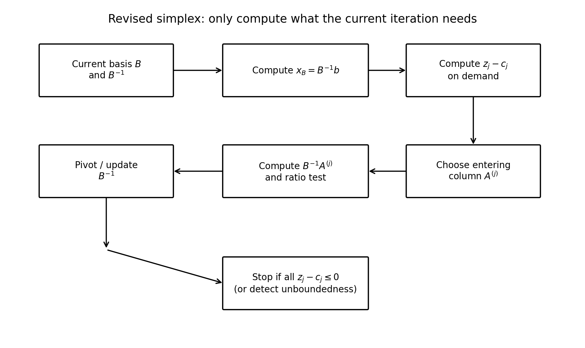
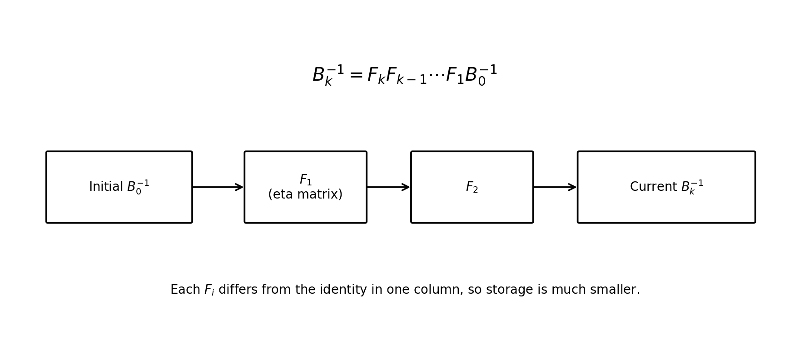
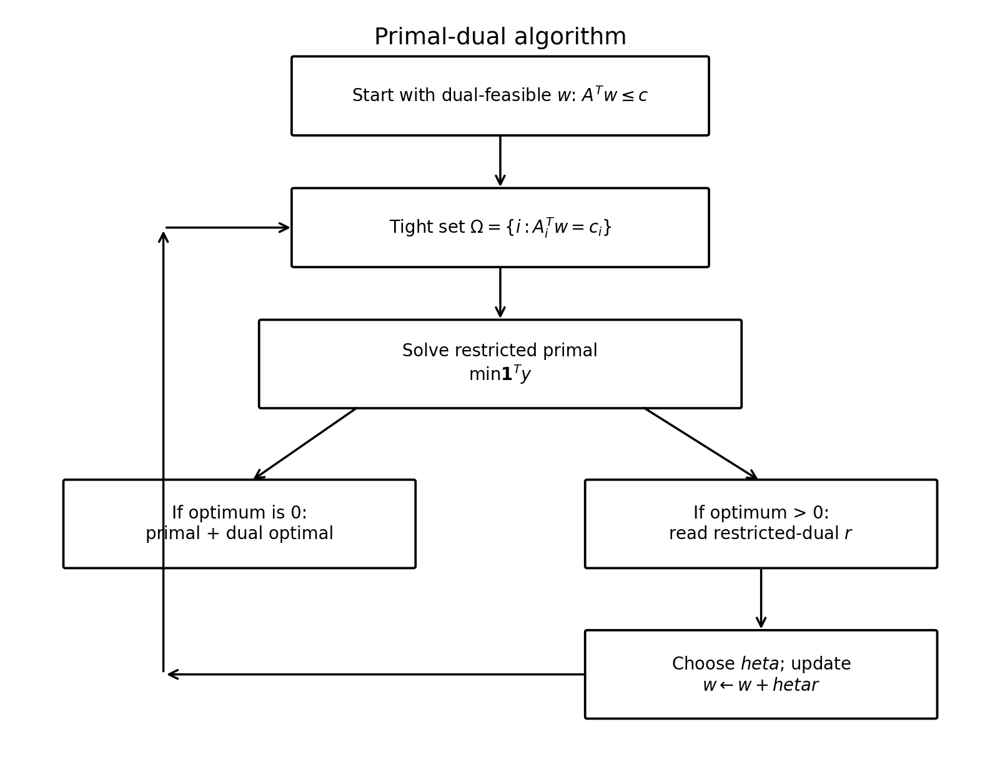
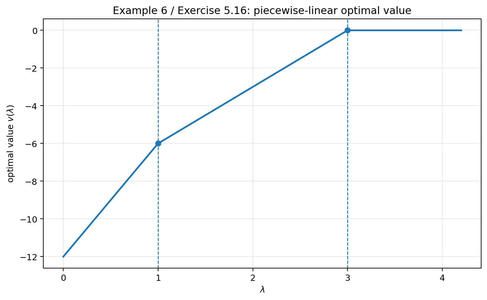
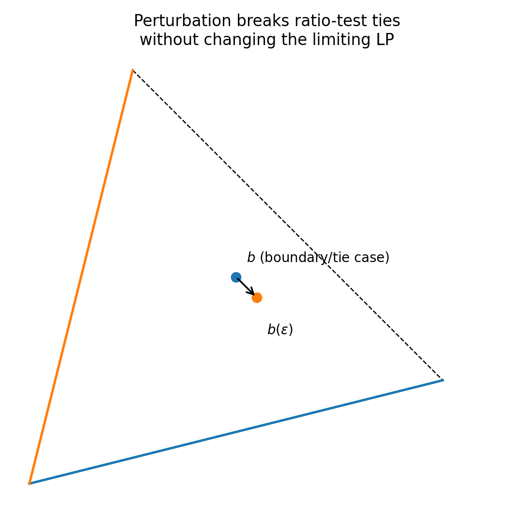

# 第 5 章：其他单纯形方法（Other Simplex Procedures）


> 记号仍沿用本书：对于最小化问题，本书使用 $z_j-c_j$，因此“当前 basis 最优”的判据是 $z_j-c_j\le 0$；这与许多现代教材采用的 reduced cost $\bar c_j=c_j-z_j$ 符号相反。

***

## 0. 本章到底在做什么？

Chapter 3 已经给出了 **primal simplex procedure（原始单纯形法）**：把完整 tableau 一路做 pivot，直到满足最优性条件。Chapter 5 的重点不是重新发明另一个“数学原理”，而是回答一个更工程化的问题：

> **同样的单纯形思想，怎样在大规模、稀疏、参数变化或退化的 LP 中算得更省、更稳、更灵活？**

本章九个部分可以理解成四条主线：

1. **少存、少算**：revised simplex、product form、elimination form；
2. **从 dual feasibility 出发**：primal-dual algorithm；
3. **参数变化时不要从头重算**：parametric linear programming；
4. **处理数值与结构问题**：degeneracy/cycling、decomposition、reinversion。



***

## Part I. 统一记号与 tableau 的再理解
### 1. 标准问题
本章继续研究

$$
\begin{aligned}
\min\quad & c^\top x\\
\text{s.t.}\quad & Ax=b,\\
&x\ge 0,
\end{aligned}
$$

其中

$$
A\in\mathbb{R}^{m\times n}.
$$

选取 $m$ 个线性无关列组成 basis matrix $B$，其余列组成 $D$。相应地把变量、成本向量分块：

$$
A=[B\ D],\qquad
x=\begin{bmatrix}x_B\\x_D\end{bmatrix},\qquad
c=\begin{bmatrix}c_B\\c_D\end{bmatrix}.
$$

约束变成

$$
Bx_B+Dx_D=b.
$$

左乘 $B^{-1}$：

$$
\boxed{x_B+B^{-1}Dx_D=B^{-1}b.}
$$

因此当前 basic solution 是

$$
\boxed{x_B=B^{-1}b,\qquad x_D=0.}
$$

它是 BFS 的必要条件是

$$
B^{-1}b\ge0.
$$

***

### 2. 目标函数行到底来自哪里？
目标函数

$$
z_0=c_B^\top x_B+c_D^\top x_D.
$$

把

$$
x_B=B^{-1}b-B^{-1}Dx_D
$$

代回：

$$
\begin{aligned}
z_0
&=c_B^\top B^{-1}b
-c_B^\top B^{-1}Dx_D+c_D^\top x_D\\
&=c_B^\top B^{-1}b
-\left(c_B^\top B^{-1}D-c_D^\top\right)x_D.
\end{aligned}
$$

所以 tableau 的最后一行本质上存的是

$$
\boxed{c_B^\top B^{-1}D-c_D^\top.}
$$

对于单个非基变量 $x_j$：

$$
\boxed{z_j-c_j=c_B^\top B^{-1}A^{(j)}-c_j.}
$$

如果所有非基列满足

$$
z_j-c_j\le0,
$$

则增加任何非基变量都不能降低当前最小化目标值，所以当前 BFS 最优。

#### 2.1 与 modern reduced cost 的关系
现代文献常写

$$
\bar c_j=c_j-c_B^\top B^{-1}A^{(j)}.
$$

所以

$$
\boxed{\bar c_j=-(z_j-c_j).}
$$

因此千万不要把别的教材中的“$\bar c_j\ge0$”与本书的“$z_j-c_j\le0$”当成矛盾。

***

## Part II. Revised Simplex Procedure
### 3. 为什么完整 tableau 会浪费？
若 $A$ 有几百行、几千列，但一次 pivot 只需要：

- 当前 $B^{-1}$；
- 当前 $B^{-1}b$；
- 候选列 $B^{-1}A^{(j)}$；
- 当前 reduced-cost 信息；

那么维护整张 tableau 会把大量永远不参与 pivot 的列反复更新。

revised simplex 的思想是：

> **只维护 basis 相关的信息；哪一列真要用，再临时计算哪一列。**

特别适合：

- $n\gg m$；
- $A$ sparse（稀疏）；
- 大规模网络流；
- 计算机实现。

***

### 4. Revised simplex 的七步算法
设当前 basis 为 $B$。

#### Step 1：计算当前 BFS
$$
\boxed{x_B=B^{-1}b.}
$$

要求 $x_B\ge0$。

#### Step 2：按需检查最优性
对非基列逐个计算

$$
\boxed{z_j-c_j=c_B^\top B^{-1}A^{(j)}-c_j.}
$$

若全部 $\le0$，停止，当前 BFS 最优。

#### Step 3：选 entering variable
找到某个

$$
z_j-c_j>0.
$$

然后只计算这一列

$$
\boxed{d=B^{-1}A^{(j)}.}
$$

#### Step 4：无界性判定
如果

$$
d\le0,
$$

则增加 $x_j$ 不会让任何基本变量变成负数，而目标值会继续下降，因此

$$
\boxed{\text{unbounded below}.}
$$

#### Step 5：ratio test
只在 $d_i>0$ 的行计算

$$
\theta_i=\frac{(x_B)_i}{d_i},
$$

并取

$$
\boxed{\theta=\min_{d_i>0}\frac{(x_B)_i}{d_i}.}
$$

达到最小比值的基本变量离开 basis。

#### Step 6：更新 basis
用进入列替换 leaving column，得到新 $B$，并更新 $B^{-1}$、$B^{-1}b$。

#### Step 7：重复
直到最优或无界。

***

### 5. Example 1：inverse-matrix form 的完整思路
教材问题为

$$
\begin{aligned}
\min\quad &x_1+2x_2+3x_3-4x_4+20x_5+6x_6\\
\text{s.t.}\quad
&x_1+x_3+x_4=8,\\
&x_2+x_3+3x_5=7,\\
&x_4+2x_5+x_6=9,\\
&x\ge0.
\end{aligned}
$$

选

$$
B=[A^{(1)},A^{(2)},A^{(6)}]=I_3,
$$

所以初始 BFS 为

$$
(x_1,x_2,x_6)=(8,7,9).
$$

计算非基 reduced-cost row，最先出现正项的是 $x_4$，故 $A^{(4)}$ 进入。ratio test 使 $A^{(1)}$ 离开。

更新后 basis 可写为

$$
B=[A^{(4)},A^{(2)},A^{(6)}].
$$

继续计算后，所有非基项满足 $z_j-c_j\le0$。最终：

$$
\boxed{x=(0,7,0,8,0,1)^\top.}
$$

目标值

$$
\boxed{z^*=-12.}
$$

#### 5.1 这个例题真正应该学什么？
不是机械记住这个答案，而是记住 revised simplex 的工作量结构：

- 不必更新整个 $D$；
- 只在发现某个 $z_j-c_j>0$ 后计算对应的 $B^{-1}A^{(j)}$；
- 真正核心状态量是 basis 与它的线性代数分解。

***

## Part III. Product Form of the Inverse
### 6. 为什么还嫌 $B^{-1}$ 太大？
revised simplex 虽然不维护整张 tableau，但每次仍要保存一个 $m\times m$ 的 $B^{-1}$。

如果 $m$ 很大，存储和更新 $B^{-1}$ 仍然昂贵。

Product Form of the Inverse（逆矩阵乘积形式）的核心观察：

> 一次 pivot 只替换 basis 的一列，因此从旧 $B^{-1}$ 到新 $\bar B^{-1}$ 的变化可以用一个“几乎是单位矩阵”的 pivot matrix 表示。

设 entering column 变换后为

$$
d=B^{-1}A^{(j)},
$$

pivot 位于第 $i$ 行，$d_i\ne0$。构造 pivot matrix $F$，使得

$$
Fd=e_i.
$$

则

$$
\boxed{\bar B^{-1}=FB^{-1}.}
$$

经过 $k$ 次 pivot：

$$
\boxed{B_k^{-1}=F_kF_{k-1}\cdots F_1B_0^{-1}.}
$$



由于每个 $F_t$ 与单位阵只差一列，实际只需保存：

- pivot row index；
- 那一列的 $m$ 个数。

这类 $F_t$ 在现代实现中常称 **eta matrix**。

***

### 7. 使用 eta matrices 计算向量
如果

$$
B_k^{-1}=F_k\cdots F_1B_0^{-1},
$$

则不必显式乘成一个大矩阵。

例如求

$$
x_B=B_k^{-1}b,
$$

可以依次做

$$
y_0=B_0^{-1}b,
$$

$$
y_1=F_1y_0,
$$

$$
y_2=F_2y_1,
$$

一直到

$$
x_B=F_k\cdots F_1B_0^{-1}b.
$$

这就是“用一串便宜变换代替一个稠密逆矩阵”的思想。

***

## Part IV. Elimination Form of the Inverse
### 8. 为什么 LU 比直接存 inverse 更稳定？
Chapter 2 已经知道：解线性方程

$$
Bx=b
$$

通常不应该先显式求 $B^{-1}$ 再乘 $b$，而应利用

$$
B=LU
$$

分两步：

$$
Ly=b,
$$

$$
Ux=y.
$$

revised simplex 中凡是出现

$$
B^{-1}b,
\qquad
B^{-1}A^{(j)},
\qquad
c_B^\top B^{-1},
$$

都可以改写成 triangular solves。

这样通常：

- 数值稳定性更好；
- 对 sparse $B$ 更容易保持 sparsity；
- 不需要显式形成 $B^{-1}$。

***

### 9. 如何更新 LU？
pivot 后 basis 只换一列。教材采用一种便利的重排：把新进入的列先移到 basis 的最后位置，再通过 row permutations 与 pivots 把新矩阵恢复为 upper-triangular 结构。

如果旧 basis

$$
B=LU,
$$

新 basis 为 $\bar B$，则先作用旧 $L^{-1}$：

$$
L^{-1}\bar B.
$$

它与 $U$ 只在一列及其后的结构上发生变化。再用 permutation matrices $P_i$ 和 pivot matrices $F_i$ 把它恢复成新的 $\bar U$：

$$
\bar U
=F_{m-1}P_{m-1}\cdots F_iP_iL^{-1}\bar B.
$$

于是得到新的

$$
\boxed{\bar B=\bar L\bar U.}
$$

#### 9.1 初学者不需要死背更新公式
必须掌握的是：

1. revised simplex 的核心只需要“解 $B$ 相关方程”；
2. LU 允许我们不显式求 inverse；
3. pivot 后 LU 可以更新，而不是每次从头分解。

这正是现代 sparse simplex 实现的基础思想之一。

***

### 10. Example 2 与 Example 3
#### Example 2
教材用 elimination form 重算 Example 1，并得到同样结果：

$$
\boxed{x=(0,7,0,8,0,1)^\top.}
$$

这说明不同实现形式改变的是“计算组织方式”，不是 LP 的数学解。

#### Example 3
教材问题：

$$
\begin{aligned}
\min\quad&x_1+2x_2+x_3+3x_4\\
\text{s.t.}\quad
&x_1+x_2+x_3+2x_4=3,\\
&x_2+2x_3+4x_4=3,\\
&4x_3+2x_4=4,\\
&x\ge0.
\end{aligned}
$$

从 basis $[A^{(1)},A^{(2)},A^{(3)}]$ 出发，利用 LU solves 计算 reduced cost 与 entering direction。教材得到最终

$$
\boxed{x=\left(\frac32,0,\frac56,\frac13\right)^\top.}
$$

目标值：

$$
\boxed{z^*=\frac{10}{3}.}
$$

***

## Part V. Primal-Dual Algorithm
### 11. 这不是 Chapter 4 的 dual simplex
名字容易混：

- **dual simplex**：维护 dual feasibility，直接在 simplex tableau 中修 primal feasibility；
- **primal-dual algorithm**：从一个 dual-feasible $w$ 出发，反复解“restricted primal / restricted dual”，逐渐扩大满足 complementary slackness 的变量集合。

本章的 primal-dual algorithm 对 Chapter 6 的 network flow 非常重要。

***

### 12. 从 complementary slackness 出发
原问题：

$$
\begin{aligned}
(P)\quad \min\quad&c^\top x\\
\text{s.t.}\quad&Ax=b,\\
&x\ge0.
\end{aligned}
$$

unsymmetric dual：

$$
\begin{aligned}
(D)\quad \max\quad&b^\top w\\
\text{s.t.}\quad&A^\top w\le c.
\end{aligned}
$$

定义 dual slack：

$$
s=c-A^\top w\ge0.
$$

complementary slackness 为

$$
\boxed{s^\top x=0.}
$$

逐分量看：

$$
\boxed{x_i>0\Rightarrow A^{(i)\top}w=c_i.}
$$

因此，若当前 $w$ 已 dual feasible，我们只允许那些 dual constraint **恰好 tight** 的变量变成正数。

定义

$$
\boxed{\Omega=\{i:A^{(i)\top}w=c_i\}.}
$$

***

### 13. Restricted primal
我们希望只使用 $i\in\Omega$ 的原变量满足

$$
\sum_{i\in\Omega}x_iA^{(i)}=b.
$$

如果暂时做不到，就加入 artificial vector $y\ge0$：

$$
\boxed{
\begin{aligned}
\min\quad&\mathbf1^\top y\\
\text{s.t.}\quad&\sum_{i\in\Omega}x_iA^{(i)}+y=b,\\
&x_i\ge0,\ y\ge0.
\end{aligned}}
$$

若最优值为 0，则 $y=0$，我们已经找到 primal feasible $x$，同时所有正 $x_i$ 对应 tight dual constraint，所以 complementary slackness 成立。

因此 primal 与 dual 同时最优。

***

### 14. Restricted dual 与更新方向
当 restricted primal 最优值仍 $>0$，取它的 dual 最优解 $r$。restricted dual 的结构可写为

$$
\begin{aligned}
\max\quad&b^\top r\\
\text{s.t.}\quad&A^{(i)\top}r\le0,\quad i\in\Omega,\\
&r\le\mathbf1.
\end{aligned}
$$

用

$$
\bar w=w+\theta r
$$

更新原 dual solution。

为了保持

$$
A^\top\bar w\le c,
$$

对所有 $A^{(i)\top}r>0$ 的列要求

$$
\theta\le
\frac{c_i-A^{(i)\top}w}{A^{(i)\top}r}.
$$

因此取

$$
\boxed{
\theta=
\min_{A^{(i)\top}r>0}
\frac{c_i-A^{(i)\top}w}{A^{(i)\top}r}.
}
$$

至少一个新的 dual constraint 变成 tight，于是 $\Omega$ 扩展。



***

### 15. primal-dual algorithm 的停止条件
#### 成功
restricted primal 最优值为 0：

$$
\boxed{P,D\text{ 同时求解完成}.}
$$

#### 失败证书
若 restricted primal 最优值 $>0$，而其 restricted-dual optimum $r$ 满足对所有 $i\notin\Omega$：

$$
A^{(i)\top}r\le0,
$$

则对任意 $\theta\ge0$，

$$
w+\theta r
$$

仍 dual feasible，而

$$
b^\top(w+\theta r)
=b^\top w+\theta b^\top r\to+\infty.
$$

所以 dual unbounded，进而 primal infeasible。

***

### 16. Example 4
教材问题：

$$
\begin{aligned}
\min\quad&2x_1+8x_2+2x_3\\
\text{s.t.}\quad
&-x_1+4x_2-x_3=1,\\
&x_1+2x_2-2x_3=1,\\
&x\ge0.
\end{aligned}
$$

教材选择一个 dual-feasible 起点，通过两轮 restricted primal / restricted dual 更新，最终得到

$$
\boxed{x^*=\left(\frac13,\frac13,0\right)^\top}
$$

和 dual optimum

$$
\boxed{w^*=\left(\frac23,\frac83\right)^\top.}
$$

目标值一致：

$$
2\cdot\frac13+8\cdot\frac13
=\frac{10}{3}
=1\cdot\frac23+1\cdot\frac83.
$$

***

## Part VI. Parametric Linear Programming
### 17. 为什么 parameterization 很重要？
现实中 $c$ 和 $b$ 经常改变：

- 原料价格、运输成本改变 → $c$ 变；
- 资源库存、需求改变 → $b$ 变。

如果每改变一点就从头跑 simplex，浪费了已经得到的 optimal basis。

parametric LP 的核心：

> **找出当前 basis 在参数的哪个区间仍然 optimal；只有越过 breakpoint 时才 pivot。**

***

### 18. 成本参数：$c(\lambda)=c+\lambda h$
问题：

$$
\min (c^\top+\lambda h^\top)x
$$

subject to

$$
Ax=b,\qquad x\ge0,
$$

其中 $\lambda\ge0$。

对于固定 basis $B$：

$$
\boxed{
(z_D-c_D)(\lambda)
=\left(c_B^\top B^{-1}D-c_D^\top\right)
+\lambda\left(h_B^\top B^{-1}D-h_D^\top\right).
}
$$

记

$$
r^{(0)}=c_B^\top B^{-1}D-c_D^\top,
$$

$$
r^{(1)}=h_B^\top B^{-1}D-h_D^\top.
$$

当前 basis optimal 当且仅当

$$
r^{(0)}+\lambda r^{(1)}\le0.
$$

所以每个非基列都给出一个关于 $\lambda$ 的线性不等式；最先达到 0 的列决定下一个 breakpoint。

***

### 19. 成本参数 breakpoint
若当前 $r^{(0)}_j\le0$，而 $r^{(1)}_j>0$，则该列将在

$$
\lambda_j=-\frac{r^{(0)}_j}{r^{(1)}_j}
$$

变为 0。

下一 breakpoint：

$$
\boxed{
\lambda_1=\min_{r^{(1)}_j>0}
\left(-\frac{r^{(0)}_j}{r^{(1)}_j}\right).
}
$$

在 $[0,\lambda_1]$ 内 basis 不变。

到 $\lambda_1$ 时：

- 某个非基变量 reduced cost 变为 0；
- 它可进入 basis；
- 用 primal simplex pivot 获得下一参数区间的 basis。

***

### 20. Example 5：参数变化但 basis 永远不换
成本函数：

$$
(-2-\lambda)x_1+(-1+\lambda)x_2-3x_3
$$

（两个 slack variables 成本仍为 0）。

在 $\lambda=0$ 时，最优 BFS 为

$$
(6,0,0,0,3).
$$

教材计算参数 reduced-cost slope 后发现其所有分量均 $\le0$，因此这个 basis 对所有 $\lambda\ge0$ 都保持 optimal：

$$
\boxed{x^*(\lambda)=(6,0,0,0,3)^\top,\quad \lambda\ge0.}
$$

目标值：

$$
\boxed{v(\lambda)=-12-6\lambda.}
$$

***

### 21. Example 6：多个 breakpoint，但 BFS 不一定每次都变
参数成本：

$$
(-2+\lambda)x_1+(-1+\lambda)x_2+(-3+\lambda)x_3.
$$

教材得到：

$$
\boxed{
0\le\lambda\le1:
\quad x=(6,0,0,0,3)^\top,
}
$$

$$
\boxed{
1\le\lambda\le3:
\quad x=(0,0,3,0,0)^\top,
}
$$

并且 $\lambda=3/2$ 处发生 basis change，但 BFS 仍是同一个点；这是 **degeneracy** 在 parametric LP 中的体现。

$$
\boxed{
\lambda\ge3:
\quad x=(0,0,0,6,9)^\top.
}
$$

目标值函数为

$$
\boxed{
v(\lambda)=
\begin{cases}
-12+6\lambda,&0\le\lambda\le1,\\
-9+3\lambda,&1\le\lambda\le3,\\
0,&\lambda\ge3.
\end{cases}}
$$



#### 21.1 重要结论
线性规划的 parametric optimal value 通常是**分段线性**的；breakpoint 对应 optimal basis 的改变。

***

### 22. Example 7：超过 breakpoint 后变成 unbounded
教材参数成本问题在 $\lambda=0$ 的最优解为

$$
\boxed{x=(0,1,2,1,0)^\top.}
$$

计算得到第一个 breakpoint

$$
\lambda_1=10.
$$

所以

$$
\boxed{0\le\lambda\le10\text{ 时该 BFS 最优}.}
$$

当

$$
\lambda>10
$$

时，对应 entering column 已满足可使目标继续下降而没有合法 leaving row 的情况，因此

$$
\boxed{\text{unbounded below}.}
$$

***

### 23. RHS 参数：$b(\lambda)=b+\lambda h$
现在成本不变，约束变为

$$
Ax=b+\lambda h.
$$

对固定 basis：

$$
\boxed{x_B(\lambda)=B^{-1}b+\lambda B^{-1}h.}
$$

注意：

- reduced costs 不随 $b$ 改变；
- 因此只要 basis 原本 dual feasible，它仍保持 dual feasible；
- 真正可能坏掉的是 primal feasibility：$x_B(\lambda)$ 某一分量会降到 0，再变负。

若 $(B^{-1}h)_i<0$，第 $i$ 个基本变量在

$$
\lambda_i=-\frac{(B^{-1}b)_i}{(B^{-1}h)_i}
$$

变为 0。

所以

$$
\boxed{
\lambda_1=
\min_{(B^{-1}h)_i<0}
\left(-\frac{(B^{-1}b)_i}{(B^{-1}h)_i}\right).
}
$$

到 breakpoint 后，用 **dual simplex** 从该行 pivot，因为 reduced-cost optimality 仍然保留，但 primal feasibility 即将破坏。

***

### 24. Example 8
问题：

$$
\begin{aligned}
\min\quad&x_1+3x_2+x_3+2x_4+x_5\\
\text{s.t.}\quad
&3x_2+x_3+x_5=1+\lambda,\\
&x_1-x_5=3,\\
&-3x_2+x_4=2-\lambda,\\
&x\ge0.
\end{aligned}
$$

教材得到：

$$
\boxed{
0\le\lambda\le2:
\quad x=(3,0,1+\lambda,2-\lambda,0)^\top.
}
$$

在 $\lambda=2$，$x_4$ 变为 0，发生 breakpoint。dual simplex 后：

$$
\boxed{
\lambda\ge2:
\quad x=\left(3,\frac{\lambda-2}{3},3,0,0\right)^\top.
}
$$

最优值是分段的：

$$
\boxed{
v(\lambda)=
\begin{cases}
8-\lambda,&0\le\lambda\le2,\\
4+\lambda,&\lambda\ge2.
\end{cases}}
$$

***

### 25. Example 9：参数过大后 infeasible
教材得到：

$$
\boxed{
0\le\lambda\le1:
\quad x=(4-2\lambda,0,0,0,1-\lambda)^\top,
}
$$

$$
\boxed{
1\le\lambda\le\frac75:
\quad x=(7-5\lambda,\lambda-1,0,0,0)^\top.
}
$$

当

$$
\boxed{\lambda>\frac75}
$$

时，关键 infeasible row 中没有可用于 dual-simplex 修复的负系数，因此问题不可行。

这与成本参数的“unbounded”形成鲜明对比：

- **成本参数**越界常导致 optimality 失效，甚至 unbounded；
- **RHS 参数**越界常导致 feasibility 失效，甚至 infeasible。

***

## Part VII. Degeneracy and Cycling
### 26. 退化的三种等价直觉
BFS 退化：

$$
B^{-1}b\ge0
$$

但至少一个基本变量为 0。

#### 代数直觉
ratio test 出现 tie，或下一步 $\theta=0$。

#### 几何直觉
同一个 extreme point 可能对应多个不同 basis。

#### 算法直觉
basis 可以变，但 $x$ 不变，目标值也不变。

这就给 cycling 留出了可能。

***

### 27. Cycling 为什么可能发生？
若连续出现 $\theta=0$，则 simplex 可以经历

$$
B_1\to B_2\to\cdots\to B_k\to B_1
$$

而目标值完全不改善。

于是算法理论上可能无限循环。

实际工程问题中 cycling 很少见，但“理论上可能”意味着实现必须有防护。

***

### 28. Charnes perturbation
教材用一个符号性的小参数 $\varepsilon>0$ 微扰 RHS：

$$
\boxed{
Ax=b+\sum_{j=1}^{n}\varepsilon^jA^{(j)},
\qquad x\ge0.
}
$$

$\varepsilon$ 不需要真的取数值；它只是提供一个 lexicographic（字典序）优先级。

如果把当前 basis 重新编号为前 $m$ 列，那么

$$
x_B(\varepsilon)
=B^{-1}b+
\begin{bmatrix}
\varepsilon\\
\varepsilon^2\\
\vdots\\
\varepsilon^m
\end{bmatrix}
+
\sum_{j=m+1}^{n}\varepsilon^jB^{-1}A^{(j)}.
$$

由于不同分量拥有不同最低次幂，ratio test 的 tie 会被打破。



***

### 29. 为什么 perturbation 不会改变原问题的最终最优 basis？
当 $\varepsilon\to0^+$：

$$
b(\varepsilon)\to b.
$$

如果某个 basis $B$ 对微扰问题是 optimal：

1. reduced costs 只依赖 $A,c,B$，不依赖 $b$，所以 optimality condition 不变；
2. $B^{-1}b$ 是 $B^{-1}b(\varepsilon)$ 的极限，而后者非负，因此极限仍非负。

所以同一 $B$ 给出原问题的一个 optimal BFS。

***

## Part VIII. Decomposition
### 30. 为什么要 decomposition？
超大 LP 常具有 block structure，例如

$$
A=
\begin{bmatrix}
A_1&0&\cdots&0\\
0&A_2&\cdots&0\\
\vdots&\vdots&\ddots&\vdots\\
0&0&\cdots&A_k
\end{bmatrix}
$$

或“多个局部子系统 + 少量 linking constraints”。

Decomposition 的目标：

> 把一个巨大 LP 拆成多个较小 subproblem，再通过 master problem 协调。

教材本节只作概念介绍，没有在本章展开具体 Dantzig-Wolfe 算法。

#### 学习补充
后续如果你学习大规模优化，常见关键词包括：

- Dantzig-Wolfe decomposition；
- column generation；
- Benders decomposition。

它们都延续了“不要一次把所有变量/约束都硬塞进同一个巨大 tableau”的思想。

***

## Part IX. Reinversion
### 31. 为什么要重新求逆 / 重新分解？
连续 pivot 后，浮点 round-off error 会累积。理论上的 $B^{-1}$ 与计算机里保存的近似矩阵可能逐渐偏离。

可检查：

#### 检查 1
$$
\boxed{B^{-1}B\approx I.}
$$

#### 检查 2：当前 basic solution residual
应检查当前基本解是否仍满足原方程：

$$
\boxed{\lVert b-Bx_B\rVert.}
$$

#### 检查 3
检查 dual / reduced-cost consistency，例如

$$
\boxed{\lVert c_B^\top-w^\top B\rVert.}
$$

当误差超过阈值，就不要继续用长期累积的 eta / update，而应从当前 $B$ **重新 factorize / reinvert**。

#### 31.1 教材与现代实现的区别
教材语言常写“recompute $B^{-1}$”。现代高质量实现通常更偏向：

> **重新做 LU factorization，而不是显式计算 inverse。**

数学目的相同：消除累计数值误差并恢复稳定的 basis representation。

***

## Part X. 四种 simplex 相关过程怎么区分？
| 方法 | 起点 | 每步保持 | 主要用途 |
|---|---|---|---|
| Primal simplex | primal feasible BFS | primal feasibility | 常规 LP |
| Revised simplex | primal feasible BFS | primal feasibility | 大规模/稀疏 LP，减少存储 |
| Dual simplex | dual feasible basis | dual feasibility | RHS/新约束变化后快速修复 |
| Primal-dual algorithm | dual feasible $w$ | dual feasibility + 逐渐建立 CS | 网络流等结构化问题 |

***

## Part XI. 本章最容易混淆的点
### 32. “revised simplex”不是不同的最优性理论
它和 primal simplex 的数学路径相同，本质区别是数据结构与线性代数实现。

### 33. product form 与 elimination form 不是两个新 LP 算法
它们是 revised simplex 中如何表示 / 更新 basis 的两种实现。

### 34. cost parameter 与 RHS parameter 的 pivot 类型不同
- $c$ 变：通常 primal feasibility 不变，optimality 先坏 → primal pivot；
- $b$ 变：reduced costs 不变，feasibility 先坏 → dual pivot。

### 35. breakpoint 不一定意味着最优点改变
退化时 basis 可以改变，但 $x$ 不变。Example 6 的 $\lambda=3/2$ 就是典型情况。

### 36. degeneracy 不等于 cycling
- degeneracy：常见；
- cycling：极少见，是退化造成的极端算法现象。

***

## Part XII. 必背公式
### 37. 当前 BFS
$$
\boxed{x_B=B^{-1}b,\qquad x_D=0.}
$$

### 38. 本书 reduced-cost 记号
$$
\boxed{z_j-c_j=c_B^\top B^{-1}A^{(j)}-c_j.}
$$

最小化最优：

$$
\boxed{z_j-c_j\le0\quad\forall j\notin B.}
$$

### 39. Revised-simplex entering direction
$$
\boxed{d=B^{-1}A^{(j)}.}
$$

### 40. Ratio test
$$
\boxed{
\theta=
\min_{d_i>0}\frac{(B^{-1}b)_i}{d_i}.
}
$$

### 41. Product form
$$
\boxed{B_k^{-1}=F_kF_{k-1}\cdots F_1B_0^{-1}.}
$$

### 42. Cost parameter reduced cost
$$
\boxed{
r_D(\lambda)=r_D(0)+\lambda
\left(h_B^\top B^{-1}D-h_D^\top\right).
}
$$

### 43. RHS parameter basic variables
$$
\boxed{x_B(\lambda)=B^{-1}b+\lambda B^{-1}h.}
$$

### 44. Primal-dual update
$$
\boxed{w^+=w+\theta r,}
$$

$$
\boxed{
\theta=
\min_{A^{(i)\top}r>0}
\frac{c_i-A^{(i)\top}w}{A^{(i)\top}r}.
}
$$

***

## Part XIII. 本章知识地图
```text
Chapter 3 primal simplex
        |
        +--> revised simplex
        |      |
        |      +--> product form of inverse
        |      +--> elimination form / LU
        |
        +--> degeneracy --> cycling --> perturbation
        |
Chapter 4 duality + complementary slackness
        |
        +--> primal-dual algorithm
        |
        +--> dual simplex
                 |
                 +--> RHS parametric LP

cost parametric LP --> primal pivot at breakpoints
RHS parametric LP  --> dual pivot at breakpoints

large-scale LP --> decomposition + reinversion
```

***

## Part XIV. 自测题
### 自测 1
为什么 revised simplex 对 $n\gg m$ 特别有吸引力？

**答案**：因为一次 iteration 只需要 basis 相关的 $m\times m$ 线性代数，以及少量候选列；无需反复更新全部 $n$ 列。

### 自测 2
若 $c$ 改变但 $A,b$ 不变，当前 BFS 会立即失去 primal feasibility 吗？

**答案**：不会。$x_B=B^{-1}b$ 不含 $c$。先发生变化的是 reduced costs，也就是 optimality。

### 自测 3
若 $b$ 改变但 $A,c$ 不变，为什么 dual simplex 特别自然？

**答案**：reduced costs 不变，因此原 basis 仍 dual feasible；但 $B^{-1}b$ 可能出现负分量，需要在保持 dual feasibility 的同时修复 primal feasibility。

### 自测 4
为什么 $\theta=0$ 可能危险？

**答案**：basis 可以发生变化但目标值和实际点不变；反复发生就可能 cycling。

### 自测 5
product form 与 LU form 的共同目标是什么？

**答案**：都避免在每次 pivot 中重新形成并存储一个昂贵的稠密 $B^{-1}$，从而降低计算/存储成本并改善大规模实现。

