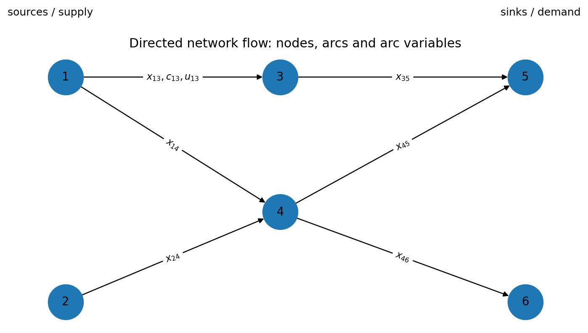
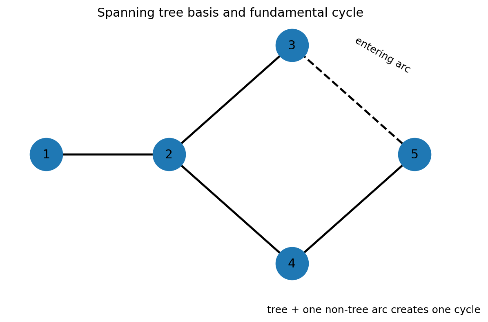
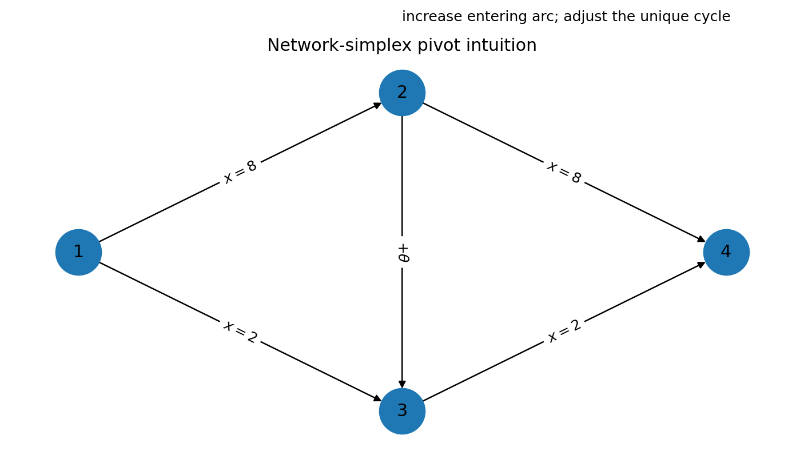
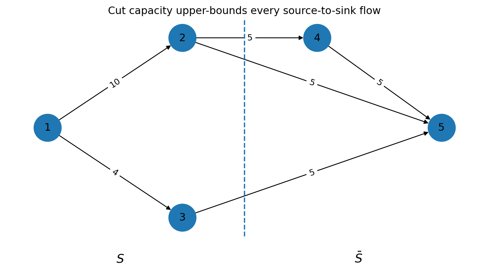
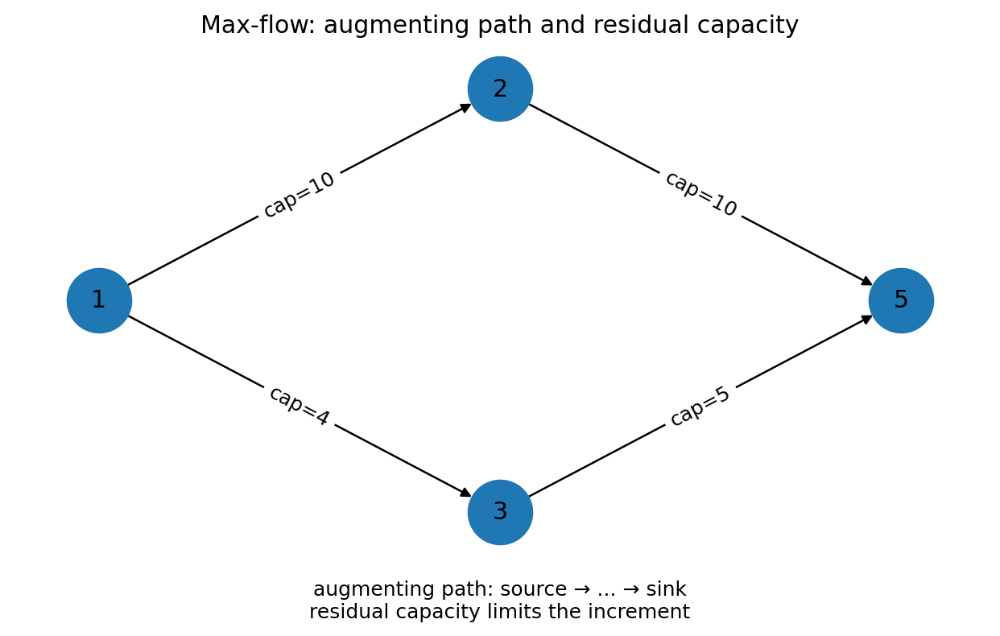
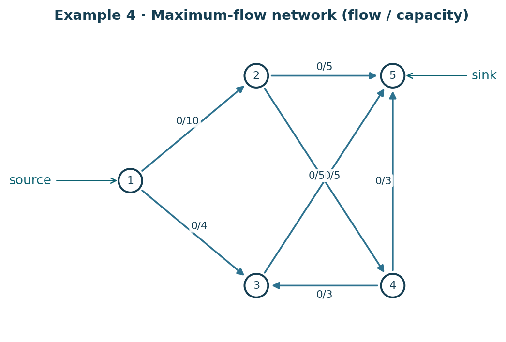
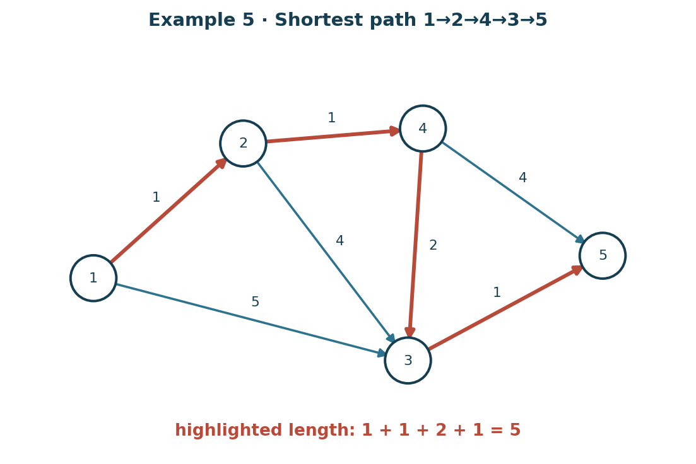
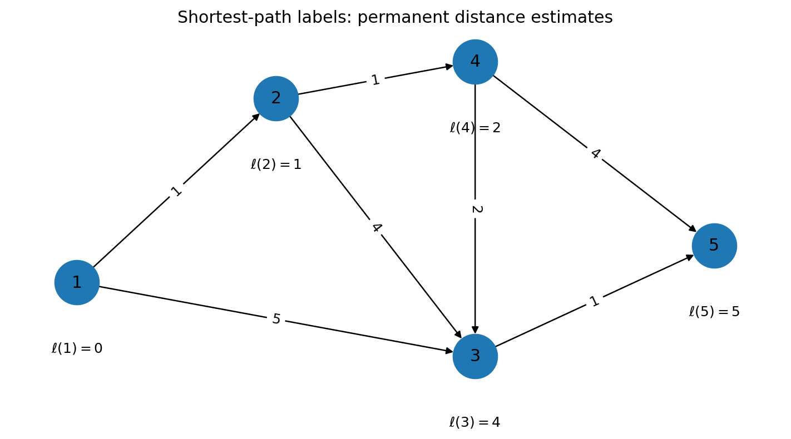

# 第 6 章：网络规划（Network Programming）

> 本章保留教材的符号习惯：弧 $a(i,j)$ 表示从节点 $i$ 指向节点 $j$；$x_{ij}$ 表示该弧上的流量；$c_{ij}$ 表示单位流量成本；$u_{ij}$ 表示容量。  

***

## 0. 本章到底在做什么？

前五章把线性规划的一般理论与单纯形方法建立起来；第 6 章开始利用一类非常特殊、也非常常见的 LP 结构：**网络流（network flow）**。

很多现实问题天然长成一张“点 + 有向边”的图：

- 发电厂、仓库、工厂、城市、路口是 **节点（node）**；
- 公路、管道、输电线、运输路线是 **弧（arc）**；
- 货物、电力、数据、车辆是沿弧流动的 **流（flow）**；
- 每条弧可以有成本、容量；
- 每个节点可以是供应点、需求点或中转点。

教材的核心观察是：这类问题虽然仍然是 LP，但其约束矩阵是 **node–arc incidence matrix（节点–弧关联矩阵）**，结构极其稀疏。正因为结构特殊，我们不必每次使用庞大的普通 simplex tableau，而可以设计更快的专门算法。

本章五个部分形成一条完整主线：

1. **Linear Network Flow Problems**：把网络流写成 LP；
2. **Some Basic Graph Theory**：学习 tree、path、cycle、spanning tree；
3. **Network Simplex for the Transshipment Problem**：把 simplex 的 basis 解释成 spanning tree；
4. **Maximal Flow Problem**：用 augmenting chain / labeling 解最大流，并证明 max-flow min-cut；
5. **Primal-Dual Procedures**：把 primal-dual 思想特化成 shortest path、Dijkstra、负权最短路、Hungarian method。

***

## Part I. Linear Network Flow Problems
### 1. 网络、节点和弧
一个网络（network，教材也把 graph 作为同义词使用）由一组 nodes 和一组 directed arcs 构成。

弧

$$
a(i,j)
$$

表示**允许从节点 $i$ 流向节点 $j$**。

如果现实中允许双向运输，通常要建立两条不同的弧：

$$
a(i,j),\qquad a(j,i).
$$

它们可以具有不同成本、不同容量，因此不能简单视作同一条无向边。

***

### 2. 节点–弧关联矩阵（node–arc incidence matrix）
设网络有 $m$ 个节点、$n$ 条弧。

对每条弧 $a(i,j)$，建立一列：

- 第 $i$ 行为 $+1$；
- 第 $j$ 行为 $-1$；
- 其余行为 $0$。

这 $n$ 列组成矩阵

$$
A\in\mathbb{R}^{m\times n},
$$

称为节点–弧关联矩阵。

#### 2.1 一个最小例子
若网络只有两条弧

$$
a(1,2),\qquad a(1,3),
$$

则

$$
A=
\begin{bmatrix}
1&1\\
-1&0\\
0&-1
\end{bmatrix}.
$$

若

$$
x=
\begin{bmatrix}
x_{12}\\x_{13}
\end{bmatrix},
$$

则

$$
Ax=
\begin{bmatrix}
x_{12}+x_{13}\\-x_{12}\\-x_{13}\end{bmatrix}.
$$

第一行就是节点 1 的“流出 − 流入”；第二、三行则分别是节点 2、3 的净流出。

***

### 3. 流量平衡：为什么是 $Ax=b$？
教材定义

$$
b_i=\text{节点 }i\text{ 的流出量}-\text{节点 }i\text{ 的流入量}.
$$

因此：

- $b_i>0$：source / supply node，供应节点；
- $b_i<0$：sink / demand node，需求节点；
- $b_i=0$：intermediate / transshipment node，中转节点。

于是所有节点的流量守恒可以统一写成

$$
\boxed{Ax=b.}
$$

例如节点 $k$ 没有自身供应或需求，则 $b_k=0$，所以

$$
\sum_j x_{kj}-\sum_i x_{ik}=0,
$$

即

$$
\boxed{\text{流入}=\text{流出}.}
$$

***

### 4. 容量、成本与一般最小费用网络流
弧 $a(i,j)$ 的流量满足

$$
0\le x_{ij}\le u_{ij},
$$

其中 $u_{ij}$ 是 capacity（容量）。

单位运输成本为 $c_{ij}$，总成本为

$$
\sum_{(i,j)}c_{ij}x_{ij}=c^\top x.
$$

因此 minimal cost network flow problem（最小费用网络流）写成

$$
\boxed{
\begin{aligned}
\min\quad &c^\top x\\
\text{s.t.}\quad &Ax=b,\\
&0\le x\le u.
\end{aligned}}
$$

***

### 5. 为什么必须满足总供给 = 总需求？
每一列关联矩阵都恰好有一个 $+1$ 和一个 $-1$，因此

$$
\mathbf 1^\top A=0.
$$

从 $Ax=b$ 得

$$
\mathbf 1^\top b
=
\mathbf 1^\top Ax
=0.
$$

所以网络平衡的必要条件是

$$
\boxed{\sum_{i=1}^m b_i=0.}
$$

#### 5.1 总供给大于总需求怎么办？
📘 教材做法：添加一个 fictitious sink（虚拟需求点），使总需求补足，同时给所有通往虚拟需求点的弧成本设为 0、容量设为无限。

这表示多余供应允许作为剩余量被虚拟节点吸收。

***

### 6. 关联矩阵为什么不是满行秩？
因为

$$
\mathbf 1^\top A=0,
$$

所以所有行线性相关：

$$
\operatorname{rank}(A)\le m-1.
$$

稍后会证明：如果网络 connected（连通），则实际上

$$
\boxed{\operatorname{rank}(A)=m-1.}
$$

这就是为什么 network simplex 会引入一个 root node / root arc：它把缺少的那一个 rank 补上。

***

## Part II. 五类重要网络流模型
### 7. Transshipment problem（转运问题）
这是**无容量上界**的最小费用网络流：

$$
u_{ij}=+\infty.
$$

因此

$$
\begin{aligned}
\min\quad &\sum c_{ij}x_{ij}\\
\text{s.t.}\quad &Ax=b,\\
&x\ge0.
\end{aligned}
$$

本章 Section 3 的 network simplex 主要针对它展开。

***

### 8. Transportation problem（运输问题）
运输问题是转运问题的特殊形式：

- 每个节点要么是 source，要么是 sink；
- 不设普通中转节点；
- 每个供应点都向若干需求点直接运输；
- 通常弧无容量限制。

若供应点为 $i=1,\ldots,m$，需求点为 $j=1,\ldots,n$，经典模型是

$$
\begin{aligned}
\min\quad &\sum_{i=1}^m\sum_{j=1}^n c_{ij}x_{ij}\\
\text{s.t.}\quad
&\sum_j x_{ij}=s_i,\\
&\sum_i x_{ij}=d_j,\\
&x_{ij}\ge0.
\end{aligned}
$$

并要求

$$
\sum_i s_i=\sum_j d_j.
$$

💡 学习补充：一个非退化运输问题 BFS 通常有 $m+n-1$ 个 basic arcs，而不是 $mn$ 个。

***

### 9. Assignment problem（指派问题）
每个人恰好分配一个工作，每个工作恰好分配一个人。

令

$$
x_{ij}=
\begin{cases}
1,&\text{person }i\text{ assigned to job }j,\\
0,&\text{otherwise}.
\end{cases}
$$

则

$$
\sum_jx_{ij}=1,
\qquad
\sum_ix_{ij}=1.
$$

教材把它看作 transportation problem 的特殊情况，其中每个供给/需求绝对值都等于 1。

网络矩阵具有特殊整数结构，因此很多 assignment LP 的极点自动为 0–1。

***

### 10. Maximal flow problem（最大流）
给定唯一 source $1$ 和唯一 sink $m$，目标是把尽可能多的流从 1 输送到 $m$。

教材指出，可加入 fictitious arc $a(m,1)$ 并把该弧流量当成网络总流量，从而把最大流写成一般网络流模型。

Section 4 会进一步利用图结构，直接给出更高效的 labeling / augmenting procedure。

***

### 11. Shortest path problem（最短路）
每条弧长度为 $c_{ij}$。

要找从节点 1 到节点 $m$ 的最短路径，可以想象“发送 1 单位虚拟商品”从 1 到 $m$：

$$
\begin{aligned}
\min\quad &\sum c_{ij}x_{ij}\\
\text{s.t.}\quad
&\text{source net outflow}=1,\\
&\text{intermediate net outflow}=0,\\
&\text{sink net outflow}=-1,\\
&x_{ij}\ge0.
\end{aligned}
$$

最优解通常满足 $x_{ij}\in\{0,1\}$；有多个同长最短路时，也可能出现分数型最优解。

***

## Part III. Some Basic Graph Theory
### 12. 必须掌握的图论术语
- **Proper network**：至少有两个节点和一条弧。
- **Subnetwork**：从原网络中选取部分节点和弧。
- **Spanning subnetwork**：包含原网络全部节点的子网络。
- **Chain（链）**：节点和弧交替出现，可以顺弧也可以逆弧走。
- **Orientation**：顺弧为 $+1$，逆弧为 $-1$。
- **Path（路）**：chain 中所有弧方向都是 $+1$。
- **Cycle（圈）**：起点与终点相同的 chain。
- **Circuit（有向回路）**：cycle 中所有弧方向一致。
- **Connected（连通）**：任意两节点之间至少存在一条 chain。
- **Acyclic（无圈）**：不存在 cycle。
- **Tree（树）**：connected + acyclic。
- **Spanning tree（生成树）**：覆盖全部节点的 tree。
- **Degree**：节点连接的弧数。
- **Endpoint**：degree 为 1 的节点。

***

### 13. Theorem 1 — Tree 的四个等价刻画
📘 教材定理：下列说法等价。

1. tree 是 connected 且 acyclic；
2. tree 是 acyclic，且节点数比弧数多 1；
3. tree 是 connected，且节点数比弧数多 1；
4. 任意两个节点之间存在唯一 chain。

若节点数为 $m$，tree 的弧数必为

$$
\boxed{m-1.}
$$

#### 13.1 为什么“多一条弧就会产生圈”？
一棵 $m$ 节点树已经用 $m-1$ 条弧刚好保持连通且无圈。若再加入一条连接已有节点的弧，那么两节点原本在树中已经有唯一 chain；新弧与这条 chain 合在一起，必形成一个 cycle。

这正是 network simplex pivot 的图论基础。

***

### 14. Theorem 2 — 连通网络一定有 spanning tree
📘 教材结论：每个 connected network 都被某棵 tree spanning；并且 tree 所对应的 incidence-matrix columns 线性无关。

#### 14.1 证明思路
从任意一条弧开始得到 2 节点 tree。若当前 tree 尚未覆盖所有节点，由于原网络连通，总能找到一条把 tree 内节点与 tree 外节点连接起来的弧。加入该节点和弧不会形成 cycle，于是 tree 可以扩大一个节点。不断重复，最终得到 spanning tree。

***

### 15. Corollary — 连通网络关联矩阵的秩
若 connected network 有 $m$ 个节点：

$$
\boxed{\operatorname{rank}(A)=m-1.}
$$

理由：

- $\mathbf 1^\top A=0$，故 rank 至多 $m-1$；
- spanning tree 有 $m-1$ 条弧；
- 对应 $m-1$ 个列向量线性无关。

***

## Part IV. Rooted network 与 Network Simplex
### 16. 为什么要 root？
普通 simplex 希望约束矩阵有 full row rank，但 incidence matrix 只有 rank $m-1$。

教材加一条强制为 0 的 artificial variable，对应列为单位向量

$$
I^{(k)},
$$

即只在第 $k$ 行为 1。

节点 $k$ 被称为 **root node**；这条人工弧叫 **root arc**。

于是扩充矩阵为

$$
[A\mid I^{(k)}],
$$

可以形成 $m\times m$ basis。

***

### 17. Theorem 3 — basis 与 spanning tree 一一对应
📘 教材核心定理：

> 对 connected network，若节点 $k$ 被 root，则 $B$ 是 $[A\mid I^{(k)}]$ 的 basis matrix，当且仅当 $B$ 包含 root column $I^{(k)}$，其余 $m-1$ 列恰好对应一棵 spanning tree。

这是本章最重要的桥梁：

$$
\boxed{\text{LP basis}\quad\longleftrightarrow\quad\text{spanning tree}.}
$$

所以：

- ordinary simplex：交换 basis column；
- network simplex：交换 spanning-tree arc。

***

### 18. 为什么树上解 $Bx=b$ 很容易？
教材 Proposition 1：适当排列 rows/columns 后，tree basis matrix 可变成 lower triangular。

更重要的是，实际根本不必显式求 $B^{-1}$。

可以使用 endpoint elimination：

1. 找一个非 root endpoint；
2. 用该端点的 balance equation 直接确定唯一 incident basic arc 的流；
3. 删除该节点和弧；
4. 对剩余 tree 重复；
5. 最后到 root。

这就是网络结构代替矩阵消元的第一处体现。

***

### 19. Example 1 — 从 rooted tree 直接求 basic solution
📘 教材 Example 1 使用 rooted tree 8(b)，root 为节点 4，并给出

$$
b=(12,18,-20,-10,0)^\top.
$$

按 endpoints 向 root 逐步平衡。

#### Step 1：节点 1
节点 1 只通过 $a(1,3)$ 连接，因此

$$
x_{13}=12.
$$

#### Step 2：节点 3
节点 3 需求为 20，已经从节点 1 得到 12，还缺 8，因此

$$
x_{43}=8.
$$

#### Step 3：节点 2
节点 2 是 supply 18，但 tree 上唯一连接弧的方向与所需净流方向相反，因此代数解给出

$$
x_{52}=-18.
$$

#### Step 4：节点 5
平衡进一步得到

$$
x_{45}=-18.
$$

最终 basic solution 中含负分量，因此它不是 BFS。

#### 19.1 这道例题真正要学什么？
> spanning tree 保证 basic solution 唯一存在，但不保证 $x\ge0$。

所以“tree basis”和“feasible tree basis”必须区分。

***

### 20. Example 2 — 构造一个 BFS
📘 对 network (1) 取

$$
b=(25,15,0,0,-10,-20,-10)^\top.
$$

教材选择一棵 spanning tree，然后从 endpoints 向内平衡。

节点 1：

$$
x_{13}=25.
$$

节点 3 先满足 node 5 的 10 单位需求：

$$
x_{35}=10.
$$

剩余 15 送给 node 6：

$$
x_{36}=15.
$$

节点 2：

$$
x_{24}=15.
$$

node 4 再向 node 6 与 node 7 分配：

$$
x_{46}=5,
\qquad
x_{47}=10.
$$

其余 non-tree arcs 为 0。

因此得到 BFS：

$$
\boxed{
\begin{aligned}
x_{13}&=25,\\
x_{24}&=15,\\
x_{35}&=10,\\
x_{36}&=15,\\
x_{46}&=5,\\
x_{47}&=10.
\end{aligned}}
$$

***

## Part V. Network simplex 的 reduced cost 与 node potential
### 21. 一般 reduced cost 如何变成节点势？
教材仍采用 Chapter 3 的 $z_j-c_j$ 符号。

令

$$
w^\top=c_B^\top B^{-1}.
$$

对于弧 $a(i,j)$，对应 incidence column 是

$$
A^{(p)}=e_i-e_j.
$$

因此

$$
\begin{aligned}
z_{ij}-c_{ij}
&=c_B^\top B^{-1}A^{(p)}-c_{ij}\\
&=w^\top(e_i-e_j)-c_{ij}\\
&=w_i-w_j-c_{ij}.
\end{aligned}
$$

于是

$$
\boxed{z_{ij}-c_{ij}=w_i-w_j-c_{ij}.}
$$

这里 $w_i$ 可理解为 **node potential（节点势）** 或 dual price。

#### 21.1 Basic arc 条件
对 tree arc：

$$
z_{ij}-c_{ij}=0,
$$

因此

$$
\boxed{w_i-w_j=c_{ij}.}
$$

#### 21.2 Root 条件
root node 的势取

$$
\boxed{w_k=0.}
$$

这样所有其他 node potentials 都可以沿 tree 递推。

#### 21.3 最优性条件
对于本书的最小化 convention：

$$
\boxed{z_{ij}-c_{ij}\le0}
$$

对所有 nonbasic arcs 成立时，当前 BFS 最优。

如果换成现代 reduced cost

$$
\bar c_{ij}=c_{ij}-w_i+w_j,
$$

则

$$
\bar c_{ij}=-(z_{ij}-c_{ij}),
$$

最优条件就是

$$
\bar c_{ij}\ge0.
$$

***

### 22. Network simplex pivot：为什么只需改一个 cycle？
把一条 non-tree arc 加入 spanning tree 后，必产生唯一 cycle。

令 entering arc 流量增加 $\theta$。为了继续满足所有 node balances，只需沿这个 cycle：

- 与 entering arc cycle orientation 同向的 flow 加 $\theta$；
- 反向的 flow 减 $\theta$。

不断增大 $\theta$，直到某条 basic arc 首先降到 0；它离开 tree。

这样：

- entering arc 加入；
- leaving arc 删除；
- 新 basic arcs 仍构成 spanning tree。

***

### 23. Network simplex — 完整算法
#### Step 0：给定一个 BFS 与 spanning tree
要求

$$
Ax=b,
\qquad x\ge0.
$$

#### Step 1：计算 node potentials
固定 root potential 为 0，然后沿每条 basic tree arc 用

$$
w_i-w_j=c_{ij}
$$

解出其余 $w_i$。

#### Step 2：检查 nonbasic arcs
对每条 nonbasic arc 计算

$$
r_{ij}=w_i-w_j-c_{ij}.
$$

若所有

$$
r_{ij}\le0,
$$

停止，当前 BFS 最优。

#### Step 3：选择 entering arc
选某条

$$
r_{ij}>0.
$$

#### Step 4：加入该弧形成唯一 cycle
根据 cycle orientation 决定哪些 basic flows 加 $\theta$、哪些减 $\theta$。

#### Step 5：网络版 ratio test
在会被减小的 basic arcs 中：

$$
\theta^*=\min\{x_e:e\text{ 在 cycle 上且变为 }x_e-\theta\}.
$$

#### Step 6：删除 first-to-zero arc
它成为 leaving arc。

更新 tree 与 flow，返回 Step 1。

***

### 24. Example 3 — 教材完整 pivot
📘 教材给 network (1) 成本：

$$
\begin{aligned}
c_{13}&=2,& c_{35}&=3,& c_{46}&=4,\\
c_{14}&=1,& c_{36}&=2,& c_{47}&=1,\\
c_{24}&=2,& c_{45}&=4.
\end{aligned}
$$

初始 BFS 来自 Example 2。

沿 tree 从 root potential 开始解 $w$，教材得到某个 nonbasic arc

$$
z_{45}-c_{45}=1>0.
$$

因此 $a(4,5)$ 进入 tree。

令

$$
x_{45}=\theta.
$$

沿 fundamental cycle 调整后：

$$
x_{35}=10-\theta,
$$

$$
x_{36}=15+\theta,
$$

$$
x_{46}=5-\theta.
$$

非负性要求

$$
\theta\le5,
$$

故

$$
\boxed{\theta^*=5.}
$$

于是 $x_{46}$ 先降为 0，对应 arc 离开 tree。

新 BFS：

$$
\boxed{
\begin{aligned}
x_{13}&=25,\\
x_{24}&=15,\\
x_{35}&=5,\\
x_{36}&=20,\\
x_{45}&=5,\\
x_{47}&=10,
\end{aligned}}
$$

其余相关 nonbasic variables 为 0。

重新计算 potentials 后，所有 nonbasic arcs 都满足

$$
z_{ij}-c_{ij}\le0,
$$

因此最优。

***

### 25. Integrality（整数性）
📘 教材指出：

- 若 $b$ 的分量都是整数，transshipment problem 的 BFS 可以取整数值；
- 对 minimal cost network flow，若供需与容量为整数，也有相应整数性。

💡 学习补充：现代语言中，这来自 node–arc incidence matrix 的 **totally unimodular（全幺模）** 性质。

你在本章不需要证明全幺模性，但应记住：

> network flow LP 是“连续 LP 自动给出整数极点”的经典结构。

这解释了为什么 transportation、assignment、max flow、shortest path 常不需要额外整数规划 machinery。

***

## Part VI. Maximal Flow Problem
### 26. 最大流的标准模型
唯一 source 为节点 1，唯一 sink 为节点 $m$。

对于中间节点：

$$
\sum_j(x_{ij}-x_{ji})=0.
$$

source 的净流出等于 $f$：

$$
\sum_j(x_{1j}-x_{j1})=f.
$$

sink 的净流出为 $-f$：

$$
\sum_j(x_{mj}-x_{jm})=-f.
$$

且

$$
0\le x_{ij}\le u_{ij}.
$$

目标：

$$
\boxed{\max f.}
$$

如果有多个 sources，可以增加一个 artificial source；多个 sinks 同理增加 artificial sink。

***

### 27. Cut（割）
取节点集合 $S$：

- source 在 $S$；
- sink 不在 $S$。

令补集为

$$
\bar S.
$$

从 $S$ 指向 $\bar S$ 的所有弧构成 cut：

$$
(S,\bar S).
$$

cut capacity 为

$$
\boxed{
\operatorname{cap}(S,\bar S)
=
\sum_{i\in S,\ j\in\bar S}u_{ij}.
}
$$

***

### 28. Proposition 2 — 任意 flow 不超过任意 cut capacity
设 flow value 为 $f$。

跨越 cut 的净流量等于 $f$：

$$
f
=
\sum_{i\in S,j\in\bar S}x_{ij}
-
\sum_{i\in\bar S,j\in S}x_{ij}.
$$

第二项非负，因此

$$
f
\le
\sum_{i\in S,j\in\bar S}x_{ij}
\le
\sum_{i\in S,j\in\bar S}u_{ij}.
$$

所以

$$
\boxed{f\le\operatorname{cap}(S,\bar S).}
$$

这是最大流理论最基本的 upper bound。

***

### 29. Corollary 4 — 一旦 flow value = cut capacity 就全部最优
若存在一个 feasible flow 和一个 cut 使

$$
f=\operatorname{cap}(S,\bar S),
$$

那么：

- 该 flow 不可能再增大；
- 该 cut 不可能再减小。

于是 flow 是 maximum flow，cut 是 minimum cut。

这是非常重要的**最优性证书（optimality certificate）**。

***

### 30. Theorem 4 — Max-Flow Min-Cut
📘 教材定理：

$$
\boxed{\text{maximum flow value}=\text{minimum cut capacity}.}
$$

#### 30.1 证明结构
教材从一个 maximal flow 出发，递归构造集合 $S$：

1. source $1\in S$；
2. 若 $i\in S$ 且正向弧还有剩余容量 $x_{ij}<u_{ij}$，则把 $j$ 放入 $S$；
3. 若 $i\in S$ 且某反向弧有正流 $x_{ji}>0$，也把 $j$ 放入 $S$。

若 sink 也进入 $S$，就说明存在一条还能增广的 chain，与 maximality 矛盾。

所以 sink 不在 $S$，$(S,\bar S)$ 是一个 cut。

对从 $S$ 到 $\bar S$ 的弧，必须全部 saturated：

$$
x_{ij}=u_{ij};
$$

对从 $\bar S$ 回到 $S$ 的弧，必须 flowless：

$$
x_{ji}=0.
$$

因此

$$
f=\operatorname{cap}(S,\bar S).
$$

再结合 Corollary 4 即得定理。

***

### 31. Residual intuition 与 flow-augmenting chain
对于当前流 $x$：

#### 正向弧
若

$$
x_{ij}<u_{ij},
$$

还能增加

$$
u_{ij}-x_{ij}.
$$

#### 反向弧
若

$$
x_{ji}>0,
$$

可以把原来从 $j$ 到 $i$ 的一部分流取消，相当于允许沿 $i\to j$ 的反方向调整。

若从 source 到 sink 能找到由这些“可调整方向”组成的 chain，就叫 **flow-augmenting chain**。

📘 Corollary 5：

$$
\boxed{
\text{flow maximal}
\iff
\text{不存在 augmenting chain}.
}
$$

***

### 32. Labeling procedure（标号算法）
教材算法本质上就是 Ford–Fulkerson 风格的 augmenting-chain method。

#### Step 1：从零流开始
$$
x_{ij}=0.
$$

#### Step 2：标记 source
source 节点 1 获得初始 label。

#### Step 3：正向扩展
若 $i$ 已标号、存在 $a(i,j)$ 且

$$
x_{ij}<u_{ij},
$$

则给 $j$ 标号，并令

$$
\theta_j
=
\min\{\theta_i,u_{ij}-x_{ij}\}.
$$

#### Step 4：反向扩展
若 $i$ 已标号，存在弧 $a(j,i)$ 且

$$
x_{ji}>0,
$$

则也可以标记 $j$：

$$
\theta_j
=
\min\{\theta_i,x_{ji}\}.
$$

#### Step 5：sink 被标号
沿 predecessor labels 回溯得到 augmenting chain。

令允许的最大增量为 $\theta$：

- 正向弧增加 $\theta$；
- 反向弧减少 $\theta$。

删除 labels，重新开始。

#### Step 6：sink 无法被标号
令 $S$ 为所有已标号节点。

则

$$
(S,\bar S)
$$

是 minimum cut，而当前 flow 是 maximum flow。

***

### 33. Example 4 — 教材最大流例题

> 公开版原创重绘。弧标签采用 $(x_{ij},u_{ij})$ 的“当前流量/容量”形式，可直接与后面的 labeling / augmentation 推导对应。

📘 教材 Example 4 的网络容量包括：

$$
u_{12}=10,
\quad
u_{13}=4,
\quad
u_{25}=5,
\quad
u_{24}=5,
\quad
u_{35}=5,
\quad
u_{43}=3,
\quad
u_{45}=3.
$$

通过多轮 labeling / augmentation，教材最终得到

$$
\boxed{f^*=13.}
$$

同时得到 cut

$$
S=\{1,2,3,4\},
\qquad
\bar S=\{5\}.
$$

该 cut 中从 $S$ 指向 5 的容量之和为

$$
5+5+3=13.
$$

所以

$$
f^*=13
=
\operatorname{cap}(S,\bar S),
$$

由 max-flow min-cut theorem 立即认证最优。

***

## Part VII. Primal-Dual Procedures for Network Flow
### 34. Shortest path 的 primal 与 dual
最短路 primal 可以理解为从节点 1 向节点 $m$ 发送 1 单位流并最小化费用。

其 dual 为：

$$
\boxed{
\begin{aligned}
\max\quad&w_1-w_m\\
\text{s.t.}\quad&w_i-w_j\le c_{ij}
\qquad \forall a(i,j).
\end{aligned}}
$$

教材固定

$$
w_m=0.
$$

于是目标就是最大化 $w_1$。

#### 34.1 Dual variable 的直观意义
约束

$$
w_i-w_j\le c_{ij}
$$

意味着“势函数差”不能超过直接弧长度。

若某条弧属于最优路径并承载正流，complementary slackness 给出

$$
\boxed{w_i-w_j=c_{ij}.}
$$

这样的弧称为 **tight arc**。

***

### 35. 教材 primal-dual shortest-path algorithm
从一个 dual feasible $w$ 出发。

定义 tight arc set

$$
Q=\{(i,j):w_i-w_j=c_{ij}\}.
$$

若 tight arcs 已经构成从 1 到 $m$ 的 path，停止。

否则构造方向 $r$，更新

$$
w\leftarrow w+\theta r,
$$

其中

$$
\theta
=
\min
\left\{
\frac{c_{ij}-(w_i-w_j)}{r_i-r_j}
:r_i-r_j>0
\right\}.
$$

每次更新至少让一个新的 dual constraint 变 tight，因此 tight-arc subnetwork 逐步扩大。

***

### 36. Example 5 — shortest path

> 公开版原创重绘保留节点编号、弧方向与长度，并用红色突出最短路径；后面的路径比较可以据此独立复算。

📘 教材 Example 5 的弧长：

$$
\begin{aligned}
1\to2 &:1,\\
1\to3 &:5,\\
2\to4 &:1,\\
2\to3 &:4,\\
4\to3 &:2,\\
4\to5 &:4,\\
3\to5 &:1.
\end{aligned}
$$

主要路径比较：

$$
1\to3\to5:
5+1=6,
$$

$$
1\to2\to3\to5:
1+4+1=6,
$$

$$
1\to2\to4\to5:
1+1+4=6,
$$

$$
1\to2\to4\to3\to5:
1+1+2+1=5.
$$

因此

$$
\boxed{1\to2\to4\to3\to5}
$$

是 shortest path，长度

$$
\boxed{5.}
$$

教材通过 primal-dual tight-arc 扩展过程得到相同结果。

***

## Part VIII. Dijkstra’s Algorithm
### 37. 适用条件
Dijkstra 要求

$$
\boxed{c_{ij}\ge0.}
$$

若存在负边，它的“已永久确定最短距离”逻辑可能失效。

***

### 38. 标签含义
对每个节点 $i$ 保存：

- $\ell(i)$：当前从 source 1 到 $i$ 的最短距离估计；
- $p(i)$：当前候选 shortest path 中 $i$ 的 predecessor。

初始化：

$$
\ell(1)=0,
$$

$$
\ell(i)=+\infty\quad(i\ne1).
$$

***

### 39. Dijkstra 完整步骤
#### Step 1
永久集合

$$
S=\{1\}.
$$

#### Step 2：Relaxation
若当前永久节点为 $x$，对于 $i\notin S$：

若

$$
\ell(x)+c_{xi}<\ell(i),
$$

则更新

$$
\ell(i)=\ell(x)+c_{xi},
$$

$$
p(i)=x.
$$

#### Step 3
从所有未永久节点中选择最小 $\ell(i)$ 的节点 $j$，将其加入 $S$。

#### Step 4
重复 relaxation 与选择，直到所有需要的节点进入 $S$。

#### Step 5：回溯路径
从目标 $t$：

$$
t,p(t),p(p(t)),\ldots,1.
$$

反向排列即可得到 shortest path。

***

### 40. 为什么非负边保证 Dijkstra 正确？
💡 学习补充证明导航：

假设当前选出的未永久节点 $j$ 有最小标签 $\ell(j)$。

如果实际上存在一条尚未发现的更短路径到 $j$，那么这条路径从 permanent set $S$ 第一次走到未永久节点时，会进入某节点 $q$。

由于后面的弧长都非负：

$$
\text{distance}(1,q)
\le
\text{distance}(1,j).
$$

而此前 relaxation 已经会使 $q$ 的标签不大于该候选路径长度，因此应有

$$
\ell(q)<\ell(j),
$$

这与 $j$ 被选作最小标签节点矛盾。

所以 $j$ 的标签一旦永久化就不会再被改小。

***

## Part IX. Negative Costs 与负圈
### 41. 为什么负边本身并不可怕？
只要没有 negative-cost circuit（负费用有向回路），最短路仍可能有有限值。

真正致命的是存在 circuit $C$ 使

$$
\sum_{a(i,j)\in C}c_{ij}<0.
$$

如果 source 可以到达这个回路，而且从回路还可继续到目标，那么可以绕该回路任意多次，使路径长度趋向

$$
-\infty.
$$

因此 shortest-path problem 没有有限最优值。

***

### 42. Exercise 6.25 的 label-correcting idea
教材给出一个允许负边的 labeling procedure。

其核心与现代 Bellman–Ford / label-correcting method 很接近。

只要发现 dual inequality

$$
w_i-w_j\le c_{ij}
$$

被违反，即

$$
w_i-w_j>c_{ij},
$$

就更新

$$
w_j=w_i-c_{ij},
$$

并记录 predecessor

$$
p(j)=i.
$$

不断修正，直到所有 dual inequalities 都满足。

教材另外给出一个基于所有负成本和的 bound，用来侦测 negative circuit。

***

## Part X. Hungarian Method
### 43. Hungarian method 解决什么？
它是 assignment problem 的专门 primal-dual algorithm。

对于成本矩阵

$$
C=[c_{ij}]\in\mathbb R^{n\times n},
$$

要从每行选一个、每列选一个，使总成本最小。

***

### 44. 为什么“行减最小值、列减最小值”不会改变最优 assignment？
如果第 $i$ 行每个元素都减去 $r_i$，每个 feasible assignment 在这一行恰好选一个元素，所以所有 assignment 的总成本都同时减少 $r_i$。

同理，列减最小值只是让所有 assignment 同时再减少同一个常数。

因此最优 assignment 不变。

这实际上是在调整 dual variables。

***

### 45. 教材 Hungarian method 步骤
#### Step 1：row reduction
每行减去该行最小元素。

#### Step 2：column reduction
每列减去该列最小元素。

#### Step 3：寻找 $n$ 个 independent zeros
要求每行、每列各用恰好一个零。

如果能找到，停止。

#### Step 4：若不能找到
用最少数量的 horizontal / vertical lines 覆盖所有零。

找所有未覆盖元素中的最小值 $\delta$：

- 未覆盖元素减 $\delta$；
- 被两条线重复覆盖的元素加 $\delta$；
- 只覆盖一次的元素不变。

回 Step 3。

#### 45.1 Primal-dual 解释
把 row potentials 与 column potentials 分别记为 $u_i,v_j$。

reduced cost 是

$$
\bar c_{ij}=c_{ij}-u_i-v_j.
$$

Hungarian method 一直维持

$$
\bar c_{ij}\ge0,
$$

并通过 dual adjustment 制造更多

$$
\bar c_{ij}=0
$$

的 tight edges。

当 tight-edge graph 存在 perfect matching 时，primal feasibility 与 complementary slackness 同时成立，于是 assignment 最优。

***

## Part XI. 一般 minimal-cost network flow 的边界处理
### 46. 有上下界时的网络 simplex optimality
对

$$
0\le x_{ij}\le u_{ij}
$$

的 arc：

- 若 nonbasic arc 在 lower bound $x_{ij}=0$，最小化最优条件要求

$$
z_{ij}-c_{ij}\le0;
$$

- 若 nonbasic arc 在 upper bound $x_{ij}=u_{ij}$，允许的移动方向是减少它，因此条件反向：

$$
z_{ij}-c_{ij}\ge0.
$$

Exercise 6.13 正是把 Chapter 3 Exercise 3.7 的 bound-simplex 条件图论化。

***

### 47. 有正 lower bounds 怎么办？
若原问题为

$$
\ell\le x\le u,
$$

令

$$
y=x-\ell.
$$

则

$$
y\ge0,
$$

并且

$$
Ay=b-A\ell,
$$

上界变成

$$
y\le u-\ell.
$$

所以一般 lower-bound network flow 可转成教材标准形式。

Exercise 6.15 就是在考这一步。

***

## Part XII. 本章最重要的统一视角
### 48. 不要把这些算法当作五套孤立技巧
它们其实都在利用同一套 LP primal/dual 结构，只是把矩阵运算替换成图上的局部操作。

| 一般 LP 概念 | 网络中的对应物 |
|---|---|
| basis matrix | spanning tree |
| basic variable | tree arc |
| nonbasic variable | non-tree arc / bound arc |
| pivot | add one arc, remove one arc |
| reduced cost | node-potential difference minus arc cost |
| dual variable | node potential / label |
| feasibility | node flow balance + arc bounds |
| complementary slackness | used arcs are tight |
| primal-dual update | grow tight-arc subnetwork |
| dual certificate | cut / node potentials |

***

### 49. Network simplex 与 ordinary simplex
ordinary simplex 会计算

$$
B^{-1}A^{(j)}
$$

并做 ratio test。

network simplex 识别到：

- $B$ 是 tree incidence structure；
- 加一个 non-tree arc 会产生唯一 cycle；
- $B^{-1}A^{(j)}$ 的非零模式正对应这个 cycle；
- ratio test 就是沿 cycle 找第一个达到 bound 的 arc。

所以 network simplex 不是另一种数学，而是：

> **把矩阵 pivot 翻译成图上的“加边—成圈—调流—删边”。**

***

### 50. Max-flow 与 duality
maximum flow $f$ 是 primal quantity；每个 cut capacity 是 upper bound。

当二者相等：

$$
f=\operatorname{cap}(S,\bar S),
$$

就像 LP 中 primal objective = dual objective，最优性被认证。

Exercise 6.22 正式要求使用 fundamental duality theorem 推导 max-flow min-cut theorem。

***

### 51. Shortest path 与 node potentials
shortest path dual：

$$
w_i-w_j\le c_{ij}.
$$

optimal path 上的 used arcs：

$$
w_i-w_j=c_{ij}.
$$

所以 shortest-path labels 不是“凭空设计的算法变量”，而是 LP dual variables。

这也是 Dijkstra 可以解释成 primal-dual algorithm 的原因。

***

## Part XIII. 易错点
### 52. 易错点 1：把 $b_i$ 的符号搞反
本书采用

$$
\boxed{b_i=\text{outflow}-\text{inflow}.}
$$

因此

- supply：$b_i>0$；
- demand：$b_i<0$。

其他教材可能使用相反 convention，必须先核对。

***

### 53. 易错点 2：把 chain 和 path 当成同义词
chain 可以逆着某些弧走；path 要求每条弧都朝前。

最大流 residual reasoning 中，reverse arc 很重要，因此教材使用 chain 是有意的。

***

### 54. 易错点 3：tree basis 不等于 BFS
spanning tree 给出 basic solution，但可能产生负流量。

只有满足

$$
x\ge0
$$

时才是 BFS。

Example 1 正是反例。

***

### 55. 易错点 4：本书 reduced cost 符号与很多现代教材相反
教材：

$$
z_{ij}-c_{ij}=w_i-w_j-c_{ij}.
$$

最小化最优条件：

$$
z_{ij}-c_{ij}\le0.
$$

现代常写

$$
\bar c_{ij}=c_{ij}-w_i+w_j\ge0.
$$

二者完全等价。

***

### 56. 易错点 5：reverse residual arc 不是现实中新加的运输方向
如果原来有

$$
x_{ij}>0,
$$

residual network 允许“向回走”，只是表示可以减少之前的 $i\to j$ 流。

***

### 57. 易错点 6：Dijkstra 不能随便处理负边
Dijkstra 的正确性依赖

$$
c_{ij}\ge0.
$$

一旦有负边，应使用 label-correcting / Bellman–Ford 类型方法；若还有负圈，则最短路可能没有有限值。

***

### 58. 易错点 7：Hungarian method 的 row/column reduction 不是贪心
“每行减最小值”并不表示每行直接选择最小元素。

它只是 dual normalization；最终必须找到一个每行每列恰好一个的 independent-zero assignment。

***

## Part XIV. 本章证明地图
### 59. 建议掌握的证明链
1. tree 至少两个 endpoints；
2. degree sum = $2|E|$；
3. tree 中两节点 chain 唯一；
4. cycle 对应 incidence columns 线性相关；
5. spanning-tree columns 线性无关；
6. connected network 的 incidence rank 是 $m-1$；
7. flow $\le$ cut capacity；
8. max-flow min-cut；
9. no augmenting chain $\iff$ max flow；
10. shortest path dual 与 complementary slackness；
11. Dijkstra 的 primal-dual interpretation；
12. Hungarian 的 primal-dual interpretation。

***

## Part XV. 自测题
### 60. 概念自测与答案
#### Q1为什么 incidence matrix 的每一列元素和为 0？

**答：** 一条弧列只有一个 $+1$ 与一个 $-1$。

#### Q2为什么 connected network 的 incidence matrix rank 为 $m-1$？

**答：** 行和为 0，所以 rank 至多 $m-1$；spanning tree 给出 $m-1$ 个线性无关列，所以 rank 至少 $m-1$。

#### Q3为什么给 tree 加一条 non-tree arc 后只会产生一个 cycle？

**答：** tree 中该 arc 两端原先存在唯一 chain；新 arc 与唯一 chain 构成唯一 cycle。

#### Q4network simplex 的 ratio test 在图上是什么？

**答：** 沿 fundamental cycle 调整流量，找到第一个达到 0 或容量上界的 basic arc。

#### Q5最大流为什么总不超过任意 cut capacity？

**答：** source 到 sink 的所有净流必须跨越 cut，而跨 cut 的每条弧都不超过其容量。

#### Q6什么时候只要找到一个 flow 和一个 cut 就能立即证明二者最优？

**答：** 当 flow value = cut capacity。

#### Q7最短路 dual inequality 是什么？

$$
w_i-w_j\le c_{ij}.
$$

#### Q8最短路上的 used arc 在最优时通常满足什么？

$$
w_i-w_j=c_{ij}.
$$

#### Q9为什么 Dijkstra 需要非负弧长？

**答：** 因为 permanent label 的正确性依赖“继续经过更多弧不会让已确定距离再降低”。

#### Q10Hungarian algorithm 与 primal-dual 有什么关系？

**答：** 行列 reduction 相当于调整 dual potentials，使更多 reduced costs 变 0；当零 reduced-cost edges 中存在 perfect matching 时，complementary slackness 成立。

***

## Part XVI. 一页速记
### 61. 核心公式
#### Minimal-cost network flow
$$
\min c^\top x
\quad\text{s.t.}\quad
Ax=b,
\quad0\le x\le u.
$$

#### Node balance
$$
\sum_jx_{ij}-\sum_jx_{ji}=b_i.
$$

#### Supply / demand
$$
b_i>0:\text{supply},
\qquad
b_i<0:\text{demand}.
$$

#### Connected incidence rank
$$
\operatorname{rank}(A)=m-1.
$$

#### Tree size
$$
|E_T|=m-1.
$$

#### Network-simplex reduced cost
$$
z_{ij}-c_{ij}=w_i-w_j-c_{ij}.
$$

#### Basic tree arc
$$
w_i-w_j=c_{ij}.
$$

#### Minimum-problem optimality
$$
z_{ij}-c_{ij}\le0.
$$

#### Cut capacity
$$
\operatorname{cap}(S,\bar S)
=\sum_{i\in S,j\in\bar S}u_{ij}.
$$

#### Flow-cut inequality
$$
f\le\operatorname{cap}(S,\bar S).
$$

#### Max-flow min-cut
$$
\boxed{f^*=\min\operatorname{cap}(S,\bar S).}
$$

#### Shortest-path dual
$$
w_i-w_j\le c_{ij}.
$$

#### Dijkstra relaxation
$$
\ell(j)\leftarrow
\min\{\ell(j),\ell(i)+c_{ij}\}.
$$

***

## 62. 本章与前后章节的关系
Chapter 6 是前六章线性规划体系的结构化高潮：

- Chapter 2 的 incidence matrix / rank / basis；
- Chapter 3 的 BFS / pivot；
- Chapter 4 的 duality / complementary slackness；
- Chapter 5 的 revised simplex / primal-dual；

在这里全部变成图上的算法。

进入 Chapter 7 后，教材转向 convex / concave functions，因此建议结束 Chapter 6 时确认你能回答：

> **为什么 network simplex、max-flow、Dijkstra、Hungarian algorithm 都可以看成线性规划及其对偶结构的不同“图论化实现”？**

如果能把这个问题讲清楚，就不再是在背算法，而是真的理解了本章。
