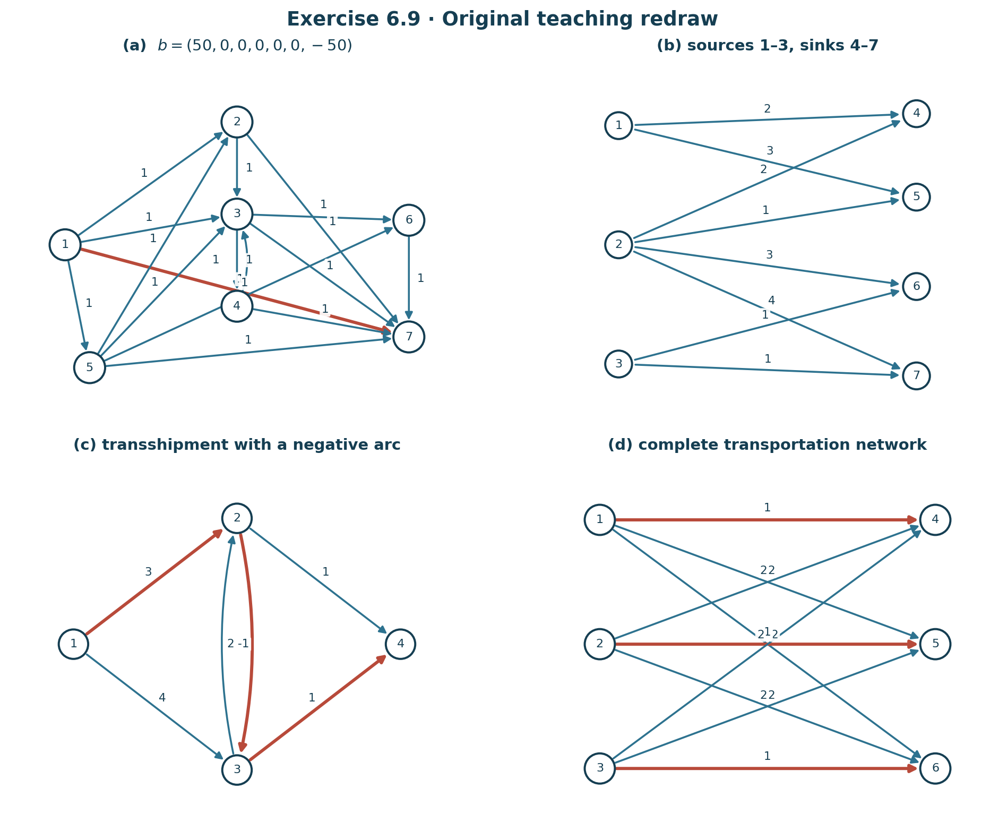
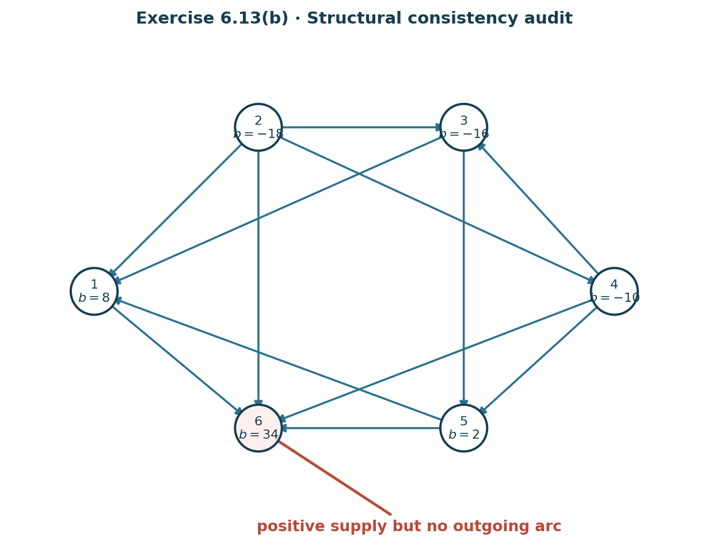
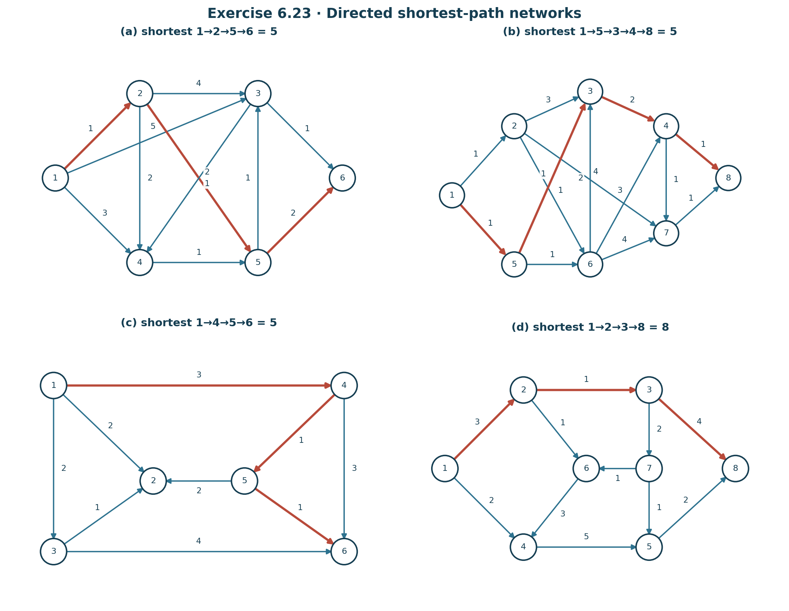
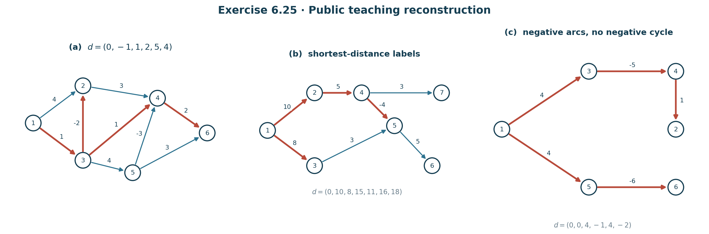

# Chapter 6 Exercises — 习题与答案（中英双语）

> **版本：独立学习版 V1**  
> 目标：不依赖教材即可读懂题意、完成推导并核对答案。教材印刷页约 pp.192–213。  
> 对含网络图的题目，本文按当前 PDF 可见图形重新识读弧方向、容量与成本；若扫描图与文字产生不可调和冲突，会明确标成“源文件异常”，不会暗中修改题面。

***

## Exercise 6.1
### 题意 / Problem
证明：任何具有至少两个节点的 tree 都至少有两个 endpoints（度为 1 的节点）。

**English restatement:** Prove that every tree with at least two nodes has at least two endpoints.

### 解答
设 tree 为 $T$，节点数为 $m\ge2$。

取 $T$ 中一条包含最多节点的 chain：

$$
v_0,v_1,\ldots,v_k.
$$

考虑端点 $v_0$。

如果 $v_0$ 的 degree 大于 1，则除了连接 $v_1$ 的弧之外，还存在另一条弧把 $v_0$ 与某节点 $u$ 相连。

- 若 $u$ 已在当前 chain 中，则这条额外弧与 chain 的一部分构成 cycle，违背 tree acyclic；
- 若 $u$ 不在 chain 中，则可以把 $u$ 接到 chain 前端，得到更长 chain，违背“当前 chain 最长”。

所以

$$
\deg(v_0)=1.
$$

同理

$$
\deg(v_k)=1.
$$

因此至少有两个 endpoints。

#### English answer
Take a longest chain in the tree. If either end node had degree greater than one, an additional incident arc would either create a cycle or extend the chain. Both are impossible. Therefore both ends have degree one, so every nontrivial tree has at least two endpoints.

***

## Exercise 6.2
### 题意 / Problem
证明一个网络所有节点的 degree 之和等于弧数的两倍。

### 解答
设网络弧集合为 $E$。

每条弧无论方向如何，都连接两个节点，因此在 degree 总和中恰好贡献 2：

- 在弧起点贡献 1；
- 在弧终点贡献 1。

所以

$$
\boxed{
\sum_{i\in V}\deg(i)=2|E|.
}
$$

这就是 handshaking lemma 的有向网络版本；这里 degree 仍按“与节点相连的弧数”计，不区分入度与出度。

#### English answer
Each arc is incident to exactly two nodes, so it contributes two to the sum of the node degrees. Hence $\sum_i\deg(i)=2|E|$.

***

## Exercise 6.3
### 题意 / Problem
证明：tree 中任意两个节点之间存在唯一 chain。

### 解答
#### 存在性
Tree 按定义 connected，因此任意两个节点 $u,v$ 之间至少存在一条 chain。

#### 唯一性
反设存在两条不同 chain：

$$
C_1:u\leadsto v,
\qquad
C_2:u\leadsto v.
$$

沿两条 chain 从 $u$ 出发，找到它们第一次分离的位置和之后第一次重新汇合的位置。两条不同支路合起来构成 cycle。

但 tree 是 acyclic，矛盾。

所以 chain 唯一。

#### English answer
Connectivity gives existence. If two distinct chains connected the same two nodes, their divergence and later reconnection would form a cycle, contradicting acyclicity. Therefore the chain is unique.

***

## Exercise 6.4
### 题意 / Problem
从一棵至少具有两个 endpoints 的 tree 中删除一个 endpoint 及连接它的弧，证明剩余网络仍是 tree。

### 解答
设删除 endpoint $v$ 和其唯一 incident arc $e$，得到 $T'$。

#### 1. $T'$ 仍 acyclic
删除节点和弧不可能制造新 cycle，所以 $T'$ 无圈。

#### 2. $T'$ 仍 connected
任取剩余节点 $x,y$。

原 tree 中 $x$ 到 $y$ 的唯一 chain 不可能把被删除的 endpoint $v$ 作为中间节点，因为 $v$ 的 degree 为 1；如果 chain 经过 $v$，只能在那里终止。

由于 $x,y\ne v$，原唯一 chain 完全保留在 $T'$ 中。

因此 $T'$ connected。

故

$$
\boxed{T'\text{ is a tree}.}
$$

#### English answer
Deleting an endpoint cannot create a cycle. The unique chain between any two remaining nodes never needs the deleted endpoint as an intermediate node, since that endpoint had degree one. Thus the remaining network stays connected and acyclic.

***

## Exercise 6.5
### 题意 / Problem
证明：node–arc incidence matrix 中对应某个 cycle 的那些列线性相关。

教材提示：使用 cycle 上各弧的 orientation number 作为线性组合系数。

### 解答
设 cycle 中依次出现弧

$$
a_1,\ldots,a_k,
$$

相对于选定遍历方向，它们的 orientation numbers 为

$$
\alpha_i\in\{+1,-1\}.
$$

令 incidence matrix 中对应列为

$$
A^{(1)},\ldots,A^{(k)}.
$$

考虑

$$
\sum_{i=1}^k\alpha_iA^{(i)}.
$$

在 cycle 的每个节点处，恰有两条 cycle arcs 相连。按 orientation 乘系数后，一条对该节点贡献 $+1$，另一条贡献 $-1$，二者抵消。

因此每个坐标都为 0：

$$
\sum_{i=1}^k\alpha_iA^{(i)}=0.
$$

但 $\alpha_i$ 不全为 0，所以这些列线性相关。

#### English answer
Multiply each incidence column on the cycle by its orientation number relative to a fixed traversal of the cycle. At every node the two incident cycle contributions cancel. Thus a nontrivial linear combination of the cycle columns is zero, so the columns are linearly dependent.

***

## Exercise 6.6
### 题意 / Problem
设 chain

$$
c=\{n_0,a_0,n_1,a_1,\ldots,a_{k-1},n_k\}
$$

的 orientation numbers 为 $\alpha_0,\ldots,\alpha_{k-1}$。证明

$$
I^{(n_k)}-I^{(n_0)}
=-\sum_{i=0}^{k-1}\alpha_iB^{(i)},
$$

其中 $B^{(i)}$ 是 incidence matrix 中对应弧 $a_i$ 的列。

### 解答
先看单条弧。

若 chain 沿弧方向从 $n_i$ 到 $n_{i+1}$，则 $\alpha_i=+1$，而 incidence column 是

$$
B^{(i)}=I^{(n_i)}-I^{(n_{i+1})}.
$$

因此

$$
-\alpha_iB^{(i)}
=I^{(n_{i+1})}-I^{(n_i)}.
$$

若 chain 逆弧方向走，则 $\alpha_i=-1$；同样仍有

$$
-\alpha_iB^{(i)}
=I^{(n_{i+1})}-I^{(n_i)}.
$$

于是求和：

$$
-\sum_{i=0}^{k-1}\alpha_iB^{(i)}
=
\sum_{i=0}^{k-1}
\left(I^{(n_{i+1})}-I^{(n_i)}\right).
$$

右端 telescopes：

$$
=I^{(n_k)}-I^{(n_0)}.
$$

证毕。

#### English answer
For each arc in the chain, $-\alpha_iB^{(i)}=I^{(n_{i+1})}-I^{(n_i)}$. Summing telescopes, leaving $I^{(n_k)}-I^{(n_0)}$.

***

## Exercise 6.7
### 题意 / Problem
概述 transshipment problem 的 network simplex procedure。

### 详细答案
对

$$
\min\sum c_{ij}x_{ij}
\quad\text{s.t.}\quad
Ax=b,
\quad x\ge0,
$$

执行：

1. **Initial BFS**：找一个 feasible spanning-tree basis；必要时加入 artificial node/arcs。
2. **Potentials**：选择 root，令 $w_r=0$；对每条 basic tree arc $a(i,j)$ 用
   $$
   w_i-w_j=c_{ij}
   $$
   求全部 $w_i$。
3. **Reduced costs**：对 nonbasic arc 计算
   $$
   z_{ij}-c_{ij}=w_i-w_j-c_{ij}.
   $$
4. 若全部 $\le0$，当前 BFS 最优。
5. 否则选某条 $z_{ij}-c_{ij}>0$ 的 arc 进入 tree。
6. 加入 entering arc 后形成唯一 cycle。
7. 沿 cycle 以 $\pm\theta$ 调整 flows，保持 $Ax=b$。
8. 增大 $\theta$，直到某条 basic arc flow 降到 0；该 arc 离开 tree。
9. 得到新 spanning tree 与 BFS，返回 Step 2。

#### English answer
Start from a feasible spanning-tree basis. Compute node potentials from the basic arcs, evaluate the reduced costs of nonbasic arcs, enter an improving arc, adjust flow around the unique fundamental cycle, drop the first basic arc that reaches zero, and repeat until all reduced costs satisfy the minimum-problem optimality condition.

***

## Exercise 6.8
### 题意 / Problem
教材给出

$$
b=(40,30,0,0,0,-50,-20)^\top,
$$

$$
c=(1,3,2,1,1,2,1,1,1,2,1)^\top,
$$

以及一个 $7\times11$ node–arc incidence matrix $A$，要求求解 transshipment problem。

由 $A$ 的各列可读出弧依次为：

$$
\begin{aligned}
&a(1,3),a(1,4),a(2,5),a(2,6),a(3,4),a(3,6),\\
&a(4,5),a(4,6),a(4,7),a(5,4),a(5,7).
\end{aligned}
$$

### 解答
一个最优可行流为

$$
\boxed{
\begin{aligned}
x_{13}&=40,\\
x_{26}&=30,\\
x_{34}&=40,\\
x_{46}&=20,\\
x_{47}&=20,
\end{aligned}}
$$

其余弧流量为 0。

#### 节点平衡检查
node 1：

$$
40=40.
$$

node 2：

$$
30=30.
$$

node 3：

$$
40-40=0.
$$

node 4：

$$
20+20-40=0.
$$

node 6：

$$
-(30+20)=-50.
$$

node 7：

$$
-20=-20.
$$

#### 目标值
$$
\begin{aligned}
z^*
&=1(40)+1(30)+1(40)+1(20)+1(20)\\
&=\boxed{150}.
\end{aligned}
$$

#### English answer
An optimal flow is $x_{13}=40$, $x_{26}=30$, $x_{34}=40$, $x_{46}=20$, and $x_{47}=20$, with all other flows zero. The minimum cost is $150$.

***

## Exercise 6.9
### 题意 / Problem
求解下图四个 transshipment problems。

> 下图以原创方式重绘四个网络。题 (b)、(c) 的给定 $b$ 总和为正，因此按本章 Section 1 的规则加入 zero-cost fictitious sink 吸收多余 supply。

> 子图顺序与小题顺序一致；弧上数字表示费用，红色弧突出正文所用的代表性最优运输路径。

***

### 6.9(a)
给定

$$
b=(50,0,0,0,0,0,-50)^\top,
$$

所有弧成本均为 1。

图中存在直接弧

$$
a(1,7).
$$

由于任何从 1 到 7 的运输至少经过一条弧，而所有 arc cost 都为 1，直接运输显然最便宜。

取

$$
\boxed{x_{17}=50}
$$

其余为 0。

最小成本：

$$
\boxed{z^*=50}.
$$

#### English answer
Ship all 50 units directly on arc $(1,7)$. Since every arc has unit cost, no route can be cheaper than one arc per unit. The minimum cost is $50$.

***

### 6.9(b)
教材给

$$
b=(10,20,30,-15,-15,-15,-5)^\top.
$$

注意

$$
\sum b_i=10,
$$

所以总 supply 比真实 demand 多 10。按教材规则添加 fictitious sink 8：

$$
b_8=-10,
$$

并允许 sources 1,2,3 以零成本把 surplus 送到 8。

可见真实弧成本：

$$
\begin{aligned}
c_{14}&=2,&c_{15}&=3,\\
c_{24}&=2,&c_{25}&=1,&c_{26}&=3,&c_{27}&=4,\\
c_{36}&=1,&c_{37}&=1.
\end{aligned}
$$

一个最优方案：

$$
\boxed{
\begin{aligned}
x_{14}&=10,\\
x_{24}&=5,\\
x_{25}&=15,\\
x_{36}&=15,\\
x_{37}&=5,\\
x_{38}&=10.
\end{aligned}}
$$

目标值：

$$
20+10+15+15+5=\boxed{65}.
$$

其中 $x_{38}=10$ 是送到 fictitious sink 的 surplus，成本为 0。

#### English answer
After adding a zero-cost dummy sink of demand 10, one optimal solution is $x_{14}=10$, $x_{24}=5$, $x_{25}=15$, $x_{36}=15$, $x_{37}=5$, and 10 units from node 3 to the dummy sink. Minimum real shipping cost: $65$.

***

### 6.9(c)
给定

$$
b=(40,0,0,-30)^\top,
$$

且

$$
c_{12}=3,
\ c_{13}=4,
\ c_{23}=-1,
\ c_{24}=1,
\ c_{32}=2,
\ c_{34}=1.
$$

同样

$$
\sum b_i=10,
$$

添加 dummy sink 5，需求 10、入弧零成本。

一个最优方案：

$$
\boxed{
\begin{aligned}
x_{12}&=30,\\
x_{23}&=30,\\
x_{34}&=30,\\
x_{15}&=10.
\end{aligned}}
$$

成本：

$$
3(30)-1(30)+1(30)=\boxed{90}.
$$

注意 $a(2,3)$ 的负成本与 $a(3,2)$ 的正成本组成 cycle 的总成本为

$$
-1+2=1>0,
$$

因此不会通过无限绕圈把目标降至 $-\infty$。

#### English answer
Using a dummy sink for the 10-unit surplus, an optimal flow sends 30 units along $1\to2\to3\to4$ and 10 units to the dummy sink. The minimum cost is $90$.

***

### 6.9(d)
三 sources 的 supply 为

$$
10,50,40,
$$

三 sinks 的 demand 为

$$
30,40,30.
$$

完整 bipartite transportation network 中：

$$
c_{14}=c_{25}=c_{36}=1,
$$

其余 $c_{ij}=2$。

一个最优方案：

$$
\boxed{
\begin{aligned}
x_{14}&=10,\\
x_{24}&=10,\\
x_{25}&=40,\\
x_{34}&=10,\\
x_{36}&=30.
\end{aligned}}
$$

成本：

$$
10+20+40+20+30=\boxed{120}.
$$

由于三条 cost-1 对角弧最多分别承载 $10,40,30$ 共 80 单位，其余 20 单位至少要付 cost 2，所以 lower bound 为

$$
80\cdot1+20\cdot2=120,
$$

该方案达到 lower bound，故最优。

#### English answer
One optimal shipping plan has cost $120$: use the three unit-cost arcs as much as supply/demand permits, and route the remaining 20 units through cost-2 arcs.

***

## Exercise 6.10
### 6.10(a) Transportation problem 永不 unbounded
每个变量都有天然上界：

$$
0\le x_{ij}\le\min\{s_i,d_j\}.
$$

因为 source $i$ 总共只有 $s_i$，sink $j$ 总共只需 $d_j$。

所以 feasible region 是 bounded polytope。线性目标函数在非空 bounded polytope 上不可能趋向 $-\infty$ 或 $+\infty$。

故 transportation problem 不会 unbounded。

#### English answer
Every shipment variable is bounded by the available supply and the destination demand, so the feasible region is bounded. Therefore the linear objective cannot be unbounded.

***

### 6.10(b) Transportation problem 总是 feasible
设 source $i$ 的

$$
b_i>0,
$$

sink $j$ 的

$$
b_j<0.
$$

令 total demand

$$
d=-\sum_{j\in D}b_j
=\sum_{i\in S}b_i.
$$

教材提示定义

$$
\boxed{x_{ij}=-\frac{b_ib_j}{d}.}
$$

因为 $b_i>0,b_j<0$，所以 $x_{ij}\ge0$。

对 source $i$：

$$
\sum_{j\in D}x_{ij}
=-\frac{b_i}{d}\sum_{j\in D}b_j
=b_i.
$$

对 sink $j$：

$$
\sum_{i\in S}x_{ij}
=-\frac{b_j}{d}\sum_{i\in S}b_i
=-b_j.
$$

所以所有 supply/demand equations 同时满足，构造出 feasible solution。

#### English answer
Set $x_{ij}=-b_ib_j/d$, where $d$ is total demand. These shipments are nonnegative and satisfy every supply and demand equality, proving feasibility.

***

## Exercise 6.11 — Northwest Corner Rule
### 数据
成本：

$$
C=
\begin{bmatrix}
2&1&4\\
3&2&2\\
4&1&5
\end{bmatrix},
$$

supplies：

$$
(15,15,15),
$$

demands：

$$
(10,10,25).
$$

### A. Northwest corner BFS
从左上角开始。

#### Cell $(1,1)$
$$
x_{11}=\min(15,10)=10.
$$

source 1 剩 5，sink 1 满足。

#### Cell $(1,2)$
$$
x_{12}=\min(5,10)=5.
$$

source 1 用尽，sink 2 剩 5。

#### Cell $(2,2)$
$$
x_{22}=5.
$$

source 2 剩 10，sink 2 满足。

#### Cell $(2,3)$
$$
x_{23}=10.
$$

source 2 用尽，sink 3 剩 15。

#### Cell $(3,3)$
$$
x_{33}=15.
$$

于是 Northwest Corner BFS 为

$$
X_{NW}=
\begin{bmatrix}
10&5&0\\
0&5&10\\
0&0&15
\end{bmatrix}.
$$

成本：

$$
20+5+10+20+75=130.
$$

### B. 最优运输方案
通过 transportation/network simplex 改进，可得

$$
\boxed{
X^*=
\begin{bmatrix}
10&0&5\\
0&0&15\\
0&10&5
\end{bmatrix}.}
$$

成本：

$$
2(10)+4(5)+2(15)+1(10)+5(5)
=\boxed{105}.
$$

#### English answer
The Northwest Corner Rule gives cost $130$. After optimization, one optimal transportation plan is

$$
\begin{bmatrix}
10&0&5\\0&0&15\\0&10&5
\end{bmatrix},
$$

with minimum cost $105$.

***

## Exercise 6.12
### 题意 / Problem
教材要求用 artificial-node procedure 给 rooted graph 8(a) 建立 BFS，然后求解。

给定

$$
b=(12,18,-20,-10,0)^\top,
$$

成本：

$$
c_{13}=c_{24}=1,
$$

$$
c_{41}=c_{43}=c_{52}=2,
$$

$$
c_{45}=c_{51}=-1.
$$

### 最终解
一个最优可行流是

$$
\boxed{
\begin{aligned}
x_{13}&=20,\\
x_{24}&=18,\\
x_{45}&=8,\\
x_{51}&=8,
\end{aligned}}
$$

其余弧为 0。

#### 平衡检查
node 1：

$$
20-8=12.
$$

node 2：

$$
18=18.
$$

node 3：

$$
-20=-20.
$$

node 4：

$$
8-18=-10.
$$

node 5：

$$
8-8=0.
$$

#### 成本
$$
20+18-8-8=\boxed{22}.
$$

#### Artificial-node procedure 的作用
初始时将 sources 与 artificial node 相连，并用 $M$-cost artificial arcs 满足 sinks；network simplex 会优先把这些 $M$ arcs 驱出 basis。全部 artificial demand arcs 被驱出后，就得到原网络的 BFS，再继续普通 network simplex 至上述 optimum。

#### English answer
After using the artificial-node construction to obtain feasibility and pivoting the artificial arcs out, an optimal solution is $x_{13}=20$, $x_{24}=18$, $x_{45}=8$, $x_{51}=8$, with minimum cost $22$.

***

## Exercise 6.13 — Capacitated minimal-cost network flow
### Optimality conditions
对 nonbasic arc：

- 若 $x_{ij}=0$，要求

$$
z_{ij}-c_{ij}\le0;
$$

- 若 $x_{ij}=u_{ij}$，要求

$$
z_{ij}-c_{ij}\ge0.
$$

若违反，则把该 arc 从一个 bound 向另一个方向移动，并沿加入后形成的 cycle 调整 flow。

***

### 6.13(a)
按教材图，节点 supply/demand：

$$
b=(10,10,20,-25,-15)^\top.
$$

可见 arcs 及 $(c_{ij},u_{ij})$：

$$
\begin{aligned}
1\to2 &: (1,8),\\
1\to4 &: (3,10),\\
2\to4 &: (1,20),\\
2\to5 &: (1,10),\\
3\to2 &: (2,15),\\
3\to5 &: (1,10),\\
5\to4 &: (2,10).
\end{aligned}
$$

一个最优 flow：

$$
\boxed{
\begin{aligned}
x_{12}&=5,\\
x_{14}&=5,\\
x_{24}&=20,\\
x_{25}&=5,\\
x_{32}&=10,\\
x_{35}&=10,\\
x_{54}&=0.
\end{aligned}}
$$

成本：

$$
5+15+20+5+20+10=\boxed{75}.
$$

#### English answer
One optimal capacitated flow is $(x_{12},x_{14},x_{24},x_{25},x_{32},x_{35},x_{54})=(5,5,20,5,10,10,0)$ with minimum cost $75$.

***

### 6.13(b) — 源文件异常

> 公开版审计图依据可见节点量和弧方向重新绘制，专门突出 node 6“正 supply 但没有 outgoing arc”的结构冲突；它不是教材扫描图。

当前 PDF 图中节点第一坐标可见为：

$$
(8,-18,-16,-10,2,34),
$$

而可见 arc directions 包括

$$
2\to1,
3\to1,
5\to1,
1\to6,
2\to3,
2\to6,
2\to4,
3\to5,
4\to3,
4\to6,
4\to5,
5\to6.
$$

若这些第一坐标按本章一贯定义解释为 $b_i=\text{outflow}-\text{inflow}$，则 node 6 有

$$
b_6=34>0,
$$

但图中 node 6 没有任何 outgoing arc，因此不可能满足其 flow-balance equation。

所以：

$$
\boxed{\text{按当前扫描图的字面数据，该实例不可行。}}
$$

#### 为什么不直接“改成能算的版本”？
因为教材前文一直明确采用 $b_i>0$ 表示 supply；如果这里偷偷把符号全部翻转，就会把推测当成原题。

#### 学习补充：若第一坐标整体符号被排版反转
若仅作为**假设性核验**，把节点量改成

$$
(-8,18,16,10,-2,-34),
$$

则网络变为 feasible；按图中容量/成本可得到一个 cost $112$ 的最优解。但这不是当前 PDF 字面题目的答案，因此不作为正式答案。

#### English answer
As printed, the visible node balances are inconsistent with the visible arc directions: node 6 is shown with positive supply but has no outgoing arc. Hence the literal scanned instance is infeasible. A global sign reversal would make it feasible, but that would be an inferred correction rather than the stated problem.

***

## Exercise 6.14 — Maximal flow
容量：

$$
u_{12}=10,
\quad u_{13}=4,
$$

$$
u_{24}=u_{25}=u_{35}=5,
$$

$$
u_{43}=u_{45}=5.
$$

source 为 1，sink 为 5。

一个 maximum flow：

$$
\boxed{
\begin{aligned}
x_{12}&=10,\\
x_{13}&=4,\\
x_{24}&=5,\\
x_{25}&=5,\\
x_{35}&=4,\\
x_{45}&=5,
\end{aligned}}
$$

其中可取 $x_{43}=0$。

总流：

$$
\boxed{f^*=14}.
$$

例如 cut

$$
S=\{1,2\},
\qquad
\bar S=\{3,4,5\}
$$

容量：

$$
u_{13}+u_{24}+u_{25}=4+5+5=14.
$$

因此 max-flow = min-cut = 14。

### English answer
The maximum flow is $14$. One minimum cut is $S=\{1,2\}$, whose outgoing capacity is $4+5+5=14$.

***

## Exercise 6.15 — Positive lower bounds
### 题意
证明

$$
\min c^\top x
\quad\text{s.t.}\quad
Ax=b,
\quad \ell\le x\le u
$$

可通过变量变换转成标准 $0\le y\le u'$ 形式。

### 解答
令

$$
\boxed{y=x-\ell.}
$$

则

$$
x=y+\ell.
$$

下界：

$$
x\ge\ell
\iff y\ge0.
$$

上界：

$$
x\le u
\iff y\le u-\ell.
$$

约束：

$$
A(y+\ell)=b
$$

即

$$
Ay=b-A\ell.
$$

目标：

$$
c^\top x
=c^\top y+c^\top\ell.
$$

常数 $c^\top\ell$ 不改变最优 $y$。

所以得到标准网络流：

$$
\boxed{
\begin{aligned}
\min\quad&c^\top y\\
\text{s.t.}\quad&Ay=b-A\ell,\\
&0\le y\le u-\ell.
\end{aligned}}
$$

#### English answer
Set $y=x-\ell$. Then $Ay=b-A\ell$, $0\le y\le u-\ell$, and the objective differs only by the constant $c^\top\ell$.

***

## Exercise 6.16 — Assignment problem
### 数据
三人对应 nodes 1,2,3，三个 jobs 对应 4,5,6。

价值矩阵：

$$
C=
\begin{bmatrix}
1&4&2\\
3&4&1\\
3&2&1
\end{bmatrix}.
$$

教材 Section 1 的 formulation 是 maximize total value。

### 解答
最优 assignment 可取：

$$
1\to6,
\qquad
2\to5,
\qquad
3\to4.
$$

即

$$
\boxed{x_{16}=1,\quad x_{25}=1,\quad x_{34}=1}
$$

其余 $x_{ij}=0$。

总 value：

$$
2+4+3=\boxed{9}.
$$

#### English answer
Assign person 1 to job 6, person 2 to job 5, and person 3 to job 4. The maximum total value is $9$.

***

## Exercise 6.17 — Maximal flow by labeling
### 6.17(a)
按图可读 capacities：

$$
\begin{aligned}
1\to2 &:10,\\
1\to3 &:4,\\
3\to2 &:6,\\
2\to5 &:10,\\
2\to4 &:5,\\
3\to5 &:5,\\
4\to3 &:3,\\
4\to5 &:5.
\end{aligned}
$$

从零流开始，最简单的 augmentation 是：

1. $1\to2\to5$ 增加 10；
2. $1\to3\to5$ 再增加 4。

得到

$$
\boxed{f=14}.
$$

source 1 所有 outgoing capacities 总和为

$$
10+4=14,
$$

因此不可能超过 14。

故

$$
\boxed{f^*=14.}
$$

一个 minimum cut 是

$$
S=\{1\},
\qquad
\bar S=\{2,3,4,5\},
$$

capacity 也是 14。

#### English answer
Send 10 units along $1\to2\to5$ and 4 along $1\to3\to5$. The source cut has capacity $10+4=14$, so the maximum flow is $14$.

***

### 6.17(b)
图中有两个外部 source inflows 到 nodes 1 和 2。按照教材前文规则，可增加 artificial source $s$ 并以 uncapacitated arcs 连接到 1、2，再对 $s\to5$ 求 maximum flow。

按当前图识读，一个 maximum flow 可取：

$$
\begin{aligned}
x_{24}&=10,\\
x_{13}&=12,\\
x_{16}&=8,\\
x_{34}&=10,\\
x_{36}&=2,\\
x_{67}&=10,\\
x_{47}&=5,\\
x_{45}&=15,\\
x_{75}&=15.
\end{aligned}
$$

到 sink 5 的总流为

$$
15+15=\boxed{30}.
$$

可构造 capacity 30 的 cut，因此

$$
\boxed{f^*=30.}
$$

> 该题为 diagram-dependent problem；上面弧方向与容量按当前扫描页读取。

#### English answer
After adding a super-source for the two external sources, a maximum flow of $30$ is obtained. A cut of capacity $30$ certifies optimality.

***

## Exercise 6.18 — Prove Corollary 4
### 命题
1. maximum flow 不超过 minimum cut capacity；
2. 如果某 flow $f$ 和某 cut 满足

$$
f=\operatorname{cap}(S,\bar S),
$$

则二者分别是 maximum flow 与 minimum cut。

### 证明
由 Proposition 2，对任意 feasible flow $f$ 和任意 cut $C$：

$$
f\le\operatorname{cap}(C).
$$

取所有 flows 中最大的 $f^*$，以及所有 cuts 中最小的 $C^*$，仍有

$$
\boxed{f^*\le\operatorname{cap}(C^*).}
$$

这证明第一部分。

若某一 flow $f$ 和 cut $C$ 满足

$$
f=\operatorname{cap}(C),
$$

那么对任意 flow $g$：

$$
g\le\operatorname{cap}(C)=f,
$$

所以 $f$ 是 maximum flow。

对任意 cut $D$：

$$
f\le\operatorname{cap}(D),
$$

而 $f=\operatorname{cap}(C)$，故

$$
\operatorname{cap}(C)\le\operatorname{cap}(D),
$$

所以 $C$ 是 minimum cut。

#### English answer
Proposition 2 gives $f\le\operatorname{cap}(C)$ for every flow and cut. Hence the maximum flow is no larger than the minimum cut. Equality for one flow-cut pair forces both to be optimal.

***

## Exercise 6.19 — Prove Corollary 5
### 命题
$$
\text{flow is maximal}
\iff
\text{there is no flow-augmenting chain}.
$$

### 证明
#### “如果存在 augmenting chain，则不是 maximal”
设 chain 从 source 到 sink。

对 chain 上每条 forward arc，有剩余容量：

$$
u_{ij}-x_{ij}>0.
$$

对每条 reverse arc，有可取消流：

$$
x_{ji}>0.
$$

取

$$
\theta
=
\min\left
\{
\text{所有 forward residual capacities},
\text{所有 reverse flows}
\right\}>0.
$$

沿 chain：

- forward flow 加 $\theta$；
- reverse flow 减 $\theta$。

中间节点 flow conservation 不变，但 sink 收到的净流增加 $\theta$。

所以原 flow 不是 maximal。

#### “如果不存在 augmenting chain，则 flow maximal”
从 source 出发，在 residual sense 下把所有 reachable nodes 放入 $S$。

因为 sink 不 reachable，$(S,\bar S)$ 是 cut。

- 所有 $S\to\bar S$ 正向 arcs 都 saturated；
- 所有 $\bar S\to S$ arcs 都 flowless。

于是当前 flow value 等于该 cut capacity。

由 Corollary 4，当前 flow maximal。

#### English answer
An augmenting chain permits a positive increase in source-to-sink flow. Conversely, if none exists, the residual-reachable set from the source defines a cut whose capacity equals the current flow, so the flow is maximal.

***

## Exercise 6.20 — Characterize a minimum cut by every maximum flow
### 命题
Cut $(S,\bar S)$ 是 minimum cut，当且仅当每个 maximum flow 都：

1. saturates 每条 $S\to\bar S$ arc；
2. 在每条 $\bar S\to S$ arc 上 flow = 0。

### 证明
对任意 feasible flow：

$$
f
=
\sum_{S\to\bar S}x_{ij}
-
\sum_{\bar S\to S}x_{ij}.
$$

又有

$$
\sum_{S\to\bar S}x_{ij}
\le
\sum_{S\to\bar S}u_{ij}
=
\operatorname{cap}(S,\bar S),
$$

且

$$
\sum_{\bar S\to S}x_{ij}\ge0.
$$

#### Necessity
若 $(S,\bar S)$ 是 minimum cut，max-flow min-cut 给出

$$
f^*=\operatorname{cap}(S,\bar S).
$$

要在上述两个不等式都达到 equality，必须：

$$
x_{ij}=u_{ij}
\quad
\forall i\in S,j\in\bar S,
$$

并且

$$
x_{ij}=0
\quad
\forall i\in\bar S,j\in S.
$$

而这对任意 maximum flow 都必须成立。

#### Sufficiency
反之，如果每个 maximum flow 都具有这两个性质，则对任一 maximum flow：

$$
f^*
=
\sum_{S\to\bar S}u_{ij}
=\operatorname{cap}(S,\bar S).
$$

由 Corollary 4，该 cut minimum。

#### English answer
Equality in the standard flow-cut bound holds exactly when every forward cut arc is saturated and every backward cut arc carries zero flow. This equality is equivalent to minimum-cut optimality.

***

## Exercise 6.21 — Structure of all minimum cuts
下面把一个 cut 的 source side 写作 $S$，sink side 写作 $\bar S$。

### 6.21(a)
若 $(S,\bar S)$ 与 $(V,\bar V)$ 都是 minimum cuts，证明 source-side union 与 intersection 也给出 minimum cuts。

#### 解答
取任意 maximum flow $x^*$。

由 Exercise 6.20：

- 对 cut $S$，所有 $S\to\bar S$ arcs saturated，$\bar S\to S$ arcs flowless；
- 对 cut $V$，同样成立。

考虑 $S\cap V$。

任意从 $S\cap V$ 指向其补集的弧，若离开 $S$ 或离开 $V$，就受到相应 minimum-cut saturation 条件约束；任意反向进入 $S\cap V$ 的弧同理由至少一个原 minimum cut 的 zero-backflow 条件约束。

因此该 maximum flow 在新 cut 上同样满足 Exercise 6.20 的 equality 条件，故

$$
(S\cap V,\overline{S\cap V})
$$

是 minimum cut。

同理对 $S\cup V$ 成立。

所以 minimum cuts 的 source sides 对 union / intersection 闭合。

#### English answer
Using the saturation/zero-backflow characterization of Exercise 6.20, the source-side intersection and union inherit the equality conditions for a maximum flow. Hence both corresponding cuts are minimum cuts.

***

### 6.21(b)
教材 Theorem 4 证明中生成的 $S$，是从 source 在 residual sense 下可到达的全部节点。

设 $(V,\bar V)$ 是任意 minimum cut。

反设存在

$$
i\in S\setminus V.
$$

由于 $i$ residual-reachable，从 source 到 $i$ 存在 residual chain。

这条 chain 必第一次从 $V$ 走到 $\bar V$。

但对 minimum cut $V$：

- 所有 $V\to\bar V$ forward arcs 都 saturated，不能残余正向通过；
- 所有 $\bar V\to V$ arcs 都 flowless，不能残余反向通过。

所以 residual chain 不可能跨越该 cut，矛盾。

因此

$$
\boxed{S\subseteq V}
$$

对所有 minimum cuts 的 source side $V$ 都成立。

***

### 6.21(c)
由 (b)：canonical $S$ 包含在每个 minimum-cut source side $S_i$ 中：

$$
S\subseteq\bigcap_i S_i.
$$

另一方面，$S$ 自身就是一个 minimum-cut source side，因此它也出现在 intersection 的 family 中：

$$
\bigcap_iS_i\subseteq S.
$$

故

$$
\boxed{S=\bigcap_iS_i.}
$$

***

### 6.21(d)
(c) 已证明 Theorem 4 生成的 $S$ 等于“所有 minimum cuts 的 source sides 的 intersection”。

右侧只由网络本身决定，而与选择哪个 maximum flow 无关。

因此 canonical cut 不依赖 maximum flow 的具体选择。

#### English summary
The source side produced by residual reachability is contained in every minimum-cut source side; hence it is exactly their intersection. Therefore it is independent of which maximum flow is used.

***

## Exercise 6.22 — Max-flow min-cut from LP duality
### 6.22(a) 写出 dual
教材 maximum-flow LP 的 dual 可写成

$$
\boxed{
\begin{aligned}
\min\quad &\sum_{i,j}u_{ij}w_{ij}\\
\text{s.t.}\quad
&-f_1+f_m=1,\\
&f_i-f_j+w_{ij}\ge0,
\qquad\forall i,j,\\
&w_{ij}\ge0.
\end{aligned}}
$$

其中：

- $w_{ij}$ 对应 capacity constraint $x_{ij}\le u_{ij}$；
- $f_i$ 对应 node flow-conservation equations。

#### 推导直觉
capacity shadow price 只在某条弧容量真正“卡住” flow 时可能为正；node dual variables 是 potentials。

***

### 6.22(b) 用任意 cut 构造 dual feasible solution
给定 cut $(S,\bar S)$，定义

$$
w_{ij}=
\begin{cases}
1,&i\in S,j\in\bar S,\\
0,&\text{otherwise},
\end{cases}
$$

并取 node variables

$$
f_i=
\begin{cases}
1,&i\in S,\\
0,&i\in\bar S.
\end{cases}
$$

source 在 $S$，sink 在 $\bar S$，所以相应 normalization constraint 成立。

对任一 arc：

- 若留在同一侧，$f_i-f_j=0$；
- 若 $S\to\bar S$，$f_i-f_j=1$，且 $w_{ij}=1$ 足以满足 dual inequality；
- 若 $\bar S\to S$，potential difference 的符号也满足约束。

因此这是 dual feasible solution。

其 dual objective：

$$
\sum u_{ij}w_{ij}
=
\sum_{i\in S,j\in\bar S}u_{ij}
=
\operatorname{cap}(S,\bar S).
$$

所以：

> 每个 cut 都对应一个 dual feasible solution，其 dual objective 正好等于 cut capacity。

取 minimum cut，就是 dual optimum。

由 fundamental duality theorem：

$$
\boxed{\text{max flow}=\text{min cut capacity}.}
$$

#### English answer
Associate a binary dual solution with every cut. Its objective equals the cut capacity. Strong duality then identifies the primal maximum flow with the minimum of these dual values, recovering the max-flow min-cut theorem.

***

## Exercise 6.23 — Shortest path from first node to last node
> 下图原创重绘四个网络。下面同时给出路径与长度，读者无需另开教材即可核对。

> 上图对应 6.23(a)–(d) 的四个带权网络；红色弧突出正文给出的最短路径，其他弧保留用于独立比较。

### 6.23(a)
从 node 1 到 node 6。

候选最短路径之一：

$$
1\to2\to5\to6.
$$

长度：

$$
1+2+2=\boxed{5}.
$$

其他明显候选：

$$
1\to3\to6=5+1=6,
$$

$$
1\to4\to5\to6=3+1+2=6.
$$

所以

$$
\boxed{d(1,6)=5.}
$$

#### English answer
A shortest path is $1\to2\to5\to6$, of length $5$.

***

### 6.23(b)
从 node 1 到 node 8。

一条 shortest path：

$$
1\to5\to3\to4\to8.
$$

长度：

$$
1+1+2+1=\boxed{5}.
$$

因此

$$
\boxed{d(1,8)=5.}
$$

#### English answer
One shortest path is $1\to5\to3\to4\to8$, with length $5$.

***

### 6.23(c)
从 node 1 到 node 6。

可取

$$
1\to4\to5\to6.
$$

长度：

$$
3+1+1=\boxed{5}.
$$

故

$$
\boxed{d(1,6)=5.}
$$

#### English answer
A shortest path is $1\to4\to5\to6$, with length $5$.

***

### 6.23(d)
从 node 1 到 node 8。

可取

$$
1\to2\to3\to8.
$$

长度：

$$
3+1+4=\boxed{8}.
$$

另一明显路径

$$
1\to4\to5\to8
$$

长度为

$$
2+5+2=9,
$$

所以前者更短。

因此

$$
\boxed{d(1,8)=8.}
$$

#### English answer
A shortest path is $1\to2\to3\to8$, of length $8$.

***

## Exercise 6.24 — Dijkstra’s algorithm
### 6.24(a) 用 Dijkstra 解 Example 5
Example 5 arcs：

$$
\begin{aligned}
1\to2 &:1,\\
1\to3 &:5,\\
2\to4 &:1,\\
2\to3 &:4,\\
4\to3 &:2,\\
4\to5 &:4,\\
3\to5 &:1.
\end{aligned}
$$

初始化：

$$
\ell(1)=0,
\qquad
\ell(2)=\ell(3)=\ell(4)=\ell(5)=\infty.
$$

#### 从 node 1 relax
$$
\ell(2)=1,
\quad p(2)=1,
$$

$$
\ell(3)=5,
\quad p(3)=1.
$$

最小未永久 label 是 node 2。

#### 从 node 2 relax
$$
\ell(4)=1+1=2,
\quad p(4)=2.
$$

对 node 3：

$$
1+4=5,
$$

与现有 5 相同，可保留原 predecessor。

下一永久节点：4。

#### 从 node 4 relax
对 node 3：

$$
2+2=4<5,
$$

所以

$$
\ell(3)=4,
\quad p(3)=4.
$$

对 node 5：

$$
\ell(5)=2+4=6,
\quad p(5)=4.
$$

下一永久节点：3。

#### 从 node 3 relax
$$
4+1=5<6,
$$

所以

$$
\ell(5)=5,
\quad p(5)=3.
$$

最终：

| node | shortest distance | predecessor |
|---:|---:|---:|
| 1 | 0 | 1 |
| 2 | 1 | 1 |
| 4 | 2 | 2 |
| 3 | 4 | 4 |
| 5 | 5 | 3 |

回溯：

$$
5\leftarrow3\leftarrow4\leftarrow2\leftarrow1.
$$

所以

$$
\boxed{1\to2\to4\to3\to5}
$$

长度

$$
\boxed{5}.
$$

#### English answer
Dijkstra gives final labels $d=(0,1,4,2,5)$ on nodes $(1,2,3,4,5)$, and the shortest path to node 5 is $1\to2\to4\to3\to5$ with length $5$.

***

### 6.24(b) 对 Exercise 6.23 四个网络计算从 node 1 到全部节点的 shortest distances
#### Network (a)
| node | distance |
|---:|---:|
| 1 | 0 |
| 2 | 1 |
| 4 | 3 |
| 5 | 3 |
| 3 | 4 |
| 6 | 5 |

一个 shortest-path tree 可取：

$$
1\to2,
\quad
1\to4,
\quad
2\to5,
\quad
2\to3,
\quad
5\to6.
$$

***

#### Network (b)
| node | distance |
|---:|---:|
| 1 | 0 |
| 2 | 1 |
| 5 | 1 |
| 3 | 2 |
| 6 | 2 |
| 4 | 4 |
| 7 | 5 |
| 8 | 5 |

到 node 8 可取

$$
1\to5\to3\to4\to8.
$$

***

#### Network (c)
| node | distance |
|---:|---:|
| 1 | 0 |
| 2 | 2 |
| 3 | 2 |
| 4 | 3 |
| 5 | 4 |
| 6 | 5 |

到 node 6 可取

$$
1\to4\to5\to6.
$$

***

#### Network (d)
| node | distance |
|---:|---:|
| 1 | 0 |
| 4 | 2 |
| 2 | 3 |
| 3 | 4 |
| 6 | 4 |
| 5 | 7 |
| 8 | 8 |

到 node 8 可取

$$
1\to2\to3\to8.
$$

#### English answer
Applying Dijkstra to each graph yields the distance tables above; the terminal-node distances agree with Exercise 6.23: $5,5,5,8$.

***

### 6.24(c) 证明 Dijkstra 是 primal-dual algorithm
shortest-path LP 的 dual constraints 可写成

$$
w_i-w_j\le c_{ij}.
$$

Dijkstra 的 distance labels 满足 triangle inequalities：

$$
\ell(j)\le\ell(i)+c_{ij}.
$$

令

$$
w_i=-\ell(i).
$$

则

$$
w_i-w_j
=-\ell(i)+\ell(j)
\le c_{ij}.
$$

所以最终 labels 对应 dual feasible potentials。

Dijkstra 每次 relaxation 与永久化的过程，会逐步让 shortest-path-tree arcs 满足 equality：

$$
\ell(j)=\ell(i)+c_{ij},
$$

即

$$
w_i-w_j=c_{ij}.
$$

这些正是 complementary slackness 所要求的 tight arcs。

最终：

- primal：得到一条 source 到目标的可行 path；
- dual：得到 feasible node potentials；
- path 上每条 used arc tight；
- primal objective 等于 dual objective。

所以 Dijkstra 可以解释为 specialized primal-dual method。

#### English answer
With $w_i=-\ell(i)$, Dijkstra’s distance labels satisfy the shortest-path dual inequalities. Tree arcs are tight, so the final primal path and dual potentials satisfy complementary slackness. Hence Dijkstra is a specialized primal-dual algorithm.

***

## Exercise 6.25 — Labeling algorithm with negative costs
> 下图为公开版教学重构。教材算法的 $w_i$ 是“负的路径长度 label”；为便于学习，下面主要给常规 shortest distance $d_i$，并给出 $w_i=-d_i$。

> (a) 按正文列出的主要弧重绘；(b)、(c) 依据可核验的距离标签与代表性路径绘制学习子图，不冒充教材逐弧原图。数值结论以正文推导为准。

### 6.25(a)
按图的主要 arcs：

$$
\begin{aligned}
1\to2 &:4,\\
1\to3 &:1,\\
3\to2 &:-2,\\
2\to4 &:3,\\
3\to4 &:1,\\
3\to5 &:4,\\
5\to4 &:-3,\\
4\to6 &:2,\\
5\to6 &:3.
\end{aligned}
$$

从 node 1 的 shortest distances：

$$
\boxed{
\begin{aligned}
d_1&=0,\\
d_2&=-1,\\
d_3&=1,\\
d_4&=2,\\
d_5&=5,\\
d_6&=4.
\end{aligned}}
$$

例如：

$$
1\to3\to2:
1-2=-1,
$$

$$
1\to3\to4\to6:
1+1+2=4.
$$

教材 $w$ labels 可取

$$
w=-d=(0,1,-1,-2,-5,-4).
$$

未发现 reachable negative circuit。

#### English answer
The shortest-distance labels are $(0,-1,1,2,5,4)$. In the book’s dual-label convention, $w=(0,1,-1,-2,-5,-4)$.

***

### 6.25(b)
按图读取 arcs 后，shortest distances 为

$$
\boxed{
\begin{aligned}
d_1&=0,\\
d_2&=10,\\
d_3&=8,\\
d_4&=15,\\
d_5&=11,\\
d_6&=16,\\
d_7&=18.
\end{aligned}}
$$

代表性 paths：

$$
1\to3:
8,
$$

$$
1\to2\to4\to5:
10+5-4=11,
$$

$$
1\to2\to4\to7:
10+5+3=18.
$$

所以教材 dual labels

$$
w=-d.
$$

#### English answer
The shortest distances from node 1 are $0,10,8,15,11,16,18$ on nodes $1,2,3,4,5,6,7$ respectively.

***

### 6.25(c)
按图读取，shortest distances 为

$$
\boxed{
\begin{aligned}
d_1&=0,\\
d_2&=0,\\
d_3&=4,\\
d_4&=-1,\\
d_5&=4,\\
d_6&=-2.
\end{aligned}}
$$

例如：

$$
1\to3\to4:
4-5=-1,
$$

$$
1\to3\to4\to2:
4-5+1=0,
$$

以及

$$
1\to5\to6:
4-6=-2.
$$

没有出现可达 negative circuit，因此算法正常终止。

#### English answer
The shortest distances are $d=(0,0,4,-1,4,-2)$ on nodes $(1,2,3,4,5,6)$.

***

### 6.25(d) 证明 finite label 对应一条真实路径
教材要证明：若

$$
w_j> -\infty,
$$

则存在从 1 到 $j$ 的 path，其 cost sum 的相反数正好等于 $w_j$。

#### 证明：按 label update 次数归纳
初始：

$$
w_1=0,
$$

对应空路径，cost 0，所以命题成立。

当某次更新使用 arc $(i,j)$：

$$
p(j)=i,
$$

$$
w_j=w_i-c_{ij}.
$$

归纳假设：存在从 1 到 $i$ 的 path $P_i$，其 cost 为

$$
- w_i.
$$

把 arc $(i,j)$ 接到 path 后，得到 path $P_j$，cost：

$$
-w_i+c_{ij}
=-(w_i-c_{ij})
=-w_j.
$$

因此更新后命题仍成立。

故所有 finite $w_j$ 均对应一条真实 path。

#### English answer
Induct on label updates. When $w_j=w_i-c_{ij}$ and $p(j)=i$, append arc $(i,j)$ to the path represented by $i$. Its cost becomes $-w_i+c_{ij}=-w_j$.

***

### 6.25(e) 证明无负圈时 labels 有界
教材令

$$
c=\text{所有负 cost coefficients 的和}.
$$

若没有 negative-cost circuit，则一条最短 path 可以取为 simple path：若重复节点形成 cycle，删掉非负总成本 cycle 不会变差。

simple path 每条 arc 至多使用一次，因此它能获得的“负成本总收益”不会小于所有负 arc costs 的总和 $c$。

也就是说 path cost 有下界 $c$，故其相反数有上界：

$$
\boxed{w_j\le -c.}
$$

所以如果算法出现

$$
w_j>-c,
$$

就说明某条 predecessor walk 已重复利用负总成本 circuit，因而 network 存在 negative circuit。

#### English answer
Without a negative cycle, an optimal walk can be made simple. A simple path uses each negative arc at most once, so its total cost is at least the sum $c$ of all negative arc costs. Therefore $w_j=-\text{path cost}\le -c$.

***

## Exercise 6.26 — Hungarian method
> 教材给出的 row-minimum / column-minimum reduction 是**最小成本 assignment**版本。若业务语义是“最大价值”，应先把最大化转成等价最小化，例如用 $M-c_{ij}$。

### 6.26(a)
给定

$$
C=
\begin{bmatrix}
5&3&1&3&1\\
1&4&1&4&1\\
6&1&8&7&2\\
6&4&4&1&1\\
2&2&3&2&9
\end{bmatrix}.
$$

#### Step 1：row reduction
各行最小值：

$$
(1,1,1,1,2).
$$

减去后：

$$
R=
\begin{bmatrix}
4&2&0&2&0\\
0&3&0&3&0\\
5&0&7&6&1\\
5&3&3&0&0\\
0&0&1&0&7
\end{bmatrix}.
$$

每列最小值已经都是 0，所以 column reduction 不再改变矩阵。

#### Step 2：选择 independent zeros
可选：

$$
(1,3),
(2,1),
(3,2),
(4,5),
(5,4).
$$

每行、每列各一次。

因此 assignment：

$$
\boxed{
1\to3,
\quad2\to1,
\quad3\to2,
\quad4\to5,
\quad5\to4.}
$$

原成本：

$$
1+1+1+1+2=\boxed{6}.
$$

#### English answer
After row reduction, a complete zero assignment already exists. One optimum is $(1,3),(2,1),(3,2),(4,5),(5,4)$ with minimum cost $6$.

***

### 6.26(b)
给定

$$
C=
\begin{bmatrix}
1&0&1&3&1\\
0&4&1&4&6\\
1&1&2&-1&2\\
2&0&1&3&0\\
3&6&0&4&0
\end{bmatrix}.
$$

各行最小值为

$$
(0,0,-1,0,0).
$$

row reduction 后：

$$
R=
\begin{bmatrix}
1&0&1&3&1\\
0&4&1&4&6\\
2&2&3&0&3\\
2&0&1&3&0\\
3&6&0&4&0
\end{bmatrix}.
$$

各列已经含 0，所以无需进一步 column reduction。

选 independent zeros：

$$
(1,2),
(2,1),
(3,4),
(4,5),
(5,3).
$$

所以 optimum：

$$
\boxed{
1\to2,
\quad2\to1,
\quad3\to4,
\quad4\to5,
\quad5\to3.}
$$

原成本：

$$
0+0-1+0+0
=\boxed{-1}.
$$

#### English answer
A full independent-zero assignment is $(1,2),(2,1),(3,4),(4,5),(5,3)$. Its minimum original cost is $-1$.

***

### 6.26(c) 证明 Hungarian method 是 primal-dual process
考虑最小 assignment primal：

$$
\begin{aligned}
\min\quad&\sum_{i,j}c_{ij}x_{ij}\\
\text{s.t.}\quad
&\sum_jx_{ij}=1,\\
&\sum_ix_{ij}=1,\\
&x_{ij}\ge0.
\end{aligned}
$$

其 dual 可写为

$$
\begin{aligned}
\max\quad&\sum_i u_i+\sum_jv_j\\
\text{s.t.}\quad&u_i+v_j\le c_{ij}.
\end{aligned}
$$

定义 reduced cost：

$$
\bar c_{ij}=c_{ij}-u_i-v_j\ge0.
$$

#### Row reduction
每行减最小值，相当于增大对应 row dual variable $u_i$，直到该行至少一个 dual constraint tight：

$$
\bar c_{ij}=0.
$$

#### Column reduction
同理调整 $v_j$，制造更多 tight constraints。

#### Zero covering adjustment
Step 4 对 uncovered / doubly-covered elements 的改变，正好对应保持 dual feasibility 的 simultaneous potential adjustment；它提高 dual objective，并增加 tight zero edges。

#### Termination
当零 reduced-cost graph 中存在 perfect assignment matching 时：

- primal assignment feasible；
- dual potentials feasible；
- 每个被选中的 $x_{ij}=1$ 都满足

$$
\bar c_{ij}=0,
$$

即 complementary slackness。

所以 primal 与 dual 同时最优。

因此 Hungarian method 是一个 specialized primal-dual algorithm。

#### English answer
Row and column reductions are dual-potential updates that preserve nonnegative reduced costs. The algorithm enlarges the set of tight zero-reduced-cost edges until a perfect primal matching exists entirely on tight edges. Complementary slackness then certifies optimality, so the Hungarian method is primal-dual.

***

## Chapter 6 Exercise Checklist
已覆盖：

- 6.1–6.6：graph-theory proofs；
- 6.7：network simplex outline；
- 6.8–6.13：transshipment / transportation / capacitated min-cost flow；
- 6.14：max-flow warm-up；
- 6.15：lower-bound transformation；
- 6.16：assignment；
- 6.17–6.22：max-flow / min-cut / duality；
- 6.23–6.25：shortest path / Dijkstra / negative costs；
- 6.26：Hungarian method。

> **源文件异常登记**：Exercise 6.13(b) 的可见 node-balance signs 与可见 arc directions 不兼容。本文按扫描件字面数据判 infeasible，并把“整体翻转 signs”仅作为假设性核验，而没有当成教材原题。
