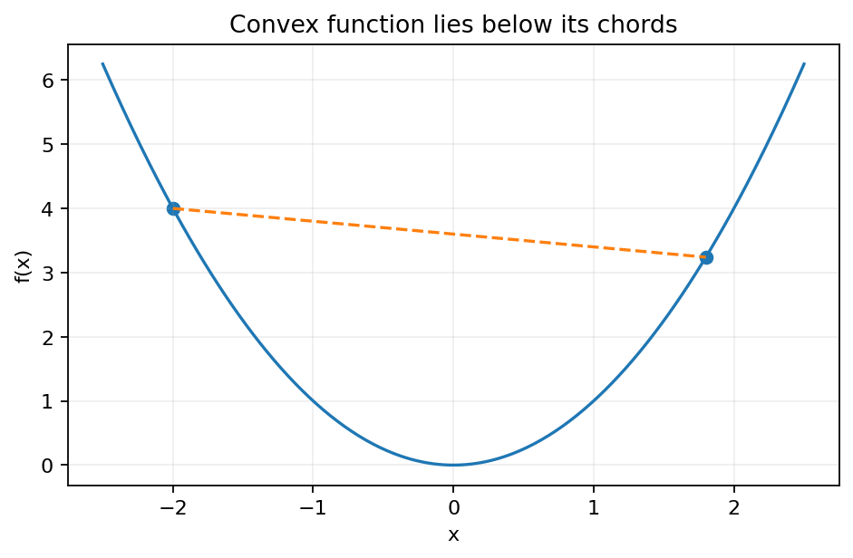
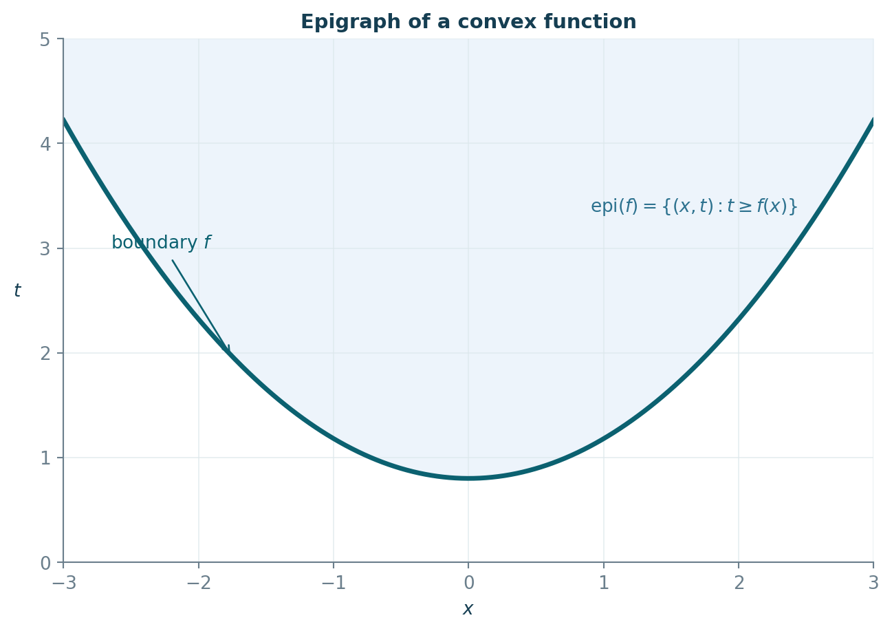
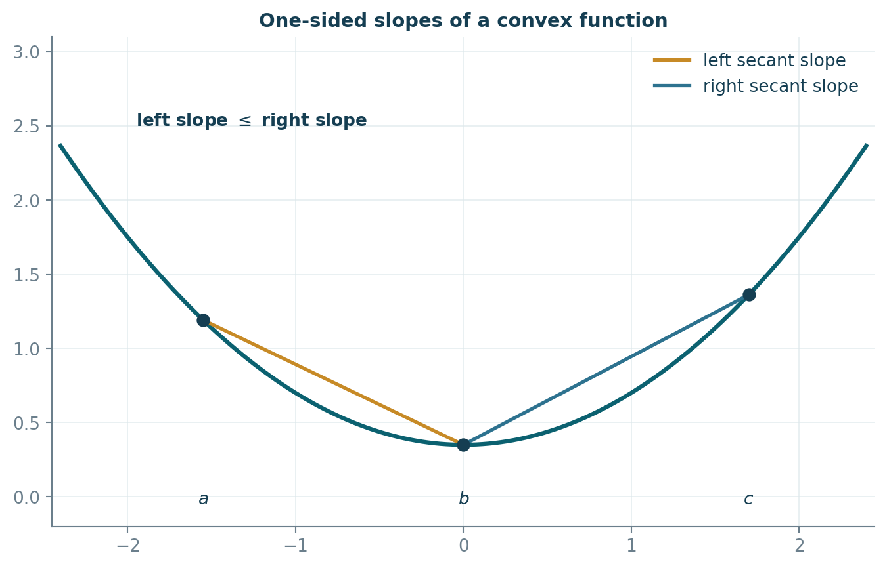
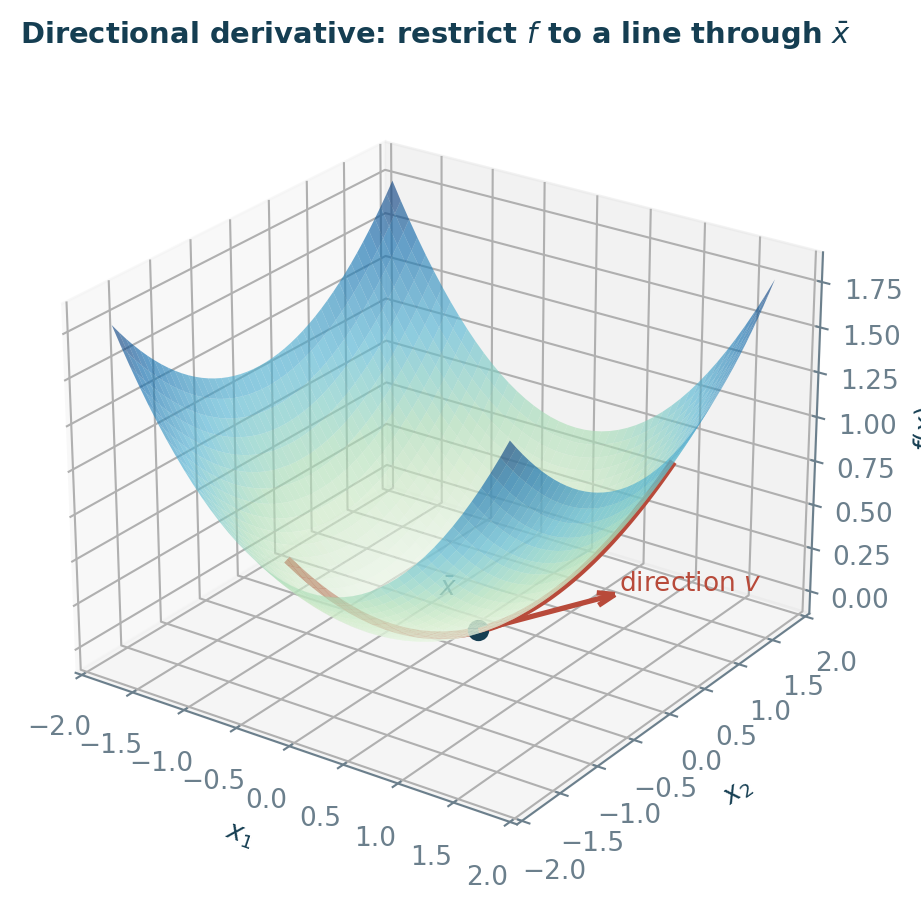
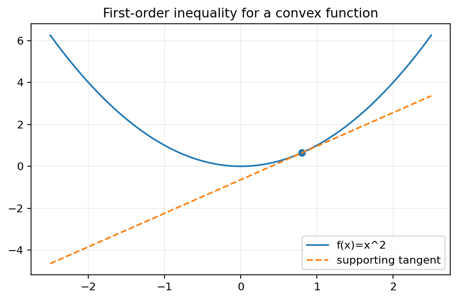
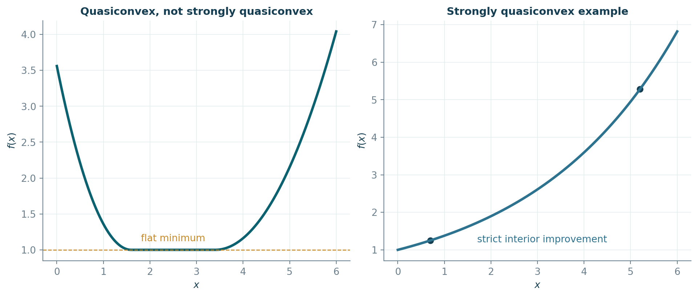
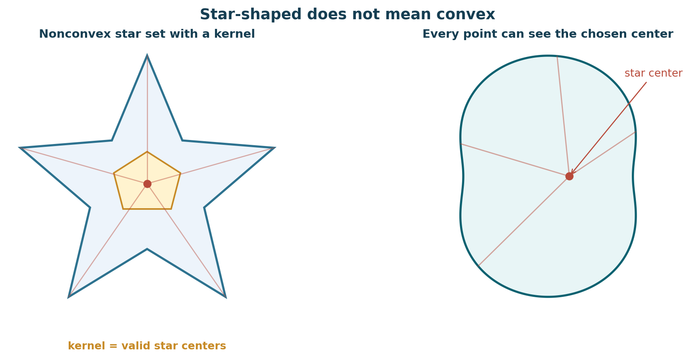

# Chapter 7 — Convex and Concave Functions（凸函数与凹函数）


***

## 0. 本章在整本书中的位置

前六章主要处理线性规划。线性规划之所以“好解”，一个深层原因是：可行域是凸集，线性函数同时是凸函数和凹函数。Chapter 7 把这个结构推广到非线性函数。

本章要建立四条主线：

1. **函数凸性**：弦位于图像上方；
2. **可微判别**：一阶切平面与二阶 Hessian 判别；
3. **凸优化的全局性**：局部极小就是全局极小；
4. **广义凸性**：quasiconvex、strongly quasiconvex、star-shaped 等。

学完本章，你应该能回答：

- 给定函数，怎样判断凸/凹、严格凸/严格凹？
- Hessian 半正定和函数凸性是什么关系？
- 为什么凸函数局部极小点不会是“假的”局部最小？
- 为什么凸函数在凸多面体上的最大值可以到极点中找？
- quasiconvex 与 convex 的区别是什么？

***

## 0.1 必要前置知识快速复习

### 凸集

集合 $K\subseteq\mathbb R^n$ 为凸集（convex set），若

$$
x,y\in K,\quad \alpha\in[0,1]
\quad\Longrightarrow\quad
\alpha x+(1-\alpha)y\in K.
$$

### 梯度

若 $f:\mathbb R^n\to\mathbb R$ 可微，

$$
\nabla f(x)=
\begin{bmatrix}
\partial f/\partial x_1\\
\vdots\\
\partial f/\partial x_n
\end{bmatrix}.
$$

方向 $d$ 上的一阶变化率是

$$
D_df(x)=\nabla f(x)^\top d.
$$

### Hessian

若 $f$ 二次连续可微，Hessian 为

$$
H_f(x)=\nabla^2f(x)
=\left[\frac{\partial^2 f}{\partial x_i\partial x_j}\right].
$$

在通常的连续二阶偏导条件下，Hessian 对称。

### 正定与半正定

对称矩阵 $A$：

- $z^\top Az>0$ 对所有 $z\ne0$：positive definite（正定）；
- $z^\top Az\ge0$：positive semidefinite（半正定）；
- $z^\top Az<0$：negative definite（负定）；
- $z^\top Az\le0$：negative semidefinite（半负定）。

***

## 1. Introduction：凸函数的基本结构
### 1.1 凸函数的定义
设 $K\subseteq\mathbb R^n$ 为凸集。函数 $f:K\to\mathbb R$ 是凸函数（convex function），若对任意 $x,y\in K$ 和 $\alpha\in[0,1]$，

$$
\boxed{
f(\alpha x+(1-\alpha)y)
\le
\alpha f(x)+(1-\alpha)f(y)
}
$$

直观上：**两点之间的弦不低于函数图像**。



读图：蓝色曲线代表函数；连接 $(x,f(x))$ 与 $(y,f(y))$ 的线段位于曲线之上。凸性不是“图像向上”这句口号，而是上述不等式。

### 1.2 凹函数
$f$ 凹（concave）当且仅当 $-f$ 凸：

$$
f(\alpha x+(1-\alpha)y)
\ge \alpha f(x)+(1-\alpha)f(y).
$$

因此很多凸函数结论可以通过把 $f$ 换成 $-f$ 得到凹函数版本。

### 1.3 严格凸与严格凹
若 $x\ne y$ 且 $\alpha\in(0,1)$ 时严格成立

$$
f(\alpha x+(1-\alpha)y)
<\alpha f(x)+(1-\alpha)f(y),
$$

则 $f$ 严格凸（strictly convex）。

严格凸的重要后果：在凸集合上，若全局极小解存在，则**至多一个**。

***

### 1.4 Jensen 型有限凸组合
由二点定义可归纳得到：若 $f$ 凸，$x_i\in K$，$\alpha_i\ge0$ 且 $\sum_i\alpha_i=1$，则

$$
\boxed{
f\!\left(\sum_{i=1}^m\alpha_i x_i\right)
\le
\sum_{i=1}^m\alpha_i f(x_i)
}
$$

这是 Jensen inequality 的有限维离散形式。

凹函数方向相反。

***

### 1.5 凸函数的常见封闭性质
#### 命题：非负加权和仍凸
若 $f_i$ 都凸且 $\lambda_i\ge0$，则

$$
g(x)=\sum_i\lambda_i f_i(x)
$$

凸。

证明直接把每个 $f_i$ 的凸性不等式乘 $\lambda_i$ 后相加。

#### 仿射复合
若 $f$ 凸，$g(x)=f(Ax+b)$，则在适当定义域上 $g$ 凸，因为

$$
A(\alpha x+(1-\alpha)y)+b
=\alpha(Ax+b)+(1-\alpha)(Ay+b).
$$

#### 上确界
若一族函数 $f_\gamma$ 都凸，则

$$
f(x)=\sup_\gamma f_\gamma(x)
$$

在有限值区域上仍凸。

***

### 1.6 二次型与凸性
二次型

$$
f(x)=x^\top Bx
$$

其中可以不失一般性地取 $B$ 对称，因为

$$
x^\top Bx=x^\top\frac{B+B^\top}{2}x.
$$

若 $B\succeq0$，则 $f$ 凸；若 $B\succ0$，则 $f$ 严格凸。

证明的核心恒等式：令 $z=\alpha x+(1-\alpha)y$，则

$$
\alpha f(x)+(1-\alpha)f(y)-f(z)
=\alpha(1-\alpha)(x-y)^\top B(x-y).
$$

若 $B\succeq0$，右侧非负。

#### Example 1：把一般二次型写成对称矩阵形式
📘 **教材 Example 1（重排公式，保留原数学内容）**

给定

$$
f(x)=x_1^2+2x_1x_2-x_1x_3+4x_2x_3-x_2^2+7x_3^2,
\qquad
x=\begin{bmatrix}x_1\\x_2\\x_3\end{bmatrix}.
$$

目标是把它写成

$$
f(x)=x^\top Bx
$$

且 $B$ 为实对称矩阵。对角项直接给出

$$
b_{11}=1,\qquad b_{22}=-1,\qquad b_{33}=7.
$$

对于交叉项，由于

$$
x^\top Bx
=\sum_i b_{ii}x_i^2+
\sum_{i<j}(b_{ij}+b_{ji})x_ix_j,
$$

而我们希望 $B=B^\top$，所以把每个交叉项的系数平均分到对称位置：

$$
2x_1x_2\Rightarrow b_{12}=b_{21}=1,
$$

$$
-x_1x_3\Rightarrow b_{13}=b_{31}=-\frac12,
$$

$$
4x_2x_3\Rightarrow b_{23}=b_{32}=2.
$$

因此

$$
\boxed{
B=
\begin{bmatrix}
1 & 1 & -\frac12\\
1 & -1 & 2\\
-\frac12 & 2 & 7
\end{bmatrix}
}
$$

并且逐项展开确实得到原来的 $f(x)$。

💡 **为什么教材要在这里做这件事？**

后面判断二次函数的凸性时，真正决定曲率的是对称矩阵。即使一开始写成某个不对称矩阵 $A$，也总有

$$
x^\top A x
=x^\top\frac{A+A^\top}{2}x.
$$

所以研究二次型时可以不失一般性地只研究对称矩阵。

**易错点：** 不能把交叉项系数全部塞到一个非对角元素后，又直接把那个非对称矩阵拿去做正定性判别；应先取对称部分。
***

### 1.7 Level set、epigraph 与 hypograph
#### 下水平集（sublevel set）
$$
\operatorname{Lev}_\lambda f
=\{x\in K:f(x)\le\lambda\}.
$$

若 $f$ 凸，则每个下水平集凸。

#### 上图集（epigraph）
$$
\operatorname{epi}(f)
=\{(x,t):x\in K,\ t\ge f(x)\}.
$$

关键结论：

$$
\boxed{f\text{ 凸}\iff \operatorname{epi}(f)\text{ 凸}}
$$

证明：把 epigraph 中两点做凸组合，第二坐标的凸组合恰好给出凸性不等式。



> 原创重绘把函数图像与其上方区域 $\operatorname{epi}(f)$ 画在同一坐标系中。对凸函数，整个 epigraph 是凸集；这一几何事实正对应上面的等价命题。

凹函数对应 hypograph：

$$
\operatorname{hyp}(f)=\{(x,t):t\le f(x)\}.
$$

***

## 2. Convex Functions of One Real Variable
### 2.1 单侧导数
对一元函数，右导数与左导数分别是

$$
f'_+(x_0)=\lim_{h\downarrow0}\frac{f(x_0+h)-f(x_0)}h,
$$

$$
f'_-(x_0)=\lim_{h\uparrow0}\frac{f(x_0+h)-f(x_0)}h.
$$

凸函数在区间内部不必处处可微，例如 $|x|$ 在 0 不可微；但左右导数存在，并满足

$$
f'_-(x_0)\le f'_+(x_0).
$$

### 2.2 割线斜率单调性
若 $a<b<c$ 且 $f$ 凸，则

$$
\frac{f(b)-f(a)}{b-a}
\le
\frac{f(c)-f(a)}{c-a}
\le
\frac{f(c)-f(b)}{c-b}.
$$

这条斜率链是理解一元凸函数几乎所有性质的核心。



> 原创重绘用同一凸曲线上的 $a<b<c$ 三点和弦展示割线斜率的次序关系；令端点逐渐逼近即可得到左、右导数的夹逼关系。

### 2.3 Proposition 7：连续性与单侧导数
教材命题指出：凸函数在区间内部的左右导数存在，并且在内部连续。

要注意：**凸函数可能在定义域边界不连续**；连续性结论需要“内部点”。

### 2.4 Proposition 8：二阶导判别
若 $f$ 在区间 $I$ 上二次连续可微，则

$$
\boxed{f\text{ 凸}\iff f''(x)\ge0\quad\forall x\in I}
$$

类似地：

- $f''(x)>0$ 对所有点成立 $\Rightarrow$ 严格凸；
- $f''(x)\le0$ $\Rightarrow$ 凹；
- $f''(x)<0$ $\Rightarrow$ 严格凹。

但反向“严格凸 $\Rightarrow f''>0$ everywhere”不成立，例如 $f(x)=x^4$ 严格凸，而 $f''(0)=0$。

***

## 3. Some Topics from Calculus：本章需要的微积分工具
教材在本节集中复习方向导数、梯度、Hessian、Taylor 展开与 chain rule。这些工具会直接进入 Chapter 8。

### 3.1 方向导数
沿方向 $v$：

$$
D_vf(x)=\lim_{t\to0}\frac{f(x+tv)-f(x)}t.
$$

可微时

$$
D_vf(x)=\nabla f(x)^\top v.
$$



> 可以把方向导数理解成：在点 $x$ 处沿方向 $v$ 做一维切片 $\varphi(t)=f(x+tv)$，再看 $\varphi'(0)$；图中同时给出平面中的方向向量与对应的一维截线。

### 3.2 Taylor 二阶展开
若 $f$ 二次连续可微，则对 $x,\bar x$，存在 $\theta\in(0,1)$ 使

$$
f(x)=f(\bar x)+\nabla f(\bar x)^\top(x-\bar x)
+\frac12(x-\bar x)^\top H_f(\bar x+\theta(x-\bar x))(x-\bar x).
$$

局部近似形式：

$$
f(x)=f(\bar x)+\nabla f(\bar x)^\top d+
\frac12d^\top H_f(\bar x)d+o(\|d\|^2),\quad d=x-\bar x.
$$

这解释了为什么梯度决定一阶变化、Hessian 决定二阶曲率。

***

## 4. Convex Functions of Several Variables
### 4.1 Proposition 9：一阶切平面判别
若 $K$ 为开凸集、$f$ 可微，则

$$
\boxed{
f\text{ 凸}
\iff
f(x)\ge f(y)+\nabla f(y)^\top(x-y),\quad\forall x,y\in K
}
$$

直观上：**凸函数的任意切平面都在图像下方。**



这条结论比定义更适合做最优性判断。

### 4.2 Proposition 10：Hessian 判别
若 $f$ 在开凸集 $K$ 上二次连续可微，则

$$
\boxed{f\text{ 凸}\iff H_f(x)\succeq0,\quad\forall x\in K.}
$$

严格版：若 $H_f(x)\succ0$ 对所有 $x\in K$，则 $f$ 严格凸。

#### 为什么成立？
取任意直线 $x=y+\lambda z$，定义

$$
g(\lambda)=f(y+\lambda z).
$$

则

$$
g''(\lambda)=z^\top H_f(y+\lambda z)z.
$$

多元凸性被降成了“沿每条直线都是一元凸函数”。

#### Example 2：用 Hessian 找凸域
📘 **教材 Example 2** 考察

$$
f(x)=x_1^3+x_2^2+x_3,
\qquad x\in\mathbb R^3.
$$

梯度为

$$
\nabla f(x)=
\begin{bmatrix}
3x_1^2\\
2x_2\\
1
\end{bmatrix},
$$

Hessian 为

$$
H_f(x)=
\begin{bmatrix}
6x_1&0&0\\
0&2&0\\
0&0&0
\end{bmatrix}.
$$

任取 $z=(z_1,z_2,z_3)^\top$，有

$$
z^\top H_f(x)z
=6x_1z_1^2+2z_2^2.
$$

因此：

- 当 $x_1\ge0$ 时，对任意 $z$ 都有 $z^\top H_f(x)z\ge0$；
- 当 $x_1<0$ 时，只要取 $z=(1,0,0)^\top$，便得到 $6x_1<0$。

所以教材得到的最大自然凸域之一是

$$
\boxed{K=\{x\in\mathbb R^3:x_1\ge0\},}
$$

且 $f$ 在 $K$ 上凸。

注意 Hessian 含有一个恒为 0 的特征方向，因此不能由这个判据推出严格凸。
### 4.3 Proposition 11：Sylvester criterion
对称矩阵 $A$ 正定当且仅当所有顺序主子式均正：

$$
\Delta_1>0,\Delta_2>0,\ldots,\Delta_n>0.
$$

也等价于所有特征值正。

负定时顺序主子式符号交替：

$$
\Delta_1<0,\quad\Delta_2>0,\quad\Delta_3<0,\ldots
$$

#### Example 3：用顺序主子式证明严格凸
📘 教材考虑

$$
f(x)=x_1^2+2x_2^2+x_3^2+3x_1-x_2+6x_3+x_2x_3-9,
$$

其中 $x=(x_1,x_2,x_3)^\top$。其 Hessian 是常矩阵

$$
H_f=
\begin{bmatrix}
2&0&0\\
0&4&1\\
0&1&2
\end{bmatrix}.
$$

用 Sylvester criterion 检查顺序主子式：

$$
\Delta_1=2>0,
$$

$$
\Delta_2=
\begin{vmatrix}
2&0\\
0&4
\end{vmatrix}=8>0,
$$

$$
\Delta_3=
\det
\begin{bmatrix}
2&0&0\\
0&4&1\\
0&1&2
\end{bmatrix}
=2(8-1)=14>0.
$$

因此

$$
H_f\succ0,
$$

从而

$$
\boxed{f\text{ 在 }\mathbb R^3\text{ 上严格凸。}}
$$

💡 **学习要点：** Hessian 为常矩阵的二次函数特别适合用主子式一次性判断全域凸性；无需逐点重复计算。
***

## 5. Optimization of Convex Functions
### 5.1 Theorem 1：局部极小就是全局极小
设 $f:X\to\mathbb R$ 凸，$X$ 凸。若 $\bar x$ 是相对/局部最小点，则 $\bar x$ 是全局最小点。

#### 证明导航
假设存在 $y\in X$ 使 $f(y)<f(\bar x)$。沿线段

$$
x_\alpha=(1-\alpha)\bar x+\alpha y
$$

当 $\alpha$ 很小时，$x_\alpha$ 任意接近 $\bar x$。凸性给

$$
f(x_\alpha)\le(1-\alpha)f(\bar x)+\alpha f(y)<f(\bar x),
$$

与局部最小矛盾。

严格凸时，全局极小若存在则唯一。

#### Example 4：局部极小如何自动升级为全局极小
📘 教材求解

$$
\min_{x\in\mathbb R} f(x),
\qquad
f(x)=e^{x^2}.
$$

先求导：

$$
f'(x)=2xe^{x^2},
$$

$$
f''(x)=2e^{x^2}+4x^2e^{x^2}
=2e^{x^2}(1+2x^2)>0,
\qquad \forall x\in\mathbb R.
$$

所以 $f$ 在 $\mathbb R$ 上严格凸。驻点由

$$
f'(x)=0
$$

得到唯一解

$$
x^*=0.
$$

普通微积分已经告诉我们 $x=0$ 是严格局部极小点；Theorem 1 进一步告诉我们：由于 $f$ 凸，这个局部极小点必然也是全局极小点。于是

$$
\boxed{x^*=0,\qquad f^*=f(0)=1.}
$$

而严格凸性又保证这个全局极小点是唯一的。

**这道例题的真正目的**不是计算 $e^{x^2}$，而是训练一条以后反复使用的路线：

> 证明凸性 $\rightarrow$ 找驻点/局部最优 $\rightarrow$ 直接升级为全局最优。
### 5.2 Proposition 12：可微凸优化的一阶充要条件
设 $f$ 凸且连续可微，$K$ 凸。$\bar x\in K$ 是全局极小点当且仅当

$$
\boxed{
\nabla f(\bar x)^\top(x-\bar x)\ge0,
\quad\forall x\in K.
}
$$

若 $K=\mathbb R^n$，取 $x=\bar x-t\nabla f(\bar x)$，可得

$$
\nabla f(\bar x)=0.
$$

### 5.3 Theorem 2：凸函数在凸多面体上的最大值
若 $K$ 是凸多面体（convex polytope），$f$ 凸，则 $f$ 的全局最大值可在某个极点取得。

原因：每个 $x\in K$ 都是极点的凸组合；Jensen 不等式给

$$
f(x)\le\sum_i\alpha_i f(v_i)\le\max_i f(v_i).
$$

#### Example 5：凸函数在 polytope 上最大化，只需检查极点
📘 教材问题是

$$
\max\quad f(x)=2x_1^2+x_2^4
$$

满足

$$
\begin{aligned}
-x_1+2x_2&\le10,\\
5x_1+3x_2&\le41,\\
2x_1-3x_2&\le8,\\
x_1,x_2&\ge0.
\end{aligned}
$$

第一步先验证目标函数凸。梯度为

$$
\nabla f(x)=
\begin{bmatrix}
4x_1\\
4x_2^3
\end{bmatrix},
$$

Hessian 为

$$
H_f(x)=
\begin{bmatrix}
4&0\\
0&12x_2^2
\end{bmatrix}\succeq0.
$$

所以 $f$ 在 $\mathbb R^2$ 上凸。

第二步观察约束定义的是一个有界凸多面体。教材给出的极点为

$$
(7,2),\quad(4,7),\quad(4,0),\quad(0,5),\quad(0,0).
$$

Theorem 2 保证：凸函数在该 polytope 上的全局最大值至少会在某个极点达到。因此只需比较：

$$
f(7,2)=2\cdot49+16=114,
$$

$$
f(4,7)=2\cdot16+7^4=32+2401=2433,
$$

$$
f(4,0)=32,
$$

$$
f(0,5)=625,
$$

$$
f(0,0)=0.
$$

故

$$
\boxed{x^*=(4,7),\qquad f^*=2433.}
$$

💡 **为什么不能把“凸函数最大化”当成一般凸优化？**

标准凸优化通常是“最小化凸函数”或“最大化凹函数”。这里恰恰相反，因此内部可能不存在有用的一阶最优性结构；教材利用 polytope 的有限极点结构，把问题转化成极点比较。
**关键辨析：**

- 凸函数 **最小化**：局部最小是全局最小；
- 凸函数 **最大化**：一般不是凸优化，但若可行域是 polytope，可把搜索限制到极点。

***

## 6. Quasiconvex Functions and Other Generalizations
### 6.1 quasiconvex
$f$ 拟凸（quasiconvex），若

$$
f(\alpha x+(1-\alpha)y)
\le\max\{f(x),f(y)\}.
$$

它比凸性弱：凸 $\Rightarrow$ quasiconvex，但反之不成立。

### 6.2 level-set characterization（Proposition 13）
$$
\boxed{f\text{ quasiconvex}\iff
\{x:f(x)\le\lambda\}\text{ 对每个 }\lambda\text{ 都凸}.}
$$

这是一条极其重要的广义凸性判据。

### 6.3 strongly quasiconvex
当 $x\ne y$、$\alpha\in(0,1)$ 时

$$
f(\alpha x+(1-\alpha)y)<\max\{f(x),f(y)\},
$$

称 strongly quasiconvex。

严格凸 $\Rightarrow$ strongly quasiconvex $\Rightarrow$ quasiconvex。



> 左图给出“quasiconvex 但非 strongly quasiconvex”的平台型例子；右图给出 strongly quasiconvex 的对照。

### 6.4 Proposition 14：拟凸函数在 polytope 上的最大值
若 $K$ 是凸多面体，$f$ quasiconvex，则最大值可以在极点取得。证明与凸函数类似，只把 Jensen 换成

$$
f\!\left(\sum_i\alpha_i v_i\right)
\le\max_i f(v_i).
$$

### 6.5 Proposition 15：strongly quasiconvex 的局部极小全局化
若 $f$ strongly quasiconvex，在凸域上任一局部极小点都是全局极小点。

注意普通 quasiconvex 不能直接保证每个局部极小都严格全局化：可能出现平台区。

### 6.6 star-shaped set 与 convex at a point
集合 $K$ 在 $\bar x$ 处 star-shaped，若

$$
\alpha x+(1-\alpha)\bar x\in K,
\quad\forall x\in K,\alpha\in(0,1).
$$

它只要求所有点都能“看见”中心 $\bar x$，不要求任意两点连线都在集合内。



> 原创对照图给出两个**非凸但 star-shaped** 的集合：左图标出可作为 star center 的 kernel，右图展示从指定中心到集合内各点的线段均留在集合中。

若 $K$ 在 $\bar x$ star-shaped，且 $f$ 在 $\bar x$ 满足沿所有连向 $x$ 的线段凸，则 $\bar x$ 的局部极小可升级为全局极小（教材 Proposition 16）。

***

## 7. subgradient：不可微凸函数的替代梯度
💡 **学习补充（教材习题会用到）**

对凸函数 $f$，向量 $g$ 是 $f$ 在 $\bar x$ 的 subgradient，若

$$
f(x)\ge f(\bar x)+g^\top(x-\bar x),\quad\forall x.
$$

所有 subgradient 的集合为 $\partial f(\bar x)$。

若 $f$ 可微，则

$$
\partial f(\bar x)=\{\nabla f(\bar x)\}.
$$

对约束集合 $K$，$\bar x$ 为凸函数全局最小点的条件可写为：存在 $g\in\partial f(\bar x)$ 使

$$
g^\top(x-\bar x)\ge0,\quad\forall x\in K.
$$

***

## 8. 高频概念辨析
| 概念 | 核心条件 | 典型后果 |
|---|---|---|
| convex | 弦上函数值不超过端点加权值 | 局部极小=全局极小 |
| strictly convex | 对不同端点严格小于 | 全局极小至多一个 |
| concave | $-f$ convex | 局部极大=全局极大 |
| quasiconvex | 不超过端点最大值 | level set 凸 |
| strongly quasiconvex | 对不同点严格低于端点最大值 | 局部极小全局化 |
| affine | 同时 convex 与 concave | $f(x)=c^\top x+b$ |

***

## 9. 易错点
1. **定义域必须是凸的**，否则“函数在该集合上凸”的标准定义没有完整意义。
2. $H\succeq0$ 是凸性判据；$H\succ0$ 是严格凸的充分条件，但不是必要条件。
3. “凸函数最大值在极点”需要可行域为凸多面体/紧凸包等合适条件；不能对任意无界凸集机械使用。
4. convex 与 quasiconvex 不同：后者只控制 level sets。
5. 局部极小=全局极小需要“凸函数 + 凸可行域”。
6. 对凹函数做最大化时，把符号全部反过来即可。

***

## 10. 本章知识地图
```text
convex set
   |
   +--> convex function definition
   |      +--> Jensen finite combination
   |      +--> epigraph convex
   |      +--> level sets convex
   |
   +--> differentiable convexity
   |      +--> first-order supporting inequality
   |      +--> Hessian PSD test
   |      +--> Sylvester criterion
   |
   +--> optimization
   |      +--> local min = global min
   |      +--> gradient variational inequality
   |      +--> maximum over polytope -> extreme points
   |
   +--> generalized convexity
          +--> quasiconvex
          +--> strongly quasiconvex
          +--> star-shaped / convex-at-point
```

***

## 11. 一页速记
$$
f(\alpha x+(1-\alpha)y)\le\alpha f(x)+(1-\alpha)f(y)
$$

$$
f\text{ convex and differentiable}
\iff
f(x)\ge f(y)+\nabla f(y)^\top(x-y)
$$

$$
f\in C^2:\quad f\text{ convex}\iff H_f(x)\succeq0
$$

$$
\bar x\text{ minimizes convex }f\text{ on convex }K
\iff
\nabla f(\bar x)^\top(x-\bar x)\ge0\quad\forall x\in K
$$

$$
f\text{ quasiconvex}\iff \operatorname{Lev}_\lambda f\text{ convex for all }\lambda.
$$

***

## 12. 自测
1. 为什么 $x^4$ 能严格凸但在 $x=0$ 时 Hessian（即二阶导）为零？
2. 若 $f$ 凸且 $\nabla f(x^*)=0$，为什么 $x^*$ 是全局最小点？
3. convex 与 quasiconvex 的 level-set 性质有什么关系？
4. 为什么正定 Hessian 比半正定 Hessian 给出更强结论？
5. 在凸多边形上最大化凸函数，为什么只需比较极点？

答案：1）严格凸不要求二阶导处处严格正；$x^4$ 的弦不等式仍严格。2）用一阶支撑不等式。3）凸必拟凸，拟凸恰等价于所有下水平集凸。4）正定排除了非零方向零曲率。5）任一点是极点凸组合，Jensen 给函数值不超过极点值最大者。
