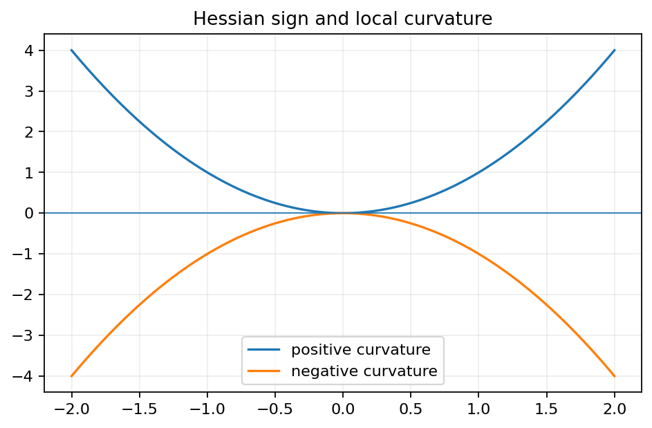
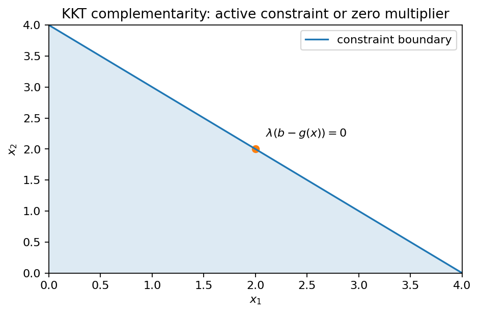
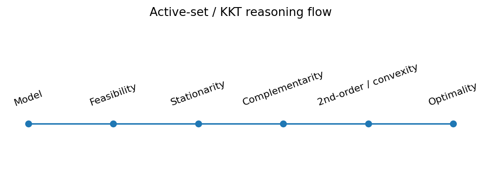

# Chapter 8 — Optimality Conditions（最优性条件）

***

## 0. 为什么需要最优性条件
线性规划中，单纯形法给出一套明确的“最优表检验”。非线性规划没有统一的表格，因此我们需要回答：

1. 一个候选点要成为局部极值，**必须**满足什么？（necessary conditions）
2. 满足什么更强条件就**足以**保证极值？（sufficient conditions）
3. 有约束时如何把“可行方向”写进一阶条件？
4. Lagrange multipliers、Kuhn–Tucker（KKT）条件从哪里来？
5. 为什么凸/凹结构能把 KKT 从“必要”升级为“充要”？

本章的最终目标是理解：

$$
\boxed{
\text{stationarity + primal feasibility + dual feasibility + complementary slackness}
}
$$

以及它与 Chapter 4 complementary slackness/LCP 的统一关系。

***

## 1. Unconstrained Problems（无约束问题）
考虑 $f:\mathbb R^n\to\mathbb R$。

### 1.1 一阶必要条件
若 $x^*$ 是内部局部极大或极小点且 $f$ 可微，则

$$
\boxed{\nabla f(x^*)=0.}
$$

理由：任意方向 $v$ 都可正负小幅移动。令 $\phi(t)=f(x^*+tv)$，$t=0$ 是一元局部极值，所以

$$
0=\phi'(0)=\nabla f(x^*)^Tv.
$$

对所有 $v$ 成立只能推出梯度为零。

### 1.2 二阶必要条件
若 $f\in C^2$，局部极大点还必须满足

$$
H_f(x^*)\preceq0;
$$

局部极小点必须满足

$$
H_f(x^*)\succeq0.
$$

这是沿每个方向做一元 Taylor 展开的结果：

$$
f(x^*+tv)-f(x^*)
=t\nabla f(x^*)^Tv+\frac12t^2v^TH_f(x^*)v+o(t^2).
$$

一阶项为零后，二阶项决定局部弯曲方向。

### 1.3 Theorem 1 / 2
教材 Theorem 1：局部最大的必要条件为

$$\nabla f(x^*)=0,\qquad H_f(x^*)\preceq0.$$

Theorem 2：若

$$\nabla f(x^*)=0,\qquad H_f(x^*)\prec0,$$

则 $x^*$ 是严格局部最大点。

对应最小化：

$$\nabla f(x^*)=0,\ H_f(x^*)\succ0\Rightarrow\text{严格局部最小}.$$

#### 不能忽略的灰区
若 Hessian 仅半正定/半负定，结论可能不确定。例如 $f(x)=x^4$ 在 0 是严格最小，但 $f''(0)=0$；而 $f(x)=x^3$ 在 0 也有 $f'(0)=f''(0)=0$，却不是极值。

#### Example 1：驻点不等于极值点
📘 **教材 Example 1** 考察

$$
f(x_1,x_2)=3x_1^3+x_2^2-9x_1+4x_2.
$$

先求梯度：

$$
\nabla f=
\begin{bmatrix}
9x_1^2-9\\
2x_2+4
\end{bmatrix}.
$$

驻点满足

$$
x_1=\pm1,\qquad x_2=-2.
$$

Hessian 为

$$
H(x)=
\begin{bmatrix}
18x_1&0\\
0&2
\end{bmatrix}.
$$

在 $(1,-2)$：

$$
H(1,-2)=
\begin{bmatrix}18&0\\0&2\end{bmatrix}\succ0,
$$

所以

$$
\boxed{(1,-2)\text{ 是严格局部极小点}.}
$$

在 $(-1,-2)$：

$$
H(-1,-2)=
\begin{bmatrix}-18&0\\0&2\end{bmatrix},
$$

Hessian 不定，因此不是局部最大或局部最小。

> **小白要点**：$\nabla f=0$ 只产生“候选点”；真正分类还需要二阶信息或其他分析。

***

## 2. Nonnegative Variables（非负变量约束）
考虑

$$
\max f(x)\quad\text{s.t. }x\ge0.
$$

这里边界点不能向所有方向移动。例如若 $x_i^*=0$，只能在该坐标向正方向进入可行域。

### 2.1 一阶必要条件
对最大化，教材 Proposition 1 的核心可以写成

$$
\boxed{
\nabla f(x^*)\le0,\qquad
\nabla f(x^*)^Tx^*=0,
\qquad x^*\ge0.
}
$$

逐分量就是：

$$
\frac{\partial f}{\partial x_i}(x^*)\le0,
\qquad
x_i^*\frac{\partial f}{\partial x_i}(x^*)=0.
$$

解释：

- 若 $x_i^*>0$，可以向正负方向微调，因此偏导必须为 0；
- 若 $x_i^*=0$，只能向正方向移动。若偏导 $>0$，增加 $x_i$ 会提高目标，故不可能是最大点；因此偏导 $\le0$。

最小化时方向反转：

$$
\nabla f(x^*)\ge0,\quad \nabla f(x^*)^Tx^*=0.
$$

### 2.2 complementarity 的雏形
对每个分量，最优性条件包含

$$
x_i^*\ge0,
\qquad
\frac{\partial f}{\partial x_i}(x^*)\le0,
\qquad
x_i^*\frac{\partial f}{\partial x_i}(x^*)=0.
$$

这意味着每对“变量—边际收益”至少有一个为 0，和 Chapter 4 的 complementary slackness 完全同型。

#### Example 2：非负变量边界上的互补条件
📘 **教材真正的 Example 2** 是

$$
\max_{x\ge0}
f(x)=
-3x_1^2-x_2^2-x_3^2
+2x_1x_2+2x_1x_3+2x_1+7.
$$

梯度为

$$
\nabla f=
\begin{bmatrix}
-6x_1+2x_2+2x_3+2\\
-2x_2+2x_1\\
-2x_3+2x_1
\end{bmatrix}.
$$

最大化且 $x\ge0$ 的必要条件是

$$
\nabla f(x^*)\le0,
\qquad
x_i^*\frac{\partial f}{\partial x_i}(x^*)=0.
$$

从后两个互补式：

$$
x_2(-2x_2+2x_1)=0,
\qquad
x_3(-2x_3+2x_1)=0.
$$

若 $x_2=0$，结合 $-2x_2+2x_1\le0$ 得 $x_1=0$，再与第一偏导的符号条件冲突；因此 $x_2>0$，故 $x_2=x_1$。同理可排除 $x_3=0$，得到

$$
x_1=x_2=x_3.
$$

再由第一互补条件可得非零候选

$$
\boxed{x^*=(1,1,1).}
$$

Hessian 为常矩阵

$$
H=
\begin{bmatrix}
-6&2&2\\
2&-2&0\\
2&0&-2
\end{bmatrix}.
$$

它负定，因此 $f$ 严格凹；于是这个局部最大点自动是唯一全局最大点：

$$
\boxed{f(1,1,1)=8.}
$$

这个例子非常重要：它把 Chapter 7 的“凹函数全局性”和本章的“边界互补条件”真正接起来了。

***

## 3. Equality Constraints（等式约束）
考虑

$$
\max f(x)\quad\text{s.t. }g(x)=b,
$$

其中 $g:\mathbb R^n\to\mathbb R^m$，$m<n$。

### 3.1 可行曲面的切空间
在 $x^*$ 附近，若 Jacobian

$$
J_g(x^*)=\frac{\partial g}{\partial x}(x^*)
$$

满行秩 $m$，那么可行集合局部是一张 $(n-m)$ 维光滑曲面。

可行切方向 $d$ 满足

$$
J_g(x^*)d=0.
$$

若 $x^*$ 为局部极值，一阶变化必须沿所有可行切方向为零：

$$
\nabla f(x^*)^Td=0\quad\forall d\in\ker J_g(x^*).
$$

这等价于 $\nabla f(x^*)$ 属于 $J_g(x^*)$ 行空间，所以存在 $\lambda^*$ 使

$$
\nabla f(x^*)=J_g(x^*)^T\lambda^*.
$$

### 3.2 Lagrangian
教材定义

$$
L(x,\lambda)=f(x)+\lambda^T(b-g(x)).
$$

一阶必要条件：

$$
\boxed{
\nabla_xL(x^*,\lambda^*)=0,
\qquad
\nabla_\lambda L(x^*,\lambda^*)=b-g(x^*)=0.
}
$$

这就是 Lagrange multiplier method 的矩阵形式。

### 3.3 multiplier 的敏感性解释
教材指出，在正则条件下，$\lambda_i$ 可解释为最优值对 RHS $b_i$ 的边际变化率：

$$
\lambda_i^*=\frac{\partial f^*}{\partial b_i}.
$$

因此它与线性规划 dual/shadow price 是同一个思想在非线性问题中的推广。

#### 💡 学习例题：圆上的乘积极值（对应等式约束类型）
教材：

$$
\max/\min\ 2x_1x_2
\quad\text{s.t. }x_1^2+x_2^2=1.
$$

令

$$
L=2x_1x_2+\lambda(1-x_1^2-x_2^2).
$$

stationarity：

$$
2x_2-2\lambda x_1=0,
\qquad
2x_1-2\lambda x_2=0.
$$

非零可行点迫使 $\lambda=\pm1$。

- $\lambda=1\Rightarrow x_1=x_2=\pm1/\sqrt2$，目标值 1（最大）；
- $\lambda=-1\Rightarrow x_1=-x_2=\pm1/\sqrt2$，目标值 -1（最小）。

***

## 4. Nonnegative Variables and Equality Constraints
考虑

$$
\max f(x)
\quad\text{s.t. }g(x)=b,\ x\ge0.
$$

Lagrangian 仍是

$$L(x,\lambda)=f(x)+\lambda^T(b-g(x)).$$

Theorem 4 的 KKT 型必要条件：

$$
\boxed{
\nabla_xL(x^*,\lambda^*)\le0,
\quad
x^{*T}\nabla_xL(x^*,\lambda^*)=0,
\quad
g(x^*)=b,
\quad x^*\ge0.
}
$$

逐坐标解释与 Section 2 完全相同，只不过“边际收益”已扣除了等式约束的 multiplier 影响。

***

## 5. Nonnegative Variables and Inequality Constraints
考虑教材 Problem (19)：

$$
\max f(x)
\quad\text{s.t. }g(x)\le b,
\quad x\ge0.
$$

定义 slack

$$s=b-g(x)\ge0.$$

把不等式改成等式 $g(x)+s=b$，对 $s$ 应用非负变量条件，即得到 multiplier $\lambda\ge0$ 及 complementarity。

### 5.1 Theorem 5：KKT 必要条件
设

$$
L(x,\lambda)=f(x)+\lambda^T(b-g(x)).
$$

在教材的正则条件（Jacobian 满秩等）下，局部最大点存在 $\lambda^*\ge0$ 满足

$$
\boxed{
\begin{aligned}
&\nabla_xL(x^*,\lambda^*)\le0,\\
&x^{*T}\nabla_xL(x^*,\lambda^*)=0,\\
&b-g(x^*)\ge0,\\
&\lambda^{*T}[b-g(x^*)]=0,\\
&x^*\ge0,\quad\lambda^*\ge0.
\end{aligned}}
$$

这五组条件分别是：

1. stationarity/sign condition；
2. variable complementarity；
3. primal feasibility；
4. constraint complementary slackness；
5. nonnegativity/dual feasibility。

### 5.2 active constraint
若

$$g_i(x^*)=b_i,$$

称第 $i$ 个约束 active（紧约束）。

互补条件

$$\lambda_i^*[b_i-g_i(x^*)]=0$$

说明：

- 非 active（有松弛）$\Rightarrow\lambda_i^*=0$；
- $\lambda_i^*>0$ $\Rightarrow$ 该约束一定 active。

反向“active $\Rightarrow\lambda_i>0$”不一定成立。

#### 💡 学习例题：KKT active-set 分情况套路
对“二次目标 + 线性不等式 + $x\ge0$”问题，最稳妥的手算策略是完整列出 KKT 条件，再按变量是否为零、约束是否 active 分情况求候选点。这里是为了训练 KKT 计算流程，并非教材另一个编号 Example。

***

## 6. The Kuhn–Tucker Theorem
### 6.1 saddle point formulation
考虑

$$
\max f(x)\quad\text{s.t. }g(x)\le b,\ x\ge0.
$$

Lagrangian

$$L(x,\lambda)=f(x)+\lambda^T(b-g(x)),\quad\lambda\ge0.$$

若 $(x^*,\lambda^*)$ 满足

$$
\boxed{
L(x,\lambda^*)\le L(x^*,\lambda^*)\le L(x^*,\lambda)
}
$$

对所有 $x\ge0,\lambda\ge0$ 成立，则称 saddle point（鞍点）。

左边：固定 multiplier，$x^*$ 最大化 Lagrangian。  
右边：固定 $x^*$，$\lambda^*$ 最小化 penalty/constraint part。

### 6.2 Theorem 6：Kuhn–Tucker saddle theorem
教材结论可分两方向：

#### saddle point $\Rightarrow$ primal optimal
这一方向不需要凸性。鞍点右侧保证 $x^*$ 可行与 complementary slackness；左侧对任意可行 $x$ 给

$$
f(x)\le L(x,\lambda^*)\le L(x^*,\lambda^*)=f(x^*).
$$

所以 $x^*$ 最优。

#### primal optimal $\Rightarrow$ saddle point
需要结构条件：

- $f$ concave；
- 每个 $g_i$ convex；
- 存在严格可行点 $\bar x\ge0$ 使 $g(\bar x)<b$（Slater 型 constraint qualification）。

此时存在 $\lambda^*\ge0$ 使 $(x^*,\lambda^*)$ 成为鞍点。

### 6.3 constraint qualification 为什么必要
KKT multiplier 的存在不是无条件的。如果可行边界在最优点“尖锐退化”、约束梯度退化，可能最优点存在但找不到满足标准 KKT 的 multiplier。Exercise 8.26 就专门给反例。

### 6.4 Theorem 7：凸/凹问题下 KKT 变成充要条件
对教材的 concave maximization：

- $f$ concave；
- $g_i$ convex；
- Slater 条件；

那么 KKT 条件既必要又充分。

这就是现代“凸优化为什么好解”的核心：

$$
\boxed{\text{KKT candidate = global optimum}}
$$

而不是一般非凸问题中仅是局部候选。

***

## 7. Quadratic Programming 与 LCP
教材 Theorem 8 考虑

$$
\max\ c^Tx+\frac12x^TBx
\quad\text{s.t. }Ax\le b,\ x\ge0,
$$

$B$ 对称。

Lagrangian：

$$L=c^Tx+\frac12x^TBx+\lambda^T(b-Ax).$$

KKT：

$$c+Bx-A^T\lambda\le0,
$$

令 stationarity slack $u\ge0$：

$$c+Bx-A^T\lambda+u=0.
$$

primal slack $v\ge0$：

$$b-Ax-v=0.
$$

互补：

$$u^Tx=0,\qquad v^T\lambda=0.
$$

把两组方程堆叠：

$$
\begin{bmatrix}u\\v\end{bmatrix}
-
\begin{bmatrix}-B&A^T\\-A&0\end{bmatrix}
\begin{bmatrix}x\\\lambda\end{bmatrix}
=
\begin{bmatrix}c\\b\end{bmatrix},
$$

再加两组向量非负与互补，即得到 LCP。

若 $B\preceq0$，目标 concave，线性约束 convex，因此 KKT 充分，解 LCP 就得到全局最优。

这把 Chapter 4 的 Lemke algorithm 与 nonlinear quadratic programming 连了起来。

***

## 8. KKT 符号总表
本教材本章主要以“最大化 + $g(x)\le b$ + $x\ge0$”写法为主。为了不混淆，建议固定记忆：

$$L=f+\lambda^T(b-g),\quad\lambda\ge0.$$

于是最大化时

$$\nabla_xL\le0,\quad x\ge0,\quad x_i(\nabla_xL)_i=0.$$

现代教材常把最小化写成 $g(x)\le0$，Lagrangian 用 $f+\lambda g$；那时 stationarity 是等式（若变量 unrestricted）且 multiplier 仍 $\lambda\ge0$。**不要跨约定机械背符号。**

***

## 9. KKT 手算流程
1. **统一问题方向与约束方向**；
2. 写 $L$；
3. 写 primal feasibility；
4. 写 dual sign；
5. 写 stationarity/变量边界条件；
6. 写 complementary slackness；
7. 猜 active set（哪些变量为 0、哪些约束紧）；
8. 解对应方程；
9. 回代检查所有符号与不等式；
10. 若问题有 concavity/convexity + CQ，再判断全局最优。

***

## 10. 易错点
1. $\nabla f=0$ 只适用于无约束内部点；有边界时梯度不必为 0。
2. 二阶必要条件半定不等于充分；正/负定才给常用充分条件。
3. multiplier 符号取决于“最大/最小 + 约束方向 + Lagrangian 定义”。
4. complementary slackness 是乘积为 0，不是“两者都为 0”。
5. active constraint 的 multiplier 可以等于 0（weakly active）。
6. KKT 在一般非凸问题中只是候选条件；需要 concavity/convexity 与 CQ 才能直接推出全局最优。
7. Equality multiplier 通常 unrestricted；inequality multiplier 才有符号要求。

***

## 11. 一页速记
无约束：

$$\nabla f(x^*)=0.$$

局部最小二阶必要：$H\succeq0$；严格充分：$H\succ0$。  
局部最大二阶必要：$H\preceq0$；严格充分：$H\prec0$。

等式约束：

$$\nabla_xL=0,\qquad g(x)=b.$$

教材最大化不等式模型：

$$
\nabla_xL\le0,
\quad x^T\nabla_xL=0,
\quad b-g(x)\ge0,
\quad \lambda^T(b-g(x))=0,
\quad x,\lambda\ge0.
$$

凸/凹 + CQ：KKT 是 global optimality 的充要条件。

***

## 12. 自测
1. 为什么边界最优点梯度不一定为零？
2. $H\succeq0$ 为什么不能保证严格局部最小？
3. equality multiplier 为什么没有非负限制？
4. KKT 的四个经典词分别是什么？
5. Slater 条件在本章证明中起什么作用？

简答：1）不可沿所有方向移动。2）可能存在零曲率高阶项。3）等式的松弛没有单侧方向。4）stationarity、primal feasibility、dual feasibility、complementary slackness。5）保证分离/乘子存在，排除退化约束几何。
