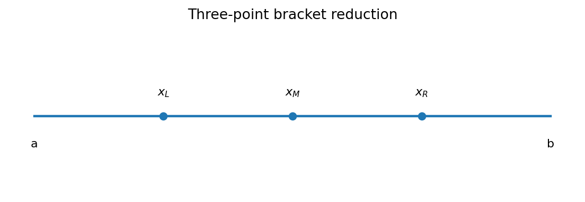
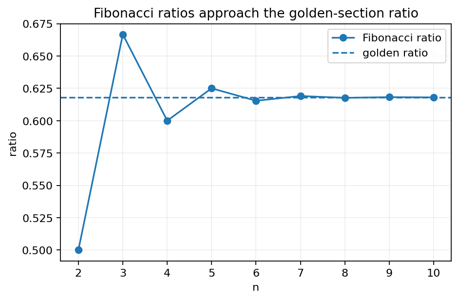
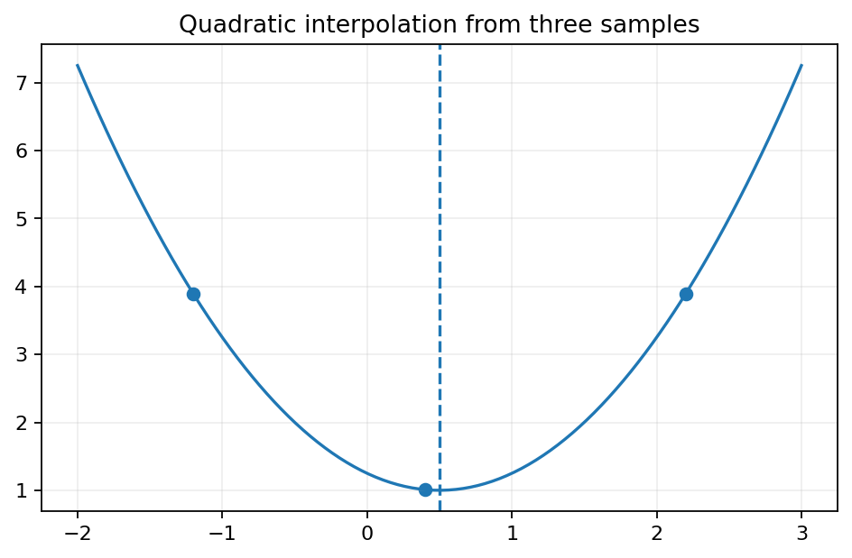
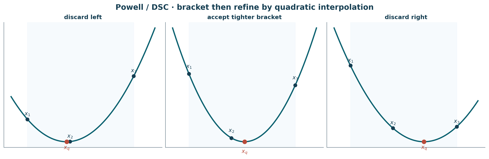
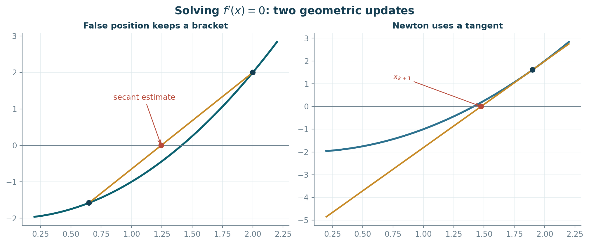
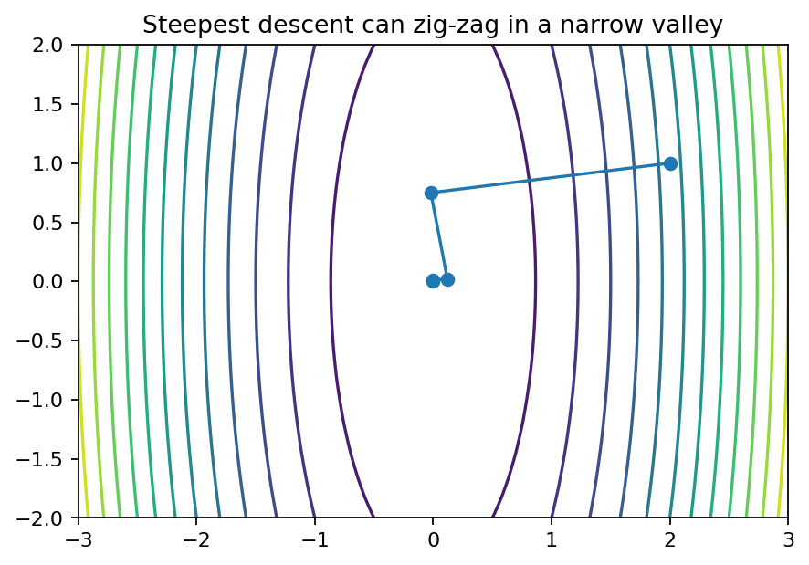
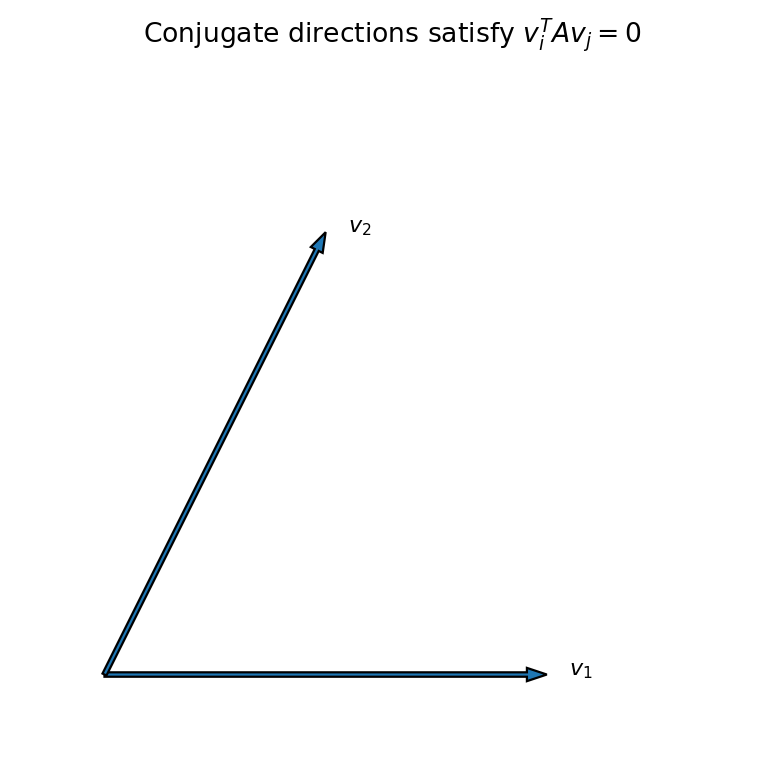
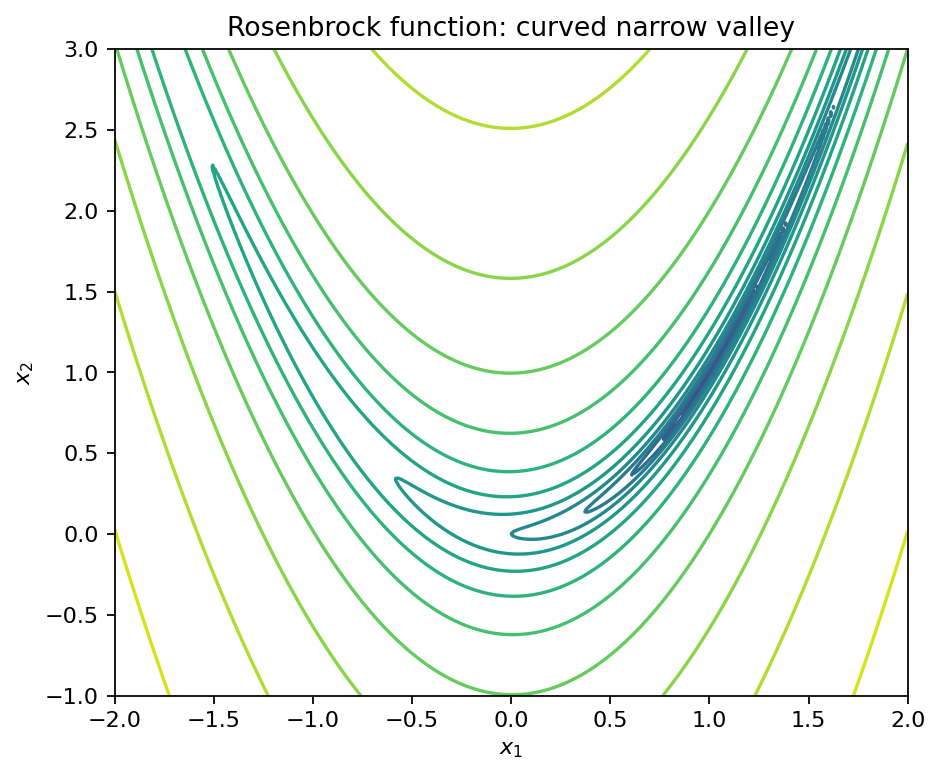

# 第 9 章：无约束优化的搜索技术（Search Techniques for Unconstrained Optimization）

> **学习目标**：只看本章笔记即可理解教材 Chapter 9 的核心思想、算法步骤、收敛直觉和计算方法。本章是“把理论最优性条件变成数值算法”的桥梁。教材本身也强调第 9、10 章非常适合用程序实现，因此这里同时给出手算逻辑与现代伪代码。

***

## 0. 本章知识地图

本章算法可分成两层：

1. **一维线搜索（line search）**：给定区间或方向，寻找一维函数最小/最大点。
2. **多维搜索（multidimensional search）**：不断选择方向，再用一维线搜索确定步长。

教材的主要路线是：

$$
\text{equal interval}
\to \text{Fibonacci / golden section}
\to \text{curve fitting}
\to \text{false position / Newton}
\to \text{steepest descent}
\to \text{conjugate gradient}
\to \text{Fletcher--Reeves}
\to \text{Newton / DFP}.
$$

***

## 1. 一维线搜索的基本问题

给定连续函数 $f:[a,b]\to\mathbb R$，希望求

$$
\min_{x\in[a,b]}f(x)
$$

或最大值。许多无需导数的区间缩减方法依赖 **unimodal（单峰/单谷）** 假设。

### 1.1 单峰函数 unimodal function

最小化情形可理解为：存在 $x^*$，使函数在 $x^*$ 左侧不增、右侧不减；严格版本则左侧严格减、右侧严格增。这样比较区间内部两个函数值，就能安全删除一段不含最优点的区间。

> **初学者重点**：unimodal 不等于 convex。凸函数必有强的一维结构，但一个函数可以在某区间单峰而不是全局凸。

### 1.2 三点等距搜索 three-point equal interval search

在当前区间 $[a_n,b_n]$ 取

$$
\epsilon_n=\frac14(b_n-a_n),
$$

$$
x_L=a_n+\epsilon_n,\quad x_M=a_n+2\epsilon_n,\quad x_R=a_n+3\epsilon_n.
$$

比较 $f(x_L),f(x_M),f(x_R)$。最小化时，若左点最好，就保留左侧较小区间；若中点最好，就保留中间；若右点最好，就保留右侧。每轮都缩短不确定区间。

**停止准则**可以基于：
- 区间长度 $b_n-a_n\le\varepsilon_x$；
- 函数值变化小于 $\varepsilon_f$；
- 达到最大迭代次数。

### 1.3 两点等距搜索

把区间三等分，取 $x_1=a+(b-a)/3$、$x_2=a+2(b-a)/3$。对于 unimodal 最小化：
- 若 $f(x_1)<f(x_2)$，删除 $(x_2,b]$；
- 若 $f(x_1)>f(x_2)$，删除 $[a,x_1)$；
- 相等时保留中间区间 $[x_1,x_2]$。

它比三点评价便宜，但如果每轮都重新评价两个点，会浪费函数调用。Fibonacci 和 golden section 的核心优化，就是**让下一轮复用上一轮的一个函数值**。

***

## 2. Fibonacci Search / 斐波那契搜索

教材从“剩余区间长度如何递推”推导 Fibonacci 数列。若 $F_0=F_1=1$，

$$
F_{k+1}=F_k+F_{k-1},
$$

则预先指定总评价次数后，各轮内部点的位置可用相邻 Fibonacci 数的比值决定。

### 2.1 为什么 Fibonacci search 高效？

它通过特殊比例安排，使区间缩短后，旧的一个内部点恰好成为新一轮内部点，因此每轮通常只需新增 **一次** 函数评价。

对固定评价次数 $n$，Fibonacci search 在经典确定性区间缩减意义下具有近似最优的 worst-case 最终区间长度。

### 2.2 误差参数

教材在最后一轮引入很小的 $\epsilon$，避免两个测试点重合。实际程序中可以直接使用浮点容差 `tol`。

***

## 3. Golden-section Search / 黄金分割搜索

Fibonacci 比例在迭代次数变大时趋向常数

$$
\rho=\frac{\sqrt5-1}{2}\approx0.6180339887.
$$

黄金分割搜索使用固定比例：

$$
x_L=b-\rho(b-a),\qquad x_R=a+\rho(b-a).
$$

每轮删除一侧后，一个旧点可以被复用，因此每轮仅需一次新函数评价。

### 3.1 Fibonacci vs golden section

| 方法 | 是否要预先给总步数 | 区间比例 | 特点 |
|---|---:|---:|---|
| Fibonacci | 通常需要 | 随迭代变化 | 固定评价预算下理论最优性较强 |
| Golden section | 不需要 | 固定 $\rho$ | 实现简单，最常用 |

教材 Example 3 对 $x^4-6x^3+12x^2-8x+1$ 在 $[0,1]$ 做 14-point golden-section search；迭代应逼近解析极小点 $(7-\sqrt{17})/4\approx0.719224$。

***

## 4. Curve Fitting / 曲线拟合法

区间缩减法只利用“大小比较”；曲线拟合进一步利用函数值的形状信息。

### 4.1 三点抛物线插值

给三个点 $x_1<x_2<x_3$ 和函数值，拟合二次函数

$$
q(x)=ax^2+bx+c.
$$

若 $a>0$，抛物线顶点

$$
\hat x=-\frac{b}{2a}
$$

可作为新的极小点估计。消去 $a,b,c$ 后可直接写成三点公式。

### 4.2 Powell's algorithm / Powell 一维插值算法

教材这里的 Powell algorithm 是**一维三点二次插值**，不要与后来著名的多维 Powell direction-set method 混淆。

基本循环：
1. 保持三个点，其中中间点函数值较好；
2. 通过三点拟合抛物线；
3. 取抛物线极值点 $x_q$；
4. 评价 $f(x_q)$；
5. 从四个点中保留能继续夹住极小点的三个点；
6. 满足位置/函数误差则停止。

### 4.3 DSC algorithm

DSC 方法（教材使用的命名）先用步长 $\Delta x$ 在一条方向上试探，找到“函数先降后升”的三点 bracket，再用二次插值精化。因此它把 **bracketing + interpolation** 结合起来。

优点：不要求初始就给很紧的 bracket；缺点：步长选择不当时会多做函数评价。

> 原创重绘汇总三种典型情形：先形成 bracket，再根据函数值关系丢弃一侧点，并用新的三点做二次插值。

***

## 5. 可微函数的一维搜索

如果 $f$ 可微，极值点通常满足 $f'(x^*)=0$，因此可以把优化问题转化为求根。

### 5.1 False Position / 假位法（针对导数求根）

假设 $f'(a)$ 与 $f'(b)$ 异号。用割线近似导数曲线，新的零点估计为

$$
x_{new}=\frac{a f'(b)-b f'(a)}{f'(b)-f'(a)}.
$$

再依据 $f'$ 的符号替换区间端点。它同时保留 bracket，因此比纯 Newton 更稳健。

### 5.2 Newton's method / 牛顿法

对方程 $f'(x)=0$ 做 Newton：

$$
\boxed{x_{k+1}=x_k-\frac{f'(x_k)}{f''(x_k)}}.
$$

若靠近非退化极值点且 $f''(x^*)\ne0$，局部收敛很快；但远离解时可能发散、跳出区间，且要求二阶导数。

> **实践建议**：现代实现通常采用 safeguarded Newton——若 Newton 步不可靠，就退回 bracket/golden-section 步。

> 左图使用两端点导数值作割线，得到新的根估计并保持 bracket；右图使用当前点处的切线得到 Newton 更新，两者都以求解 $f'(x)=0$ 为目标，但稳定性与局部收敛速度不同。

***

## 6. 多维搜索的统一框架

多维无约束最小化

$$
\min_{x\in\mathbb R^n}f(x)
$$

常写成

$$
x_{k+1}=x_k+\alpha_k v_k,
$$

其中 $v_k$ 是搜索方向，$\alpha_k$ 由一维线搜索决定：

$$
\alpha_k\in\arg\min_{\alpha\ge0} f(x_k+\alpha v_k).
$$

**所以本章前半章的一维算法，就是多维算法的“发动机”。**

***

## 7. Steepest Descent / 最速下降法

梯度 $\nabla f(x)$ 指向局部上升最快方向，因此下降方向为

$$
\boxed{v_k=-\nabla f(x_k)}.
$$

然后线搜索求 $\alpha_k$。

### 7.1 几何意义

梯度垂直于等高线，负梯度指向当前点最陡下降方向。

### 7.2 精确线搜索的正交性质

若 $\alpha_k$ 是精确线搜索解，则

$$
\frac{d}{d\alpha}f(x_k+\alpha v_k)\Big|_{\alpha_k}=0,
$$

即

$$
\nabla f(x_{k+1})^\top v_k=0.
$$

对最速下降 $v_k=-\nabla f(x_k)$，得到相邻梯度正交。这解释了狭长椭圆谷中的 zig-zag。

***

## 8. Conjugate Gradient / 共轭梯度

对于严格凸二次函数

$$
f(x)=\frac12x^\top A x+b^\top x+c,
$$

其中 $A\succ0$，若搜索方向满足

$$
\boxed{v_i^\top A v_j=0\quad(i\ne j)},
$$

称它们 **A-conjugate / A-orthogonal**。

利用共轭方向与精确线搜索，理论上至多 $n$ 个方向即可到达二次函数的精确最小点（忽略舍入误差）。

### 8.1 线性共轭梯度核心递推

设 $g_k=\nabla f(x_k)$。经典 Fletcher–Reeves 型递推：

$$
v_0=-g_0,
$$

$$
\beta_k=\frac{g_{k+1}^\top g_{k+1}}{g_k^\top g_k},
$$

$$
v_{k+1}=-g_{k+1}+\beta_k v_k.
$$

对严格凸二次函数和精确线搜索，它与线性 CG 的共轭性质一致。

***

## 9. Fletcher–Reeves 非线性共轭梯度

教材把共轭梯度思想推广到一般非线性 $f$。基本算法：

1. 给 $x_0$，$g_0=\nabla f(x_0)$，$v_0=-g_0$；
2. 沿 $v_k$ 做线搜索得到 $\alpha_k$；
3. $x_{k+1}=x_k+\alpha_kv_k$；
4. 计算 $g_{k+1}$；
5. $\beta_k=(g_{k+1}^\top g_{k+1})/(g_k^\top g_k)$；
6. $v_{k+1}=-g_{k+1}+\beta_kv_k$；
7. 常每 $n$ 步 restart：令新方向回到 $-g$。

教材 Example 10 用 Rosenbrock 函数

$$
f(x_1,x_2)=100(x_1^2-x_2)^2+(1-x_1)^2
$$

说明非线性共轭梯度如何穿过狭窄弯曲谷；全局最小点是

$$
\boxed{(1,1),\qquad f^*=0}.
$$

***

## 10. 多维 Newton 法

二阶 Taylor 模型

$$
q(x_k+p)=f(x_k)+g_k^\top p+\frac12p^\top H_kp.
$$

若 $H_k\succ0$，令 $\nabla_p q=0$ 得

$$
\boxed{p_k=-H_k^{-1}g_k},
$$

所以

$$
\boxed{x_{k+1}=x_k-H_k^{-1}\nabla f(x_k)}.
$$

实际计算不应显式求逆，而应解线性方程

$$
H_kp_k=-g_k.
$$

Newton 靠近非退化极小点时常有二次收敛，但 Hessian 不正定时 Newton direction 可能不是下降方向。

***

## 11. DFP Quasi-Newton / DFP 拟牛顿法

DFP（Davidon–Fletcher–Powell）避免每步重新计算和求逆 Hessian，而维护一个正定矩阵 $H_k$ 近似 **inverse Hessian**。

定义

$$
p_k=x_{k+1}-x_k,
$$

$$
q_k=\nabla f(x_{k+1})-\nabla f(x_k).
$$

教材给出的 DFP 更新是

$$
\boxed{H_{k+1}=H_k+\frac{p_kp_k^\top}{p_k^\top q_k}-
\frac{H_kq_kq_k^\top H_k}{q_k^\top H_kq_k}}.
$$

搜索方向

$$
v_k=-H_k\nabla f(x_k).
$$

若 $H_k\succ0$ 且曲率条件 $p_k^\top q_k>0$，更新保持正定。

> **现代补充**：今天更常见的是 BFGS，它在数值稳定性上通常优于 DFP；但 DFP 对理解 quasi-Newton secant update 很经典。

***

## 12. 停止准则与数值实践

常用停止条件：

$$
\|\nabla f(x_k)\|\le\varepsilon_g,
$$

$$
\|x_{k+1}-x_k\|\le\varepsilon_x(1+\|x_k\|),
$$

$$
|f(x_{k+1})-f(x_k)|\le\varepsilon_f(1+|f(x_k)|).
$$

不要只依赖一个条件。对于平坦区域，函数值变化很小并不代表梯度已经小。

### 12.1 精确 vs 非精确线搜索

教材为了教学经常使用精确线搜索。大型现代算法更多使用 Armijo/Wolfe 条件，因为精确线搜索代价过高。理解教材时应先掌握“方向 + 一维步长”的逻辑，再学习现代 inexact line search。

***

## 12.2 教材 Examples 1–10：完整学习索引与结果验算

前面的算法说明给出了“怎么做”，这里把教材编号 Example 与具体问题一一对齐。这样只看笔记也能知道每个算法在原书里究竟解决了什么。

### Example 1 — three-point equal interval search

教材最大化

$$
f(x)=x(3-x)^{5/3},\qquad x\in[0,3].
$$

首轮三点是 $0.75,1.5,2.25$。教材继续缩区间并最终稳定在 $x\approx1.125$。解析验算：

$$
\frac{f'(x)}{f(x)}=\frac1x-\frac5{3(3-x)}=0
\quad\Longrightarrow\quad
\boxed{x^*=\frac98=1.125}.
$$

$$
\boxed{f^*\approx3.207411.}
$$

这个例子最重要的不是“算出 1.125”，而是理解**每轮保留哪个子区间以及为什么不会丢掉单峰函数的最优点**。

### Example 2 — eight-point Fibonacci search

教材在

$$
\left[\frac1{2\pi},\frac1\pi\right]
$$

上最小化

$$
f(x)=x\sin(1/x),
$$

并使用 $\epsilon=0.0001$。教材表格给出的最优估计约为

$$
\boxed{x\approx0.22462463,\qquad f(x)\approx-0.21704508.}
$$

这一例体现了 Fibonacci search 的核心优势：一个旧试探点在下一轮被复用，因此绝大多数迭代只需一次新的函数评价。

### Example 3 — fourteen-point golden-section search

教材最小化

$$
f(x)=x^4-6x^3+12x^2-8x+1,
\qquad x\in[0,1].
$$

用 13 次迭代（14 个搜索点）执行 golden-section search。解析驻点为

$$
\boxed{x^*=\frac{7-\sqrt{17}}4\approx0.71922359},
$$

$$
\boxed{f^*\approx-0.51106756.}
$$

这也是 Exercise 9.13 的独立验算值。

### Example 4 — Powell 一维二次插值

教材最小化

$$
f(x)=\frac{x^2+3x+2}{x}=x+3+\frac2x,
\qquad x\in[1/200,3].
$$

从 $x_1=0.5$、$\Delta x=1$ 开始，用三点拟合抛物线。真实极小点满足

$$
f'(x)=1-\frac2{x^2}=0,
$$

因此

$$
\boxed{x^*=\sqrt2,\qquad f^*=3+2\sqrt2.}
$$

Powell interpolation 的每一步都应围绕这个解析答案收敛。

### Example 5 — DSC algorithm

教材用 $\Delta x=0.001$ 最小化

$$
f(x)=\frac{8x}{x^2+4},
\qquad x\in[-4\sqrt3,0].
$$

DSC 先沿固定步长扩大试探范围直到形成 bracket，再做二次插值。教材得到 $x\approx-2.05575$ 的插值估计，而真实答案是

$$
\boxed{x^*=-2,\qquad f^*=-2.}
$$

所以这是一个很好的“算法近似值 vs 解析值”对照例。

### Example 6 — false position on $f'(x)$

教材最小化

$$
f(x)=x\sqrt{2+x},
\qquad x\in[-1.99,0],
$$

把优化改写成 $f'(x)=0$ 的根问题，并在导数异号区间上做 false-position。

真实答案为

$$
\boxed{x^*=-\frac43},
$$

$$
\boxed{f^*=-\frac43\sqrt{\frac23}\approx-1.08866211.}
$$

### Example 7 — Newton's method

教材最大化

$$
f(x)=4x^{1/3}-x^{4/3},
\qquad x\in[0,4],
$$

从 $x_1=2$ 开始执行

$$
x_{k+1}=x_k-\frac{f'(x_k)}{f''(x_k)}.
$$

教材表格很快逼近

$$
\boxed{x^*=1,\qquad f^*=3.}
$$

### Example 8 — steepest descent

教材从

$$
x_0=(2,0)^T
$$

最小化

$$
f(x_1,x_2)=x_1^2+7x_2^2-6x_1+56x_2+121.
$$

配方可直接看出

$$
f=(x_1-3)^2+7(x_2+4)^2,
$$

因此

$$
\boxed{x^*=(3,-4),\qquad f^*=0.}
$$

教材分别比较固定步长、optimal steepest descent 与用一维 Powell search 找步长三种实现。

### Example 9 — conjugate gradient

教材用 conjugate-gradient 最小化

$$
f(x_1,x_2)=5(x_1+5)^2+x_2^2,
$$

从 $x_0=(1,1)^T$ 出发。它是严格凸二次函数，因此在二维精确算术下至多两个共轭方向即可到达

$$
\boxed{x^*=(-5,0),\qquad f^*=0.}
$$

### Example 10 — Fletcher–Reeves / Rosenbrock

教材从

$$
x_0=(-1.2,1)^T
$$

最小化 Rosenbrock function

$$
f(x_1,x_2)=100(x_1^2-x_2)^2+(1-x_1)^2.
$$

全局最小点为

$$
\boxed{x^*=(1,1),\qquad f^*=0.}
$$

这一例最能体现 nonlinear conjugate gradient 的难点：Rosenbrock 的谷底弯曲而狭长，单纯最速下降会严重 zig-zag，而 FR 通过历史方向信息改善搜索。

***

## 13. 方法选择速查

| 场景 | 推荐理解 |
|---|---|
| 一维、无导数、已知 bracket | golden section |
| 一维、函数值较贵、固定预算 | Fibonacci |
| 一维、函数较光滑 | quadratic interpolation / Powell |
| 一维、导数可得且 bracket 可靠 | false position on $f'$ |
| 一维、二阶导可得且初值好 | Newton |
| 多维、只要梯度 | steepest descent / nonlinear CG |
| 大规模 SPD 二次型 | conjugate gradient |
| 二阶信息可承受 | Newton |
| 想近似 Newton 而不算 Hessian | DFP/BFGS |

***

## 14. 一页速记

- **Unimodal** 是区间缩减正确性的关键。
- Fibonacci / golden section 的效率来自**复用一个旧测试点**。
- 抛物线插值用三个函数值预测极值点。
- 可微一维问题可转化为 $f'(x)=0$ 求根。
- 多维统一形式：$x_{k+1}=x_k+\alpha_kv_k$。
- steepest descent：$v=-\nabla f$。
- 共轭方向：$v_i^\top Av_j=0$。
- Fletcher–Reeves：$v_{k+1}=-g_{k+1}+\beta_kv_k$。
- Newton：解 $Hp=-g$。
- DFP：迭代更新 inverse-Hessian approximation。

***

## 15. 自测题（含答案）

### Q1. 为什么 golden-section / Fibonacci search 不需要导数？

因为它们只利用 **unimodality + 函数值比较** 来排除不可能包含最优点的区间。它们属于 derivative-free line search。

### Q2. false position 与 Newton 的核心区别是什么？

两者都可用于求 $f'(x)=0$。false position 只用两个端点的一阶导数并保持 bracket；Newton 使用

$$
x_{k+1}=x_k-\frac{f'(x_k)}{f''(x_k)},
$$

局部通常更快，但对初值和 $f''$ 更敏感。

### Q3. 为什么只求到 $f'(x)=0$ 还不能宣布“最小值”？

stationary point 可能是 maximum、minimum 或更高阶平坦点；闭区间还必须比较端点。Exercise 9.24 正好展示了这种风险：内部 stationary point 是最大点，而字面最小值在端点。

### Q4. 为什么精确 steepest-descent 的相邻梯度正交？

精确线搜索令

$$
\phi(\alpha)=f(x_k-\alpha g_k)
$$

在 $\alpha_k$ 处满足 $\phi'(\alpha_k)=0$，即

$$
g_{k+1}^T(-g_k)=0.
$$

所以 $g_{k+1}^Tg_k=0$。

### Q5. 对 SPD 二次函数，共轭梯度为什么最多 $n$ 步？

它生成彼此 $A$-conjugate 的非零方向；在 $\mathbb R^n$ 中至多有 $n$ 个线性无关方向。精确算术下，在这些方向上依次最小化后已经覆盖整个空间。

### Q6. Rosenbrock 函数的全局最小点是什么？

$$
f(x_1,x_2)=100(x_1^2-x_2)^2+(1-x_1)^2\ge0.
$$

两项同时为 0 必须有

$$
\boxed{(x_1,x_2)=(1,1)},
$$

故全局最小值为

$$
\boxed{0}.
$$
