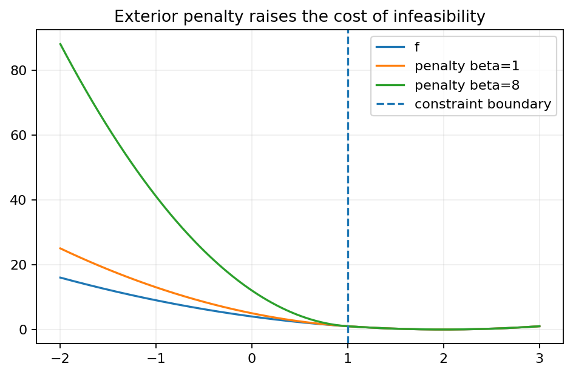
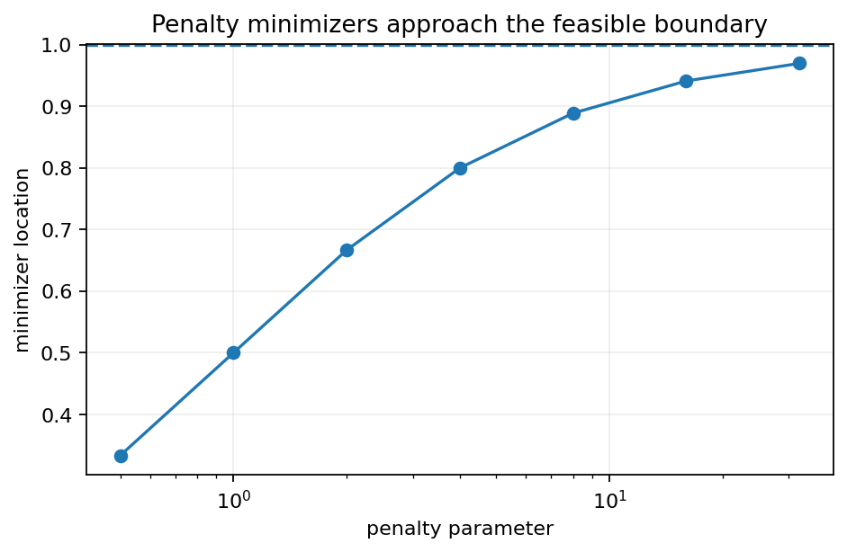
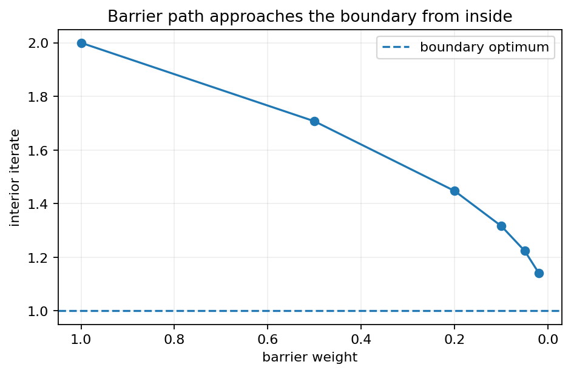
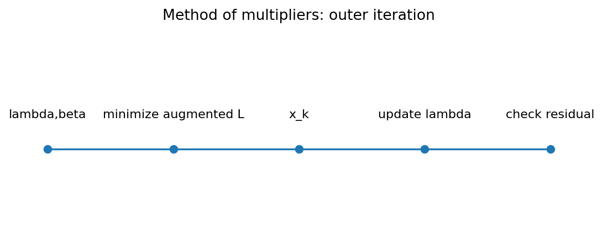

# Chapter 10 — Penalty Function Methods（罚函数方法）


***

## 0. 本章在整本书中的位置

Chapter 8 解决“**一个候选点怎样满足最优性条件**”；Chapter 9 解决“**无约束问题怎样数值搜索**”。Chapter 10 把这两条线合起来：

```text
约束问题
  |
  +-- 外点罚函数（penalty）------> 无约束问题序列，点通常在可行域外
  |
  +-- 内点障碍函数（barrier）----> 内点问题序列，点始终在可行域内部
  |
  +-- 乘子/增广 Lagrangian ------> 罚函数 + Lagrange multiplier，更快、更稳定
```

教材明确强调：对一般非线性约束问题不存在一个“普遍最好”的单一算法；本章讨论的是三类经典思想，而实际计算必须结合问题结构和 Chapter 9 的搜索方法。

学完本章，你应该能够：

- 构造 equality / inequality 的罚函数；
- 解释为什么罚参数增大后不可行度趋于 0；
- 区分 exterior penalty 与 interior barrier；
- 理解 barrier 为什么要求严格可行初始点；
- 写出增广 Lagrangian / method of multipliers 的迭代；
- 解释 penalty parameter 过大造成的病态与慢收敛；
- 把 Chapter 8 的 Lagrange multiplier 与本章 multiplier update 联系起来。

***

## 1. Penalty Function Method：外点罚函数法
### 1.1 为什么罚函数能去掉约束？
考虑等式约束问题

$$
\min f(x)\quad\text{s.t.}\quad h_i(x)=0,\ i=1,\dots,m.
$$

我们构造一个非负函数 $p(x)$，满足

$$
p(x)\ge0,
\qquad
p(x)=0\iff x\text{ 满足全部约束}.
$$

最常见的二次罚函数是

$$
\boxed{p(x)=\sum_{i=1}^m h_i(x)^2.}
$$

然后对给定 $\beta>0$ 解无约束问题

$$
\boxed{
\min P_\beta(x)=f(x)+\beta p(x).
}
$$

直观上：

- $f(x)$ 决定“原问题喜欢什么点”；
- $\beta p(x)$ 决定“违反约束有多贵”；
- $\beta$ 越大，违反约束的代价越大。

因此得到一串无约束最优点

$$
x_1,x_2,\ldots,
\qquad \beta_1<\beta_2<\cdots\to\infty,
$$

期望它们逐渐靠近可行集并最终逼近原问题最优解。



图中应重点看：罚参数较小时，最优点可以明显位于可行域外；随着 $\beta$ 增大，罚函数等高线越来越强烈地把点推向约束边界。

***

### 1.2 同时包含等式和不等式时怎样构造罚函数？
教材考虑

$$
\min f(x)
$$

满足

$$
g_i(x)=b_i,
\quad i=1,\dots,\ell,
$$

以及

$$
g_i(x)\le b_i,
\quad i=\ell+1,\dots,m.
$$

一种自然罚函数为

$$
\boxed{
p(x)
=
\sum_{i=1}^{\ell}|g_i(x)-b_i|^k
+
\sum_{i=\ell+1}^{m}\bigl[\max\{0,g_i(x)-b_i\}\bigr]^k,
}
$$

其中 $k$ 通常取偶数；本教材主要使用 $k=2$。

为什么 inequality 要用 $\max\{0,\cdot\}$？

- 若 $g_i(x)\le b_i$，约束没有违反，罚项应为 0；
- 若 $g_i(x)>b_i$，只处罚“超出的部分”。

#### 平方松弛变量转换
教材还把不等式写成等式。例如

$$
g_i(x)\le b_i
$$

可以引入 unrestricted 的 $z_i$，写成

$$
g_i(x)+z_i^2=b_i.
$$

由于 $z_i^2\ge0$，这与原不等式等价。这样整个问题可以统一成

$$
h(x)=0.
$$

> 💡 **学习补充**：今天更常见的是直接用 $[g_i(x)-b_i]_+^2$，避免额外引入平方变量，因为平方变量会增加维数并可能带来新的非线性。

***

### 1.3 有界变量怎样处理？
若

$$
a_i\le x_i\le b_i,
$$

教材讨论两种思路：

1. 把 bound violation 也放入 penalty；
2. 用变量替换

$$
x_i=a_i+(b_i-a_i)\sin^2 z_i,
$$

使 $z_i$ unrestricted，而 $x_i$ 自动满足区间约束。

第二种方法的代价是目标/约束会变得更非线性，而且映射多对一，所以现代算法通常直接支持 bounds，而不是必须做这种替换。

***

### 1.4 Example 1：一维不等式如何被外点罚函数逼近
📘 **教材 Example 1**：

$$
\min x_1^2
\quad\text{s.t.}\quad x_1\ge5.
$$

原问题显然在

$$
x_1^*=5,
\qquad f^*=25
$$

取得最小值。

教材通过平方松弛变量 $x_2$ 把约束改写为

$$
x_1-x_2^2=5.
$$

取

$$
p(x)=(5-x_1+x_2^2)^2,
$$

得到

$$
P_\beta(x)
=x_1^2+\beta(5-x_1+x_2^2)^2.
$$

对 $x_2$ 求导：

$$
\frac{\partial P_\beta}{\partial x_2}
=4\beta x_2(5-x_1+x_2^2).
$$

全局最小分支取 $x_2=0$。再对 $x_1$ 求导：

$$
2x_1-2\beta(5-x_1)=0.
$$

所以

$$
(1+\beta)x_1=5\beta,
$$

即

$$
\boxed{x_1(\beta)=\frac{5\beta}{1+\beta}
=\frac{5}{1+1/\beta}.}
$$

当 $\beta<\infty$ 时，$x_1(\beta)<5$，所以这是**不可行外点**；但

$$
\lim_{\beta\to\infty}x_1(\beta)=5.
$$

原目标值为

$$
f(x(\beta))
=25\left(\frac{\beta}{1+\beta}\right)^2
\to25.
$$

这个例子把 exterior penalty 的本质展示得非常清楚：

> **中间点可以不可行；参数越大，点越靠近可行边界。**

***

### 1.5 Theorem 1：罚函数法为什么收敛到原问题？
考虑

$$
\min f(x)\quad\text{s.t.}\quad h(x)=0,
$$

可行集

$$
F=\{x:h(x)=0\}.
$$

教材假定：

- $f,h_i$ 连续；
- $F$ 非空、闭且有界；
- $\beta_k>0$ 单调增加，$\beta_k\to\infty$；
- 对每个 $k$，$x_k$ 是

$$
P_k(x)=f(x)+\beta_kp(x)
$$

的全局最小点；
- $p(x)=\sum h_i(x)^2$。

#### 结论
若某子序列 $x_{k_j}\to\bar x$，则 $\bar x$ 是原约束问题的全局最小解，并且

$$
\boxed{p(\bar x)=\lim_j p(x_{k_j})=0,}
$$

$$
\boxed{\lim_j\beta_{k_j}p(x_{k_j})=0,}
$$

$$
\boxed{\lim_j f(x_{k_j})=\min_{x\in F}f(x).}
$$

#### 证明主线
令 $x^*$ 是原问题最优解。因为 $p(x^*)=0$，且 $x_k$ 最小化 $P_k$，

$$
f(x_k)+\beta_kp(x_k)
\le
f(x^*)+\beta_kp(x^*)
=f(x^*).
$$

因此

$$
0\le\beta_kp(x_k)\le f(x^*)-f(x_k).
\tag{1}
$$

若 $x_{k_j}\to\bar x$，连续性给 $f(x_{k_j})\to f(\bar x)$、$p(x_{k_j})\to p(\bar x)$。

若 $p(\bar x)>0$，则左端

$$
\beta_{k_j}p(x_{k_j})\to\infty,
$$

但右端保持有限，与 (1) 矛盾。所以

$$
p(\bar x)=0,
$$

即 $\bar x\in F$。

又因为 (1) 给 $f(x_k)\le f(x^*)$，极限后

$$
f(\bar x)\le f(x^*).
$$

而 $x^*$ 已经是 $F$ 上全局最优，所以只能

$$
f(\bar x)=f(x^*).
$$

最后把这个极限再代回 (1)，即可推出

$$
\beta_{k_j}p(x_{k_j})\to0.
$$

#### 为什么要假设“存在 accumulation point”？
Theorem 1 并不自动保证 $\{x_k\}$ 有收敛子序列。若罚子问题最优点跑向无穷远，可能没有 accumulation point。教材 Exercise 10.3 就要求构造这类反例。

***

### 1.6 实际外点罚函数算法
一个基本版本：

```text
给定 beta_1 > 0, c > 1, 初始点 x_0
for k = 1,2,...:
    近似求解 min_x f(x)+beta_k p(x)，得到 x_k
    若约束违反度 p(x_k) 和最优性误差足够小：停止
    beta_{k+1}=c beta_k
    用 x_k 作为下一个子问题起点
```

#### 为什么不能把 $\beta$ 一开始就设得极大？
因为 Hessian 中约束罚项会被 $\beta$ 放大，子问题可能高度病态：

- 可行方向上的曲率仍由 $f$ 决定；
- 法向方向的曲率约为 $O(\beta)$；
- 条件数会迅速变坏；
- line search 步长被迫很小。

于是出现经典现象：**约束越来越准，但无约束子问题越来越难解。**



***

### 1.7 Example 2：二维圆盘问题的 penalty path
📘 **教材 Example 2**：

$$
\min x_1+x_2
\quad\text{s.t.}\quad x_1^2+x_2^2\le1.
$$

原问题是在线性函数方向 $(-1,-1)$ 上取单位圆盘最远边界点，因此

$$
\boxed{
x^*=\left(-\frac1{\sqrt2},-\frac1{\sqrt2}\right),
\qquad f^*=-\sqrt2.
}
$$

教材把不等式变为

$$
x_1^2+x_2^2+x_3^2=1
$$

并使用二次罚项

$$
p(x)=\left(x_1^2+x_2^2+x_3^2-1\right)^2.
$$

于是对一串 $\beta_k$ 解

$$
\min P_k(x)
=x_1+x_2+\beta_k
\left(x_1^2+x_2^2+x_3^2-1\right)^2.
$$

教材从不可行点开始，用 steepest descent direction + Newton line search 解每个子问题，并令 $\beta$ 逐步加倍。表中可观察到：

- $p(x_k)$ 总体下降；
- $x_k$ 逐渐逼近 $(-1/\sqrt2,-1/\sqrt2,0)$；
- $f(x_k)\to-\sqrt2$。

这个 Example 的教学重点不是手工重复几十次 Newton，而是理解**continuation / warm start**：每个 $x_k$ 都作为下一罚参数子问题的起点。

***

## 2. Barrier Function Methods：内点障碍函数法
### 2.1 exterior penalty 与 barrier 的根本区别
教材本节考虑

$$
\min f(x)
\quad\text{s.t.}\quad g_i(x)\le0,
\quad i=1,\dots,m.
$$

定义严格内部

$$
F^\circ=\{x:g_i(x)<0,\forall i\}.
$$

Barrier $b(x)$ 具有两件事：

1. 在 $F^\circ$ 内有限；
2. 当 $x$ 从内部逼近边界时，$b(x)\to+\infty$。

教材给出两类经典形式：

#### Reciprocal barrier
$$
\boxed{
b(x)=-\sum_{i=1}^m\frac1{g_i(x)}
}
$$

因为内部 $g_i(x)<0$，所以每项 $-1/g_i(x)>0$。

#### Log barrier
$$
\boxed{
b(x)=-\sum_{i=1}^m\ln[-g_i(x)]
}
$$

教材排版把它写成等价的 $\sum\ln|g_i(x)|$ 配合目标中的符号；为避免符号混淆，学习时建议统一用现代最小化形式 $-\ln(-g_i)$。

Barrier 子问题为

$$
\boxed{
\min_{x\in F^\circ}
B_\beta(x)=f(x)+\frac1\beta b(x),
\qquad \beta\to\infty.
}
$$

由于 $1/\beta\downarrow0$，barrier 的影响逐渐减弱，中心点可以越来越靠近真实最优边界。



***

### 2.2 Example 3：一维 log barrier 可以解析求解
📘 **教材 Example 3**：

$$
\min x
\quad\text{s.t.}\quad x\ge5.
$$

严格可行域是 $x>5$。使用 log barrier 后教材求解

$$
\min_{x>5}
\left[x-\frac1\beta\ln(x-5)\right].
$$

一阶导数：

$$
1-\frac1{\beta(x-5)}=0.
$$

因此

$$
\boxed{x(\beta)=5+\frac1\beta.}
$$

它始终严格可行，并且

$$
x(\beta)\downarrow5.
$$

与 Example 1 对比：

- penalty path：$x(\beta)<5$，从**外侧**接近；
- barrier path：$x(\beta)>5$，从**内侧**接近。

这就是 exterior 与 interior 的最直观区别。

***

### 2.3 Theorem 2：barrier path 的极限
教材假定：

- $F$ 非空、闭、有界；
- $F^\circ$ 非空；
- 每个边界点都可以由内部点逼近；
- $f,g_i$ 连续；
- $\beta_k\uparrow\infty$；
- $x_k$ 最小化

$$
B_k(x)=f(x)+\frac1{\beta_k}b(x)
$$

且 $x_k\in F^\circ$。

则任一收敛子序列的极限都是原问题最优解，而且

$$
\frac1{\beta_k}b(x_k)\to0
$$

（沿相应收敛序列）。

#### 证明直觉
与罚函数相反：barrier 从来不允许点越过边界，而参数 $1/\beta$ 越来越小。取任意接近最优边界点的严格可行比较点，就能把 $B_k(x_k)$ 上界压到原问题最优值附近；紧性保证存在收敛子序列，再由连续性完成极限论证。

***

### 2.4 Barrier algorithm 的完整流程
```text
Step 1  找到严格可行 x0: g_i(x0)<0 for all i
Step 2  选 beta_1>0 和增长规则 beta_{k+1}=c beta_k
Step 3  从 x_{k-1} 出发解
        min f(x)+(1/beta_k)b(x)
        并要求每个 trial point 仍严格可行
Step 4  检查原目标、约束裕量、梯度/步长误差
Step 5  未收敛则增大 beta，继续
```

#### barrier 最大的现实困难
1. 必须先找到严格可行点；
2. line search 不能跨出可行域；
3. 靠近边界时 barrier 曲率会非常大；
4. 若原目标只在可行域内定义，barrier 反而很自然，而外点罚函数可能连 $f(x)$ 都无法计算。

教材 Exercise 10.8 就展示了“目标在可行域外无定义”的典型测试问题。

***

### 2.5 Example 4：圆盘问题的 barrier path
📘 **教材 Example 4** 再次求解

$$
\min x_1+x_2
\quad\text{s.t.}\quad x_1^2+x_2^2\le1.
$$

这一次使用 reciprocal barrier

$$
b(x)=\frac1{1-x_1^2-x_2^2}.
$$

（等价于教材 $-(x_1^2+x_2^2-1)^{-1}$。）

于是

$$
B_k(x)
=x_1+x_2+\frac1{\beta_k(1-x_1^2-x_2^2)}.
$$

每个 $x_k$ 都满足

$$
x_{1,k}^2+x_{2,k}^2<1,
$$

并从圆盘内部沿一条 central-like path 靠近

$$
\left(-\frac1{\sqrt2},-\frac1{\sqrt2}\right).
$$

教材表格显示 $\beta$ 增大时 $x_k$ 的坐标逐渐接近 $-0.70711$。

***

## 3. Quadratic Penalty Function Method / Method of Multipliers
### 3.1 为什么单纯增大 penalty parameter 不够好？
外点二次罚函数

$$
f(x)+\frac\beta2\|h(x)\|^2
$$

虽然理论简单，却需要 $\beta\to\infty$ 才能强迫 $h(x)\to0$。这会造成病态。

Chapter 8 告诉我们，原等式约束问题的最优点通常存在 multiplier $\lambda^*$，满足

$$
\nabla f(x^*)+J_h(x^*)^T\lambda^*=0,
\qquad h(x^*)=0.
$$

因此更聪明的做法是：**一边罚约束，一边学习 multiplier。**

***

### 3.2 Augmented Lagrangian
定义

$$
\boxed{
L_\beta(x,\lambda)
=f(x)+\lambda^Th(x)+\frac\beta2\|h(x)\|^2.
}
$$

这就是增广 Lagrangian（augmented Lagrangian）。

与普通 Lagrangian

$$
L(x,\lambda)=f(x)+\lambda^Th(x)
$$

相比，多了一个二次稳定项。

> 📘 教材称这一类为 multiplier methods，并把本节具体方案称为 quadratic penalty function method。现代优化教材通常更直接称为 augmented Lagrangian method / method of multipliers。

***

### 3.3 Theorem 3：bounded multipliers + increasing penalty 的极限
教材考虑：

- $F=\{x:h(x)=0\}$ 非空、闭、有界；
- $f,h_i$ 连续；
- $\lambda_k$ 是有界序列；
- $\beta_k\uparrow\infty$；
- $x_k$ 解

$$
\min_x
L_k(x,\lambda_k)
=f(x)+\lambda_k^Th(x)+\frac{\beta_k}{2}p(x),
$$

其中

$$
p(x)=\|h(x)\|^2.
$$

若 $x_{k_j}\to\bar x$，则

$$
\boxed{p(\bar x)=0,}
$$

$$
\boxed{\frac{\beta_{k_j}}2p(x_{k_j})\to0,}
$$

且

$$
\boxed{f(\bar x)=\min_{x\in F}f(x).}
$$

证明与 Theorem 1 类似，但必须多控制一项

$$
\lambda_k^Th(x_k).
$$

由于 $\lambda_k$ 有界、而最后会证明 $h(x_k)\to0$，这项不会破坏极限。

***

### 3.4 multiplier update 从哪里来？
最常用更新：

$$
\boxed{
\lambda_{k+1}
=
\lambda_k+\beta_k h(x_k).
}
$$

观察增广 Lagrangian 对 $x$ 的梯度：

$$
\nabla_xL_\beta(x,\lambda_k)
=
\nabla f(x)
+J_h(x)^T\left[\lambda_k+\beta_kh(x)\right].
$$

因此在子问题近似驻点 $x_k$ 处，

$$
\nabla f(x_k)+J_h(x_k)^T\lambda_{k+1}\approx0.
$$

也就是说，新的 $\lambda_{k+1}$ 正在逼近 Chapter 8 的真实 Lagrange multiplier。



***

### 3.5 教材给出的 multiplier algorithm
选择：

- $\beta_k>0$；
- 内层最优性容差 $\varepsilon_k\downarrow0$；
- 初始 multiplier $\lambda_1$。

第 $k$ 轮：

1. 近似求解

$$
\min_xL_k(x,\lambda_k)
$$

使

$$
\|\nabla_xL_k(x_k,\lambda_k)\|\le\varepsilon_k;
$$

2. 若原约束和最优性已达精度，停止；
3. 更新

$$
\lambda_{k+1}=\lambda_k+\beta_kh(x_k);
$$

4. 必要时增大 $\beta_k$；
5. 用 $x_k$ warm-start 下一轮。

教材给出的经验是：若需要增长，$\beta$ 乘以大约 $4$ 到 $10$ 的因子常能工作；但 multiplier method 的优点恰恰是**不一定需要让 $\beta$ 无限变得非常大**。

***

### 3.6 Example 5：圆盘问题的 method of multipliers
📘 **教材 Example 5** 又一次求解

$$
\min x_1+x_2
\quad\text{s.t.}\quad x_1^2+x_2^2\le1.
$$

教材先用 $x_3^2$ 写成

$$
h(x)=1-x_1^2-x_2^2-x_3^2=0.
$$

然后使用

$$
L_k(x,\lambda_k)
=x_1+x_2
+\lambda_k h(x)
+\frac{\beta_k}{2}h(x)^2.
$$

并更新

$$
\lambda_{k+1}
=\lambda_k+\beta_k h(x_k).
$$

教材数值表中，$x_k$ 很快收敛到

$$
\boxed{
\left(-0.70711,-0.70711,0\right)
}
$$

而目标趋于

$$
-1.41422\approx-\sqrt2.
$$

与纯 penalty 表相比，multiplier method 不需要把 $\beta$ 推到极端大就能获得高精度，这就是它最重要的数值优势。

***

## 4. 三种方法放在一起比较
| 方法 | 子问题点的位置 | 参数极限 | 是否需 multiplier | 主要优点 | 主要困难 |
|---|---|---|---|---|---|
| exterior penalty | 通常不可行 | $\beta\to\infty$ | 否 | 可从不可行点出发 | 大 $\beta$ 病态 |
| barrier | 始终严格可行 | $1/\beta\to0$ | 否 | 不越过边界 | 必须先有严格可行点 |
| method of multipliers | 可不可行 | $\beta$ 可适度 | 是 | 通常更快、更稳定 | 内外层迭代、乘子更新 |

#### 记忆方式
- **Penalty：外面犯错，要交罚款。**
- **Barrier：边界像墙，不能碰。**
- **Multiplier：不仅罚，还学“影子价格”。**

***

## 5. 与 KKT 的关系
考虑 equality problem

$$
\min f(x)\quad\text{s.t.}\quad h(x)=0.
$$

KKT/Lagrange 条件：

$$
\nabla f(x^*)+J_h(x^*)^T\lambda^*=0,
$$

$$
h(x^*)=0.
$$

Method of multipliers 实际上在做：

$$
\begin{cases}
\nabla f(x_k)+J_h(x_k)^T\lambda_{k+1}\approx0,\\
\lambda_{k+1}=\lambda_k+\beta_kh(x_k).
\end{cases}
$$

如果 $x_k\to x^*$、$\lambda_k\to\lambda^*$，极限正好恢复 KKT。

所以 Chapter 10 不是“另起炉灶”，而是把 Chapter 8 的最优性方程变成可计算的迭代过程。

***

## 6. 为什么二次 penalty 会产生病态？
在可行点附近线性化

$$
h(x^*+d)\approx J_hd.
$$

二次罚项 Hessian 的主要部分约为

$$
\beta J_h^TJ_h.
$$

于是：

- 法向于可行流形的方向曲率随 $\beta$ 增大；
- 切向曲率不一定同步增大。

Hessian 条件数因此可能随 $\beta$ 快速恶化。这就是“理论上 $\beta\to\infty$，数值上却不能粗暴取极大 $\beta$”的原因。

***

## 7. 高频易错点
1. $\beta$ 的方向：外点 penalty 用 $\beta\uparrow\infty$；本章 barrier 写成 $(1/\beta)b$，所以也是 $\beta\uparrow\infty$，但实际 barrier 权重在下降。
2. $p(x)=0$ 只表示“约束罚项为零”；必须确保所选 penalty 的零集合**恰好**等于可行集。
3. penalty intermediate points 通常不可行；barrier intermediate points 必须严格可行。
4. 罚参数过大不等于更好：会造成 ill-conditioning。
5. barrier line search 必须检查 trial point 是否仍在 interior。
6. augmented Lagrangian 中 $\lambda_k$ 不是固定常数，而是要更新。
7. $\lambda_{k+1}=\lambda_k+\beta_k h(x_k)$ 的符号取决于 $L=f+\lambda^Th$ 的约定；若你把约束定义成相反号，更新也要一致改变。
8. “收敛定理”通常只说明 accumulation points；若序列根本没有收敛子序列，定理不能自动救你。

***

## 8. 本章知识地图
```text
constrained nonlinear program
        |
        +--> equality/inequality violation
        |       |
        |       +--> p(x) >= 0, p=0 iff feasible
        |                 |
        |                 +--> f + beta p
        |                       beta -> infinity
        |
        +--> strict interior exists
        |       |
        |       +--> b(x) -> infinity at boundary
        |                 |
        |                 +--> f + (1/beta)b
        |                       beta -> infinity
        |
        +--> equality KKT multipliers
                |
                +--> augmented Lagrangian
                    f + lambda^T h + beta/2 ||h||^2
                |
                +--> lambda <- lambda + beta h
```

***

## 9. 一页速记
外点二次罚函数：

$$
p(x)=\|h(x)\|^2,
\qquad
P_k(x)=f(x)+\beta_kp(x),
\qquad
\beta_k\to\infty.
$$

不等式 violation：

$$
p(x)=\sum_i[\max\{0,g_i(x)-b_i\}]^2.
$$

Reciprocal barrier：

$$
b(x)=-\sum_i\frac1{g_i(x)},
\quad g_i(x)<0.
$$

Log barrier：

$$
b(x)=-\sum_i\ln[-g_i(x)].
$$

Barrier subproblem：

$$
B_k(x)=f(x)+\frac1{\beta_k}b(x),
\quad\beta_k\to\infty.
$$

Augmented Lagrangian：

$$
L_{\beta_k}(x,\lambda_k)
=f(x)+\lambda_k^Th(x)+\frac{\beta_k}{2}\|h(x)\|^2.
$$

Multiplier update：

$$
\lambda_{k+1}=\lambda_k+\beta_kh(x_k).
$$

***

## 10. 学完本章应能回答
- [ ] 为什么 penalty point 通常在可行域外？
- [ ] 为什么 barrier point 必须在严格内部？
- [ ] 如何把 $g(x)\le b$ 写成平方 violation penalty？
- [ ] Theorem 1 的关键比较不等式是什么？
- [ ] 为什么 $\beta\to\infty$ 会导致数值病态？
- [ ] multiplier update 为什么近似恢复 KKT stationarity？
- [ ] Example 1 与 Example 3 的路径分别从哪一侧逼近 $x=5$？
- [ ] method of multipliers 为什么通常比纯 quadratic penalty 更快？

***

## 11. 自测题
1. 对 $\min (x-3)^2$ s.t. $x\ge1$，写出 squared exterior penalty，并说明原问题最优点是否在边界。
2. 对 $\min x$ s.t. $x\ge2$，使用 log barrier 推导 $x(\beta)$。
3. 若 $h(x)=Ax-b$，写出 augmented Lagrangian 的梯度和 Hessian。
4. 解释为什么 barrier method 不能从 infeasible point 直接开始。
5. 若 $\lambda_{k+1}=\lambda_k+\beta h(x_k)$ 且 $h(x_k)\to0$，为什么这并不自动保证 $\lambda_k$ 收敛？

**简答：** 2）$x(\beta)=2+1/\beta$；3）$\nabla f+A^T\lambda+\beta A^T(Ax-b)$，Hessian 为 $\nabla^2f+\beta A^TA$；4）barrier 在外部无定义或不具有 barrier 含义；5）增量趋零不等于增量可求和。
